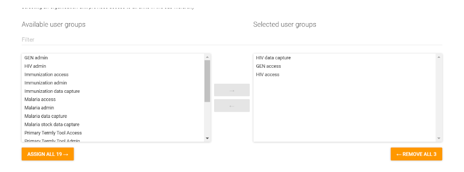
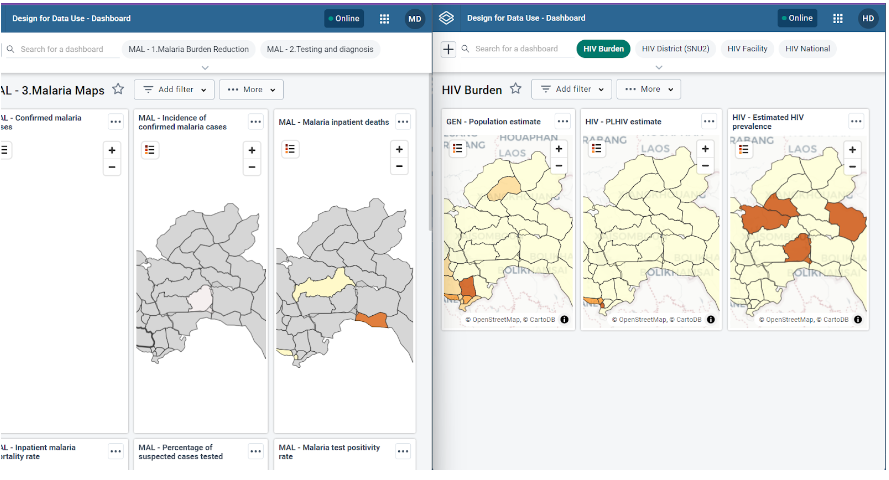
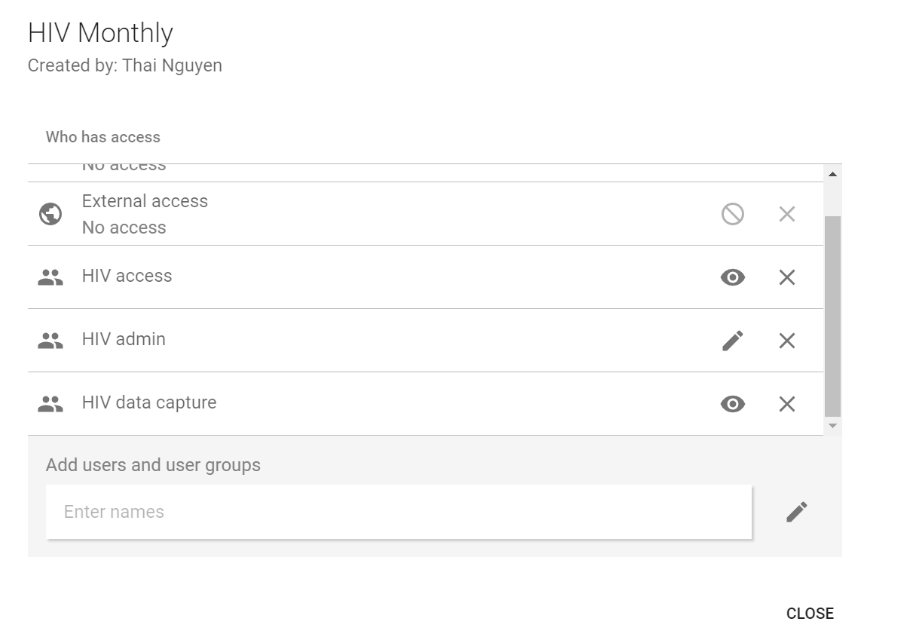
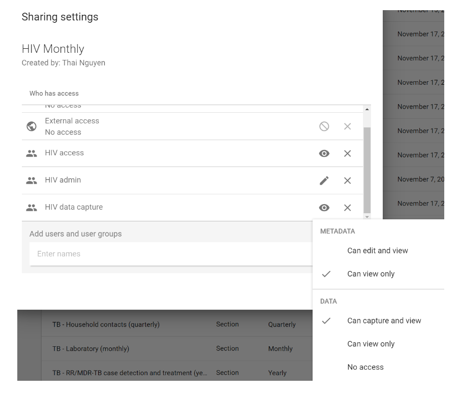

# Trainer’s Guide to Sharing

## What is this guide?

This guide is a support document for DHIS2 Academy trainers for the session "Sharing and User Groups" This session follows the standard Academy training approach with 

1. a live demo session where the trainer demonstrate and explain the features, and 
   
2. a hands-­on session with exercises where participants get to practice the same features.

This guide will help the trainer​ prepare​​ for the live demo session. The “Live Demo step by step” section has a detailed walkthrough of all the steps to demonstrate with explanations and screenshots that should be easy to follow. Use that when preparing for the live demo session.

There is also a Quick Guide which lists the steps very briefly and this is meant as a lookup guide or “cheatsheet” WHILE doing the demo, to help the trainer remember all the steps and the flow of the demo.

## Learning objectives for this session

1. Review the sharing concept
2. Explain the link between sharing, user roles and user groups
3. Describe the difference between metadata and data sharing
4. Identify the aggregate metadata that can be shared
5. Describe the concepts of category option and dataset sharing
6. Apply category option and dataset sharing to your own metadata

## Time Requirements

- Live Demo: 
- Hands-on Exercises: 
- Assignment: 

## Background

## Preparations

## Best Practices

Before starting the demonstration, please keep in mind that the most important thing is that the audience is following, so make sure to ask questions to the audience to verify that they are following. If something is unclear, go back and go through it slowly. If you don’t have time for all the steps, it is better to cut some steps, than to go fast while nobody understands.

In an online setting, you will be breaking regularly to allow them to perform various ungraded exercises in order to keep them engaged.

In an in-person setting, the participants may be doing the demo with you at the same time. In this scenario, it is ideal if there are other trainer's moving around the room to support participant's as it will be difficult for the trainer leading the session to answer many individual questions during the demonstrations. 

## Quick Guide

1. Review the sharing presentation

2. Log in as the HIV user and review what they have access to
   1. HIV/District1#
3. Log in as the EMIS user and review what they have access to
   1. EMIS/District1#
4. Log in as the all health programs user and review what they have access to
   1. health_admin/District1#

STOP - Perform Exercise 1

7. Review data level sharing in maintenace by discussing user groups
8. Create a new user group
9. Review the data sharing for category options

STOP - Perform Exercise 2

10. Discuss the default settings when you create a new category options and justify public category options
11. Review the sharing settings for the EMIS and HIV monthly data sets

STOP - Perform Exercise 3

## Live Demo step by step

### Review the presentation on Sharing

[Link](https://docs.google.com/presentation/d/1IaQnlxp6HTSYvDMCwh_kW2I49kMa5QaSOBLXN1q9_y0/edit?usp=sharing)

### Log in as the HIV user

Log in as the HIV user

Username: hiv

Password: District1#

You can review the apps menu and note that the apps they have access to here are c

This user has the ability to enter and analyze HIV data only. This starts from when they log in, as they only have access to the HIV dashboards within the system.

Navigate to data entry and access a facility. If you try to see a dataset, they will only have access to the HIV data sets.

Navigate to data visualizer

First, review the dimensions panel. You will see it has been reduced from the admin user. You only have those dimensions that are applicable to the HIV user.

Now, open the data panel. With all types selected, scroll through. You will notice the user only has access to data items from shared population items as well as the HIV data items.

Select indicators as the data type, only the HIV and population indicator groups are available to this user.

The same is true for the other data types. Here is the example for data elements

### Log in as the education user

Log out of the HIV user and log in as the EMIS user

Username: emis

Password: District1#

This user has the ability to enter and analyze EMIS data only. This starts from when they log in, as they only have access to the EMIS dashboard within the system.

Navigate to data entry and access a school. If you try to see a dataset, they will only have access to the Primary Termly Tool. Note they are also only seeing the Gambia hierarchy with the schools inside of it.

Navigate to data visualizer

Review the dimensions panel. Only a handful of dimensions, specific to the EMIS user, are available. 

Now, open the data panel. With all types selected, scroll through. You will notice the user only has access to data items from shared population items as well as the EMIS data items.

Select indicators as the data type, only the EMIS and population indicator groups are available to this user.

The same is true for the other data types. Here is the example for data elements

### Log in as the all health programs user

The combination of user roles, user groups and sharing allows us to provide a great deal of granularity when we define our users. We can have them only access segmented pieces of the system, along with limited access to the apps within DHIS2; or we can create users with maintenance privileges and access to many data types. Anything in between can also be created.

For the last user, log in with

Username: health_admin
Password: District1#

Right away we can see this user has access to all of the health dashboards.

If we view there app menu, they have access to all of the DHIS2 apps.

We can go to Maintenace -> Data Elements and see this user has wide authority to view, edit and add data elements from all of the health programs. 

We can see from these different user types that we can create a wide variation of access using a combination of user roles, user groups and sharing.

#### STOP - Perform Exercise 1

### Introduce data level sharing

We will now review the concept of data level sharing in more detail as it applies to aggregate data sets. In particular, we will discuss 2 objects in detail:

- Category Options
- Data Sets

These 2 objects have both meta-data and data level sharing applied to them. In most instances (unless everything is public) sharing of these items will have to be configured in order for users to access the data sets, data and reporting rates related to these data sets correctly. 

Sharing generally works within the intersection of these 3 concepts in DHIS2:

The user role assigned to a user (already covered)
The user group in which the user belongs to
The sharing settings themselves

We can traditionally think of user groups as defining how outputs are shared (dashboards, tables, maps, etc.) but we can also use both meta-data and data level sharing to restrict what a user has access to in quite a bit of detail.

2.1 - User Groups

We have covered user roles, now we can discuss user groups in a bit more detail. Navigate to the user groups part of the application. You will see a number of user groups available here; and they typically follow the same pattern

- Data Capture
- Access
- Admin

These 3 user group types contain the same users that were discussed earlier, linked to the various functionality that has already been demoed. We can use these groups to share reports/outputs, data elements, indicators, categories and other meta-data, as well as data which is what we will do in this case.

Creating a user group is very easy. 
1. Select the blue plus sign to add a new group
2. Assign the group a name (and code if you want)
3. Save the user group

We assign these user groups to our user at any time (either during or after creating the user) in order to apply the correct sharing settings to them. If we review the user "EMIS: we can see they are assigned to two EMIS user groups.

This allows us to use these user groups to assign sharing permissions to any user assigned to the user group.  

Slides 8-9 [here](https://docs.google.com/presentation/d/1IaQnlxp6HTSYvDMCwh_kW2I49kMa5QaSOBLXN1q9_y0/edit?usp=sharing) explain specific permissions for data level sharing for different aggregate specific objects, 

Go to Category option management and open the sharing dialog for any of the category options

We can see that the category options are not actually shared with a particular user group, but are in fact public. You will also notice that these sharing settings are seperated into **METADATA** and **DATA**.  

**METADATA** sharing determines if a person can edit (for example, updating its name or changing another parameter, note that they would need the proper user authorities/user role assigned to them on top of this sharing setting) and view an object or only view the object (see the object in various apps). 

**DATA** level sharing takes this one step further and determines, in specific detail, what a person can do with the data that is linked to the object. 

### STOP - Perform Exercise 2

### Discussing the configuration

#### Category Options

Go to Category option management and open the sharing dialog for any of the category options

> Regarding aggregate data and category options, this relationship is VERY important! When we create a new category option, data sharing by default is set to no access. If we then use this category option in a category and category combination without altering the sharing settings, a user trying to access a data set containing this category option will in fact not be able to do so. In essence, it will completely restrict the user from entering entire datasets as well as any data associated with this category combination if the data sharing is set to no access. Users will need "can capture and view" access to enter data. User group sharing is possible, but can quickly become challenging if not maintained over time. 
>
>In this case, keeping category options public with the sharing settigns displayed on screen is recommended so that users and administrators are able to re-use them freely. By making them public, any program can use them to make category combinations; and any admin will be able to log in and check for duplicates before creating new ones!

#### Data Sets

***Preparation***

Log back in to the two users for HIV and EMIS in different browsers (not just a new tab; it should be either a different incognito window or a different browser altogether). 

*Log in as the HIV user*

Username: hiv

Password: District1#

*Log in as the EMIS user*

Username: emis

Password: District1#

You should then have three different browser instances running. 

1. As the admin
2. As the HIV user
3. As the EMIS user

***Demo start***

With the prep taken care of, you can then alternate between the explanation and showing what the user can do (similar to demo 1 but now with the maintenance explanation) while showing the sharing settings. This will allow the user to see how certain sharing settings are reflected within DHIS2

Next, go to dataset management and open the sharing dialog for the dataset EMIS - Primary Termly Tool.

We can see this dataset is shared with 3 user groups; and there are different sharing settings applied to each of these user groups.

You will notice there is only one user group that has they "Can capture and view" setting applied to it's data level sharing. This means that only users part of this user group will be able to enter data within this data set.

You could switch over the the EMIS user in another browser to show the effect these sharing settings have to a user within this user group.

You can also open the sharing settings for the HIV Monthly data set.

Similarly, this dataset is also shared with 3 user groups; and there are different sharing settings applied to each of these user groups.

You will notice there is only one user group that has they "Can capture and view" setting applied to it's data level sharing. This means that only users part of this user group will be able to enter data within this data set.

You could switch over the the HIV user in another browser to show the effect these sharing settings have to a user within this user group.

Let us breakdown these user groups and their sharing settings as a review

- Access user groups
  - Metadata : can view only
    - This means they can see the data set in various apps
  - Data : 
    - Can view only
      - This actually only refers to the reporting rates for the data set, not the values within the data set themsevles. That is tied to the data elements and the category model
- Admin user groups 
  - Metadata : can edit and view
    - Users in this group can edit the dataset; but they must have the appropriate user authorities to access data set mainteance or they won't be able to do this via the UI
  - Data :
    - Can view only
      - This actually only refers to the reporting rates for the data set, not the values within the data set themsevles. That is tied to the data elements and the category model
- Data Capture user groups
  - Metadata : can view only
    - This means they can see the data set in various apps
  - Data : 
    - Can capture and view
      - Users in this group can see the data set in data entry and enter values in the data set AS LONG AS they have the correct user authorities to add values. They can also see this dataset in various analysis apps

#### STOP - Perform Exercise 3

