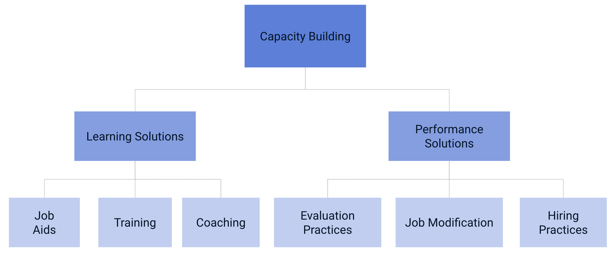
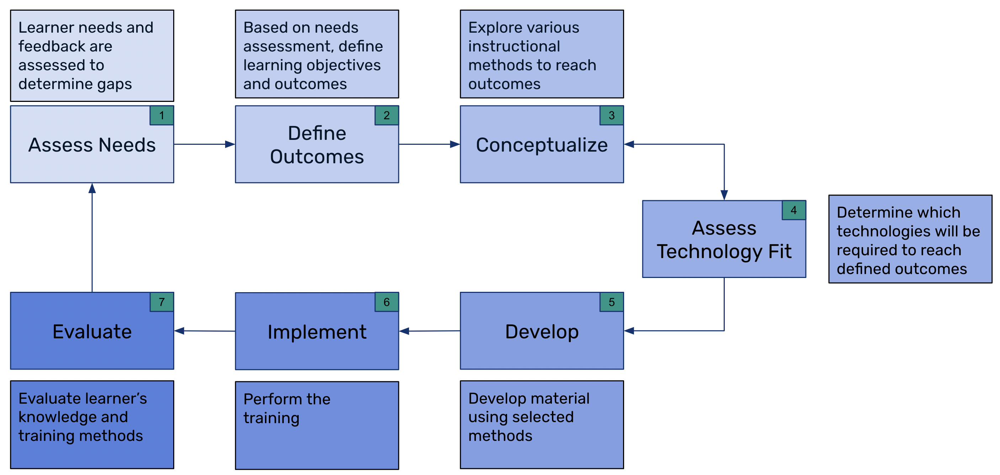
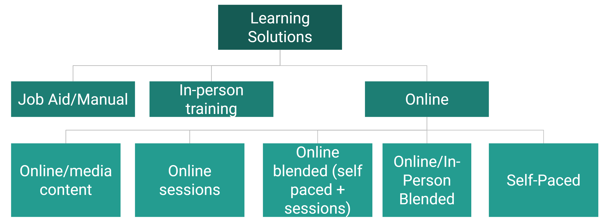
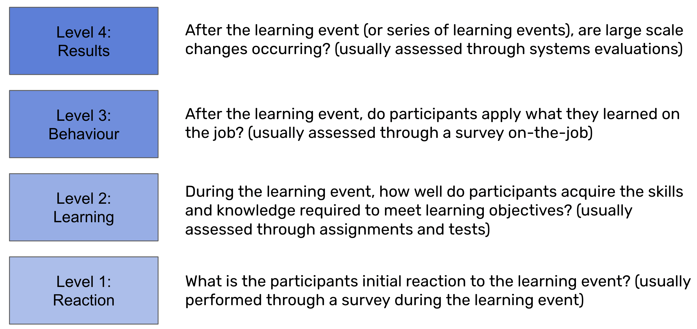

# Introduction

This section discusses some of the considerations to make when performing capacity building activities. Capacity building solutions can be divided into 2 key areas

1. Learning Solutions : These types of solutions focus on providing materials, references, guidance or training
2. Performance Solutions : These types of solutions focus on organizational policies, procedures, work practices, etc.)

You can review of breakdown of these in **Figure 1**.

***Figure 1 : Capacity Building Types***

In most scenarios when working with DHIS 2, the immediate impulse is to consider learning solutions; however this may not always yield the best outcome on its own. Performance solutions is covered in the implementation manual as it relates to building a DHIS2 core team. ***Do not ignore performance solutions in your capacity building plan; it requires equal consideration and thoughtful planning in your system scaling efforts.***

## Scenario

So we can apply each of our concepts in a practical context, we will outline a real-world scenario that we can use.

> You have implemented a tracker program for routine immunization. This data will be collected using both web-based and Android devices. As this is a completely new process, a mixture of learning and performance solutions may be required to build capacity within your teams to enter data and interact with this new workflow.

Let us start by reviewing how we would build our learning solution.

## Developing New Learning Solutions

When it is determined that a learning solution is needed; there are 7 steps we can follow as outlined in **Figure 2**

**Figure 2 : DHIS2 instructional design method**

### Understanding the needs of your audience (Assess Needs)

This first step prior to conducting your training is to understand the needs of your learner's. This does not need to be a comprehensive or time-consuming process if you have an already identified gap/gaps as a result of introducing a new process (for example, a new data collection form, a new set of indicators, a new dashboard) that you are rolling out in response to meeting specific requirements within your context. It is important however to also consider how to manage expectations in this step, as the scope can quickly become to large if you are not able to consider the immediate needs you are trying to address by creating a new learning solution. You can take this into consideration by following an outline like this when performing your needs analysis:

1. Identify the gap between current and desired results.
    * In our scenario, we want to get to a point where our teams are proficient in entering data into our immunization program using both web-based and Android devices.
2. Prioritizing the gaps that have been identified
   * Here we would want to ensure that we are addressing our gaps in the right order. This may involve modifying the order items are presented within a single training event, or potentially considering additional training events in the future. An example of this could be training on tracker data analysis. While this is relevant when working with the immunization program, it would not address our immediate needs to get the data into the system. Also, if the learning gap is currently quite large, addressing several priorities at once may be overwhelming for the teams you are trying to build capacity within.
3. Identify the cause of the identified gaps.
Try to identify some simple questions that you can work through to identify why a current knowledge gap exists. This may be self-explanatory, particularly when introducing a new process; however this may become more difficult as training goals become more complex and/or learner's current skill levels are already high. Some example questions that can help iun our scenario: 
      * Have they ever used DHIS2 before?
      * Have they ever entered tracker data before?
      * Do they understand all of the different workflows that are within the immunization program?
      * How proficient are they with using a web-based device (desktop or laptop computer)?
      * How proficient are they using an Android device (mobile phone or tablet)?
1. Identify how you could address these causes
      * In order to do this, there are different types of needs analysis that can be performed. Please feel free to review some of them [here](https://hr-guide.com/Training/Determining_Training_Needs.htm). When working with DHIS 2, a common way to determine how to address identified gaps will be through conducting a ***task analysis***. During this process, you would define all of the steps, knowledge and skills required to complete a task (or set of tasks). In the case where you have identified the causes of your current skill gaps, you would want to address how to complete specific tasks to bridge the gap between current and desired results. A framework for conducting the task analysis can include the following questions
        * What are the specific tasks that must be performed (break it down into component parts; if a user has never logged in to DHIS 2 you will need to cover a gamut of tasks from logging in to completing and scheduling events, completing enrollments, etc.)
        * What is the sequence in which tasks must be performed (ie. log in -> select tracker capture -> select your org unit -> select your program, etc.)
        * What are the conditions which these tasks will be performed (will they enter this data online, offline? will they have access to resources or people that they can regularly refer to? will they do it from paper or via direct entry?). You want to try take this into account within your training as much as possible.
        * How often will they perform the task (in our example, you can try to identify how often they will be entering data)
        * Which tasks should we place the most emphasis on (in our case, more complex operations will need to have more emphasis, for example interacting with a person's tracker dashboard will be more complex then logging in to DHIS 2)
        * Is there any existing training or material that might support you in addressing these tasks

Note that an outcome from needs analysis is also to determine whether training is an appropriate way to address the gaps you have identified on its own. If not, a mix of learning and performance solutions, or a performance solution on its, may be more applicable. In our example case, as we are introducing a new process, we have made the assumption that at least some type of learning solution will be required.

### Establishing Learning Objectives (Define Outcomes)

Learning objectives help us to frame our training and define what we would like to achieve as our training outcomes. This is the start of the design process and can be difficult to keep within a specific scope we require if we have identified gaps we want to address that do not relate to our immediate needs. This is especially true as there may be any number of constraints (time, staff availability, funding, learner capacity, etc.) limiting the amount of training you can offer at any one time. With this in mind, the learning objectives can help us narrow our focus, and also help us identify areas to address with potential training in the future.

It is helpful to think of objectives with 3 predominant areas in mind:
1. The condition (what will they be provided with)
2. The performance (what will they be expected to do)
3. The criteria (what is the measure of success)

We can see an example applied to enrolling a new born into our immunization program below

**Condition**

With the use of a job aid

**Performance**

The staff member will register and enroll a child receiving vaccinations at birth into the DHIS 2 immunization tracker program

**Criteria**

To the extent that the correct organisation unit and enrollment date have been selected and all mandatory fields have been filled in.

These learning objectives are best kept for internal use and development of materials only as a frame of reference, and can be shortened when presented to those learning the concept in question. As an example, we can shorten our longer example above to:

> Learners will demonstrate how to register and enroll a child receiving vaccinations at birth

This is more concise and will be easier to discuss with the learner's initially before diving in to the specifics of the concept.

A common framework used to develop learning objective's is called [Bloom's taxonomy](https://cft.vanderbilt.edu/guides-sub-pages/blooms-taxonomy/) and is based upon the action we are expecting of the learner to perform when the learning objective has been satisfied. This can be used to develop more detailed learning objectives in order to outline what you will cover as part of your training.

### Designing Learning Solutions (Conceptualize)

After we have established our learning objectives, we need to start the process of designing our learning solution.

You may want to start this process by deciding how you will actually deliver your learning solution. This will affect some of the design principles behind the generation of the materials themselves. For example, if performing an online training, sessions may need to be shorter and more detailed guidance may need to be provided to the learner when compared to the in-person environment.

You can review a breakdown of methods you might want to asses for your design in **Figure 3**.

***Figure 3 : Learning solution methods***

1. Job aids/manuals : These materials are often useful regardless if your training will be online or in-person as they can be used to supplement your training efforts. They can have detailed step-by-step instructions regarding a series of tasks that a person may need to perform both during and after the training. They can be in the form of documents, but can also be videos or other media that will support a person to perform the set of tasks they need to while on the job. It is unlikely they will be followed verbatim after a training and serve more use as a quick reference when a particular concept is forgotten. 
2. In-person training : This is the traditional method of training face-to-face
   1. Mentorship : In this method of training, a relationship between the mentor and the trainee is often established over a long period of time. The mentor provides both structure training and also acts as a resource for the trainee when they have questions about a specific concept they are unfamiliar with. In many cases, a member of the HISP network will serve as a mentor to different individuals within a DHIS2 core team; while members of the DHIS2 core team an serve as mentors to others within their implementation. In the mentorship model, sharing of resources for independent study is also common.
   2. Coaching : Coaching will occur routinely, likely in an ad-hoc, on-demand fashion. This is often focused on reviewing a particular skill or set of skills to reach a desired learning outcome over a longer period of time. Direct observation of a task by the coach can be performed in order to identify specific areas that can be modified. 
   3. Formal training : Specific dates, time and place are reserved for training on a specific set of topics. A formal agenda identifying the format, topics and learning objectives is 
   4. On-the-job traing: 
3. Online training : this type of training can be broken down into several types:
   1. Online or media content : this can be in the form of reviewing existing case studies, documents or videos as an example
   2. Online sessions : this is similar to in-person delivery, however all of the sessions will be conducted via an online environment rather than in-person
   3. Online blended : this blends self-paced material that learner's work through independently with live online sessions including an instructor
   4. Online/in-person blended : this blends self-paced material that learner's work through independently with in-person sessions including an instructor
   5. Self-paced : this type of course is completed completely online via a mix of pre-made content without instructor intervention

Within these methods, there are many different types of instructional strategies that can be employed; feel free to review some of them [here](https://tophat.com/blog/instructional-strategies/).

After you have selected your method of delivery, you will need to decide which topics you want to cover, which learning objective(s) these relate to and what types of material might contribute to this content. Consider the decision on delivery methods, as some types of content may not be applicable depending on the method of delivery selected. Here is an example table that we might fill out as we start this initial design process.

| Session 	| Description 	| Learning Objective 	| Estimated Duration (in minutes) 	| Type of material needed 	|
|---	|---	|---	|---	|---	|
| Logging in to DHIS 2 	| Participants will log in to the DHIS 2 training system using a copy of the account they will be provided on production.  They will learn how to navigate the apps menu and update their profile and password. 	| The learner will demonstrate the ability to log in to DHIS 2 and modify their profile 	| 45 mins 	| Power point presentation, DHIS 2 demonstration, hands-on exercise 	|

It is common to end up with a list with too many topics to include within the training you are immediately planning; however this is not necessarily problematic as any lists you develop can be used as reference when developing future training.

After you have developed this list you will have to develop a training agenda (or divide this list into modules if performing it online) that synthesizes the topics to achieve the training outcomes you have identified as part of this process. This will also inform you as you prepare your training materials.

### Determine what technologies you will use to deliver your training (Assess Technology Fit)

When thinking about technolgies to use when delivering our learning solution, there are 2 categories we can consider:
1. Technology that will help us facilitiate our training
2. Technology that is essential for us to meet our learning objective

#### Technology that will help us facilitiate our training

To support learning solutions, a number of tools can be used. This is not an exhaustive list, but may be worth reviewing depending on your needs. Note that these tools are mainly used to facilitate training

1. Communication
   - [Zoom](https://zoom.us/)
   - [Slack](https://slack.com/)
   - [Teams](https://www.microsoft.com/en-ca/microsoft-teams/group-chat-software)
   - [Gather](https://www.gather.town/)
2. Learning Management Systems (LMS)
   - [Moodle*](https://moodle.org/)
   - [OpenEdX](https://open.edx.org/)
   - [Blackboard](https://www.blackboard.com/)
   - [Google classroom](https://edu.google.com/intl/ALL_ca/)
3. eLearning authoring tools
   - [iSpring](https://www.ispringsolutions.com/)
   - [Articulate](https://articulate.com/)
   - [Adobe Captivate](https://www.adobe.com/ca/products/captivate.html)
4. Screen Recording
   - [Open Broadcaster Software*](https://obsproject.com/)
   - [Camtasia](https://www.techsmith.com/video-editor.html)
   - [Chrome Autoscroll](https://chrome.google.com/webstore/detail/autoscroll/occjjkgifpmdgodlplnacmkejpdionan?hl=en)
5. Image Capture/Editing Tools
   - [Paint.net*](https://www.getpaint.net/)
   - [Greenshot*](https://getgreenshot.org/)
   - [Cleanshot X (Mac)]
   - [Techsmith SnagIt]
   - [Adobe PhotoShop]
6. Polling Tools
   - [Kahoot]
   - [Mentimeter]
   - [Google Forms]

\* = indicates an open source solution

Any mix of these tools can be used based on your delivery method and material that you are designing. As a general rule, once you select a set of tools to facilitate your delivery method, it is a good idea to try and stick with them as it will become easier over time to work with them. As there is a combination of tools used for facilitation (such as a learning management or communication software) as well as content generation, different tools may be needed depending on where you are in your process. 

This is important to consider `before` you perform you develop your training content, as different software will have different capabilities that may be able to support you in delivering material in innovative ways. 

#### Technology that is essential for us to meet our learning objective

In the second category, we have additional tools that must be present to support our learning solution. In our scenario, we will need at least:

1. Android devices configured with a training version of the Android app to perform demonstrations
   1. A mechanism to project the Android device on screen will also be needed
2. A demo database in which users can enter data and make mistakes without this affecting your actual system
   1. You should also decide if this will be hosted locally on a phyiscal server during the training or hosted online
3. Android and web-based devices for the participants to use during and after the training
   1. The android devices should have the Android app set up on them already

In other scenarios, you may need to support additional technology, such as a GIS application if discussing the export of map data or server tools if discussing server management. Not all of these tools are DHIS2 specific; however they should also be maintained over time so training can occur as needed. 

### Developing sessions and materials (or adapting existing materials)

The development of material is often the most time consuming process. This involves the creation, modification or update of all materials, assessments, learning management systems, and as this is a DHIS 2 training, some type of DHIS 2 training environment.

When we develop training materials, we can consider three district phases of use of the material we are building.

1. Before the training, where most of our preparation should occur in an ideal circumstance
2. During the training, where we use our developed material to deliver our sessions
3. After the training, where we need to determine how we can ensure transfer of knowledge has been completed and our learning objectives have been met

After the training is often the most difficult to prepare for, as we want to regularly combat what is referred to as the [forgetting curve](https://elearningindustry.com/forgetting-curve-combat). This is the 'use it or lose it principle' and is essentially outlining the fact that information can be lost quickly over time if it it is not used or there is no mechanism made available to retain it.

As you want to create references they can use during and after the training, you should consider creating items they would have to refer to while on the job. For example, in our immunization data entry example, we could create a number of job aids outlining this process in the form of a step-by-step manual or video demonstration(s). As you are performing your training, you would refer to same references that they could use on the job. Importantly, remember that is unlikely they will constantly refer to ever step in your guidance, it is more likely they will want to refer to something they forget then quickly move on. It is therefore important to outline all relevant steps so they are available for reference on demand. 

When designing our material, distinct processes or tasks that have many steps associated with them, or are complex by nature, should have additional reference to be used both during the training and after the training is over.

If possible, try to simplify these processes down to there core steps to serve as a reminder to the learners when the training is complete. This is more challenging than you think!

You also need to consider the audience of your training. In our example, it may not necessarily be a learning objective to ensure our learner's can train others on how to perform data entry of immunization data, but if this was a gap we needed to fill as part of our need's analysis, there may be a package of training materials you would be providing to them. ***In cases where it is a training of trainers, then a combination of training on the subject as well as how to deliver training on the subject may be needed. You would identify specific needs via your needs analysis.***

#### Delivering a DHIS2 technical topic

When we are designing our materials, we often refer to a learning frame work to help us outline what we will contain within our session for a particular topic. You can learn more about various learning frame works [here](https://poorvucenter.yale.edu/BackwardDesign). A well tested learning framework for DHIS 2 principles (that would also work well in our case of tracker data entry for web and android) consists of the following:

***Explanation***

- The instructor outlines what is to be learned (the task) and why it is important.
- Instruction can then be provided about what the item is used for and its basic features. Critical aspects can also be pointed out to the learners.

***Demonstration***

- The instructor provides a demonstration about how (what is to be learned) the task operates/functions.
- While the instructor demonstrates how something works, learners observe and ask questions.

***Practice (Do)***

- The instructor guides learners and provides feedback throughout practice sessions.
- Depending on the complexity and risk associated with the task, a learner may or may not be asked to practice independently.

***Evaluation (Test)***

- The instructor evaluates to ensure learners are able to achieve the learning objective. This can be through ungraded or graded assignments or quizzes, or even by having the learner demonstrate the core concept back to the instructor.

Each of these components will require a companion piece of material to assist the instructor in explaining the concept as well as the learning in performing and retaining the concept. If you are not familiar with this process, then it is a good time to re-visit the types of material you will be making for each session in order to ensure each component within your learning framework for a particular session will be met.

#### Facilitating a discussion

Facilitating a meaningful discussion is a very different task then performing a technical training on a specific DHIS2 concept. These may include determining policy direction, development of a procedure, discussing budget contraints related to an implementation, weighing the pros and cons of a particular investment to strengthen an implementation, discussion with development partners, etc. You can find a number of facilitation methods [here](https://www.sessionlab.com/library/iafmethods). 

#### Developing Evaluation Assessments

Our learning objectives will help us dictate what types of evaluation would be the most appropriate for a specific task. We must remember that not all evaluation methods are appropriate for all tasks. In our example, we want our participant's to be able to independently enter immunization data using both web and Android devices. In this scenario, evaluating them using a multiple choice test would not be sufficient. We want to be able to directly observe them entering records succesfully into DHIS2. This could be done via direct observation for example, and does not need to be "graded;" in particular if that will act as a detternt to potential learners that will focus on receiving a good score (or conversely do not like being scored) rather then developing the skills needed to perform the task at hand. 

If we refer to our framework for developing learning objectives, [Bloom's taxonomy](https://cft.vanderbilt.edu/guides-sub-pages/blooms-taxonomy/), we can develop a learning evaluation framework that identifies appropriate methods to test these objectives in Table 2.

|   | Multiple Choice | True/False | Matching | Short Answer | Demo/Direct Observation | Presentation |
|---|-----------------|------------|----------|--------------|-------------------------|--------------|
|Remember |Yes               |Yes            |Yes          |Yes              |No                         |No              |
|Understand   |Yes                 |Yes            |Yes          |Yes              |No                         |No              |
|Apply   |No                 |No            |No          |Yes              |Yes                         |Yes              |
|Analyze   |Yes                |No            |No          |Yes              |Yes                         |Yes              |
|Evaluate   |No                 |No            |No          |No              |Yes                        |Yes              |
|Create   |No                 |No           |No         |No              |Yes                         |Yes              |

**Table 2 : Appropriate Assessment Methods**

Let's apply this to our learning objective : `Learners will demonstrate how to register and enroll a child receiving vaccinations at birth`. This falls under the category of `apply`. Therefore, a useful way to assess this would be through any of the following methods

1. A short answer question in which they had to outline this process back to you
2. Direct observation of them performing this task in DHIS2
3. A presentation in which they demonstrated this skill and explained it to others

In this scenario, direct observation seems to be the best fit as you can observe them performing the skill directly. If this was a training of trainers, then observing them explain the skill may be more relevant. 

Take factors like this into consideration when developing your own training in order to determine what would be the most appropriate assessment method based on your desired learning outcome.

#### Example Materials

There are many pieces of generic material that have been made available and can be localized for various uses. Some of these examples include:

- [Implementation manuals for tracker and android](https://docs.dhis2.org/en/implement/implement.html)
- Generic, modifiable tracker end-user and trainer’s material for [COVID-19 surveillance](https://dhis2.org/covid-training-material/), [COVID-19 vaccination](https://dhis2.org/covid-training-material/) and [AEFI](https://dhis2.org/aefi-training-material/)
- Country specific COVID-19 vaccination [videos for data entry](https://www.dropbox.com/sh/4ann2g93za23ce9/AADi97RyLtERwR5cE2i3Ucsja?dl=0) (Vanuatu example)

You can also access a repository of previous DHIS2 academy material via [Moodle](https://training.dhis2.org/); as well as additional material via our [docs site](https://docs.dhis2.org/en/topics/training-docs/tracker-use-academy/tracker-use-academy-sop.html).

Please contact us via the [DHIS 2 community](https://community.dhis2.org/) if you are seeking training material to modify for your implementation.

### Perform the Training

A checklist prior to training a DHIS2 concept:
* We have a clear understanding of the needs of our defined learning group
* We have well defined learning objectives
* We have decided what topics we will discuss 
* We have decided how we will deliver these topics
* We have developed all of the required material and assessments
* We have prepared/populated any of the required supplemental tools (LMS, zoom meetings, DHIS2 instances, etc.) needed to support the delivery of learning material
* We have REVIEWED and TESTED the components for each of our topics

If you have gone through all of these steps, you would simply follow the methods you have identified for delivering each of your sessions to meet your learning objectives correctly. The more your perform training, the more you will be comortable in front of an audience or recording your own video or audio. Get up there and trust in your preparation!

### Evaluate the Training

As you perform the training, you need to think about how you can evaluate progress. A common model used to evaluate training conists of 4 levels and can be seen in **Figure 4.**

***Figure 4: Evaluation method model***

While level 1 and level 2 evaluations are common, level 3 and 4 are much less common in practice. These are important to assess however as these levels allow you to understand the effect that your training is having on actual practices in your system.

Let us apply this evaluation framework to our example in which we are working on showing staff how to enter immunization tracker data into DHIS2. 

- Level 1 : Creating a survey that allows the learners to judge how useful the training format, learning objectives, instruction, etc. have been
- Level 2 : Create an assessment to determine if learner's are able to perform the learning outcomes previously defined. In this scenario, it was suggested that direct observation of them performing the steps in data entry would work well.
- Level 3 : Create a survey that can be conducted while they are on-the-job. This should include the key behaviours they should be performing as a result of the training. As an example, they could self-evaluate if they are performing the correct steps to register a new child in the immunization program, that they are classifying dose numbers in the correct order and/or that they are regularly downloading new unique IDs for their android device. In addition to self-evaluation, this can also be assesed via supervisory suppport. This may have the added advantage in identifying issues that could be improved upon within the process itself or the overall training approach. 
- Level 4 : This type of evaluation requires baseline data before training (or a series of training events) has taken place. In practice you are more likely to make a correlation between many training events and improvement in a systems ability to function. To get a better idea of this type of systems assessment, you can refer to the tracker readiness assessment and/or the DHIS2 maturity framework.

Once you have performed some type your evaluation of your training , you can use these results to plan for future training, either on the same topic or by drawing conclusions that can be used for training on additional topics.
