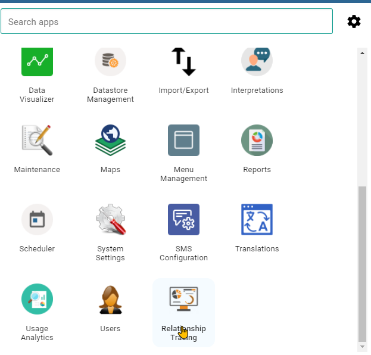
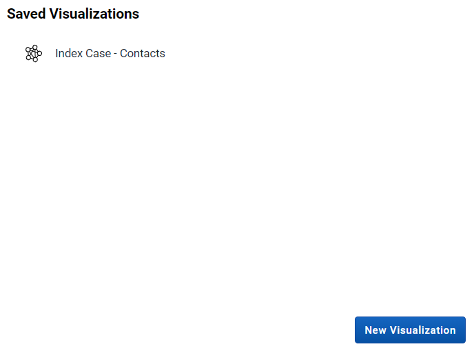
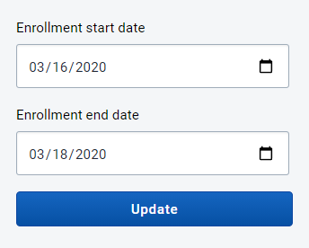
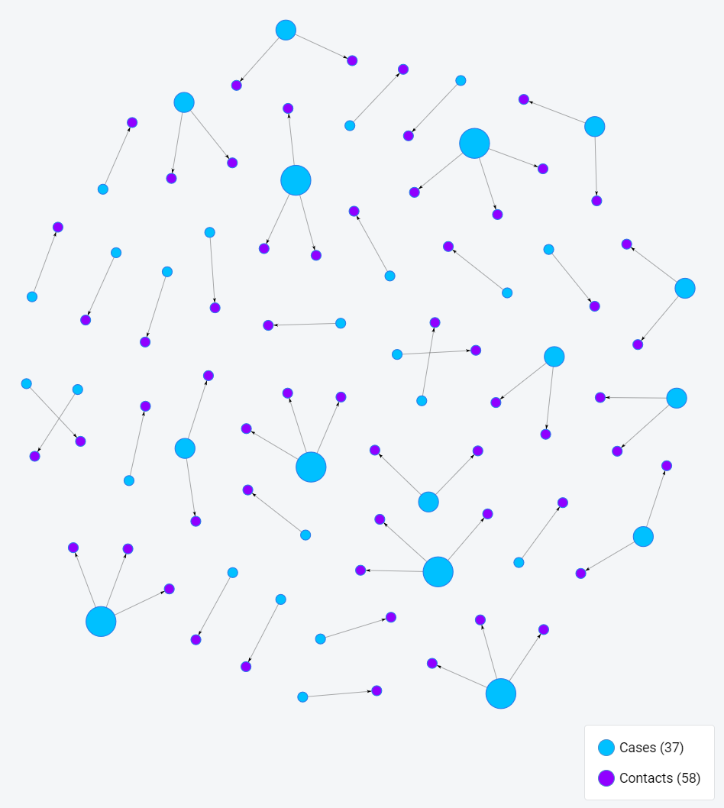
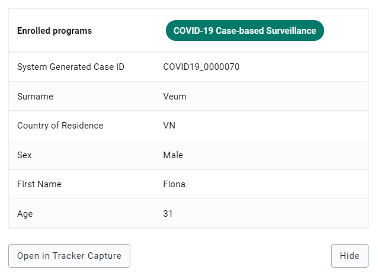
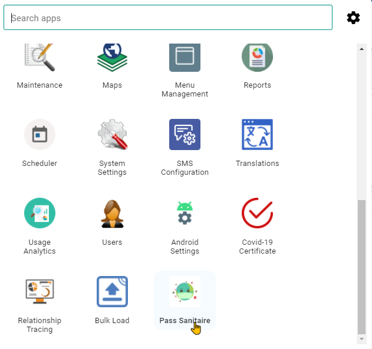
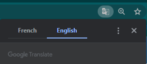
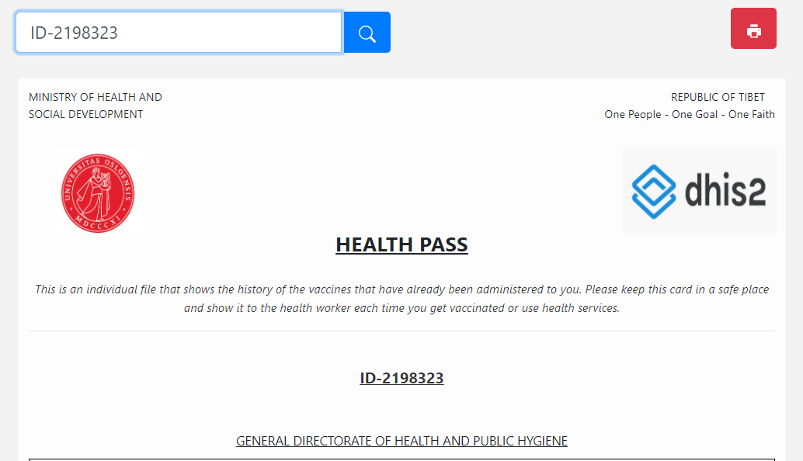
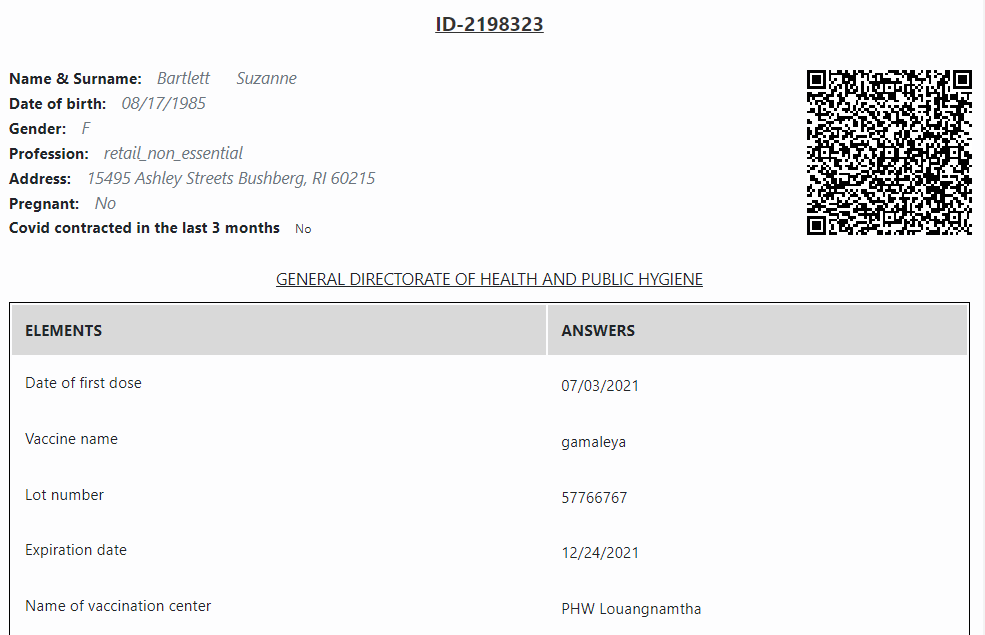
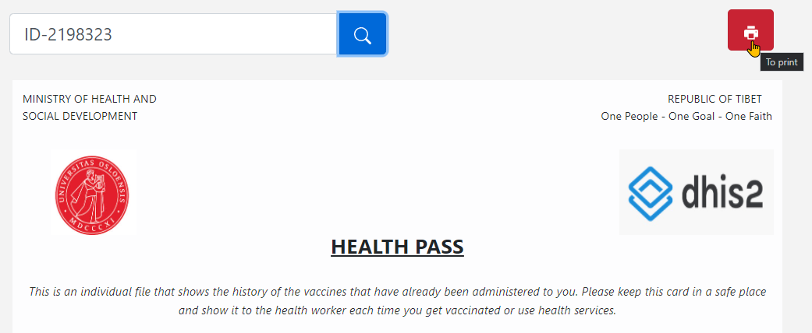

# Learner's Guide to Event Reports

## What is this guide?

This guide contains all exercises and detailed steps to perform them related to the review of custom apps for the Tracker Use Level 1 academy. Please perform each of the exercises when prompted to by your instructors.

## Learning objectives for this session

1. Understand how custom apps can support a tracker implementation
2. Create a contact tracing map using the relationship tracing app
3. Generate a certificate using a COVID-19 health pass app

## Exercise 1

## Review the relationships tracing app

This app was made for creating relationship network maps between cases and contacts for COVID-19 surveillance. In order to access this app, login to the ***relationships*** database using:

Username : custom_apps

Password : District1#

From the dashboard, access the "relationship tracing" app from the apps menu

The app will launch. You should see 1 saved visualization and the option to create a new visualization

Select the saved visualization "Index Case - Contacts"

You will now be asked to select an enrollment start and end date. The data and relationships in this database are for March 2020. 

Select March 16 - March 18, 2020 and update the visualization.

You should now see the relationship network map on screen.

In this example, the blue dots represent our cases and the purple dots are the contacts. We then have a line connecting each case to its contact. Select a case or a contact to pull up their information. 

You can review their details and you can also open their record in tracker capture by selecting "Open in Tracker Capture." This option will open their record in a new tab, allowing you to investigate it further.

## Exercise 2

### Review the COVID-19 Health Pass

The COVID-19 health pass app was made to generate an internal health pass with related COVID-19 vaccination data on it. It is a "health pass" because it is meant for internal use only, as it does not use any international schema that would be accepted by other governments for international travel. Solutions that use such schemas are also being tested however and this pass could use one in the future.

From the dashboard access the app "Pass Sanitaire" -- this is health pass but in French as this app was developed for French speaking communities. 

If using chrome, you should be able to translate the app to English via Google Translate.

In order to use the app to generate the pass, you must have the ID of a person. 

For example, we can use the ID : ID-2198323

Once you enter the ID, search for the record. It will populate the details of the pass.

The QR code shown here contains the following information: first name, surname, sex, the name of the vaccine and the dates of the doses. It is important to note that other information can be added or removed to the QR as required (within reason). It will depend on the country or organization that wants to implement it.

You are able to print or download the pass using the print button.

To read the code, you need a separate android app. For more details on this app, refer to the [user manual](https://docs.google.com/document/d/1qWyOcyCmQXsmG9FG91WIocNBvWmLkJT3/edit?usp=sharing&ouid=104677221247573000314&rtpof=true&sd=true).