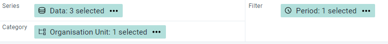
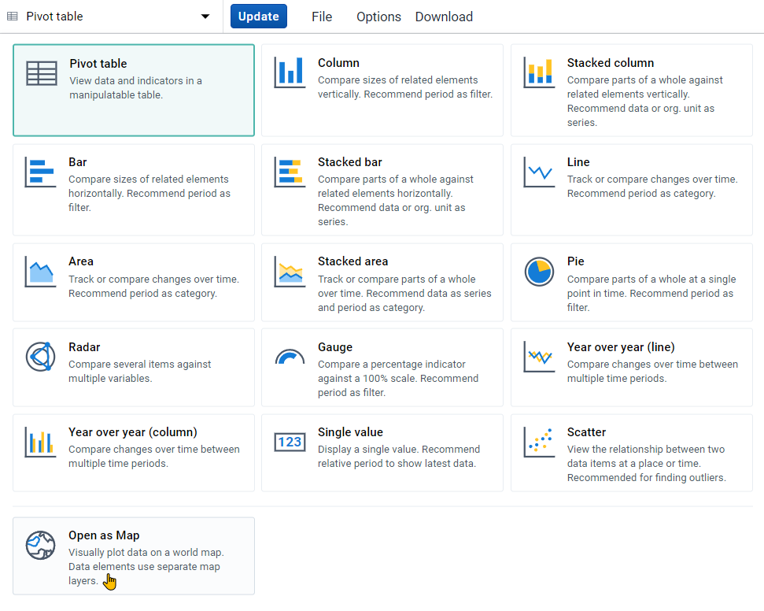
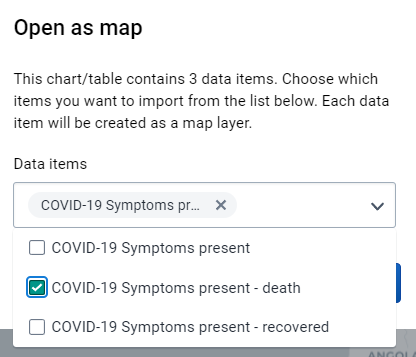
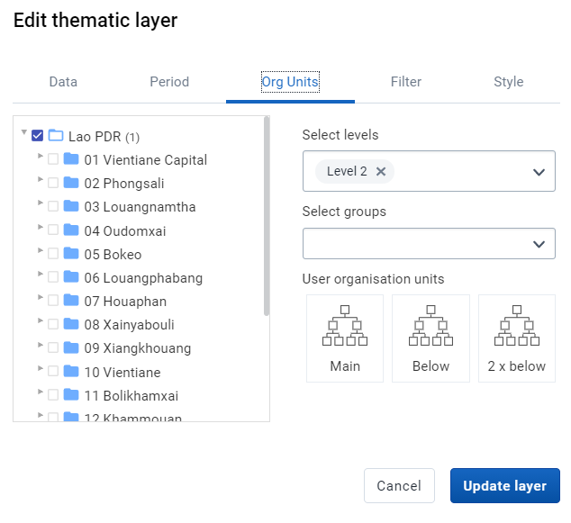
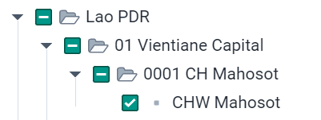

# Learner's Guide to Program Indicator Analysis

## What is this guide?

This guide contains all exercises and detailed steps to perform them related to program indicator analysis session for the Tracker Use Level 1 academy. Please perform each of the exercises when prompted to by your instructors.

## Learning objectives for this session

1. Describe what a program indicator is
2. Describe how program indicators are derived
3. Describe the difference between event and enrollment program indicators
4. Understand how program indicators can fill tracker data analysis gaps present in other visualization tools
5. Create visualizations using program indicators derived from tracker data

## Exercise 1

### Create a pivot table in data visualizer using an enrollment program indicator from the COVID-19 Vaccination Registry program

Create a pivot table using a single program indicator in data visualizer. It will have the following inputs:

 - Visualization Type : Pivot Table
 - Data 
   - Data Type : Program Indicator
   - Program : COVID-19 Vaccination Registry program
   - Program Indicator : Underlying conditions
 - Period : Last 6 months
 - Org Unit : All Level 2 OUs

The layout can look like this

The table is saved as "COVAC - Underlying Conditions, last 6 months" as reference.

This is an enrollment type program indicator that is pulling its information from the data element "COVAC - Underlying conditions."

Enrollment is being used for this program indicator so it does not double or triple count the number of individuals with an underlying condition (remember, this program consists of a single repeated stage).

You can quickly compare the two reports by duplicating your current tab followed by opening the saved table "COVAC - Underlying Conditions (event), last 6 months."

You will see the event based indicator reports higher values as it is counting the underlying condition variable for every event; this does not make sense in this scenario if you want to know the total number of unique people with an underlying condition.

Note that you are able to create this same output in event reports using an enrollment pivot table. So far, we have not addressed any gap but are just showing that it is possible to pull filtered tracker data into data visualizer.

### Create a chart using event indicators from different program stages from the COVID-19 Case-based Surveillance Program

One gap that we can address however is creating a pivot table, chart or map using data from different program stages. We can do this in data visualizer for any of the available visualizations using either event or enrollment type program indicators and is not something we could achieve in either event reports or event visualizer.

In this example, we will create a line chart with the following inputs:

 - Visualization Type : Line Chart
 - Data 
   - Data Type : Program Indicator
   - Program : COVID-19 Case-based Surveillance Program
   - Program Indicators : 
     - COVID-19 Symptoms present
     - COVID-19 Symptoms present - death
     - COVID-19 Symptoms present - recovered
 - Period : This Year
 - Org Unit : All Level 2 OUs

In order to create this chart, ensure your layout looks like this:

The chart is saved as "COVID_CBS - Symptoms and health outcome, this year" as reference. 

This chart uses enrollment indicators, including combining data from Stage 1 (Clinical exam and diagnosis), where it gets the data on whether or not a person has symptoms, and Stage 4 (Health Outcome), where it gets the information on whether or not the person died or recovered. It is not possible to create this type of output using event visualizer.

You can covert this chart to a pivot table to review that creating pivot tables using data from multiple stages is now possible; this is not possible in event reports.

Lastly, you can open this table as a map to show you can now use the thematic layer. The thematic layer opens up a number of additional options when working with your data (we will go over an example where we create a map from scratch using a program indicator in the thematic layer during the next part of this session).

Do this by selecting "Open as Map" from the visualization selection.

When you open this as a map, you will have to select one of the data items used in the chart/table as your primary layer (you can select all 3 but since they are all displaying data at the same OU level, you will in effect only see data from the top layer). Select one of the enrollment indicators (death or recovered) using data from multiple stages to demonstrate that this type of data can be mapped.

## Exercise 2

### Create a map using a program indicator from the COVID-19 Case-Based Surveillance program

In the maps session, we had discussed how we can use the event and TEI layer to map raw tracker data (also known as event data items). While we can also use the thematic layer when dealing with tracker data, this is often less useful as the number of numeric data elements in a tracker program may be limited.

Through the use of program indicators however we are able to extend maps functionality with tracker data significantly as we can use the thematic layer to its full potential. This includes creating split view and timeline maps and using the available style options (such as creating choropleth and bubble maps) that are not available when using the event and TEI layer as examples.

Create a map using the thematic layer with the following inputs:

- Layer Type : Thematic 
- Data:
  - Item Type : Program Indicators
  - Program : COVID-19 Case-Based Surveillance
  - Program Indicator : COVID-19 Suspected Cases
  - Leave the aggregation type as default
- Period:
  - Period Type : Relative
  - Period : Last 12 months
  - Display Periods : Timeline
- Org Units : All Level 2 OUs
- Filter : None
- Style : Bubble Map, Single Color Legend

**Data Tab**

**Period Tab**

**Org Units Tab**

**Style Tab**

The map has been saved as "COVID_CBS - Suspected cases, last 12 months" for reference.

You can play back the timeline map. You will see over time the monthly values are increasing in line with the COVID-19 situation occurring globally (the map is showing the total number per month, not the cumulative number; cumulative can be shown however the indicator needs to be configured differently).

## Exercise 3

### In the line list app, create an enrollment report showing the number of relationships by TEI from the COVID-19 Case-based Surveillance Program

Program indicators can be used in event reports and event visualizer as well as within data visualizer and maps, depending on how they are defined. This is because one program indicator can work on two levels:

1. Through creating a summary output for a single TEI
2. Through creating a summary output for all TEIs within a period/org unit 

We will demonstrate these principles using two program indicators that use "Average" as the aggregation type.

1. COVID-19 Contacts
   1. Summarizes the total number of contacts a single TEI has through the relationships that have been created in tracker capture
   2. Summarizes the average number of contacts for all TEIs based on their enrollment date and the specified period and organisation unit
2. COVID-19 days between onset and consultation
   1. Summarizes the total number of days between onset of symptoms and their initial consultation date for single TEI
   2. Summarizes the average number of days between onset of symptoms and initial consultation date for all TEIs based on their enrollment date and the specified period and organisation unit

Create a line list table with the following inputs:

- Input Type : Enrollment
- Program Dimesions 
  - Program : COVID-19 Case-based Surveillance
  - Data
    - Attributes : First Name, Surname
    - Data Element: Sign/Symptoms Present
    - Program Indicator: COVID-19 Contacts
- Org Unit : CHW Mahosot
- Time Dimension : Case Registrtion Date (this is the enrollment date)

Note : here is the location of the org unit in case you are unfamiliar with this hierarchy (01 Vientiane Capital -> 0001 CH Mahosot -> CHW Mahosot)

This table has been saved as "COVID_CBS - Contacts by Person" for reference.

You will notice that you can select program indicators from the data tab; however some program indicators may not work as intended or not give you any meaningful output depending on how they have been configured. For example, for a single TEI, any count based indicators within a single event may not be so helpful as the maximum value they can return is 1 for a single TEI.

Sort the table by the "COVID-19 contacts" column. This is showing the number of contacts each person has had as defined through adding relationships via tracker capture.

#### Add the program indicator "COVID-19 days between symptoms onset and consultation" to your report and update your line list

From the program dimensions tab, add the PI "COVID-19 days between symptoms onset and consultation"

Update your table.

We now have an additional program indicator which is showing the number of days between each person's onset of symptoms and their initial consultation.

#### Create a bar chart showing the average days between onset and consultation across all level 3 OUs within Savannakhet

As discussed previously, these types of program indicators can function on two levels. We have reviewed how we can use various types of program indicators at the individual level, now we can use the same program indicator and create a summary output.

We will use data visualizer to demonstrate this.

> Note: Program indicators are available to select within event visualizer but they often do not result in any output. It is best to use data visualizer to create charts when using program indicators.

In data visualizer, create a chart with the following inputs:

 - Visualization Type : Bar Chart
 - Data 
   - Data Type : Program Indicator
   - Program : COVID-19 Case-based Surveillance Program
   - Program Indicator : COVID-19 days between onset and consultation
 - Period : This Year
 - Org Unit : Level 3 OUs within Savannakhet

Note : here is the location of the org unit in case you are unfamiliar with this hierarchy

And here is the layout that should be used for the chart

The chart is saved as "COVID_CBS - Average days between symptoms onset and consultation, this year" as reference.

When we review this chart, we no longer see values that are representative of one individual person, but using the same indicator we are able to take an average for all individuals within the organisation units and period that we have selected.

#### Summary on these two indicators

From these two program indicator examples, we can see that program indicators can have multiple functions at both the individual and aggregate level. These various functions can be quite useful depending on what information you are looking to review within your system. There are many other advanced possibilities that are available when using these types of indicators. The best source of this information will be the documentation.
