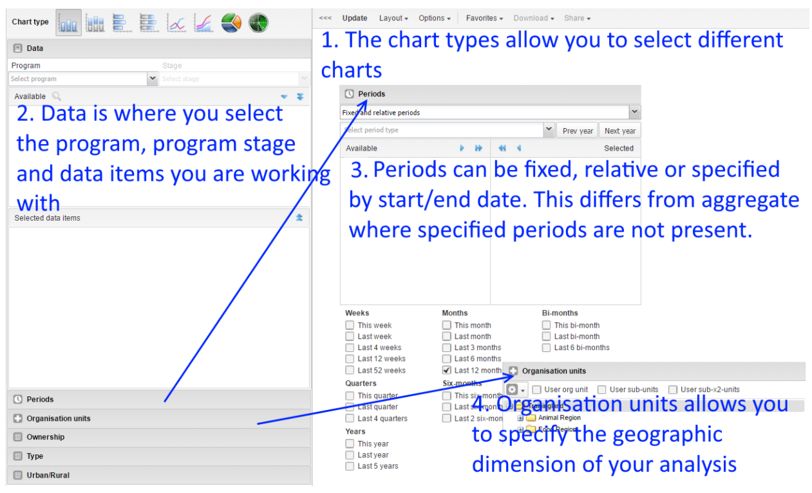
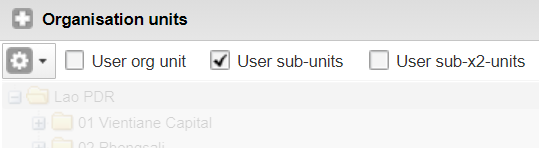
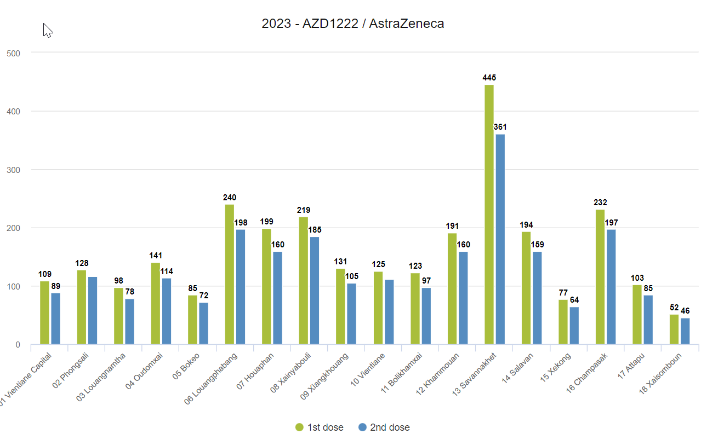
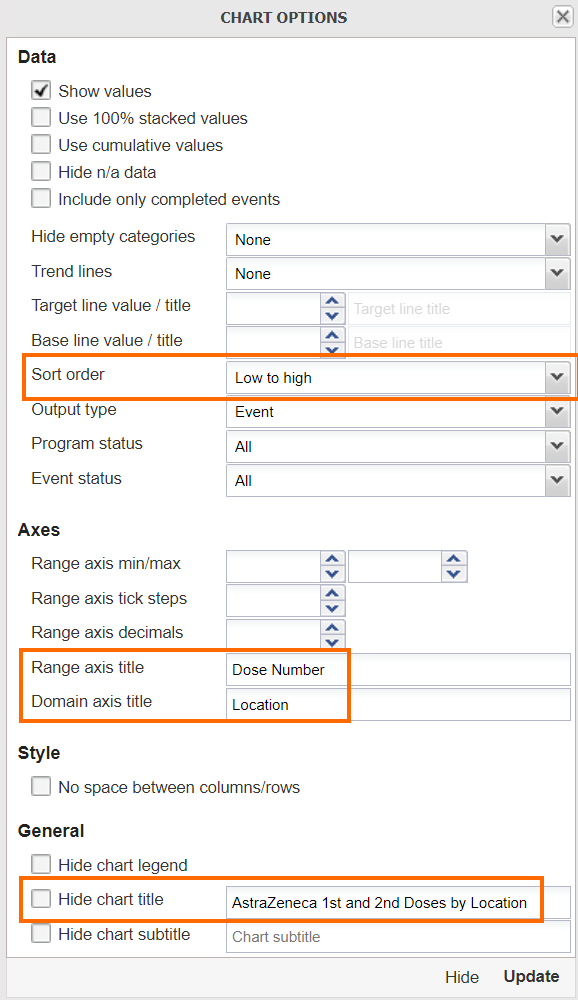
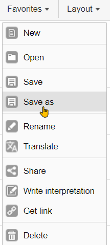
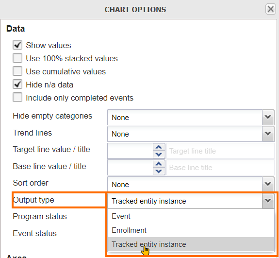

# Trainer’s Guide to Event Visualizer

## What is this guide?

This guide is a support document for DHIS2 Academy trainers for the session “Event Visualizer.” This session follows the standard Academy training approach with 

1. a live demo session where the trainer demonstrate and explain the features, and 
   
2. a hands-­on session with exercises where participants get to practice the same features.

This guide will help the trainer​ prepare​​ for the live demo session. The “Live Demo step by
step” section has a detailed walkthrough of all the steps to demonstrate with
explanations and screenshots that should be easy to follow. Use that when preparing for
the live demo session.

There is also a Quick Guide which lists the steps very briefly and this is meant as a lookup
guide or “cheatsheet” WHILE doing the demo, to help the trainer remember all the steps
and the flow of the demo.

## Learning objectives for this session

1. Describe the functions of the event visualizer app
2. Describe the event visualizer interface
3. Create visualizations using tracker data
4. Describe the limitations of event visualizer when working with tracker data

## Time Requirements

- Live Demo: 2 demos, 15 minutes each
- Hands-on Exercises: 2 exercises, 10 minutes each
- Assignment: 

## Background

This session is more or less a review of what the participants have learned during the event fundamentals course. This is because event visualizer does not introduce any new concepts around the management of tracker data and does not have any enrollment type outputs built in. This session will therefore discuss this constraint as it is applied to tracker data and review some of the features available in event reports quickly.

## Preparations

This session will see you creating a number of visualizations. Ensure that you have run analytics in the demo database you are using and that all the data is being populated correctly. If you find that data is not present for the correct period or year, please contact the training content team so we can advise how to move the data correctly.

You should consider running through the entire demo prior to presenting it. After this, you should take the quick guide and supplement it with any additional notes you made while running through the demo. If you identify any changes that may be required or additional explanation that would be helpful within the session, please content the training content team in order to allow us to evaluate how to best integrate this feedback into the material.

Every visualization that you are asked to create has been saved and should be shared for public view. You can open each one up and review how it is has been made if you are unsure about any of the visualizations contents.

Also, the learner's guide and session summary are the main material that will be provided to the learner's with both detailed steps for ungraded exercises as well as the key messages from the session. Review these as well to ensure you are able to get these key points across during your demonstration.

## Best Practices

Before starting the demonstration, please keep in mind that the most important thing is that the audience is following, so make sure to ask questions to the audience to verify that they are following. If something is unclear, go back and go through it slowly. If you don’t have time for all the steps, it is better to cut some steps, than to go fast while nobody understands.

In an online setting, you will be breaking regularly to allow them to perform various ungraded exercises in order to keep them engaged.

In an in-person setting, the participants may be doing the demo with you at the same time. In this scenario, it is ideal if there are other trainer's moving around the room to support participant's as it will be difficult for the trainer leading the session to answer many individual questions during the demonstrations. 

## Quick Guide

1. Review the event visualizer interface

2. Review and create a bar chart showing AstraZeneca 1st and 2nd Doses by Location using the COVID-19 vaccination registry program. 
   - Program : COVID- COVID-19 Vaccination Registry, Stage: Vaccination
   - Data : Dose Number : 1st dose, 2nd dose, Vaccine Name : AstraZeneca
   - Period : This Year
   - Org Unit : All level 2 OUs
   
   Discuss how this data is being pulled from all the events within the stage, meaning repeated event data will be included. This is not really a concern when using data from a non-repeatable stage.
   - Review saving and downloading the chart if needed

3. Review the chart "COVID_CBS - Test Results" and discuss the difference between the output type options "Event" and "Tracked entity instance"

4. Review the recap slide
5. Have them perform the assignment

## Live Demo step by step

### Review the event visualizer interface

#### Periods in Event Visualizer

In event visualizer, similar to event reports, Periods can be selected as either Fixed or relative periods (same as aggregate) or with specific start/end dates (specific to event/tracker data)

If choosing the start/end dates than you can select exact dates to filter events based on the report date that was entered during event or tracker capture.

### Review and create the chart "COVAC - AstraZeneca 1st and 2nd Doses by Location"

Open the chart "COVAC - AstraZeneca 1st and 2nd Doses by Location" within event visualizer.

Event visualizer is particular adept at supporting outputs within both event and tracker programs as it relates to the visualization of data elements using option sets. We can quite easily combine various filters across different data elements and option sets to see an aggregate representation of the cross section of these filters as applied to our data.

This is the scenario we see with the chart that we are reviewing.

Review the Data Panel in particular.

We see here there is no output type selection here, just the program and the program stage. We are able to actually output a count of TEIs by using the options and this will be shown. We can not however combine data from multiple stages in event visualizer; charts using data from multiple program stages must be handled through the use of program indicators and data visualizer.

As a review, you can re-create this chart. It has the following inputs:

- Chart Type : Column
- Program : COVID- COVID-19 Vaccination Registry, Stage: Vaccination
- Data : Dose Number : 1st dose, 2nd dose, Vaccine Name : AstraZeneca
- Period : This Year
- Org Unit : All level 2 OUs

1. Favorites -> New
2. Select the program (COVAC - COVID-19 Vaccination Registry) and stage (Vaccination)
   1. Note here again there is no enrollment output type , event visualizer is using the "event" output type by default; meaning all events in across all stages are counted in the totals being displayed
3. Select the data (Dose Number : 1st dose, 2nd dose, Vaccine Name : AstraZeneca)

3. Select the Period (This Year)

4. Select the org unit (All provinces, or user sub-units)

5. Modify the layout

Update the chart to review your output.

The chart is not sorted and does not have a title as is the case with the saved chart reviewed earlier. You can open up the options panel and add in these details.

Then proceed to update your chart to view the final output.

#### Other features as a refresher

You can also show them how to save the chart using the favorites menu

and download the chart

#### STOP! Have them perform *Exercise 1* in the learner's guide.

### Review and modify the chart "COVID_CBS - Test Results"

Open the chart "COVID_CBS - Test Results." Nothing so unique about this chart; however we can note that it using data from Stage 3 - Lab Results in the surveillance program. This stage is repeatable, and by default we are seeing all of the events in this program stage being displayed on the chart.

Rather then counting the total number of tests with these results, what if we wanted the number of unique people with these test results? In event reports, we were able to use the enrollment type output to both count enrollments as well as combine data from multiple stages in one list. We do not have that option here, but we can count the number of tracked entities.

Open the chart options and review the output type

We can see there are 3 options:
1. Event
2. Enrollment
3. Tracked Entity Instance

***NB***: Enrollment does not work as we can not pull data from multiple stages in event visualizer. It seems to be there incorrectly. Please ask the participant's to ignore this option.

Select the option "Tracked entity instance" and update the chart. You should see a a few less positive cases identified within this org unit when compared to the previous chart, as it is counting the number of TEI's uniquely, rather then counting the number of events matching the criteria of your filter(s).

> Why the different language between event reports and event visualizer regarding the output type? The Enrollment output type in event reports allows you to display information unique to an enrollment, as well as obtain data across an entire enrollment (meaning you can review data from multiple program stages together in the line list; and obtain unique counts via the pivot table). The "Tracked entity instance" output type in event visualizer is much more limiting. It does not allow you to pull data from multiple program stages; it just let's you count the number of unique tracked entities (in this case individual people) that meet the criteria you have set via your filters within a program stage 1 or more times. This can be useful but it is important to identify this distinction.

In explaining the concept above to the participant's, you can refer back to slide 4 in the presentation. 

#### STOP! Have them perform *Exercise 2* in the learner's guide.

## Recap

Review the recap slide with them at the end of the session before they perform the assignment

## Assignment

After you have completed all demos and they have finished the exercises, have them complete the graded assignment for this session. If you find you are running out of time, assign the graded assignment to them and ask them to complete it outside of the live scheduled session.