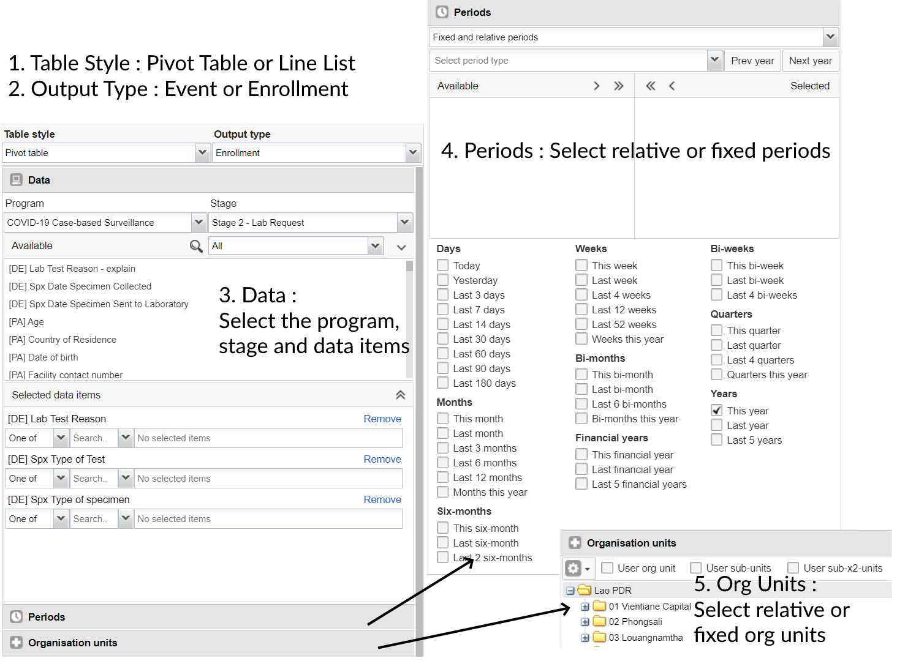
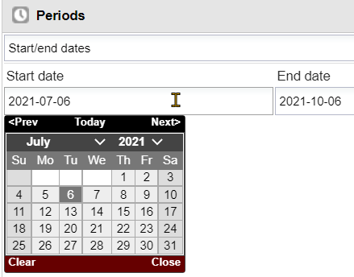
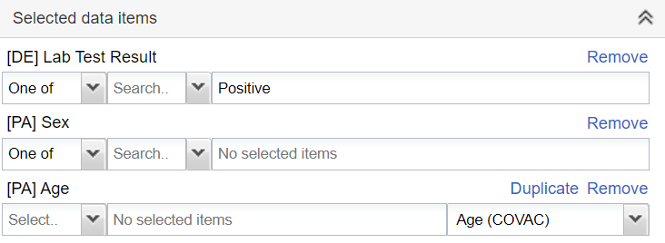
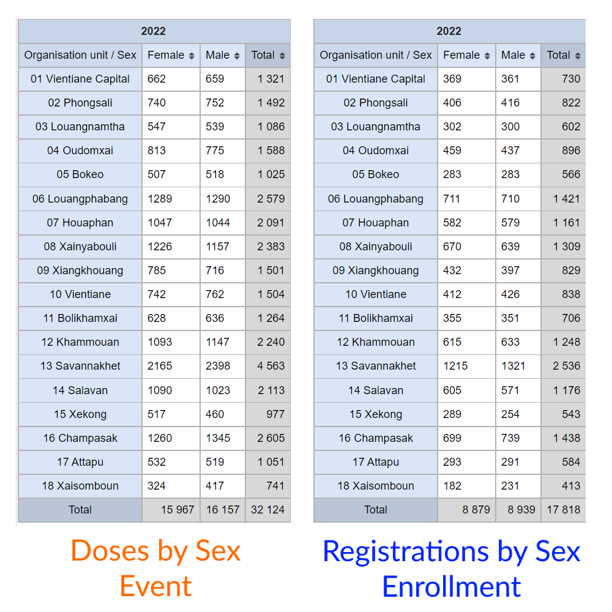

# Trainer’s Guide to Event Reports (Pivot) amd Line Listing

## What is this guide?

This guide is a support document for DHIS2 Academy trainers for the session “Event Reports and Line Listing.” This session follows the standard Academy training approach with

1. a live demo session where the trainer demonstrate and explain the features, and 
   
2. a hands-­on session with exercises where participants get to practice the same features.

This guide will help the trainer​ prepare​​ for the live demo session. The “Live Demo step by step” section has a detailed walkthrough of all the steps to demonstrate with explanations and screenshots that should be easy to follow. Use this when preparing for the live demo session.

There is also a Quick Guide which lists the steps very briefly and this is meant as a lookup guide or “cheatsheet” WHILE doing the demo, to help the trainer remember all the steps and the flow of the demo.

## Learning objectives for this session

The overall objective of this session is to use the DHIS2 Line Listing app to review ***tracker*** data. Detailed objectives include:

1. Describe the functions of the line listing app
2. Explain the difference between event and enrollment type reports
3. Design line listing reports using tracker data
4. Describe the differences between how repeated and non-repeated stage data is displayed
5. Design line listing reports showing data from multiple tracker program stages

## Time Requirements

Live Demo: 4 demos, 10 minutes each
Hands-on Exercises: 4 exercises, 10 minutes each
Assignment: 

## Background

This session build on concepts introduced during the event fundamentals course. In the events fundamentals course, the learner reviewed how to create an event report for a single event, creating both line-lists as well as aggregated reports. The line listing app is a new app that builds on some of the concepts described in using the event reports app. The line listing app allows for much more flexibility in creating line lists for tracker data and will be updated with additional features over time that event reports does not support. At this stage, implementations may still be transitioning between event reports and the line listing app; therefore the event reports trainer's and learner's guide is still available and can be shared with participants. The line listing app does not yet support aggregated outputs; so the event reports app will still need to be used for this purpose.

## Preparations

This session will see you creating a number of reports. Ensure that you have run analytics in the demo database you are using and that all the data is being populated correctly. If you find that data is not present for the correct period or year, please contact the training content team so we can advise how to move the data correctly.

You should consider running through the entire demo prior to presenting it. After this, you should take the quick guide and supplement it with any additional notes you made while running through the demo. If you identify any changes that may be required or additional explanation that would be helpful within the session, please content the training content team in order to allow us to evaluate how to best integrate this feedback into the material.

Every visualization that you are asked to create has been saved and should be shared for public view. You can open each one up and review how it is has been made if you are unsure about any of the visualizations contents.

Also, the learner's guide and session summary are the main material that will be provided to the learner's with both detailed steps for ungraded exercises as well as the key messages from the session. Review these as well to ensure you are able to get these key points across during your demonstration.

## Best Practices

Before starting the demonstration, please keep in mind that the most important thing is that the audience is following, so make sure to ask questions to the audience to verify that they are following. If something is unclear, go back and go through it slowly. If you don’t have time for all the steps, it is better to cut some steps, than to go fast while nobody understands.

In an online setting, you will be breaking regularly to allow them to perform various ungraded exercises in order to keep them engaged.

In an in-person setting, the participants may be doing the demo with you at the same time. In this scenario, it is ideal if there are other trainer's moving around the room to support participant's as it will be difficult for the trainer leading the session to answer many individual questions during the demonstrations. 

## Quick Guide

## Live Demo step by step

### Review the events reports interface

*NB: We will be using the line listing app to make line lists in this session. Therefore, we will only be using the "Pivot" table style in event reports to produce aggregate outputs. 

#### Periods in Event Reports

In event reports, Periods can be selected as either Fixed or relative periods (same as aggregate) or with specific start/end dates (specific to event/tracker data)

If choosing the start/end dates than you can select exact dates to filter events based on the report date that was entered during event or tracker capture.

### Create an aggregate/pivot table event report using COVID-19 vaccination

Open the table "COVID_CBS - Confirmed cases by Age & Sex." This the table that you will create. You can explain the layout to the participants before continuing. This should be a review as this type of table is covered in the events fundamentals online course.

Clear your inputs by going to Favorites -> New.

Create an aggregate event report. You can use the following data items as an example:

- Table Style : Pivot, Output Type : Event
- Program : COVID-19 Case Based Surveillance
- Stage : Stage 3 - Lab Results
- Data : Lab Test Result (select Positive as the filter), Age (apply the Age COVID-19 Legend), Sex
- Period : This year
- Org Unit : Country

The table should look like this after updating:

The layout can should like this

You should modify some of the options, for example hiding empty rows to hide the age groups with no data, and update the table to see the effect this has

Note that you can modify the way data that is collected through tracker (and event) programs is aggregated. You can demonstrate this by changing the legend for the Age attribute to Age (COVAC) and updating the table.

You will see all the totals are the same; however the disaggregation of the data is different.

This should be a review of concepts from the event fundamentals; however if there are questions you can explain this concept a bit more by referring to the examples you will have on screen.

### Other features as a refresher

You can also show them how to save the report using the favorites menu

 

and download the report

#### STOP! Have them perform *Exercise 1* in the learner's guide.

### Compare aggregate/pivot table event and enrollment reports using a repeatable stage

The main new concept in preparing pivot table event reports will be comparing event vs. enrollment type tables. 

Let's review an example with the following inputs

- Table Style : Pivot, Output Type : Event
- Program : COVAC - COVID-19 Vaccination Registration
- Stage : Vaccination
- Data : Sex, Vaccine Name
- Period : This year
- Org Unit : Country

This is saved as the output "COVAC - Doses by sex." *You can open this table instead of re-creating it*.

Duplicate your tab and open the existing event report "COVAC - Registrations by sex." 

This report has all of the same data input selections but is using "Enrollment" as the output type instead of event.

What happens when we compare these two outputs?

The output "COVAC - Doses by sex" is useful in understanding how many actual vaccinations have been given, because the vaccination program consists of a program stage that is repeatable. This report is using "event" as the output type, meaning it will count or display data for all events in one program stage.

This is not so useful however if we want to identify the number of unique individuals that are currently in the vaccination program. The output "COVAC - Registrations by sex" shows this as it is only counting the number of enrollments based on the "Enrollment" output type that has been selected.

> In summary, the "event" output type always shows data for all events within a single program stage, while the "enrollment" output type will count unique registrations and will only use data from the most recent event in its output.

#### STOP! Have them perform *Exercise 2* in the learner's guide.