# Trainer’s Guide to Program Indicator Analysis

## What is this guide?

This guide is a support document for DHIS2 Academy trainers for the session “Program Indicator Analysis.” This session follows the standard Academy training approach with 

1. a live demo session where the trainer demonstrate and explain the features, and 
   
2. a hands-­on session with exercises where participants get to practice the same features.

This guide will help the trainer​ prepare​​ for the live demo session. The “Live Demo step by step” section has a detailed walkthrough of all the steps to demonstrate with explanations and screenshots that should be easy to follow. Use that when preparing for the live demo session.

There is also a Quick Guide which lists the steps very briefly and this is meant as a lookup guide or “cheatsheet” WHILE doing the demo, to help the trainer remember all the steps and the flow of the demo.

## Learning objectives for this session

1. Describe what a program indicator is
2. Describe how program indicators are derived
3. Describe the difference between event and enrollment program indicators
4. Understand how program indicators can fill tracker data analysis gaps present in other visualization tools
5. Create visualizations using program indicators derived from tracker data

## Time Requirements

- Live Demo: 3 demos, ~10 mins each
- Hands-on Exercises: 3 exercises, ~10mins each
- Assignment: 30 mins multiple choice

## Background

Program Indicators offer a flexible way of interacting with tracker data and allow for a number of advanced functionality as it relates to aggregating or summarizing individual tracker data. This session will focus on how program indicators can be used in data visualizer, maps and event reports to both display information related to a single tracked entity as well as summarize data for many tracked entities based on the org unit and period you are working with. 

## Preparations

This session will see you creating a number of visualizations. Ensure that you have run analytics in the demo database you are using and that all the data is being populated correctly. If you find that data is not present for the correct period or year, please contact the training content team so we can advise how to move the data correctly.

You should consider running through the entire demo prior to presenting it. After this, you should take the quick guide and supplement it with any additional notes you made while running through the demo. If you identify any changes that may be required or additional explanation that would be helpful within the session, please content the training content team in order to allow us to evaluate how to best integrate this feedback into the material.

Every visualization that you are asked to create has been saved and should be shared for public view. You can open each one up and review how it is has been made if you are unsure about any of the visualizations contents.

Also, the learner's guide and session summary are the main material that will be provided to the learner's with both detailed steps for ungraded exercises as well as the key messages from the session. Review these as well to ensure you are able to discuss these key points during your demonstration.

## Best Practices

Before starting the demonstration, please keep in mind that the most important thing is that the audience is following, so make sure to ask questions to the audience to verify that they are following. If something is unclear, go back and go through it slowly. If you don’t have time for all the steps, it is better to cut some steps, than to go fast while nobody understands.

In an online setting, you will be breaking regularly to allow them to perform various ungraded exercises in order to keep them engaged.

In an in-person setting, the participants may be doing the demo with you at the same time. In this scenario, it is ideal if there are other trainer's moving around the room to support participant's as it will be difficult for the trainer leading the session to answer many individual questions during the demonstrations. 

## Quick Guide

1. In data visualizer, create a pivot table using an event program indicator from COVID-19 Vaccination Registry program
- Visualization Type : Pivot Table
 - Data 
   - Data Type : Program Indicator
   - Program : COVID-19 Vaccination Registry program
   - Program Indicator : Underlying conditions
 - Period : Last 6 months
 - Org Unit : All Level 2 OUs

2. Create a chart using program indicators from different program stages from COVID-19 Case-based Surveillance Program
   1. Create the chart using
      - Visualization Type : Line Chart
       - Data 
         - Data Type : Program Indicator
         - Program : COVID-19 Case-based Surveillance Program
         - Program Indicators : 
           - COVID-19 Symptoms present
           - COVID-19 Symptoms present - death
           - COVID-19 Symptoms present - recovered
       - Period : This Year
       - Org Unit : All Level 2 OUs
   2. Explain the visualization and where the data is coming from. Note that this type of chart can not be made in event visualizer.
   3. Convert the chart to a pivot table. Note that this type of table can not be made in event reports.
   4. Convert the table to a map. Note that you are now using the thematic layer to display your data, which has different options available compared to the event and TEI layer.

STOP! Have them perform *Exercise 1* in the learner's guide.

3. Create a map using a program indicator from the COVID-19 Case-Based Surveillance program
   1. Create the chart using
      - Layer Type : Thematic 
      - Data:
        - Item Type : Program Indicators
        - Program : COVID-19 Case-Based Surveillance
        - Program Indicator : COVID-19 Suspected Cases
        - Leave the aggregation type as default
      - Period:
        - Period Type : Relative
        - Period : Last 12 months
        - Display Periods : Timeline
      - Org Units : All Level 2 OUs
      - Filter : None
      - Style : Bubble Map, Single Color Legend
   2. Highlight the additional options available when using the thematic layer via program indicators 

STOP! Have them perform *Exercise 2* in the learner's guide.

4. Create an event report showing the number of relationships by TEI from the COVID-19 Case-based Surveillance Program
   1. Create the linelist using
      - Table Style : Line, Output Type : Enrollment
      - Program : COVID-19 Case-based Surveillance
      - Stage : Stage 1 - Clinical examination and diagnosis
      - Data
        - First Name, Surname
        - Sign/Symptoms Present
        - PI COVID-19 Contacts
      - Period : This year
      - Org Unit : CHW Mahosot
   2. Explain the report and the program indicator you have added to this report
   3. Add the program indicator for days between symptoms onset and consultation
   4. In data visualizer, create a bar chart showing the average days between onset and consultation across all level 3 OUs within Savannakhet
      1. Create the chart using
       - Visualization Type : Bar Chart
       - Data 
         - Data Type : Program Indicator
         - Program : COVID-19 Case-based Surveillance Program
         - Program Indicator : COVID-19 days between onset and consultation
       - Period : This Year
       - Org Unit : Level 3 OUs within Savannakhet
      2. Explain the chart and based on what the program indicator is showing

STOP! Have them perform *Exercise 3* in the learner's guide.

5. Review the recap slide
6. Have them perform the assignment

## Live Demo step by step

### Create a pivot table in data visualizer using an enrollment program indicator from the COVID-19 Vaccination Registry program

Open the table "COVAC - Underlying Conditions, last 6 months." This is the table that you will create. You can explain the layout to the participants before continuing.

Clear your inputs by going to Favorites -> New.

In the first example, you will create a simple pivot table using a single program indicator in data visualizer. It will have the following inputs:

 - Visualization Type : Pivot Table
 - Data 
   - Data Type : Program Indicator
   - Program : COVID-19 Vaccination Registry program
   - Program Indicator : Underlying conditions
 - Period : Last 6 months
 - Org Unit : All Level 2 OUs

The layout can look like this

The table should look like this (the months shown may differ as its relative to the current date)

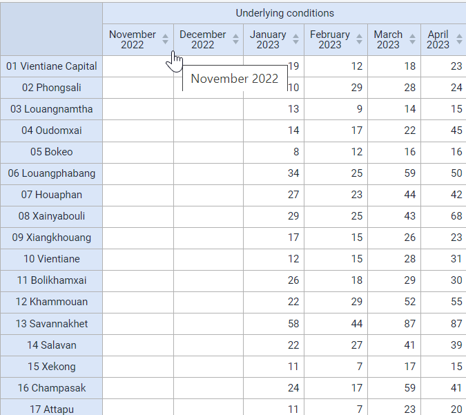

This is an enrollment type program indicator that is pulling its information from the data element "COVAC - Underlying conditions." 

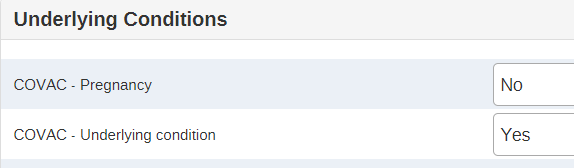

Enrollment is being used for this program indicator so it does not double or triple count the number of individuals with an underlying condition (remember, this program consists of a single repeated stage).

You can quickly compare the two reports by duplicating your current tab followed by opening the saved table "COVAC - Underlying Conditions (event), last 6 months."

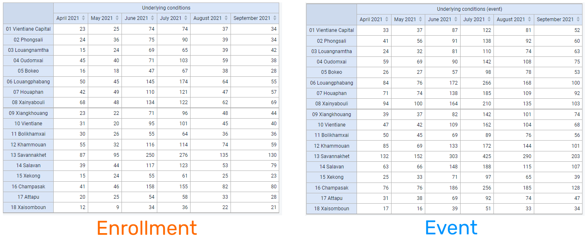

You will see the event based indicator reports higher values as it is counting the underlying condition variable for every event; this does not make sense in this scenario if you want to know the total number of unique people with an underlying condition.

Note that you are able to create this same output in event reports using an enrollment pivot table. So far, we have not addressed any gap but are just showing that it is possible to pull filtered tracker data into data visualizer.

### Create a chart using event indicators from different program stages from the COVID-19 Case-based Surveillance Program

One gap that we can address however is creating a pivot table, chart or map using data from different program stages. We can do this in data visualizer for any of the available visualizations using either event or enrollment type program indicators and is not something we could achieve in either event reports or event visualizer.

Open the chart "COVID_CBS - Symptoms and health outcome, this year." This is the chart that you will create. You can explain the layout to the participants before continuing.

Clear your inputs by going to Favorites -> New.

In this example, we will create a line chart with the following inputs:

 - Visualization Type : Line Chart
 - Data 
   - Data Type : Program Indicator
   - Program : COVID-19 Case-based Surveillance Program
   - Program Indicators : 
     - COVID-19 Symptoms present
     - COVID-19 Symptoms present - death
     - COVID-19 Symptoms present - recovered
 - Period : This Year
 - Org Unit : All Level 2 OUs

In order to create this chart, ensure your layout looks like this:

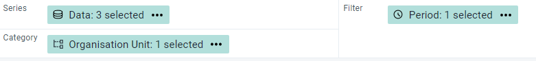

The chart should look like this

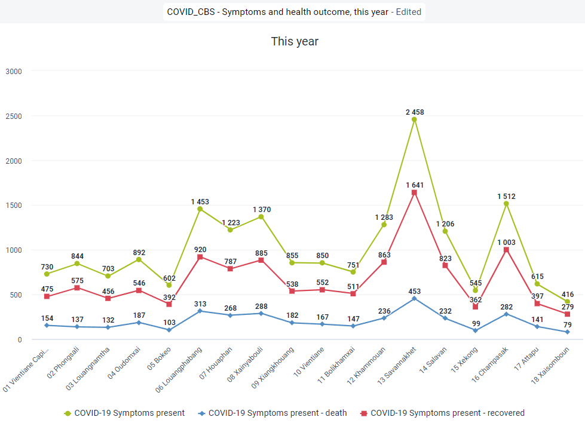

This chart uses enrollment indicators, including combining data from Stage 1 (Clinical exam and diagnosis), where it gets the data on whether or not a person has symptoms, and Stage 4 (Health Outcome), where it gets the information on whether or not the person died or recovered. It is not possible to create this type of output using event visualizer (you can not pull data from multiple stages using event visualizer). 

You can covert this chart to a pivot table so they can see that you can also create a pivot table using data from multiple stages, an option not possible in event visualizer/reports.

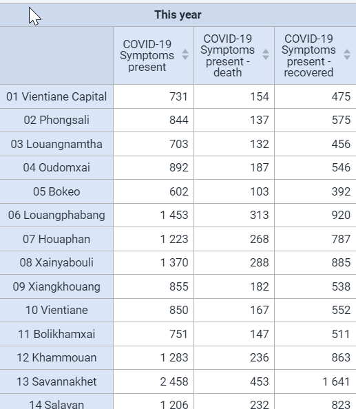

Lastly, you can open this table as a map to show you can now use the thematic layer. The thematic layer opens up a number of additional options when working with your data (we will go over an example where we create a map from scratch using a program indicator in the thematic layer during the next part of this session).

Do this by selecting "Open as Map" from the visualization selection.

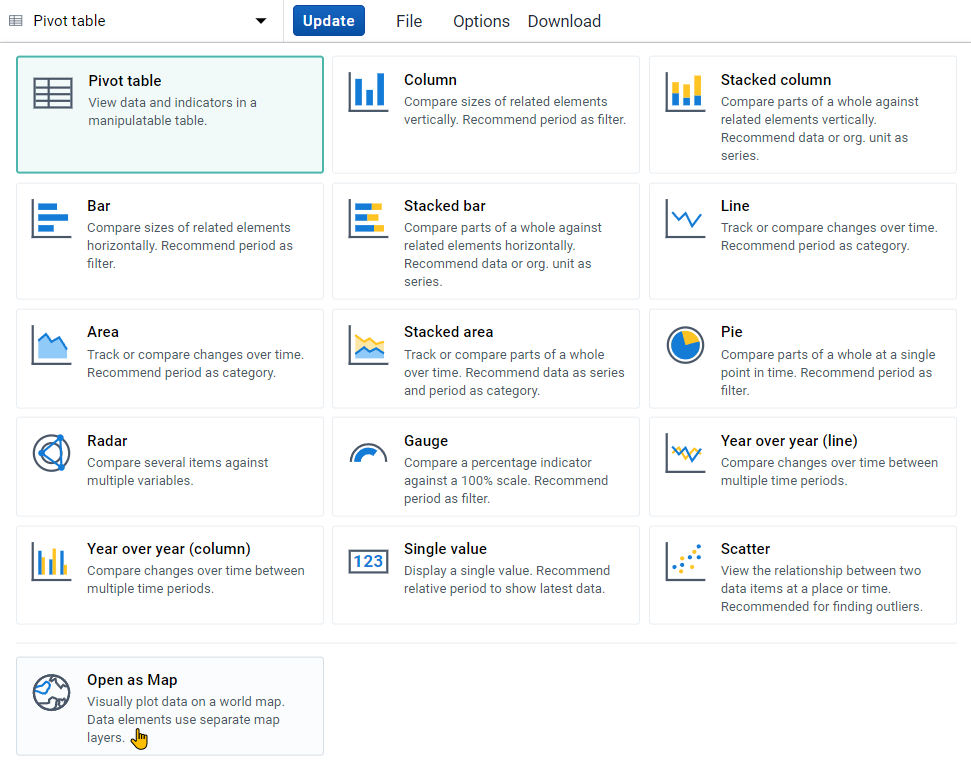

When you open this as a map, you will have to select one of the data items used in the chart/table as your primary layer (you can select all 3 but since they are all displaying data at the same OU level, you will in effect only see data from the top layer). Select one of the enrollment indicators (death or recovered) using data from multiple stages to demonstrate that this type of data can be mapped.

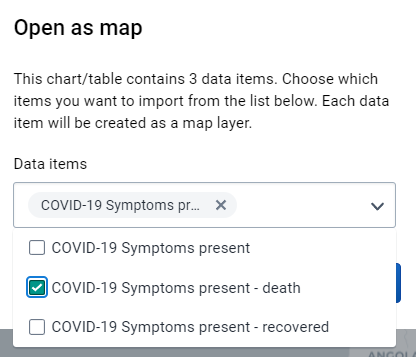

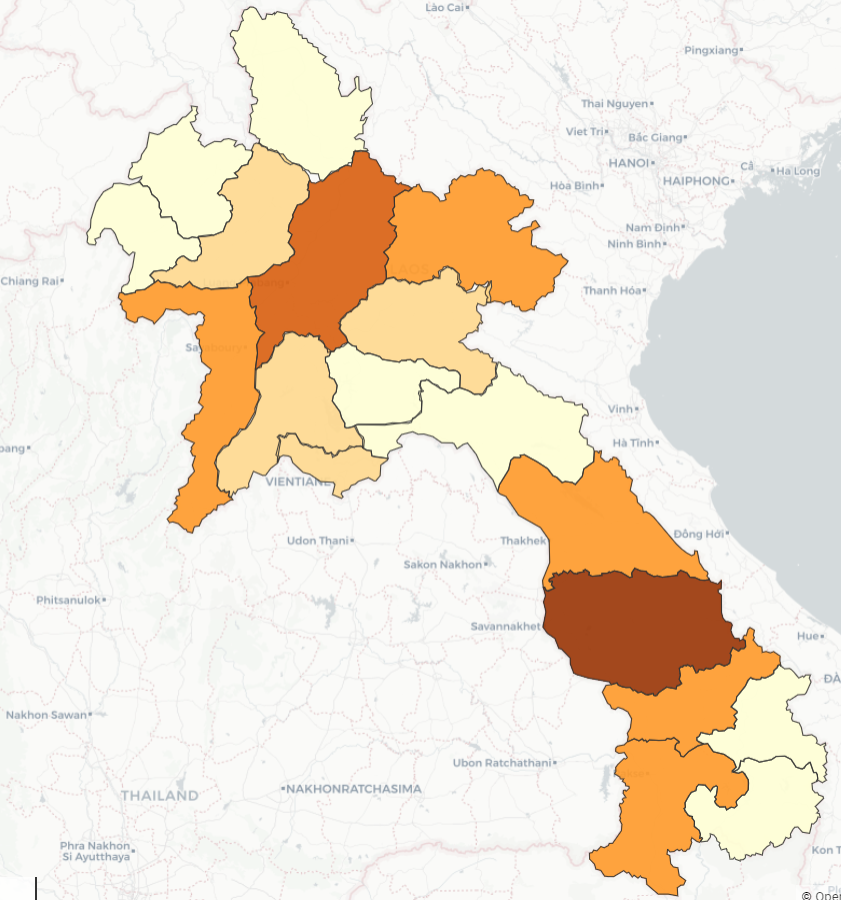

#### STOP! Have them perform *Exercise 1* in the learner's guide.

### Create a map using a program indicator from the COVID-19 Case-Based Surveillance program

In the maps session, we had discussed how we can use the event and TEI layer to map raw tracker data (also known as event data items). While we can also use the thematic layer when dealing with tracker data, this is often less useful as the number of numeric data elements in a tracker program may be limited. 

Through the use of program indicators however we are able to extend maps functionality with tracker data significantly as we can use the thematic layer to its full potential. This includes creating split view and timeline maps and using the available style options (such as creating choropleth and bubble maps) that are not available when using the event and TEI layer as examples.

Open the map "COVID_CBS - Suspected cases, last 6 months." This is the map that you will create. You can explain the layout to the participants before continuing.

Clear your inputs by going to Favorites -> New.

Create a map using the thematic layer with the following inputs:

- Layer Type : Thematic 
- Data:
  - Item Type : Program Indicators
  - Program : COVID-19 Case-Based Surveillance
  - Program Indicator : COVID-19 Suspected Cases
  - Leave the aggregation type as default
- Period:
  - Period Type : Relative
  - Period : Last 6 months
  - Display Periods : Timeline
- Org Units : All Level 2 OUs
- Filter : None
- Style : Bubble Map, Single Color Legend

**Data Tab**

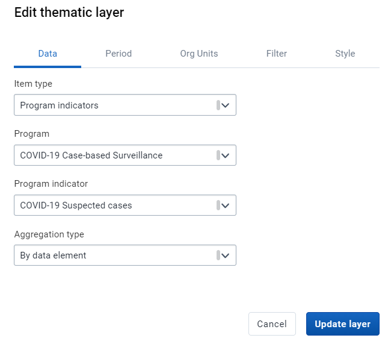

**Period Tab**

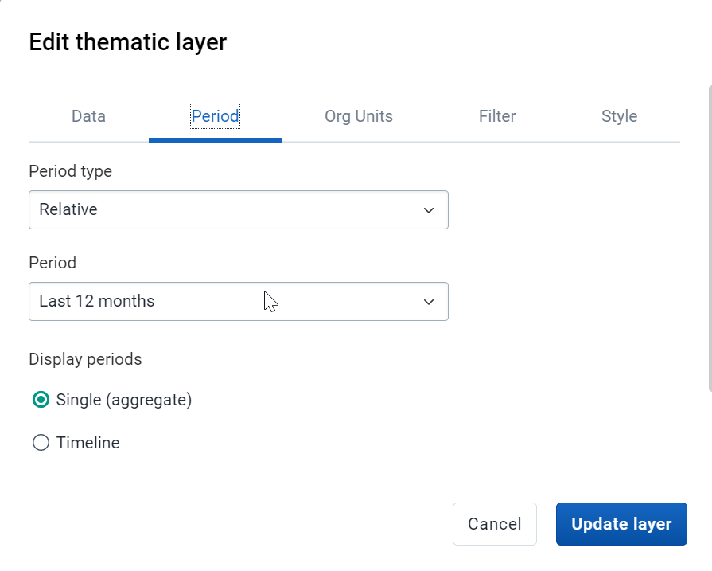

**Org Units Tab**

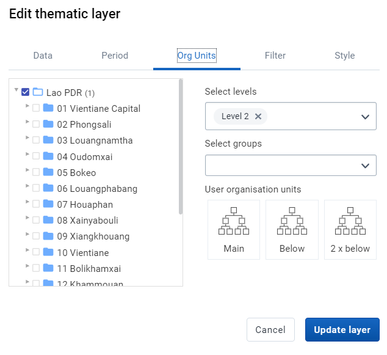

**Style Tab**

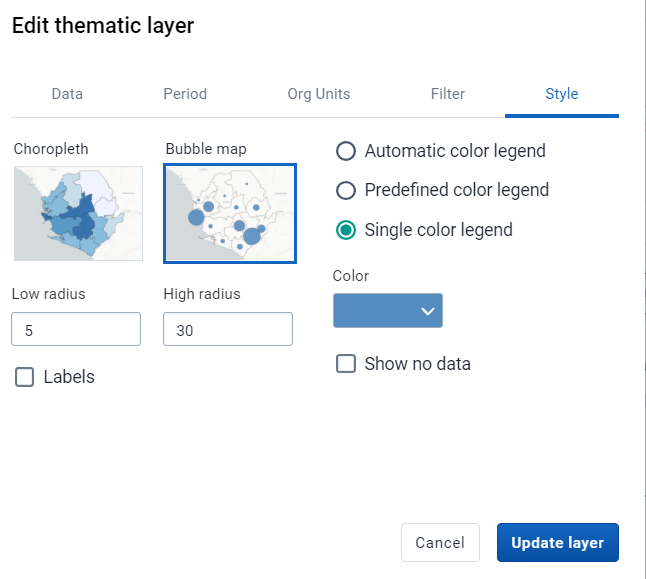

The map should look like this (note that the months displayed may be different as the period is relative to the current date)

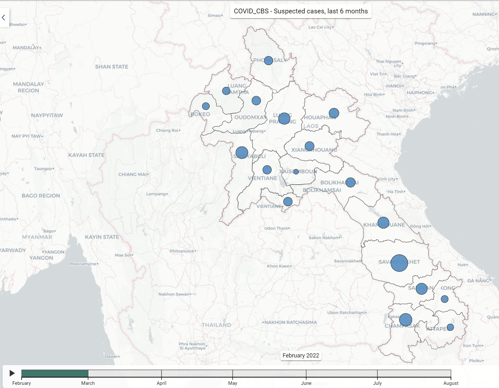

You can play back the timeline map. You will see over time the monthly values are increasing in line with the COVID-19 situation occurring globally (the map is showing the total number per month, not the cumulative number; cumulative can be shown however the indicator needs to be configured differently).

#### STOP! Have them perform *Exercise 2* in the learner's guide.

### In the line listing app, create a line list, enrollment report showing the number of relationships by TEI from the COVID-19 Case-based Surveillance Program

Program indicators can be used in event reports and event visualizer as well as within data visualizer and maps, depending on how they are defined. This is because one program indicator can work on two levels:

1. Through creating a summary output for a single TEI
2. Through creating a summary output for all TEIs within a period/org unit 

We will demonstrate these principles using two program indicators that use "Average" as the aggregation type.

1. COVID-19 Contacts
   1. Summarizes the total number of contacts a single TEI has through the relationships that have been created in tracker capture
   2. Summarizes the average number of contacts for all TEIs based on their enrollment date and the specified period and organisation unit
2. COVID-19 days between onset and consultation
   1. Summarizes the total number of days between onset of symptoms and their initial consultation date for single TEI
   2. Summarizes the average number of days between onset of symptoms and initial consultation date for all TEIs based on their enrollment date and the specified period and organisation unit

Open the table "COVID_CBS - Contacts by Person." This is the table that you will create. You can explain the layout to the participants before continuing.

Clear your inputs by going to Favorites -> New.

Create a line list table with the following inputs:

- Input Type : Enrollment
- Program Dimesions 
  - Program : COVID-19 Case-based Surveillance
  - Data
    - Attributes : First Name, Surname
    - Data Element: Sign/Symptoms Present
    - Program Indicator: COVID-19 Contacts
- Org Unit : CHW Mahosot
- Time Dimension : Case Registrtion Date (this is the enrollment date)

Note : here is the location of the org unit in case you are unfamiliar with this hierarchy (01 Vientiane Capital -> 0001 CH Mahosot -> CHW Mahosot)

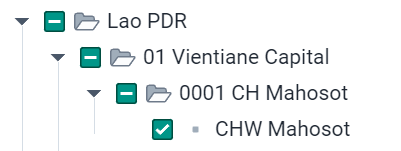

The table should look like this

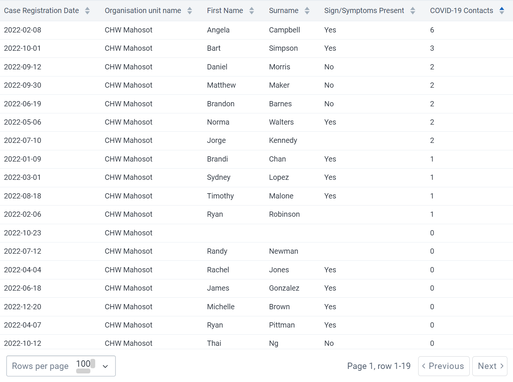

Emphasize that you are able to select program indicators from the program dimensions tab; however some program indicators may not work as intended or not give you any meaningful output depending on how they have been configured. For example, for a single TEI, any count based indicators within a single, non-repeatable program stage may not be so helpful as the maximum value they can return is 1 for a single TEI.

Sort the table by the "COVID-19 contacts" column. This is showing the number of contacts each person has had as defined through adding relationships via tracker capture.

(note : a likely follow up question may be if we can list the individuals they have relationships with; this is not possible and requires a custom app or report)

#### Add the program indicator "COVID-19 days between symptoms onset and consultation" to your report and update your line list

From the program dimesions tab, add the PI "COVID-19 days between symptoms onset and consultation" 

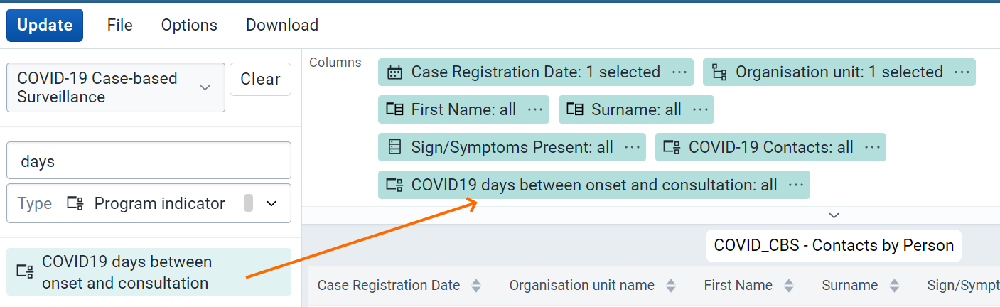

Update your table.

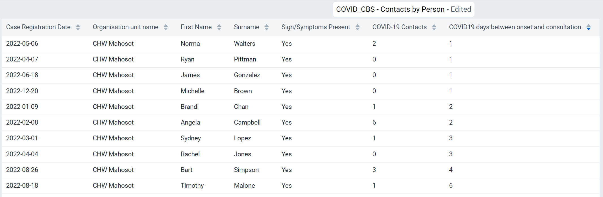

We now have an additional program indicator which is showing the number of days between each person's onset of symptoms and their initial consultation.

#### Create a bar chart showing the average days between onset and consultation across all level 3 OUs within Savannakhet

As discussed previously, these types of program indicators can function on two levels. We have reviewed how we can use various types of program indicators at the individual level, now we can use the same program indicator and create a summary output.

We will use data visualizer to demonstrate this.

> Note: Program indicators are available to select within event visualizer but they often do not result in any output. It is best to use data visualizer to create charts when using program indicators.

Open the chart "COVID_CBS - Average days between symptoms onset and consultation, this year." This the chart that you will create. You can explain the layout to the participants before continuing.

Clear your inputs by going to Favorites -> New.

In data visualizer, create a chart with the following inputs:

 - Visualization Type : Bar Chart
 - Data 
   - Data Type : Program Indicator
   - Program : COVID-19 Case-based Surveillance Program
   - Program Indicator : COVID-19 days between onset and consultation
 - Period : This Year
 - Org Unit : Level 3 OUs within Savannakhet

Note : here is the location of the org unit in case you are unfamiliar with this hierarchy

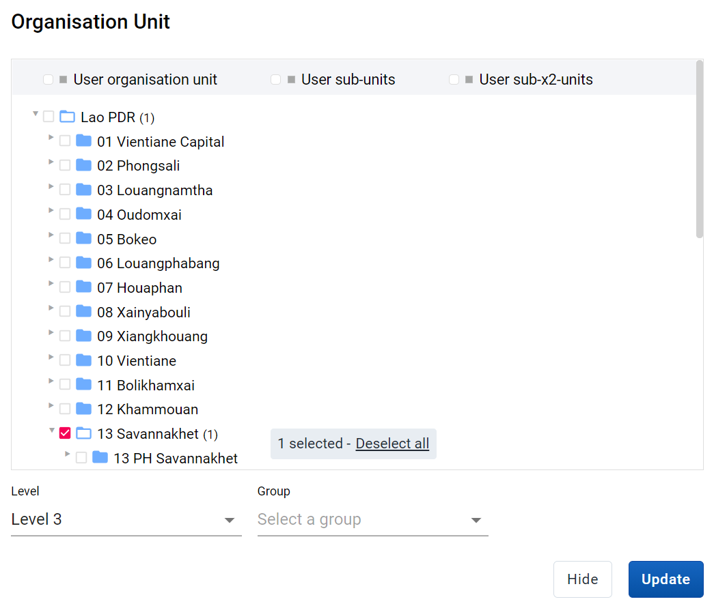

And here is the layout that should be used for the chart

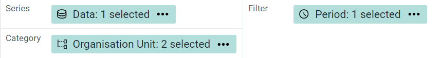

The chart should look like this

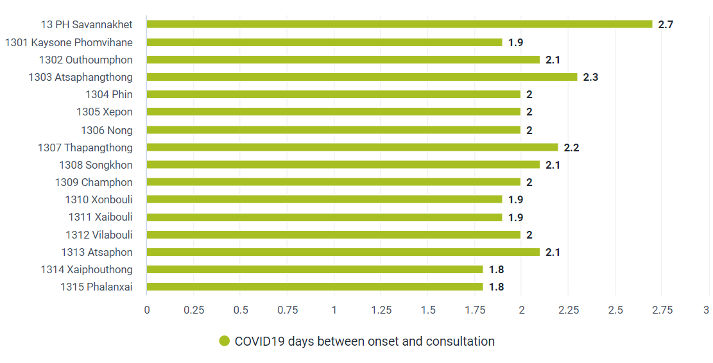

When we review this chart, we no longer see values that are representative of one individual person, but using the same indicator we are able to take an average for all individuals within the organisation units and period that we have selected.

#### Summary on these two indicators

From these two program indicator examples, we can see that program indicators can have multiple functions at both the individual and aggregate level. These various functions can be quite useful depending on what information you are looking to review within your system. There are many other advanced possibilities that are available when using these types of indicators. The best source of this information will be the documentation.

#### STOP! Have them perform *Exercise 3* in the learner's guide.

## Recap

Review the recap slide with them at the end of the session before they perform the assignment

## Assignment

After you have completed all demos and they have finished the exercises, have them complete the graded assignment for this session. If you find you are running out of time, assign the graded assignment to them and ask them to complete it outside of the live scheduled session.

