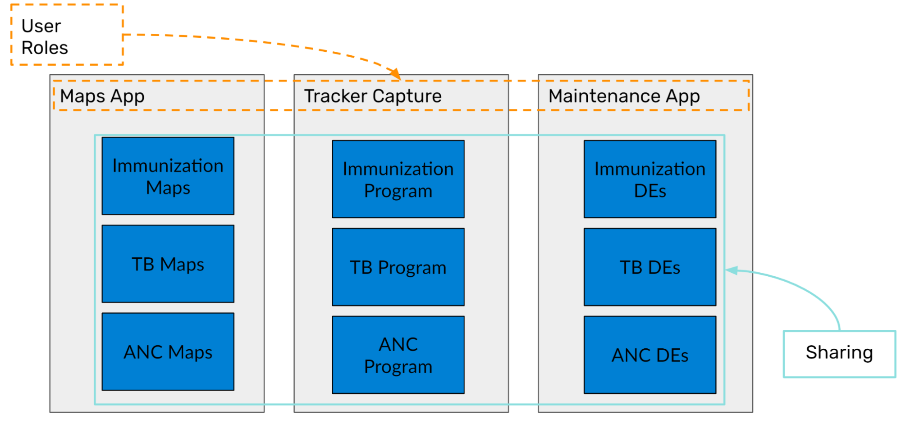
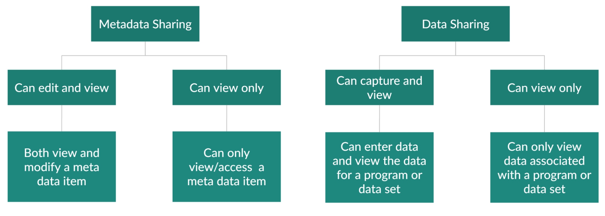

# Sharing - Session Summary

* User roles can be thought of as the top layer restriction on what users can do in the system
* Sharing can be thought of as the second layer which more precisely restricts a user roles functions to specific objects in the system

The sharing model has two levels, metadata and data sharing. Metadata sharing is focused on various elements of the configuration, while data sharing deals with how a person can interact with already existing, or, potentially add new data

In a tracker program, we can share the meta-data of following objects

* Data Elements
* Tracked Entity Attributes
* Option Sets
* Tracked Entity Types
* Programs
* Program Stages
* Program Indicators

In a tracker program, we can share the data of the following objects:

* Tracked entity types
* Programs
* Program Stages

The data level sharing can be described as follows

Tracked entity type

| Can view data                                                                                                                              	| Can capture data                                                                                                                                                                                                                                                             	|
|--------------------------------------------------------------------------------------------------------------------------------------------	|------------------------------------------------------------------------------------------------------------------------------------------------------------------------------------------------------------------------------------------------------------------------------	|
|  Search for tracked entities with this tracked entity type  See tracked entity type attribute values for this tracked entity type 	|  Edit visible tracked entity attributes for tracked entity instances of this type  Register/create new tracked entity instances of this type  Delete tracked entity instances of this type  Deactivate/reactivate tracked entity instances of this type 	|

Tracker Program

| Can view data                                                                                                                                                                                       	| Can capture data                                                                                                                                                                                                                                                                                           	|
|-----------------------------------------------------------------------------------------------------------------------------------------------------------------------------------------------------	|------------------------------------------------------------------------------------------------------------------------------------------------------------------------------------------------------------------------------------------------------------------------------------------------------------	|
|  Search for tracked entities within this program  See tracked entity attributes specific to this program  See enrollment details for the program  See notes for the enrollment 	|  Enroll entities into the program  Edit enrollment details for the program  Complete/reopen enrollments into the program  Add notes for the program  Edit relationships for the program  Send message to tracked entity instance  Delete enrollments in the program 	|

Program Stage
| Can view data                                                                                             	| Can capture data                                                                                                                                                                                                                                                                            	|
|-----------------------------------------------------------------------------------------------------------	|---------------------------------------------------------------------------------------------------------------------------------------------------------------------------------------------------------------------------------------------------------------------------------------------	|
|  See the program stage and its events and data within an enrollment  See the program stage notes 	|  Add/schedule/refer a new event within the program stage  Complete/reopen the events within the program stage  Edit tracked entity data values within events in the program stage  Add notes for events in the program stage  Delete events in the program stage 	|

