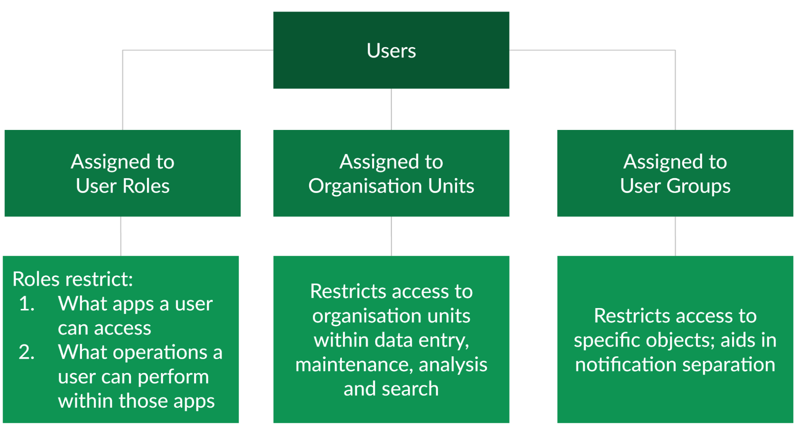
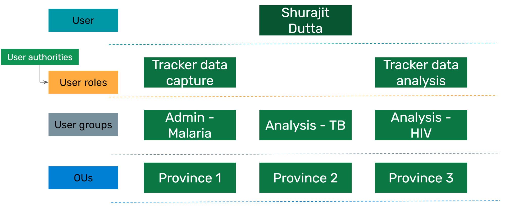

# USERS SUMMARY

Users are made of up the following elements

* User Authorities
    * A permission to perform one or several specific tasks
* User Roles
    * A group of authorities created for a specific type of user
* User Groups
    * A group of users that have access to a specific object
* Organisation Units
    * Control a users access to administrative units in data entry, data analysis, and search

To create a user role, we must select authorities from 5 different sections

1. **Metadata** : the metadata section allows you to assign different permissions to a user role that allow for adding or deleting either public or private metadata objects. For example, you could provide someone access to create and delete public data elements. You will also see an option for external access. This is only available for report type objects, and allows this user role to give access to these reports via outside access (for example, through a web portal). 
2. **Apps**: the apps section allows you to give access to the various DHIS2 apps that are within your instance. This includes all of the core DHIS2 apps, as well as any custom apps you may have on your own system. Note that this section only gives you access to the app, it does not specify what you can do within the app necessarily.
3. **Tracker** : tracker authorities have their own specific section as they are unique to the tracker data model. This does include events to some extent as well. This is because items like adding tracked entities or modifying events is unique to this model.
4. **Import - Export** : these authorities are given to a user role that will be dealing with the import/export of metadata, data or both. This is usually only given to a specialized role.
5. **System** : the system authorities allow a user to run various system level operations within DHIS2. This includes operations like validation rule analysis, predictor, and data approval for example. 

We combine the authorities from these sections to create roles that we can assign to multiple users as needed. 

We create several roles, and then can assign a user any combination of these roles that we require.
