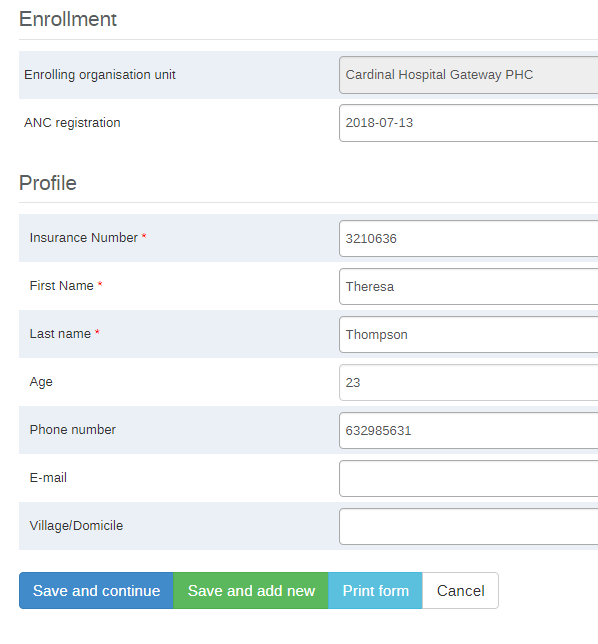
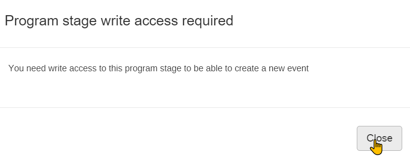
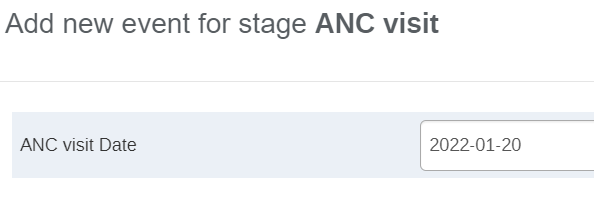
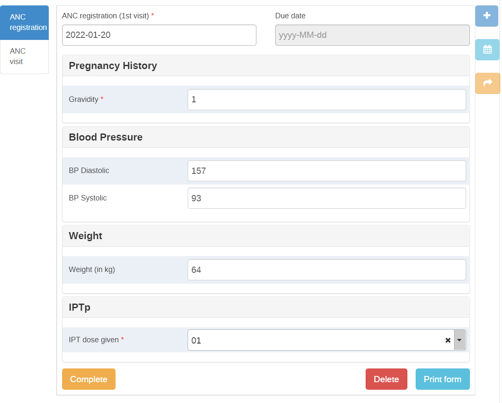
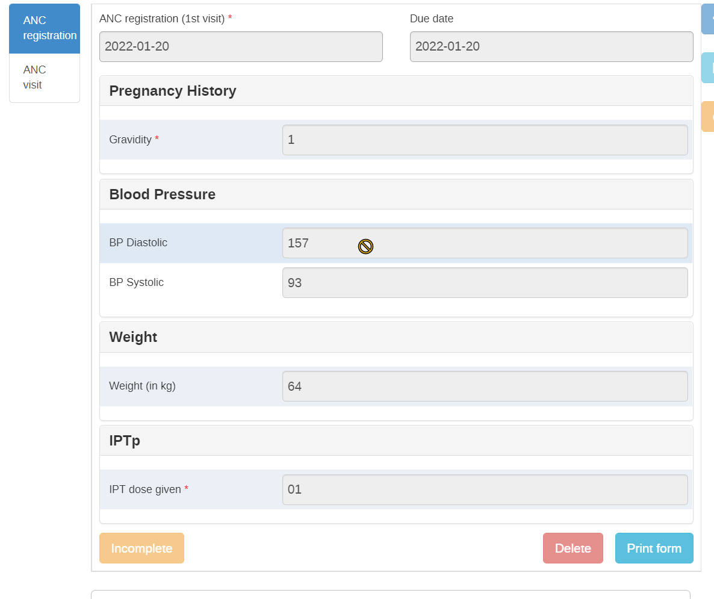
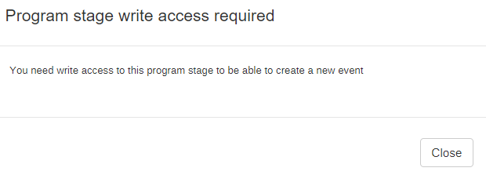
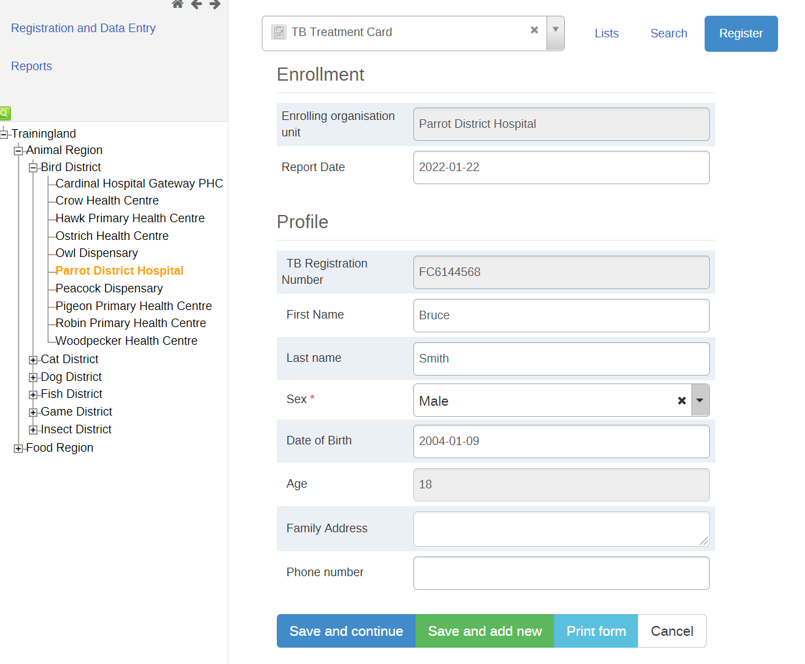
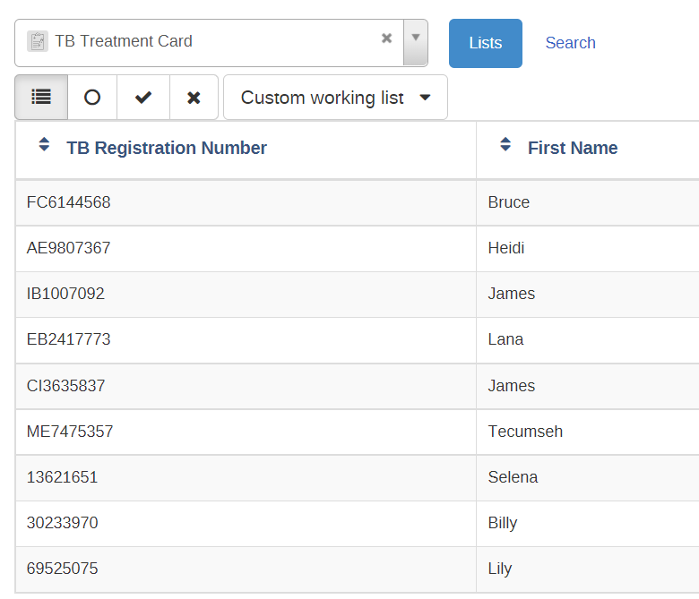
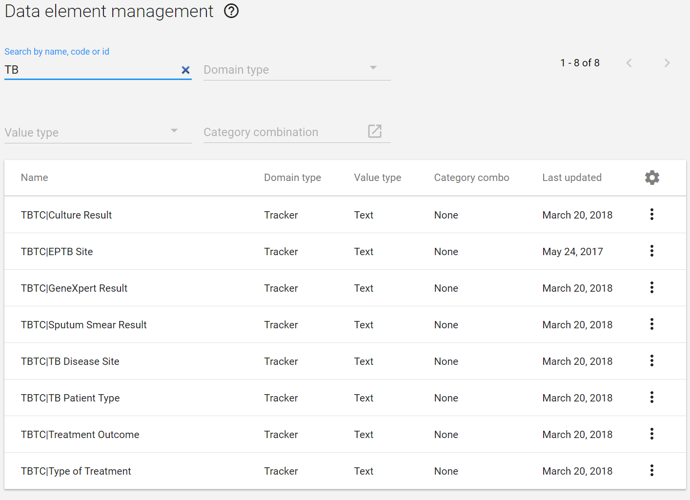

# **Learner’s guide to Sharing - Part 1**

# Perform these exercises in the “DEMO” instance

## **What is this guide?**

This guide contains all ungraded exercises and detailed steps to perform them related to the creation of a tracker program for the Tracker Config Level 1 academy. Please perform each of the exercises when prompted to by your instructors

## **Learning objectives for this session**

* Describe the sharing concept
* Explain the link between sharing and user groups
* Describe the difference between metadata and data sharing
* Identify the objects within a tracker program that can be shared
* Describe the concepts of program and program stage sharing
* Apply program and program stage sharing to your own program

## **Exercise 1**

In this exercise you will be logging in as different users in order to show that you can configure users to have different levels of access to tracker programs and program stages. In Exercise 1, we will review the users associated with the ANC program.

### Step 1 - Log in as the case registration user

Log in as the first user

Username: casereg

Password: District1#

This user can only register cases and enter data into the first stage of the program. This may be the person at the front desk who is responsible for registering all clients regardless of what service they received.

Note that this user does not have access to any data analysis apps, only tracker capture. This is a result of their user role which will be discussed further later on. The apps they do see are all controlled by their user role.


Go to tracker capture and select an org unit at the facility level. You will see in this case this user has access to multiple programs as they are responsible for registering patients in all health programs. 


As this user’s primary role is to register clients, note that the “Register” button exists for this user. Select this button and register a new patient into the Antenatal care program.



Select save and continue.

This user is unable to create any new events. This will result in an error if this user tries to do so.



This is controlled via sharing. They have access to view data that is already within a record, so they can look up a person’s record and the information if that is already completed for example in order to reduce duplicate entry, but they can not add any events to the program stages.

### Step 2 - Log in as ANC staff 

Login as the ANC staff member. This user has access to view and edit all the data within all program stages. They are not able to register however, as that is handled by another user type.

Username: ancstaff

Password: District1#

You can see they have access to more apps when compared to the previous user. This is defined through the user role(s) assigned to them.


When you go to tracker capture with this user and select a facility (select the same facility you registered a mother in using the caereg user), note that they will not see the “register” button at all when within an organisation unit. This is because these users do not have the ability to register new patients. This is reserved for the users in the “Case Registration” user group.


You will, however, see the new case that the other user has registered. You can select (or search and select) the case you previously registered which will take you to the tracker dashboard. This user will be able to add new events to the program stages



They can also interact with the data elements as they have the ability to edit the data.




### Step 3 - Login as the ANC Manager

Login as an ANC manager. This user has access to view and all the data within all program stages. They can not edit any of the stages or register new expectant women however.

Username: ancmanager

Password: District1#

This user has access to the same apps as the ANC staff member. They will likely have the same user roles assigned to them, but this can be confirmed later on. Go to tracker capture and find the same person you have been working on in the other examples. This person can not register cases, similar to the ANC staff member. When you go to the dashboard for the patient you were working with, you will see the ANC manager can see the data for the program stages, but can not edit any of the data.



Similarly, if they try to add an event, they will see an error.



The ability to see the data within these program stages but not edit the program stages is controlled via sharing. The ability to see data is not restricted to only tracker capture; they can also view data in the analysis apps. This must be combined with the authority “View event analytics” to view data within the analysis apps. 


```
Both the ANC manager, ANC staff and case registration user have the same permissions to view this data, though this could be changed via sharing if you did not want this to be the case. The case registration user is limited where they can see this data however, as they do not have access to any analysis apps. They could therefore only see the data in the dashboard or through a person's tracked entity dashboard. This could be changed by assigning them the correct user authorities via a user role.
```

## **Exercise 2**

In exercise 2, you can review a more common configuration of program and program stage access using the TB program.


### Step 4 - Login as the TB Data Entry User

Login as the TB data entry user. This user has access to register data and enter data for all of the program stages. 

Username: tb_entry

Password: District1#

As an entry user, they only have access to certain apps


If we go to tracker capture we can register a new person



And we can see they can enter data for all of the stages


### Step 5 - Login as the TB Data Analysis User

Login as the TB analysis user. This user has access to view data for all of the program stages. They also have additional access to analysis apps.

Username: tb_analysis

Password: District1#

This user has access to tracker capture to view records, 

If we navigate to tracker capture we will see they can’t register any records



If you open a record, they can not edit it either


They can however run reports


### Step 6 - Login as the TB Admin User

Login as the TB admin user. 

Username: tb_admin

Password: District1#

This user has access to tracker capture and analysis apps to view records as well as maintenance to edit metadata. It is the only user out of the three that has access to maintenance.


