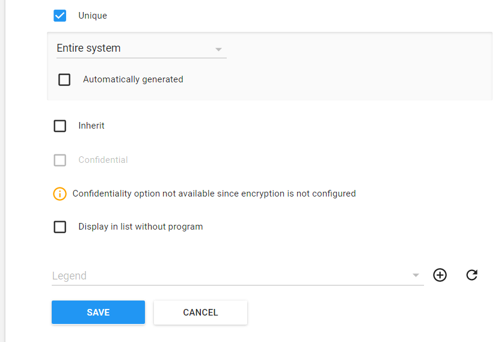
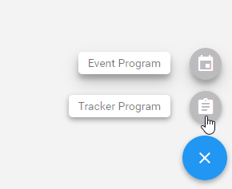
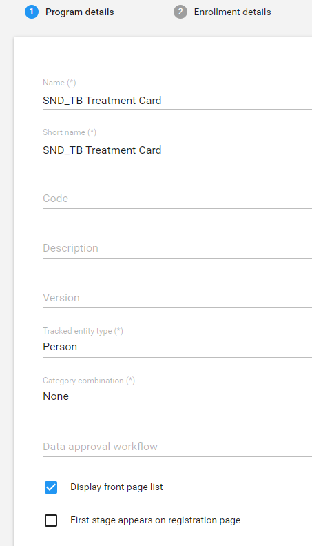
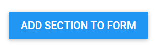

# **Learner’s guide to Creating a Multiple Stage Tracker Program**

**_Perform these exercises within the “CONFIG” system_**

## What is this guide?

This guide contains all ungraded exercises and detailed steps to perform them related to the creation of a tracker program for the Tracker Config Level 1 academy. Please perform each of the exercises when prompted to by your instructors

## Learning objectives for this session

The overall objective of this session is to demonstrate the design of a multiple stage tracker program in DHIS2. Detailed objectives include:

* Creating Option Sets through the user-interface
* Creating “Tracker” type data elements
* Creating Tracked Entity Attributes through the user interface
* Creating a tracker program
* Filling in correct tracker program details
* Creating program stages
* Creating section based data entry forms
* Assign a Program to Organisation Units

## Background

In this exercise we will go through the process of creating a multiple stage tracker program in its entirety. An example of this program has already been created in Trainingland, “TB Treatment Chart,” at the facility level. You can review this program to get a better understanding of how this example program has been created. 

The program consists of 4 stages starting with the diagnosis/initial phase, 2 continued treatment phases and the end of treatment phase. The program is broken up via the following attributes and data elements:

**Attributes**

* Reg. No
* First Name
* Last Name
* Age (in years)
* Sex (Male/Female)
* Address
* Phone

**Program Stage 1 - Diagnosis/Initial Phase**

| **Data Element**        | **Data Element Type**    | **Options**                                                                                                                                                                       |
|-------------------------|--------------------------|-----------------------------------------------------------------------------------------------------------------------------------------------------------------------------------|
| TB Patient Type         | Text                     | * New * Relapse * Treat after failure * Treat after loss to follow up * Transfer in * Other previously treated * Treat history unknown                          |
| Disease Site            | Text                     | * Pulmonary * Extra-Pulmonary                                                                                                                                                  |
| Extra Pulmonary TB Site | Text                     | * Pleura * Lymph Nodes * Abdomen * Genitourinary tract * Skin,Joints and Bones * Meninges                                                                          |
| Type of Treatment       | Text                     | * Hospitalized * Facility-based DOT * Community-based DOT * Self-administered                                                                                            |
| Sputum Smear Result     | Text                     | * Negative (0 AFB / 100HPF) * 1-9/100HPF * + 10-99 AFB/100HPF * ++ 1-10 AFB/HPF * +++ >10 AFB/HPF                                                                     |
| Culture Result          | Text                     | * Negative (0 colonies) * <10 colonies,+ 10-100 colonies * ++ >100 colonies * +++ Innumerable/confluent growth * Contaminated                                         |
| GeneXpert Result        | Text                     | * No TB detected (N) * TB confirmed not Rifampicin (T) * TB confirmed * Rifampicin (RR) * TB confirmed Rifampicin indeterminate (TI) * Invalid/No result/Error (I) |
| Weight (Kg)             | Zero or positive integer | N/A                                                                                                                                                                               |

Program Stage 2 - Continuation Phase 1 (2-3 months)
| **Data Element**    | **Data Element Type**    | **Options**                                                                                                                                    |
|---------------------|--------------------------|------------------------------------------------------------------------------------------------------------------------------------------------|
| Type of Treatment   | Text                     | * Hospitalized * Facility-based DOT * Community-based DOT * Self-administered                                                         |
| Sputum Smear Result | Text                     | * Negative (0 AFB / 100HPF) * 1-9/100HPF * + 10-99 AFB/100HPF * ++ 1-10 AFB/HPF * +++ >10 AFB/HPF                                  |
| Culture Result      | Text                     | * Negative (0 colonies) * <10 colonies * + 10-100 colonies * ++ >100 colonies * +++ Innumerable/confluent growth * Contaminated |
| Weight (Kg)         | Zero or positive integer | N/A                                                                                                                                            |

Program Stage 3 - Continuation Phase 2 (5 months)

| **Data Element**    | **Data Element Type**    | **Options**                                                                                                                                    |
|---------------------|--------------------------|------------------------------------------------------------------------------------------------------------------------------------------------|
| Sputum Smear Result | Text                     | * Negative (0 AFB / 100HPF) * 1-9/100HPF * + 10-99 AFB/100HPF * ++ 1-10 AFB/HPF * +++ >10 AFB/HPF                                  |
| Culture Result      | Text                     | * Negative (0 colonies) * <10 colonies * + 10-100 colonies * ++ >100 colonies * +++ Innumerable/confluent growth * Contaminated |
| Weight (Kg)         | Zero or positive integer | N/A                                                                                                                                            |

Program Stage 4 - End of Treatment 

| **Data Element**    | **Data Element Type**    | **Options**                                                                                                                                   |
|---------------------|--------------------------|-----------------------------------------------------------------------------------------------------------------------------------------------|
| Sputum Smear Result | Text                     | * Negative (0 AFB / 100HPF) * 1-9/100HPF * + 10-99 AFB/100HPF * ++ 1-10 AFB/HPF * +++ >10 AFB/HPF                                 |
| Culture Result      | Text                     | * Negative (0 colonies) * <10 colonies * + 10-100 colonies * ++ >100 colonies * +++Innumerable/confluent growth * Contaminated |
| Treatment Outcome   | Text                     | * Cured * Treatment completed * Died * Treatment failure * Loss to follow-up * Not evaluated                                   |
| Weight (Kg)         | Zero or positive integer | N/A                                                                                                                                           |

### Exercise Overview

In order to create a multiple-event with registration tracker program, we can follow these general guidelines within DHIS2:

1. Identify and create (if not yet created) the entity that you are tracking
2. Identify and create (if not yet created) any relationship types to other tracked entities
3. Identify and Create Option Sets
4. Identify and create (if not yet created)  the attributes that will register the entity in the program
5. Create Data elements with domain type “Tracker”
6. Identify the number of program stages in the program
7. Identify if any of the program stages are repeatable or not
8. Create a tracker program
9. Follow the step-wise approach to creating the program by:
    * Filling in the program details
    * Filling in the enrollment details
    * Adding attributes to the program
    * Create Program stages, identifying the number of days each stage should be filled in from the start of the program
        1. Include the Data elements in the respective program stages
    * Assign the Program to Organization unit(s)

#### Exercise 1 - Explore the tracked entity type

The first thing we will do is ensure that there is an entity of type “Person” within Trainingland. 

In order to navigate to the tracked entity page select “Tracked entity” from the apps menu when you are within the maintenance app:

We are tracking a person within the program we are creating, therefore no other tracked entity type needs to be created. We can and should re-use tracked entity types whenever possible. Note that other entities such as supplies can be tracked by creating the entity type here. 

#### Exercise 2 - Identify and Create Option Sets

Let us review which attributes and data elements require options sets (refer to the table in the background section to see the options):

Attributes:

* Sex (note that male/female options should already be present)

Data Elements within Program Stage 1-4 (**note that the option sets will be re-used throughout the program**):

* TB Patient Type
* Disease Site
* Extra Pulmonary TB Site
* Type of Treatment
* Sputum Smear Result
* Culture Result
* GeneXpert Result

Refer back to the form or design guidance to see this in full view.

In order to create/edit option sets, navigate to the option set page. 

After navigating to option sets from within maintenance, you will see the list of existing option sets. All of the option sets used in the exercise have already been configured for use.

You can re-create the TB treatment outcome option set as practice.

To add a new option set, click on the plus sign in the lower right corner

Provide the option set a name (mandatory) a code (optional) and value type (mandatory).**_Use your initials as a prefix when creating the option set._** 

Click on “Save” to save the option set:

After the option set has been saved, you will be taken directly to the option management screen

We can then add new options from the Option management screen by clicking on the add option button

Provide a name and code for the option and click on Save:

The option will then be added to the Option Management Screen:

Repeat this process in order to complete theTreatment Outcome option set:

If necessary, you can repeat the process of adding another option set and individual options until all of the option sets required for the program are present (note this may be mixed with other option sets from other programs). 

#### Exercise 3 - Identify and create (if not yet created) the attributes that will register the entity in the program

From the review of the program (and by reviewing the tracker design sheet for the TB program), the following attributes need to be made:

* Registration Number
* First Name
* Last Name
* Age (zero or positive integer)
* Date of birth (date)
* Sex (Male/Female)
* Address
* Phone Number

Rather than creating all of the attributes during this exercise, we will create 2 attributes : Registration Number and Sex. The remainder of the attributes are available in Trainingland already; however if you feel you need more practice, please create additional attributes.

In order to create/view/edit attributes navigate to “Tracked entity attribute”:

We can add new attributes by clicking on the plus sign from the attribute management screen:

When adding new attributes, encryption can either be configured or not configured. In the case of Trainingland, encryption is not currently configured. This would allow you to decide if you want certain attributes to be searchable or not. This can be useful in instances where confidentiality is of paramount concern and there are proper registration numbers that allow you to track individuals without looking up other details such as name, etc. Please note the differences between the attribute creation screen in a DHIS2 instance where encryption is not available vs. a DHIS2 instance where encryption is configured.

If encryption is not configured, you will receive a message notifying you that this is not the case

If encryption is configured correctly, you will have the option to select the confidential option when creating attributes.

Review and fill in the options for the attribute. Click on “Add” to save the new attribute. Note that by choosing Text for the Registration number, we can also make this attribute unique for the whole system. There is also the option to automatically generate these numbers, but for the moment we will assume that these are taken from the form directly. When creating this attribute, **_please use your initials as a prefix._**

The attribute will be added to the Tracked entity attribute management screen:

Repeat this process for the sex attribute; however make sure you assign the sex option set to the attribute that you create.

#### Exercise 4 - Create Data elements with domain type “Tracker”

This should be a review for you!

In order to create/view/edit data elements we navigate to data element within the maintenance app:

Within data element management, click on the “+” sign underneath data element to add in new data elements.

Now we create the required data elements. From the background section:

* TB Patient Type
* TB Disease Site
* EPTB Site
* Type of Treatment
* Sputum Smear Result
* Culture Result
* GeneXpert Result
* Treatment Outcome
* Weight (kg)

**_We will just create one data element as part of the exercise._**

Let us review the Data Element properties for the TB Patient Type data element

When making the data elements provide them with a prefix. In this instance, TBTC has been used to denote “TB Treatment Card.” 

**_Remember to also use your initials as a prefix when creating this data element._**

Assign the data element a form name to remove these prefixes in data entry. 

The domain type should be assigned to Tracker, as it is a Tracker data element. The value type for this data element will be determined by the option set that has been selected for this particular data element. 

The option set is defined as TB Patient Type, the option set that has been previously created. 

If you feel it is necessary to practice more, create additional data elements based on the program requirements.

Note that several of the data elements belong to more than one program stage, like sputum smear result or weight (kg); they only need to be made once as they can be used in multiple program stages.

After you have created the data elements, it is a good idea to create the data element group as well (as a standard principle, we should group or data elements; in this case this is for admin operation (like bulk sharing) as tracker DE groups are not really used for analysis). Either select Data Element Group from the left context menu and click on the “+” sign in the bottom right hand corner, or click on the “+” sign directly from the main app page under data element group.

Provide the Group with a name (using your initials as a prefix) and assign **_all_** the relevant program DE’s to the data element group (including ones you did not make but are already available for you to use). Click “Save” when finished.

#### Exercise 5 - Identify the number of program stages in the program

In this case, we have already identified that there are 4 stages in the program. You can review the various presentations and documentation on the TB program’s design to verify this.

#### Exercise 6 - Identify if any of the program stages are repeatable or not

In this particular program, the four stages are distinct and should not be repeated. This is because each stage has a different mix of data elements that are reported on. You can refer to any previously presented examples on when a repeatable stage is necessary (for example, ANC visits with the same services, HIV Testing and Counselling with Negative Results; the immunization program). 

#### Exercise 7 - Create a new tracker program

In order to create a new program, navigate to Program from within maintenance

To add a new program, click the + button follow by tracker program from the program management screen.

At the top, you will see that, similar to events, a stepwise approach to creating tracker programs has been implemented within program maintenance

We will follow this approach as we create our program in DHIS2.

#### Exercise 8 - Fill in the program details page

Describe the fields in the program details box area as much as possible. It may also be useful to point to the docs for a more detailed explanation of what each field does. Fill in the mandatory fields, as well as any other fields you may be appropriate within the program details page.

#### Step 9 - Fill in the enrollment details page

Select the “Enrollment details” from the top bar. Here you may want to refer to the docs again if people are interested in understanding what each fields represents on this page. At minimum, fill in the incident and enrollment date. Clearly define again what these dates are and why they are important.

Select “Save” to save the details of the program so far.

#### Exercise 10 - Add in the attributes

You now want to add in the attributes of the program. Select your program from maintenance to open it back up, then select attributes from the top header. You can refer back to the initial form, slide set, excel design doc or other conceptual documentation you have been provided with to identify the attributes belonging to this program. Note that it is important to identify these before actually going into DHIS2. You can add in the following attributes **_(use the registration number and sex attributes that you created)_**

| Registration Number 	| Date of Birth 	| First Name 	|
|---------------------	|---------------	|------------	|
| Last Name           	| Age           	| Sex        	|
| Family Address      	| Phone number  	|            	|

Select Save to save your changes to the program.

#### Exercise 11 - Create Program stages, identifying the number of days each stage should be filled in from the start of the program if possible and including the required data elements in the program stages

From the background information previously discussed, some basic information on scheduling can be obtained. There are stages at diagnosis, 2-3 months and 5 months. The end of treatment stage is dependent on a number of factors. They could end the program prematurely, and thus this stage would be moved in front of the others. In the case that they finish the program, a new TB case would typically reach the end of treatment phase at 6 months while a re-treatment case would reach this phase at 8 months. Due to the variability of the end of treatment stage, schedule only the second and third stages of the program. Therefore, the general outline of the program can be viewed as below:

| Diagnosis/Initial Phase                                                                                                                       	| Continuation 1 (60 days)                                                  	| Continuation 2 (150 days)                            	| End of Treatment                                                          	|
|-----------------------------------------------------------------------------------------------------------------------------------------------	|---------------------------------------------------------------------------	|------------------------------------------------------	|---------------------------------------------------------------------------	|
| TB Patient Type Disease Site EPTB Site Type of Treatment Sputum Smear Result Culture Result GeneXpert Result Weight (Kg) 	| Type of Treatment Sputum Smear Result Culture Result Weight (Kg) 	| Sputum Smear Result Culture Result Weight (Kg) 	| Sputum Smear Result Culture Result Treatment Outcome Weight (Kg) 	|

In this exercise, you will create 2 stages to practice making them in DHIS2

#### Exercise 11.1 - Create the 1st stage

In order to add a new program stage, select the “Program stages” button from the top menu. Select the “+” button to add a new program stage

**Let’s review the program stage details for the first stage, “Diagnosis/Initial Phase.”**

Review the various options that are available here as well as how they can potentially affect tracker capture. You may need to go back to this when you are opening up the program stage in tracker capture after it is created if it does not behave the way you expect. It is not necessarily important that everything is perfect the first time; we can always make changes!

In this particular stage, you can see that the event is not repeatable as mentioned earlier. Upon registration, the event will be auto-generated and the data entry form for these data elements will also appear. Events are also auto-generated based on the enrollment date that is selected by the user for each stage. 

**Assign the data elements to the program stage**

Refer back to the accompanying documentation to check which data elements belong in the first stage and assign them here. You can also explain what the options that appear for each data element mean when they are selected (compulsory, display in reports, etc.)

The data elements have been added using the same order as the paper form. They can be arranged by using the up and down green arrows if required. You can also add them to sections. For now, save the program stage, and save the program before proceeding.

**Create the Data Entry Form**

It is always a good idea to take the data elements you have added in the program and arrange them based on sections in your source form. This allows you more control in defining the layout of how data elements appear within your program stages. Referring back to the TB Treatment Card, we can create the following sections and data elements in the 1st stage of the program:

| **Section**                         | **Data Elements**                                                    |
|-------------------------------------|----------------------------------------------------------------------|
| Type of Patient                     | TBTC\|TB Patient Type                                                |
| Disease Site                        | TBTC\|TB Disease Site TBTC\|EPTB Site                             |
| Type of Treatment for Initial Phase | TBTC\|Type of Treatment                                              |
| Sputum Examination Results          | TBTC\|Sputum Smear TBTC\|Culture Result TBTC\|GeneXpert Result |
| Weight                              | Weight in kg                                                         |
Select your program, navigate back to program stages, and select the program stage you have just made. Select “Create data entry form” after you have opened your program stage.

Add in the 5 sections. Click on the 
button to add a new section.  
Enter the title of the section and click on “Add”

Repeat this process for all 5 sections. After this is complete, add the data elements to the section.

Select a section (it will be highlighted in black) and select the data element you want to add to that section from the list on the right side.

If we follow the table outlined previously, we should end up with something that looks like this

Select “Add stage” when you have finished, followed by “Save” to make updates to your program.

#### Exercise 11.2 - Create the 2nd stage

Create a new stage by selecting the program you have made, going back to program stages,  and selecting the

**The second stage, Continuation 1, will add in some scheduling components to the program details. This is reflected in the “Scheduled days from start” and “Generate events based on enrollment date” options.**

 

**After entering in the details, assign the data elements to the stage**

Note that in this second stage, 60 days has been entered as the “Scheduled days from start” value to denote the 2-3 month scheduling of the second program stage.

**Create the Data Entry Form**

We can define our sections based on our form as follows

| **Section**                              | **Data Elements**                          |
|------------------------------------------|--------------------------------------------|
| Type of Treatment for Continuation Phase | TBTC\|Type of Treatment                    |
| Sputum Examination Results               | TBTC\|Sputum Smear TBTC\|Culture Result |
| Weight                                   | Weight in kg                               |

It should look like this when you create it in DHIS2

Select “Add stage” when you have finished, followed by “Save” to make updates to your program.

#### Exercise 12 - Assign the Program to Organisation unit(s)

Select your program from within program maintenance then select “Access” from the top menu and proceed to select the organisation units you wish to assign the program to:

After assigning the organisation units you can click on “Save” to save these changes

#### Exercise 13 - Assign Sharing to the Program

Remember what you've been shown from your previous experience working with events! When you configure an event program you must share the program and program stages. The same applies to a tracker program!

Under the “Roles and access” heading within the Access tab, select the program name you have made.

Apply the following sharing settings:

* Public Access
    * Metadata : No Access
    * Data: No Access

Look for your user in the “Add users and user groups” field and apply the following sharing settings:

* Metadata : Can edit and view
* Data: Can capture and view

Select “Apply” when finished.

Click “Select all” to select all of your program stages

Click on “Apply to selected stages.” You will see that the sharing settings you applied to your program will then be applied to all of your program stages as well.

Select “Save” to save your program updates.

**The program can now be viewed in tracker capture and data entered against the assigned org. units.**
