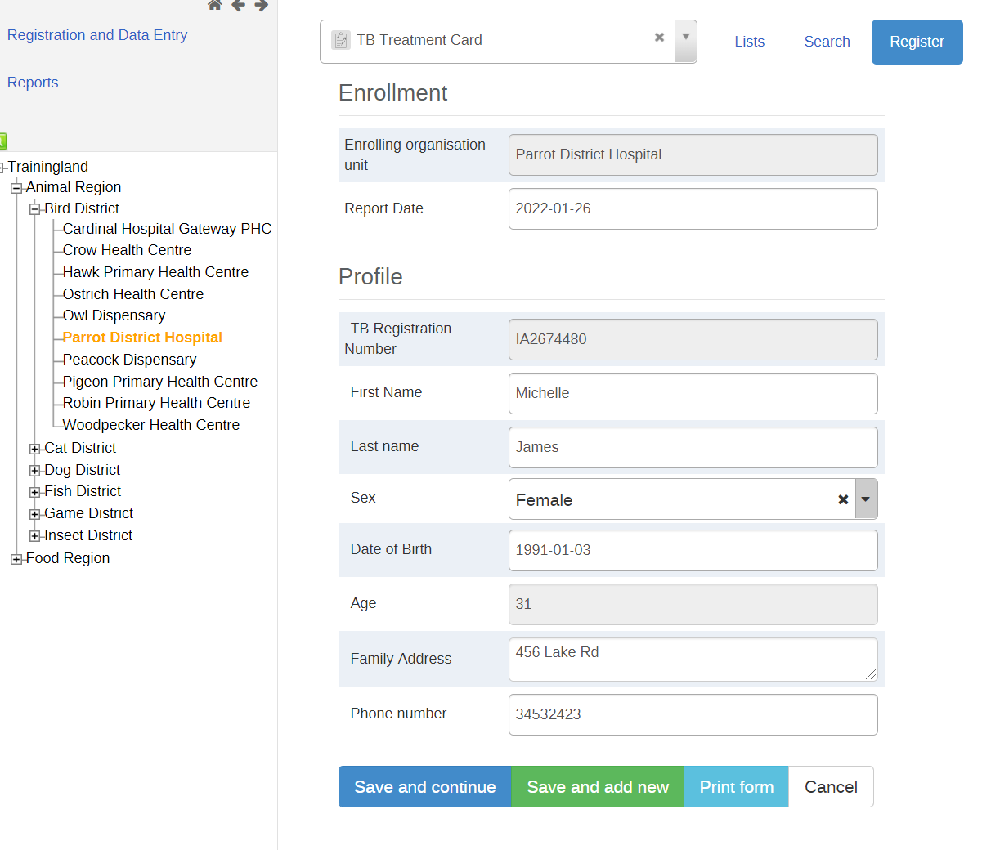
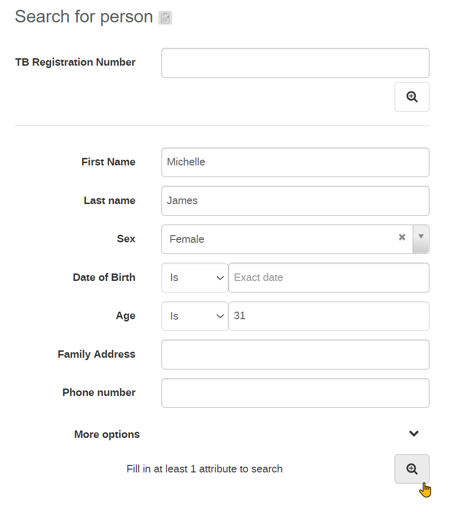
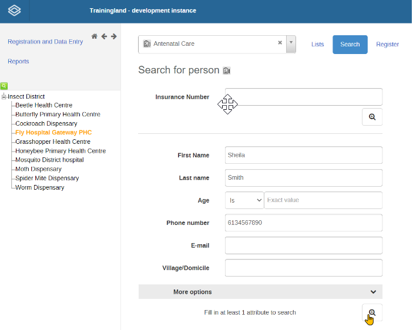
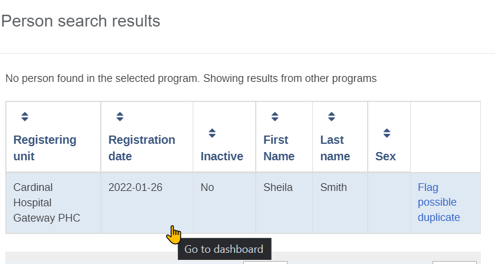
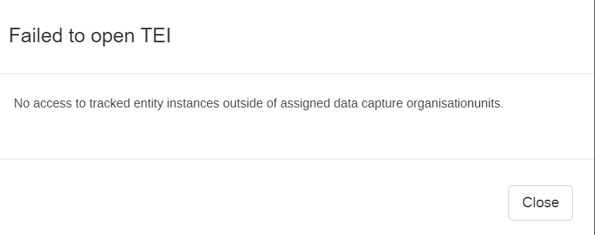
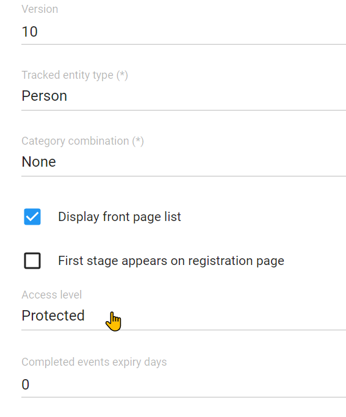
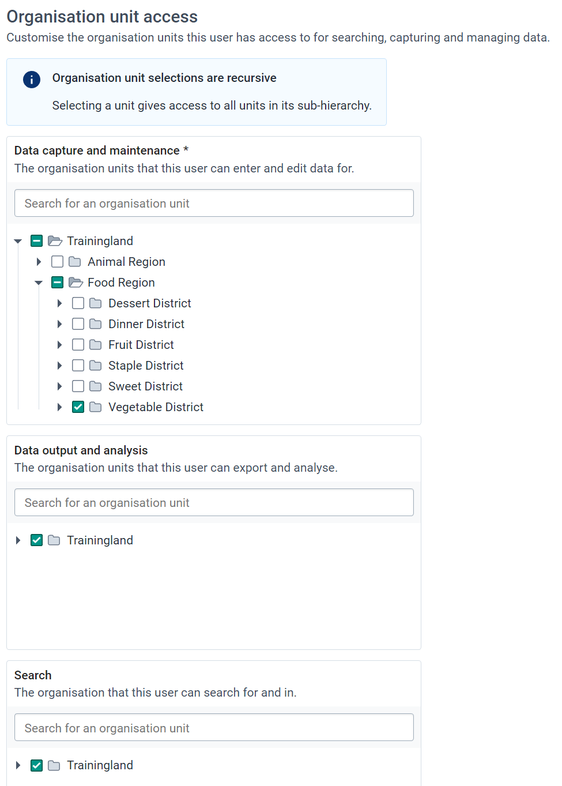

# Learner’s guide to Program Access Levels

**_Perform Exercise 1 and 2 within the “DEMO” system._**

**_Perform Exercise 3 with the “CONFIGURATION” system_**

## What is this guide?

This guide contains all ungraded exercises and detailed steps to perform them related to program access levels for the Tracker Config Level 1 academy. Please perform each of the exercises when prompted to by your instructors

## Learning objectives for this session

* Describe what program access levels are
* Describe the 4 types of program access level available in DHIS2
* Apply program access levels to your own tracker programs

## Exercise 1

**_Perform this exercise within the “DEMO” system._**


### Part 1 - Register a new TEI

Log in as a user who has access to register an tracked entity within the entire organisation unit. Select **_Parrot District Hospital_** and proceed to register an individual in the <span style="text-decoration:underline;">TB Treatment card program</span>.



After registration, quickly fill in some of the first stage data.


**_Take note of the details of the person that you registered!_**

### Part 2 - Find this TEI by breaking the glass

Log out and log back in again as a user with the following details:

Username : breakglass
Password : District1#

After logging in, clear your cache and go to tracker capture.


```
Note on user permissions: In our example, the current user that is logged in has access to register and search for people within the TB Treatment card tracker program. They also have the ability to edit/update the information within the program stages of this program. 

Though they are only assigned one district for data capture, they can search for individuals within this program across the entire organisation unit hierarchy (note that this is configured on a per user basis as we can select which organisation units a user has access to search). 
```

In this example, in the event this user needs to search for AND access an individual's record that was not registered within their data capture organisation unit(s), they will have to enter a reason as to why they are accessing this record. 

Search for the record that was previously registered (select an orgunit at the facility level, then the TB program, then search). 


Enter the details and search for the person.



Select the record after you find it.


When we try to access the record, we will have to enter a message as to why we are accessing a record outside of our assigned data capture organisation unit. For example:

This person has attended our facility to continue their TB treatment; however they have initiated their treatment in a facility outside of our district. In this case, it seems a referral was not performed directly and we need to update the record with their latest treatment details


Only after we enter this information can we be allowed to access the record by selecting “Add audit message.”

This access control is dependent on how the program is set up and if this feature is configured. If there is no need to have them enter a reason for accessing a person’s information outside of their data entry organisation unit(s) this prompt does not have to be displayed.  This can also be configured to not allow them to access tracked entity records outside their own data entry org unit within a certain program at all, which we will discuss shortly.

If the program is configured to allow this type of access, when the user enters a reason for entering the record they will then subsequently be taken to the person’s tracker dashboard. 

You can see this individual can enter data for a new stage, as it is attached to their data capture organisation unit, but can not edit the data from the program stage belonging to the organisation unit outside of its data capture assignment


## Exercise 2

**_Perform this exercise within the “DEMO” system._**

### Part 3 - Review Open Access

Log out and log back in again as a user with the following details:

Username : breakglass

Password : District1#

After logging in clear your cache and go to tracker capture.

In this example, in the event this user needs to search for AND access an individual's record that was not registered within their data capture organisation unit(s), they will be able to access it without any extra log entry or audit entry required from the user. That is because the program we are accessing is set to the “Open” access level.

Navigate to tracker capture, select an orgunit and select the Immunization program and search for 

* First Name: Jayden
* Last name: Thomas
* Sex : Male


You will see he was not registered in any of the capture org units this user has access to


If I select the record, it will just open however. No reason needs to be entered.

```
Note: The behaviour for the audited level of access is the exact same, except an additional log entry will be automatically created when this record is accessed. The user will not have to enter any additional details though.
```

### Part 4 -  Review Closed Access

You should still be logged in as 

Username : breakglass

Password : District1#

Go back to tracker capture, select the ANC program and perform a search

* First Name : Sheila
* Last name : Smith
* Date of Birth : 2003-09-05
* Phone Number : 6134567890



You will see she was not registered in any of the capture org units this user has access to



If I try to open this record, I will not be able to. Instead I will receive the following message.



This is because this program is configured with the CLOSED level of access.

## Exercise 3

### Part 5 - Modify the access level of your program

**_Perform this exercise within the “CUSTOMIZE” system._**

Log in as your admin user.

Navigate to your Antenatal Care program (the one you created as part of the assignment) in Maintenance and review the program details. Change the access level to “Protected”



This is where we configure the access level of the program. This then needs to be combined with a user’s data capture scope to dictate the behaviour that we observe in tracker capture. 

**Modify the sharing settings of your program**

**_Share your program and program stages_** with the user group “access levels”

Metadata : can view only

Data : can capture and view


**Ensure you have someone registered in your ANC program**

Make sure that someone is registered in the ANC program that you have made.


If there is no one registered, then register a new person into your program. **_You can register them anywhere EXCEPT for the org units within Vegetable District._**

**Review the “acess_levels” user in the users app**

**NOTE : DO NOT MODIFY THIS USER! Just review the users details.**

Navigate to the users app and find the “acces_levels” user.


Review their orgunit assignment



We can see here the data capture org unit is limited to one district. The search org units comprise the entire country however. This, combined with the program access level, will dictate the behaviour of what happens when this user tries to access a tracked entity instance in our program. At the moment, we have shared the ANC program with this user via a user group, so that is the program they will be able to access. 

In summary:

For the closed level

* If a TEI is outside of a users data capture scope, the user can not open it

For the protected level

* If a TEI is outside of a users data capture scope, the user can open it but will have to enter a reason. This access expires after 3 hours before they have to enter a reason again

For the audited level

* If a TEI is outside of a users data capture scope, the user can open it but additional log entries will be made on its access

For the open level

* If a TEI is outside of a users data capture scope, the user can open it. Only the regular log/audit history is recorded

Keep in mind, the user still needs sharing settings applied to their user that allows them to interact with the program as well, otherwise they won’t be able to perform any operations with the program. We can see that the user “access_level” is part of the “Access Levels” user group that you have just assigned to the program that you have made.


**Login as  the “acess_levels” user in and search for a TEI in your ANC program**

Login to the CUSTOMIZE system using

Username : access_levels

Password : District1#

Navigate to tracker capture, select an organisation unit, select your program and perform a search.

Search for a person registered in your program. You should get the prompt that asks you to enter a reason for accessing the record. This is due to setting the program to the protected level of access.
