# **Learner’s guide to Program Notifications**

**_Perform Exercise 1 within the “DEMO” system._**

**_Perform Exercise 2 and 3 with the “CUSTOMIZE” system_**

## What is this guide?

This guide contains all ungraded exercises and detailed steps to perform them related to program access levels for the Tracker Config Level 1 academy. Please perform each of the exercises when prompted to by your instructors

## Learning objectives for this session

The overall objective of this session is to describe the usage of building and using program reminders in DHIS2. Detailed objectives include:

* Describe what program notifications are
* Identify when to use reminders
* Create reminders at the program and program stage level
    * Understand how template messages populate when notifications are sent
    * Understand the different types of recipients that can be specified to receive notifications

## Exercise 1

### Review a program level notification

PERFORM THIS EXERCISE in the DEMO system

Register a new person into the ANC program. Use your own email.

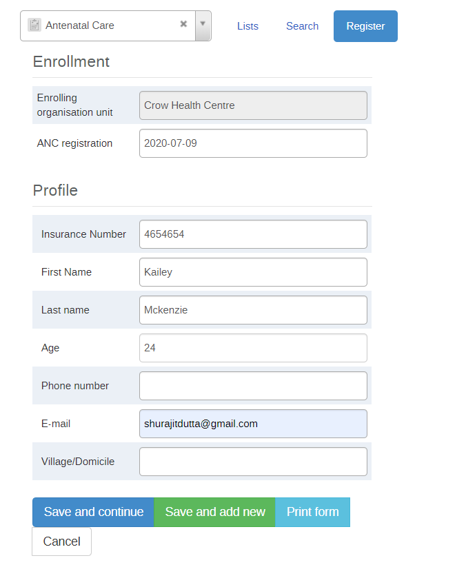

You should receive an email

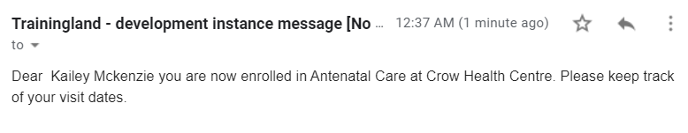

## Exercise 2

### Configure the program notification

**_PERFORM THIS EXERCISE in CUSTOMIZATION against the ANC program you have created_**

_Create a notification template for the ANC program created in the previous exercise that notifies the mother by e-mail that she is registered in the program._

Log into the customize instance and go to Program maintenance

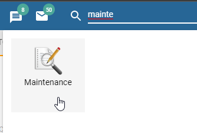

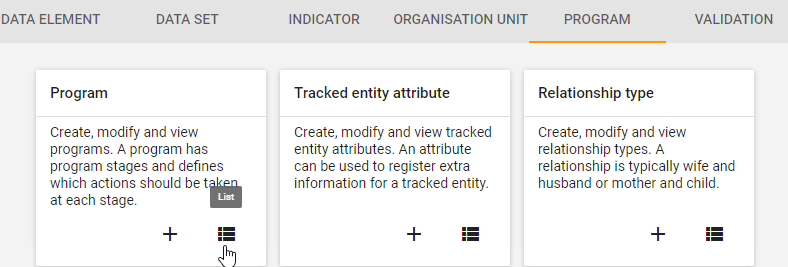

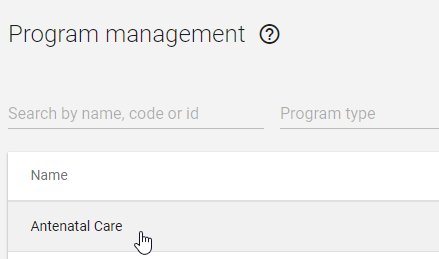

Select the Antenatal Care program then select “Notifications” from the top bar menu.

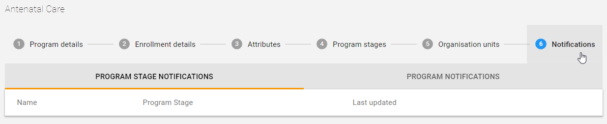

Click on “+” in order to add a new
notification Program notification.

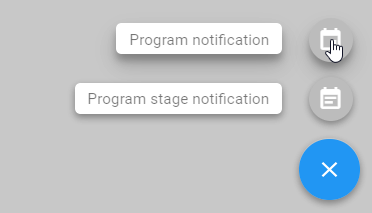

Enter the program notification name and enter the message details

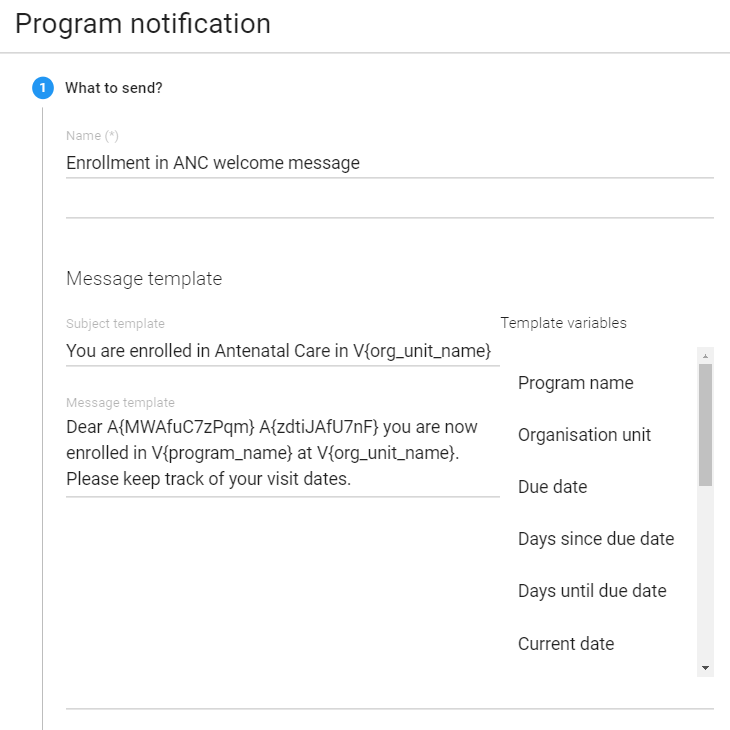

The message window allows for customization of the reminders including parameters to personalize the message e.g adding the name (Last name) of the tracked entity, where they are registered (Orgunit) and when the appointment is due (due date).

==>Enter the message template  **“Dear _First name_ _Last name_ you are now enrolled in the _Program name_ program at _Orgunit name_”**

Specify when to send it

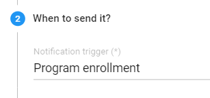

    

**NOTE:**

* Days scheduled allows for specifying the number of days after enrollment or incident date that the message is going to sent
* Program completion will only send the reminder when the enrollment is completed
* Program enrollment will send the reminder when a tracked entity is enrolled into the program

==>Select **Program enrollment**

Specify the recipients of the reminder

Explain the different recipients that are available (also explained in the presentation). 

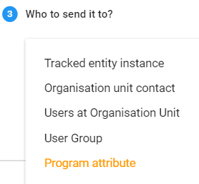

    
You will notice different fields pop-up depending on the recipient type that is selected. For example, if user group is selected then the different user groups available in DHIS2 will be available for selection.

You are now able to specify the program attribute that you want to send a message to. This allows you to, for example, send a different messages to different numbers using the same enrollment.

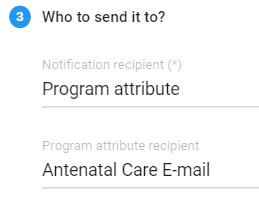

=>Select “**Program attribute”**

==>Select “**Antenatal care E-mail”**

This will send the message to the e-mail that is entered during enrollment.

Save the reminder by clicking on Done than Save.

### **Test the program notification in tracker capture**

Navigate to tracker capture and select an org unit at the facility level as well as the Antenatal Care program. Proceed to register a new mother.

After registration, check the email that you entered. You can show them the program notification has been sent.

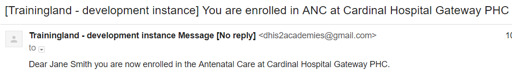

## Exercise 3

**_PERFORM THIS EXERCISE in CUSTOMIZATION against the ANC program you have created_**

### **Notification 2 : Creating a reminder based on program stage**

Notifications can also be set on within a program stage.

_In this demo part you will configure a template that will be used to send appointment reminders 2 days before the due date._

1. Log into the blank instance and go to Program app

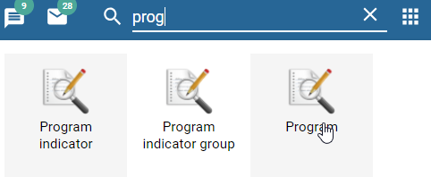

2. Click on Program and select the Antenatal Care program. Select “Notifications” from the top bar menu.

3. Click on the “+” sign followed by Program stage notification

4. Create the message

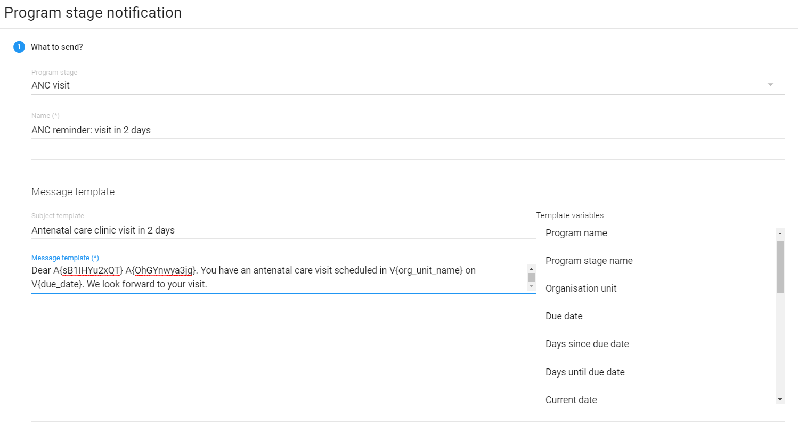

5. Decide when the message will be sent

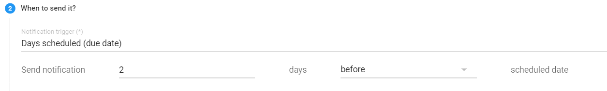

6. Specify the recipients

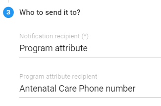

While not possible to show this reminder being sent, this example is to show participants how to create a schedule based notification when necessary. 
