# **Learner’s guide to Program Rules**

**_PERFORM THESE EXERCISES IN THE CONFIG SYSTEM. USE THE TB Program you have created._**

## **What is this guide?**

This guide contains all exercises and detailed steps to perform them related to the configuration of programs for the Tracker Config Level 1 academy. Please perform each of the exercises when prompted by your instructors.

## **Learning objectives for this session**

The overall objective of this session is to demonstrate how to create program rules in DHIS2 for both event and tracker programs. Detailed objectives include:

* Define the program rules concept
* Define the steps to consider when creating a program rule
* Create program rules using variables, expressions and actions in DHIS2

## **Background**

Program rules allow you to create and control dynamic behavior of the user interface in the Tracker Capture and Event Capture apps. Program rules give functionality to configure dynamic behavior in the programs in DHIS2 that are implemented on the paper forms through skip logic, warnings and patterns as well as auto filling some fields.

## Program Rules Reference

In reality, it is difficult to remember all of the rule operators and actions that are possible to use. It is likely you will need to reference the [documentation](https://docs.dhis2.org/en/use/user-guides/dhis-core-version-master/configuring-the-system/programs.html#configure_program_rule) from time to time as it is a useful resource regarding what types of expressions, operators and actions you can use. 

## Exercises

In order to create a program rule, we can follow these general guidelines:

1. Conceptualise the logic of the rule you want to create
2. Create a program rule variable that points to the data element/attribute which will trigger your logic
3. Create a new program rule
    1. Fill in the program rule details
        1. Select the program
        2. Provide a name and description
        3. Assign a priority if applicable
4. Enter the program rule expression
    2. Refer the the [documentation](https://docs.dhis2.org/en/use/user-guides/dhis-core-version-master/configuring-the-system/programs.html#configure_program_rule) to see many examples of the items that can be used within the expression, as well as examples of expressions
5. Define the program rules actions
    3. Refer to the [documentation](https://docs.dhis2.org/en/use/user-guides/dhis-core-version-master/configuring-the-system/programs.html#configure_program_rule) for more detail on each individual action
6. Clear your cache and test the rule!

## Exercise 1 - In the first example, we will create a program rule for the TB program which hides the “EPTB Site” data element if the TB is not classified as extra-pulmonary.

### Step 1 - Access the Program and attribute app

**Log into the blank instance and go to Maintenance App **

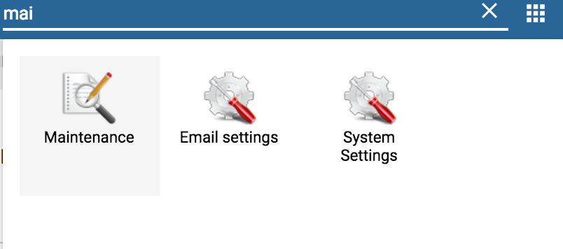

**and click on Program**

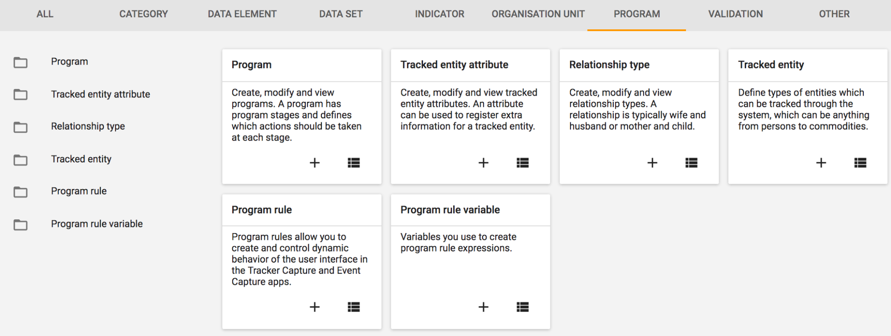

NOTE: To create a new program rule, you may need to first create Program rule variables

### Step 2 - Create the program rule variable

**To create a new program rule variable. You need to first create Program rule variables before creating your rules.**

**Click on Program rule variable and Add**

Use your initials as a prefix when creating the variable to keep the name unique.

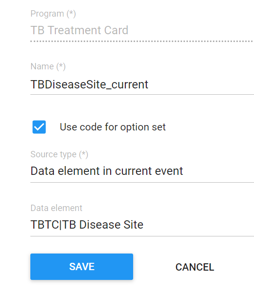

* **Use code for option set**: When your variable is using an option set, this allows you to select whether or not you will use the option set code rather than the value when creating your program rule expressions. It is often useful to use the code as this is less subject to change than the value. You may not want to use the code however if you are displaying feedback of some kind for example.
* **Source type:** The source type is determining how the source field is populated with a value. Please refer to the [documentation](https://docs.dhis2.org/en/use/user-guides/dhis-core-version-master/configuring-the-system/programs.html#configure_program_rule) for the latest info.

The majority of the time you will be using “data element in current event” or “Tracked entity attribute” however there are uses for the other fields. We will explain them further in additional examples. 

### Step 3 - Create the program rule

**To create a new program rule, Click on Program rule and Add (the “+” **symbol)**

**Enter Program rule details**

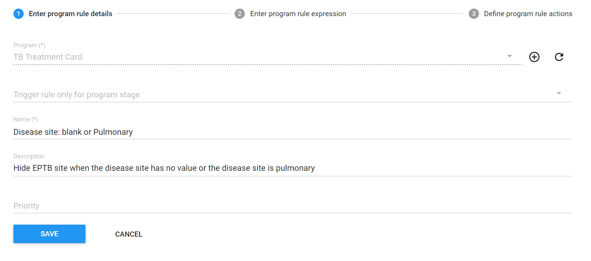

Do not worry about the priority for now. This will be covered in other trainings/academies.

**Enter the Program rule expression**

**Create an expression, for example  #{TBDiseaseSite_current} == ''  || #{TBDiseaseSite_current} == 'Pulmonary'**

Recall the operators from the [documentation](https://docs.dhis2.org/en/use/user-guides/dhis-core-version-master/configuring-the-system/programs.html#configure_program_rule) that are now present along the bottom row. You will be using an expression that includes the** equals to** and **OR **logical operators in this example.

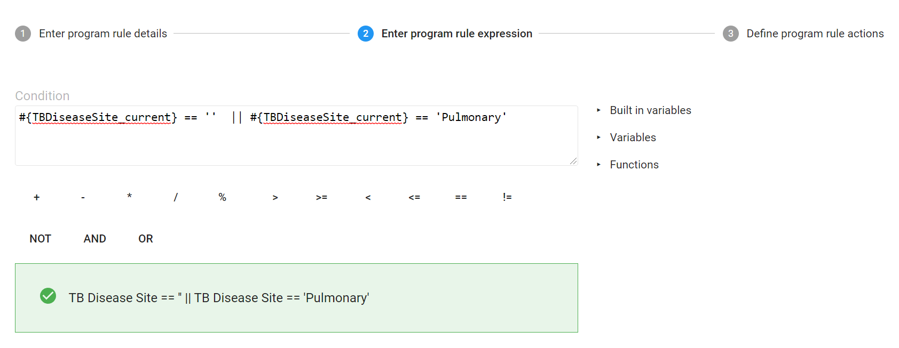

**Create the action (“Hide Field” on EBTB Site Data Element).**

**At this stage explain the various actions that are available once again.**

The full list of actions can be viewed in the [documentation](https://docs.dhis2.org/en/use/user-guides/dhis-core-version-master/configuring-the-system/programs.html#configure_program_rule). 

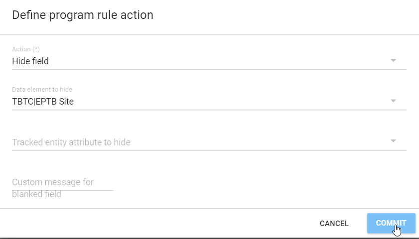

**and click on COMMIT to save. SAVE the program rule before continuing.**

### Step 3 -Test the Program Rule

You may need to clear your cache or reload in incognito mode so the rule works correctly.

**Go to tracker capture to show the rule in action**

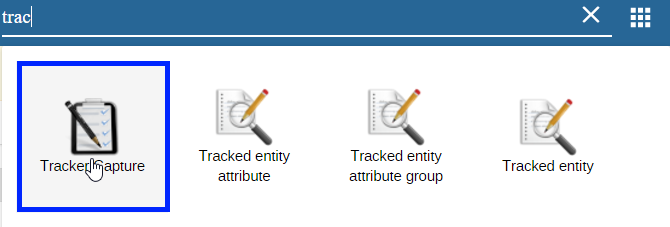

**Register a new person**

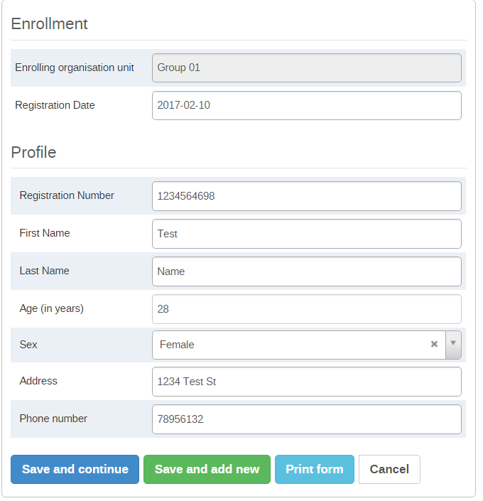

**We can see immediately that the rule is working, as there is no value for disease site and the EPTB site data element is hidden.**

Selecting Pulmonary yields the same result

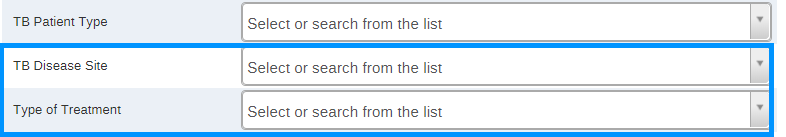

Select Pulmonary yields the same result

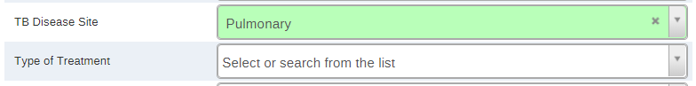

Only when we select Extra Pulmonary does the EPTB site data element appear. This is the intended action of the rule.

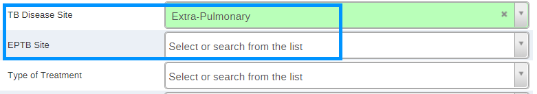

Note that if you select an EPTB site

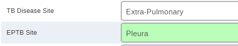

However go back and change the TB Disease site to Pulmonary

You will get an error message saying that the EPTB Site value was deleted. The logic here is that unless the disease site is extra-pulmonary, the EPTB site value is hidden and therefore can not have a related value entered within it.

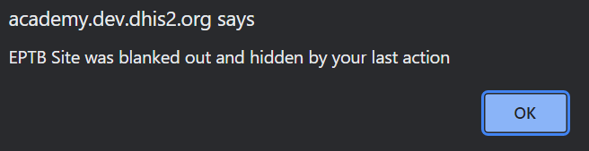

## Exercise 2 - Create a program rule to hide Pregnant if Gender is Male using the TB Program

**Access the Programs rules from Maintenance App ⇒ Program**

**Log into the blank instance and go to Maintenance App**

**and click on Program**

**_Remember to use your initials as a prefix when creating these objects to keep the names unique._**

**Add in a new program rule variable**

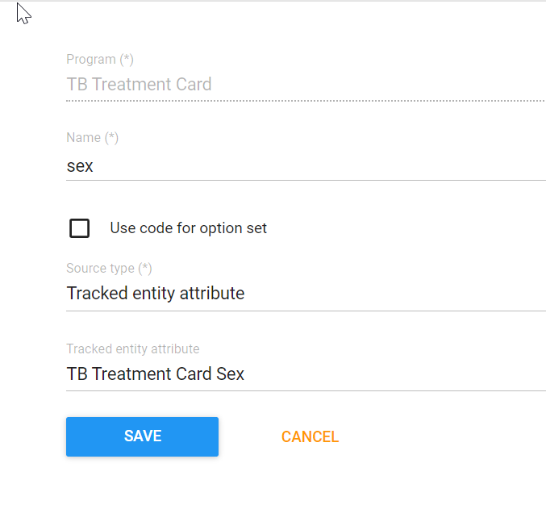

**Create a Program Rule**

Hide pregnant if sex is Male

Enter the program rule details.

In the expression, we are using numbers. There are no quotes needed around the number. We will also hide the pregnant if sex is Male.

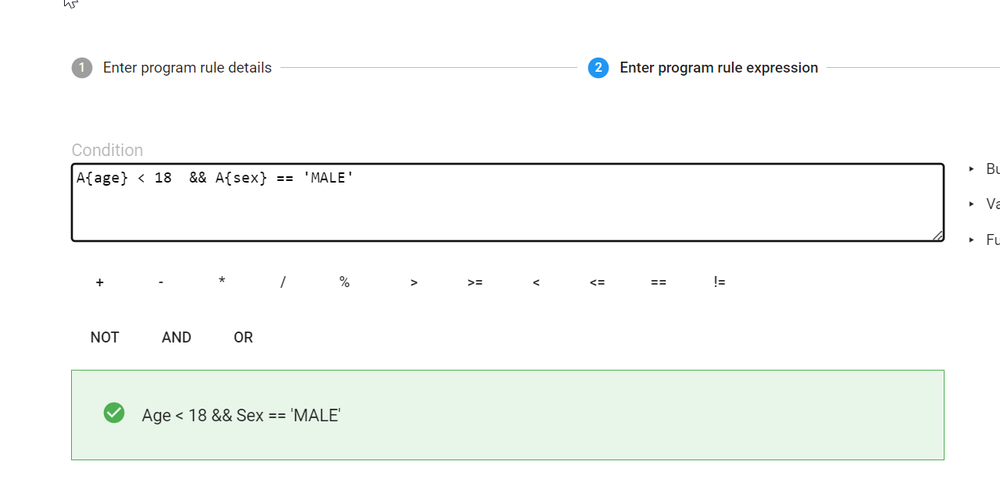

**Test the rule with the participants**

Clear the cache if needed, than go to tracker capture to test the rule

Pregnant should be hidden if age is less than 18 and sex is Male

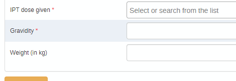

It should show 

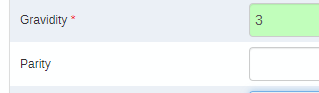

## Exercise 3 - Create another program rule for the TB Treatment Card which displays a warning message when Weight is out of range

**Access the Programs rules from Maintenance App ⇒ Program**

**Log into the blank instance and go to Maintenance App**

**and click on Program**

**_Remember to use your initials as a prefix when creating these objects to keep the names unique._**

**Add in a new program rule variable**

Weight, data element in current event, Weight (in kg)

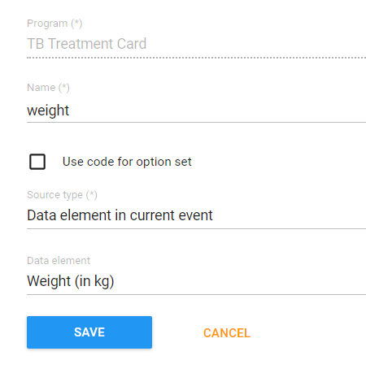

## Create the program rule

**Provide the Program rule details**

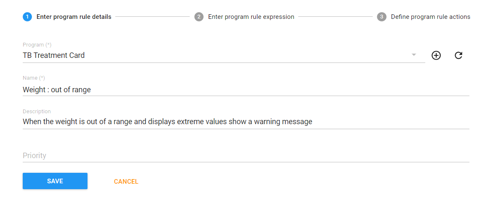

In the expression, we combine several principles to create our output by using a custom function, the “AND” and “OR” logical operators as well as brackets to define the extreme ranges of the weight value. As weight is a numerical value, we can apply logic similar to a validation rule in order to determine which values we consider out of range.

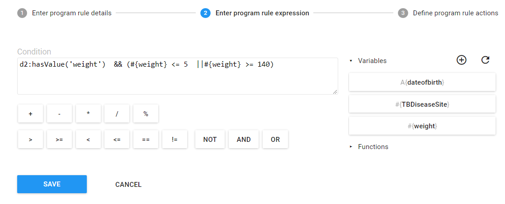

**Provide the program rule action**

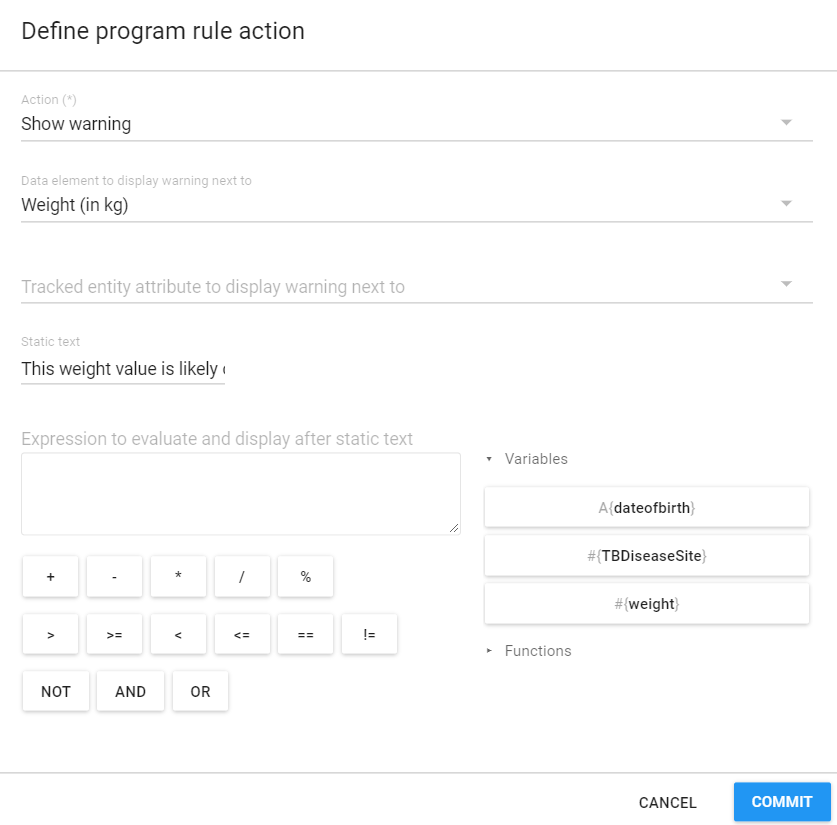

## Test the program rule as before

**Clear your browser cache by using the browser cache cleaner app**

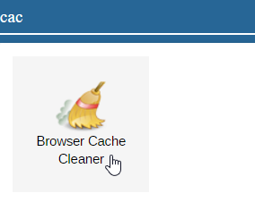

“Select all” -> Clear

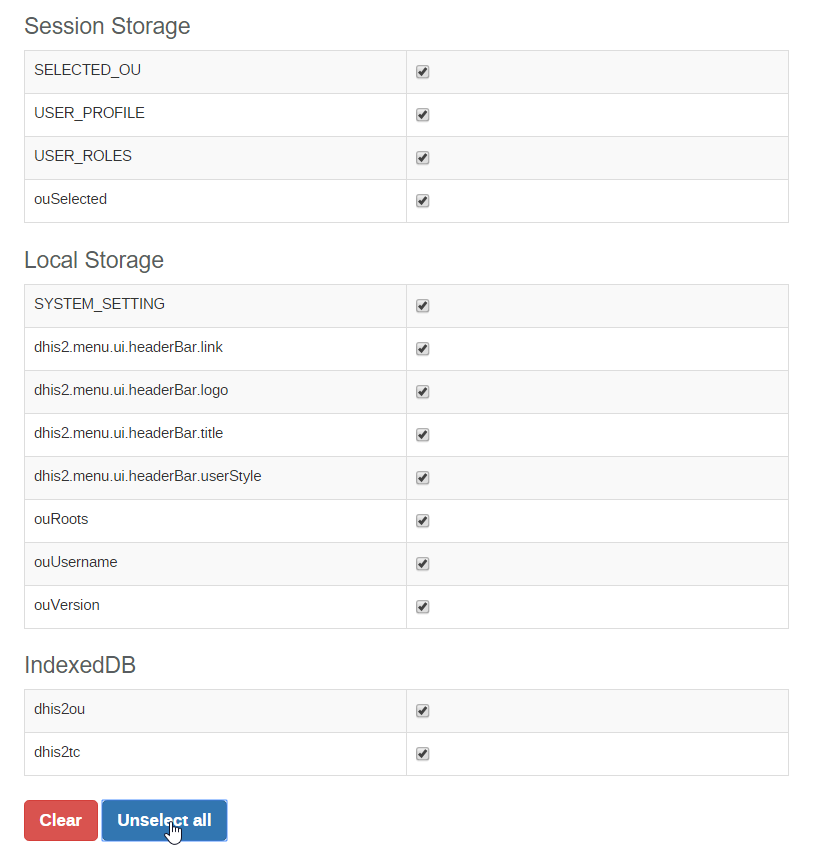

When the weight value is out of the range you have defined it should display a warning message.

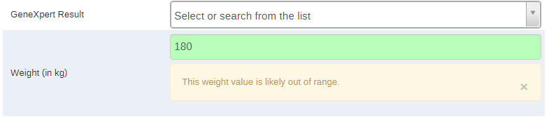
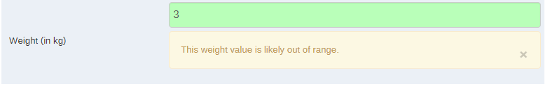

When the weight is within the range you have defined, or the weight data element has no value, no warning message should appear.

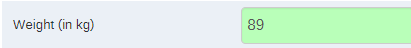
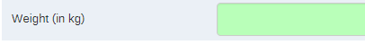

## Exercise 4 - Create a program rule that shows the TB disease site in the feedback

**Show the disease site in the feedback widget**

**Access the Programs rules from Maintenance App ⇒ Program**

**Log into the blank instance and go to Maintenance App**

**and click on Program**

**_Remember to use your initials as a prefix when creating these objects to keep the names unique._**

**Add in a new program rule variable**

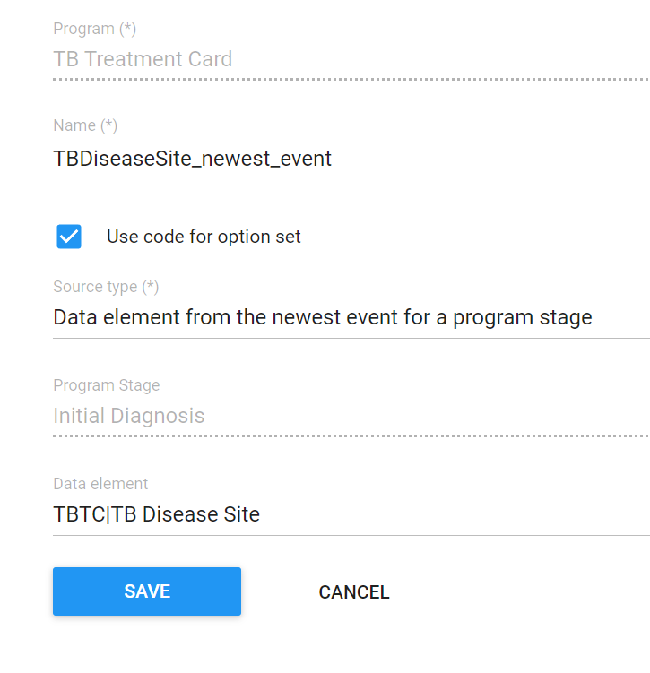

We want to see the disease site regardless of what stage we are viewing in tracker capture. The disease site is only captured in the initial stage, so we want to refer to it to display the necessary information in the widget. This is an example of when we can use a different source field than we have so far.

**Create the new rule**

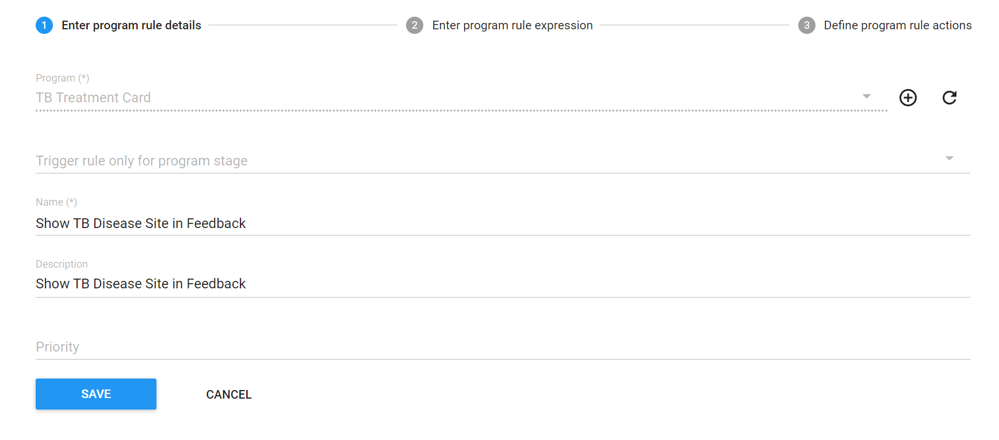

**Create and explain the expression. We will use a function called d2:hasValue to check if there is any value for the data element**

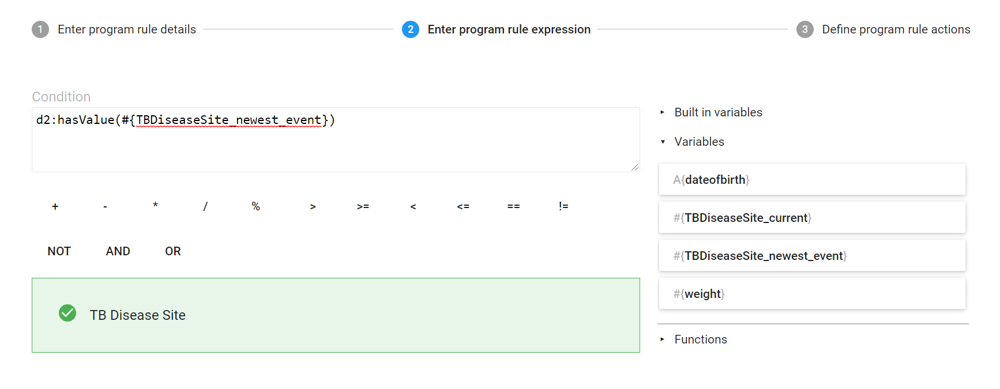

**Define the action**

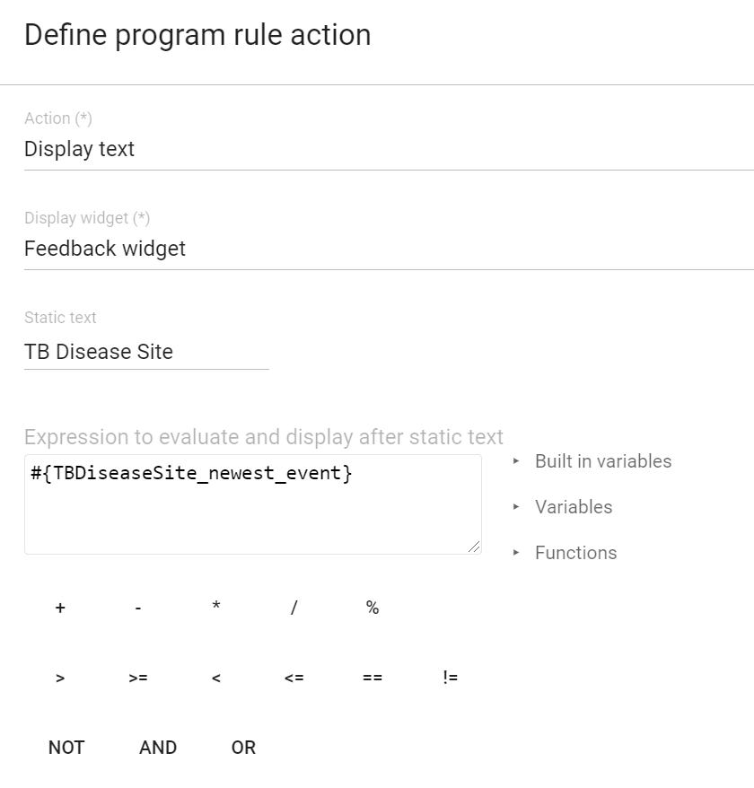

For the action, we will display the value that was collected in the feedback widget. We can then add this to the top bar.

**Test the rule. Clear cache if necessary**

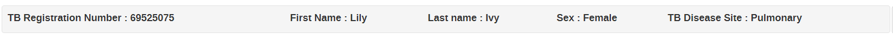

## Exercise 5 - Create another program rule for the TB Treatment Card to Assign Age based on the date of birth

**Access the Programs rules from Maintenance App ⇒ Program**

**Log into the blank instance and go to Maintenance App **

**and click on Program**

**Add in a new program rule variable**

**Program rule variable “dateofbirth” with “Tracked entity attribute” source type**

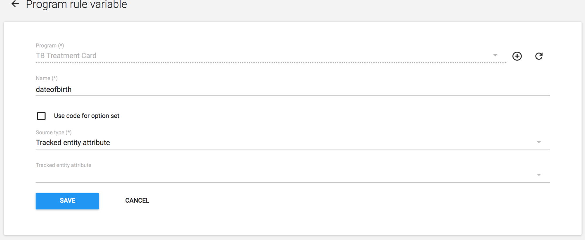

## Create the program rule

**Provide the Program rule details**

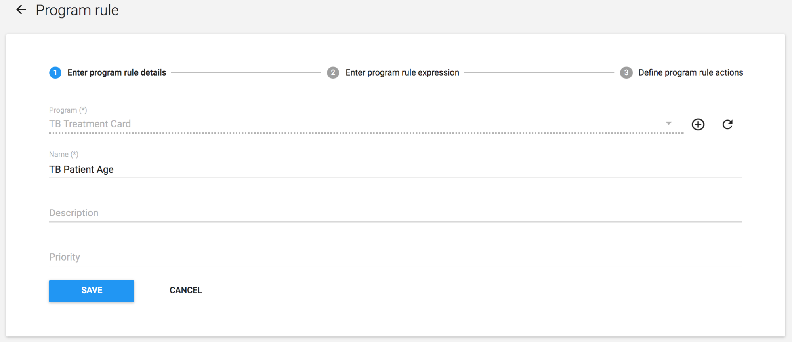

In the expression, we will use a numerical function. You can point the participants to the documentation for a full listing of custom functions available to the user, as the other will not be covered in detail here. This is rather to give them an idea of what is possible with these functions.

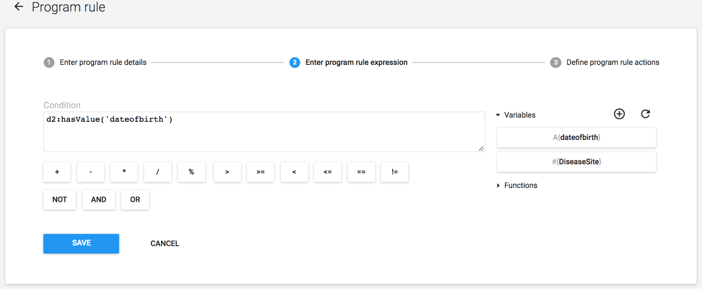

**Provide the program rule action**

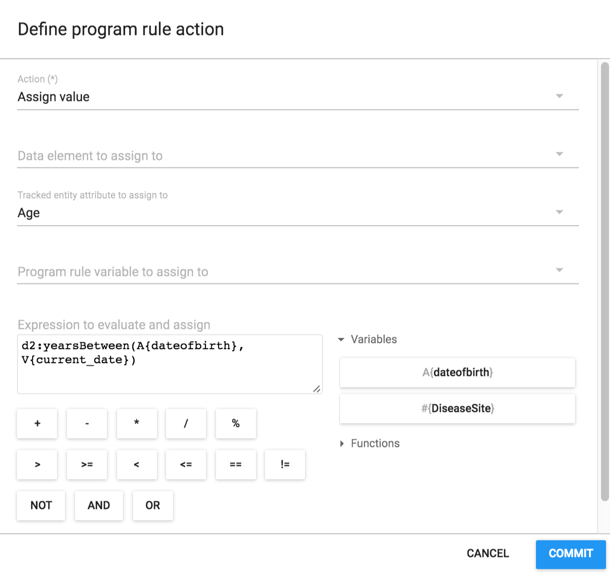

## Test the program rule as before

**Clear your browser cache by using the browser cache cleaner app**

“Select all” -> Clear

**Register a new entity and enter the date of Birth**

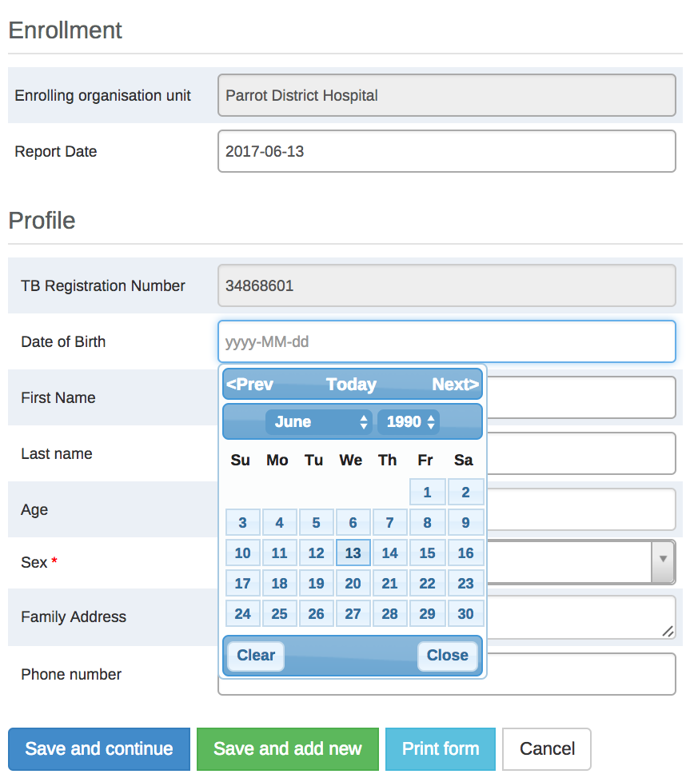

After entering the Date of Birth, Age will be calculated

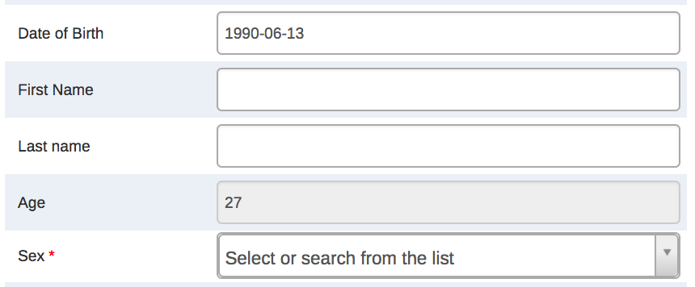
