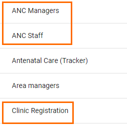
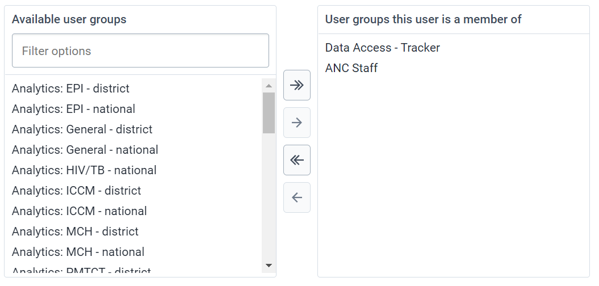
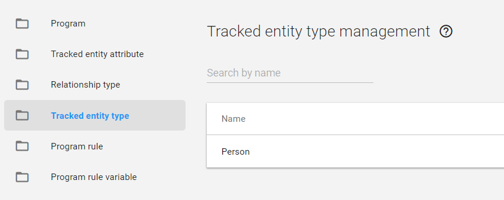
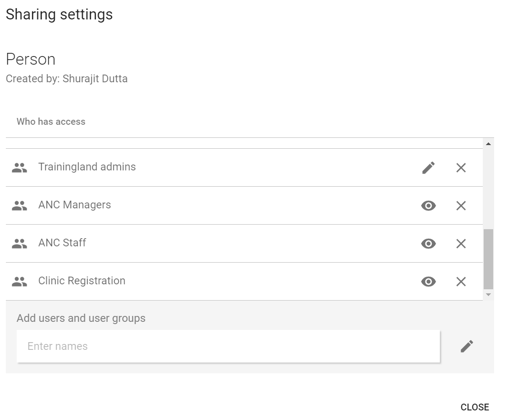
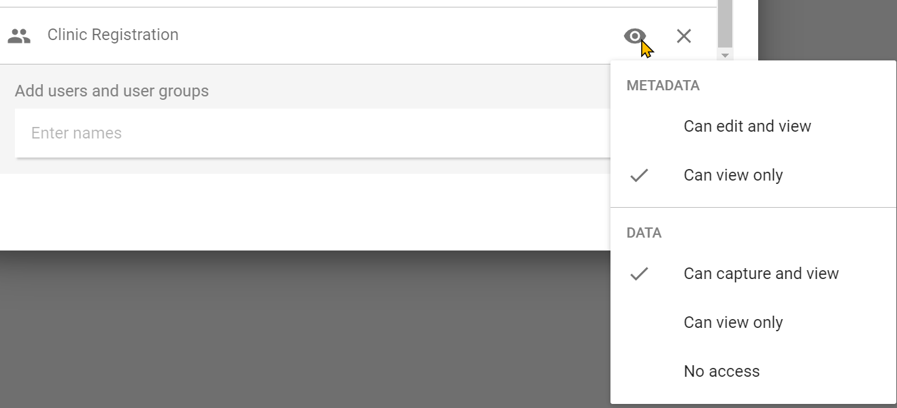
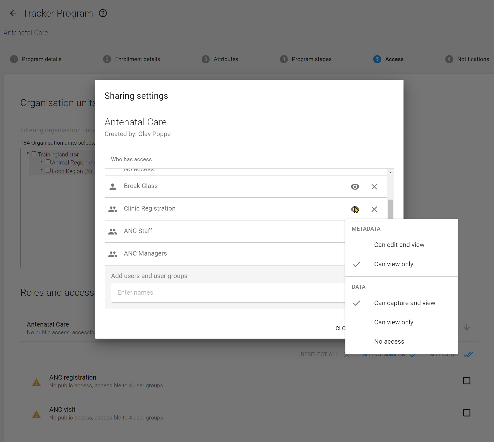

# **Learner’s guide to Sharing - Part 2**

**Perform these exercises in the “DEMO” system.**

## **What is this guide?**

This guide contains all ungraded exercises and detailed steps to perform them related to the creation of a tracker program for the Tracker Config Level 1 academy. Please perform each of the exercises when prompted to by your instructors

## **Learning objectives for this session**

* Describe the sharing concept
* Explain the link between sharing and user groups
* Describe the difference between metadata and data sharing
* Identify the objects within a tracker program that can be shared
* Describe the concepts of program and program stage sharing
* Apply program and program stage sharing to your own program

### Data Level Sharing Background

We will now review the concept of data level sharing in more detail as it applies to tracker programs. In particular, we will discuss 3 objects in detail:

1. Tracked Entity Types
2. Programs
3. Program Stages

These 3 objects have both meta-data and data level sharing applied to them. In most instances (unless everything is public) sharing of these items will have to be configured in order for users to access different parts of the program correctly. 

Sharing generally works within the intersection of these 3 concepts in DHIS2:

1. The user role assigned to a user (already covered)
2. The user group in which the user belongs to
3. The sharing settings themselves

We can traditionally think of user groups as defining how outputs are shared (dashboards, tables, maps, etc.) but we can also use both meta-data and data level sharing to restrict what a user has access to in quite a bit of detail.

### **Exercise 1**

#### 1.1 - User Groups

We have covered user roles, now we can discuss user groups in a bit more detail. Navigate to the user groups part of the application. There are 3 user groups we can focus on here as related to the ANC program:

1. Clinic Registration
2. ANC Managers
3. ANC Staff

These 3 user groups contain the same users that were discussed earlier, linked to the various functionality that has already been demoed. We can use these groups to share reports/outputs, but also to share meta-data and data which is what we will do in this case.

Creating a user group is very easy. 

1. Select the blue plus sign to add a new group
2. Assign the group a name (and code if you want)
3. Save the user group

We assign these user groups to our user in order to apply the correct sharing settings to them. If we review the user “ANC Staff” we can see they are assigned to a user group.

This allows us to use these user groups to assign sharing permissions to any user assigned to the group.  

#### 1.2 - Data Level Sharing

Go to “Tracked Entity Type” and open the sharing dialog for the tracked entity type of “Person”

We can see that all 3 user groups we have discussed have some sharing settings applied to this item. Select a user group in order to open its sharing settings. You will see this is separated into **METADATA** and **DATA.**

**METADATA** sharing determines if a person can edit (for example, updating its name or changing another parameter, note that they would need the proper user authorities/user role assigned to them on top of this sharing setting) and view an object or only view the object (see the object in various apps). 

**DATA** level sharing takes this one step further and determines, in specific detail, what a person can do with the data that is linked to the object.

### **Exercise 2**

#### Part 2 - Reviewing the configuration

In order to understand how we have achieved the various levels of access for each of the users demoed in Part 1, we can review each object type and determine what level of sharing settings these users have. Note that this may be in addition to meta-data sharing that has been applied to data elements or other meta-data in the system. This will not be covered in detail at this stage due to time limitations. 

**_Review the sharing settings of the 3 items (tracked entity type, program, program stage) through the maintenance user interface_** for each of the user groups for the Antenatal care program.

Here is an overview of the sharing settings that are applied to these 3 groups

| Object             | User Group          | Data Level Sharing Setting Explanation                                                                                                                                                                                                                                                                                                                                                                |
|--------------------|---------------------|-------------------------------------------------------------------------------------------------------------------------------------------------------------------------------------------------------------------------------------------------------------------------------------------------------------------------------------------------------------------------------------------------------|
| Tracked EntityType | Clinic Registration | Can capture and view: allows the user group to view all tracked entity data related to a person and enroll a person into DHIS2. In this case, it allows front desk staff to add new people to the system.                                                                                                                                                                                             |
|                    | ANC Staff           | Can view only: Can view tracked entities of type person; they can not alter this data                                                                                                                                                                                                                                                                                                                 |
|                    | ANC Manager         |                                                                                                                                                                                                                                                                                                                                                                                                       |
| Program            | Clinic Registration | Can capture and view: allows this user group to enroll users INTO the ANC program; without access to capture data for a particular program, users with “can capture and view” for the tracked entity type can only register new entities with no program                                                                                                                                              |
|                    | ANC Staff           | Can capture and view: allows this user group to delete enrollments, update existing tracked entity information, and delete enrollments. They can not register new entities though, due to the sharing settings they have for the tracked entity type                                                                                                                                                  |
|                    | ANC Manager         | Can view only: allows the users within these groups to view the data associated with the program                                                                                                                                                                                                                                                                                                      |
|                    |                     |                                                                                                                                                                                                                                                                                                                                                                                                       |
| Program Stages     | Clinic Registration | Can view only: these users can view the data in BOTH data entry (tracker capture) and data analysis apps. They must have access to these apps via their user authority/role. As the clinic registration user does not have access to the analysis apps, they will only see this data via tracker capture.                                                                                             |
|                    | ANC Manager         |                                                                                                                                                                                                                                                                                                                                                                                                       |
|                    | ANC Staff           | Can capture and view: these users can view and edit the data in all of the program stages in data entry (tracker capture) and view the data in data analysis apps. They must have access to these apps via their user authority/role. In some cases, you may need different levels of access for each program stage and this can be controlled via sharing the stages differently within the program. |

For all three objects, the meta-data permissions are set to view only for these 3 user groups. This is so these users within these groups can see this meta-data but do not have permission to edit it. The “can edit and view” meta-data sharing setting is often reserved for administrators of the systems, and we can see that is the case here as well. 

When reviewing the sharing settings for the program and program stages, use the access tab within the program itself from maintenance and go through the user groups for the program and each of the stages. Here you will see differing data sharing settings for the different user groups based on what they can do.

You can once again review the details of these users by logging in with the different user types we reviewed previously, this time comparing them with the data sharing settings configuration to review the effect this has as outlined in the above table. 

These are the login details of the 3 users for the antenatal care program.

1. Case registration user : casereg/District1#
2. ANC staff member : ancstaff/District1#
3. ANC manager : ancmanager/District1#