# Learner’s Guide to Users Roles

## USE THE CONFIG SYSTEM TO FOLLOW THIS GUIDE

## What is this guide?

This guide contains all ungraded exercises and detailed steps to perform them related to the creation of a tracker program for the Tracker Config Level 1 academy. Please perform each of the exercises when prompted by your instructors within the **CONFIG** system. 

## Learning objectives for this session

* Describe the individual concepts that make up a user
* Configure these concepts in DHIS2
* Create a user in DHIS2

## Exercise 1 - Review user roles and their effect on user permissions

When we create a new user, we must first have in place the relevant user roles that will be assigned to the user. It is often also helpful to have the user groups available that a user will be assigned to; though this might come later on. 

Let us start this process by reviewing the makeup of a user role.

### Review the user roles management page

In order to start the process of creating a user role, navigate to the users app

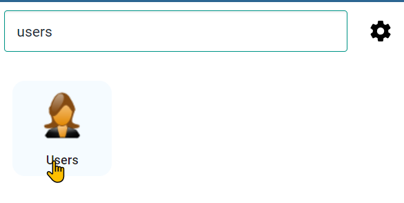

From here, you can either list or add a new user role. Start by listing the available user roles

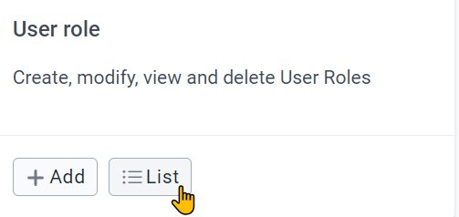

In this system, you will only see a couple of user roles. In a live system, you are likely to see many more user roles. 

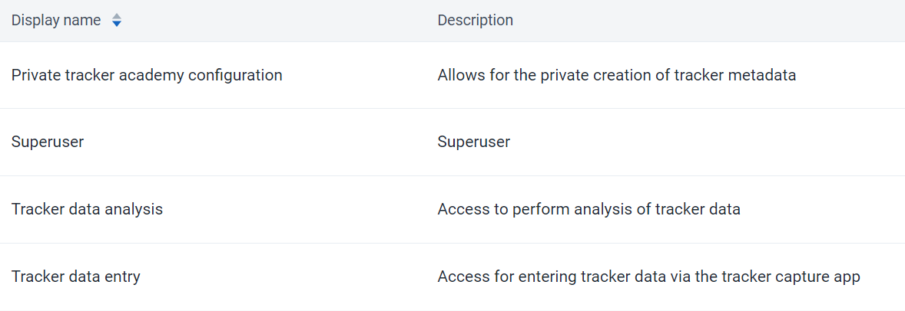

Select the tracker data entry role in order to review it. You will see the user role management page is divided into 3 sections.

1. Basic information
2. Metadata authorities
3. Other authorities (this is subdivided into 4 additional sections)
    1. App authorities
    2. Tracker authorities
    3. Import/export authorities
    4. System authorities

 **Basic information** : Includes the name and description of the user role
   
**Metadata** : the metadata section allows you to assign different permissions to a user role that allow for adding or deleting either public or private metadata objects. For example, you could provide someone access to create and delete public data elements. You will also see an option for external access. This is only available for report type objects, and allows this user role to give access to these reports via outside access (for example, through a web portal).
    
**Apps**: the apps section allows you to give access to the various DHIS2 apps that are within your instance. This includes all of the core DHIS2 apps, as well as any custom apps you may have on your own system. Note that this section only gives you access to the app, it does not specify what you can do within the app necessarily.
   
**Tracker:** tracker authorities have their own specific section as they are unique to the tracker data model. This does include events to some extent as well. This is because items like adding tracked entities or modifying events is unique to this model.
   
**Import - Export** : these authorities are given to a user role that will be dealing with the import/export of metadata, data or both. This is usually only given to a specialized role.
   
**System**: the system authorities allow a user to run various system level operations within DHIS2. This includes operations like validation rule analysis, predictor, and data approval for example. 

```
Note: at the moment there is no comprehensive list of what each of the user authorities available here allows the user to do. While some are straightforward, many are not. As a result it can be slightly confusing to determine which authorities to assign a user role. We will try to provide some examples of template user roles that can be used for common tracker operations. When you are unsure about how to define a user role, the community of practice will be a better resource until the documentation is updated.
```


### Review the authorities assigned to the tracker data capture user role

We can review the authorities assigned to this user role in two ways.

1. For metadata authorities, select “only show selected metadata authorities.” Since this is a data entry role, we will not see any metadata authorities selected
2. For all other authorities, view the authorities in the selected section of the app

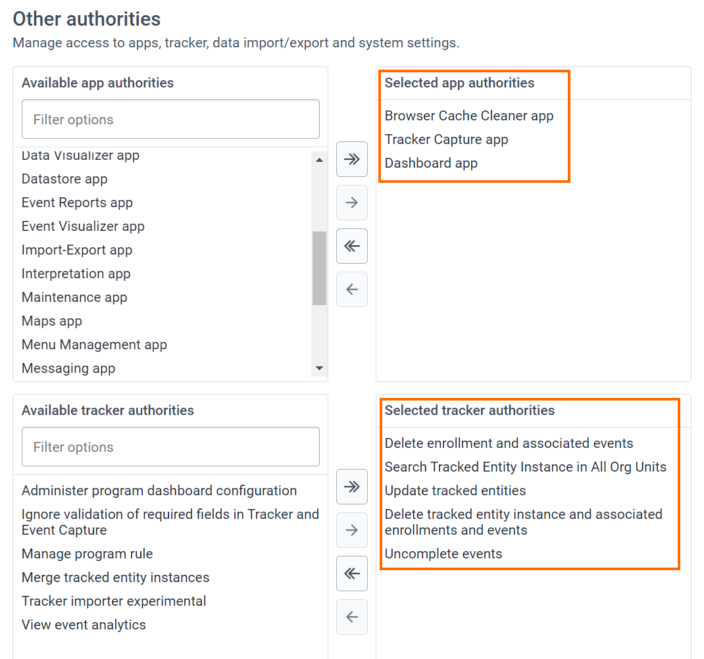

For this user role, we are only using authorities from the apps and tracker sections. When we create user roles, we should be thinking about creating roles that cover a specific function. We can then combine various user roles together to give our user the access they need. This may differ from a common approach of creating a user role for a specific job type (data entry clerk, reproductive health staff) or geographical level (national staff, provincial staff) for example; however such an approach is not recommended. Such an approach does not allow for any variation within those functions as it is not as flexible as creating generic, reusable roles.

Let us review the authorities assigned to this role. 

There are only assigned 3 apps as part of this role


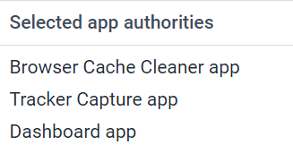

This means, if they only have this user role, they will only see these 3 apps in the apps menu (along with menu management, which every user sees). 

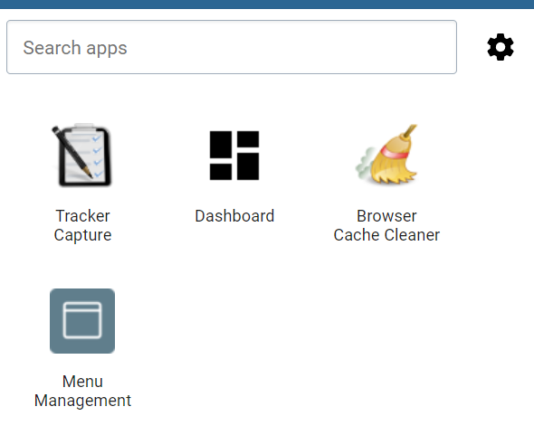

The user roles also has several tracker authorities assigned to it

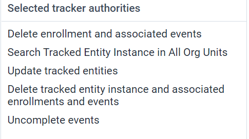

These authorities specify which actions a user can perform as it relates to tracker data. A quick note, if a user can create an event or enrollment, they can also delete it. The delete authorities you see here allow for cascading the deletion (for example, they can delete all the events in an enrollment at once - rather than one by one). 

Let us review each of the available tracker authorities as they are important for tracker user roles (note: they are not applied to the user role we are reviewing)

* Administer program dashboard configuration:
    * Allows a user to modify the default tracked entity dashboard layout that users see
* Delete enrollment and associated events
    * Allows a cascading delete of an enrollment in a program as well as all of its related events
* Delete tracked entity instance and associated enrollments and events
    * Allows a cascading delete of a tracked entity instance, all of its enrollments in all programs as well as all of the related events
* Manage program rule
    * Please ignore this, you can handle managing program rules via the metadata authorities section
* Search tracked entity instance across all organisation units
    * Allows a user to search for tracked entities across all organisation units, regardless of the search organisation units they are assigned
* Uncomplete events
    * Allows a user to incomplete a previously completed event
* Update tracked entities
    * Allows a user to update an existing tracked entity
* View event analysis
    * Allows a user to view analytics data related to any events

A combination of these authorities from tracker, along with authorities from the apps category, is usually what will be needed for the majority of user roles that are assigned to end-users in the system not responsible for any type of system maintenance. 

### Log into the user with this role

In the tracker customization instance, log into the user that has this role assigned to them. Note that there are other components that make up this user role as we have discussed, including user groups, sharing and organisation units; but we will focus on the implications of the user role for now.

Username : tracker_entry

Password : District1#

First, go to tracker capture. Select **_Parrot district hospital_** for entering data along with the TB Treatment card program. Access to the program, including registering new TEIs and adding data to program stages, is actually controlled via sharing, which we will cover in the next session.

The user role however allows them to access tracker capture in the first place, and perform specific actions within the program and program stages that have been shared with them. 

We can explore the features of what the user role is allowing by opening an existing record

You can incomplete events (via the “Uncomplete events” authority)

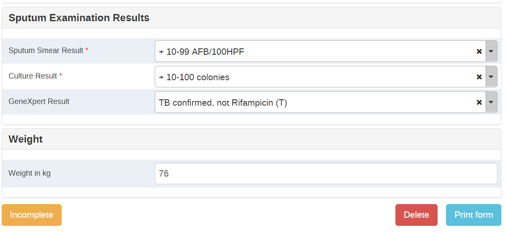

Update a TEI (via the “Update tracked entities” authority)

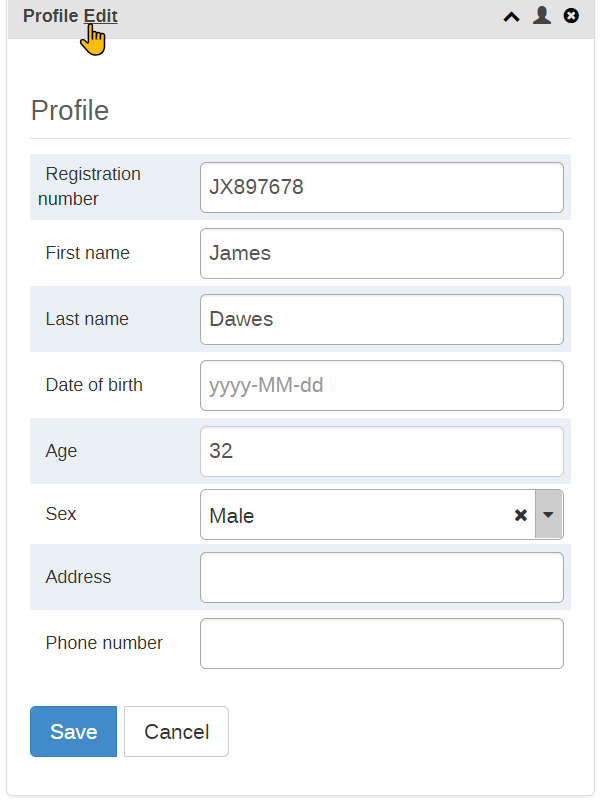

Or perform a cascaded delete (via the “Delete tracked entity instance and associated enrollments and events” authority). Cancel the deletion of the enrollment by selecting “No.”

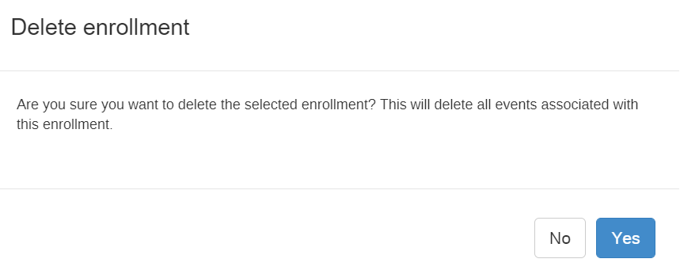

This is all possible via the user role and the authorities we have assigned to it.

## Exercise 2 - Create a new user

### Create a new user and assign it the tracker data entry role

Let’s go through the process of creating a new user and assign it the tracker data entry role.

Navigate back to the user page and select the plus icon to add a new user

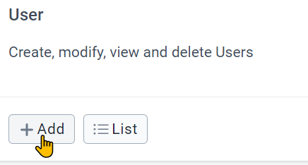

When you create a new user you can use 1 of 2 methods

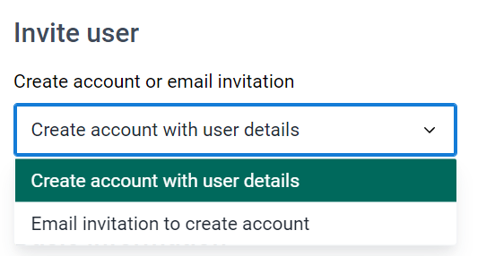

1. You can create the account directly with all of the user details
2. You can send an email invitation to create their account

Option 2 is often better in practice, as it allows for the user to create their own password directly, rather than you having to figure out how to share a password you have made for them, which may or may not get updated by the user.

Let us follow this method by selecting “email invitation to create account.”

The user creation screen is then split into the following sections:

1. Basic information
2. Contact details
3. Organisation unit access. This is divided into 3 subsections
    1. Data capture and maintenance
    2. Data output and analysis
    3. Search
4. Roles and groups. This is divided into 2 subsections
    4. User roles
    5. User groups
5. Analytics dimension restrictions

We can then go through and review the sections and fields, starting with the basic information. This includes general details on the user itself

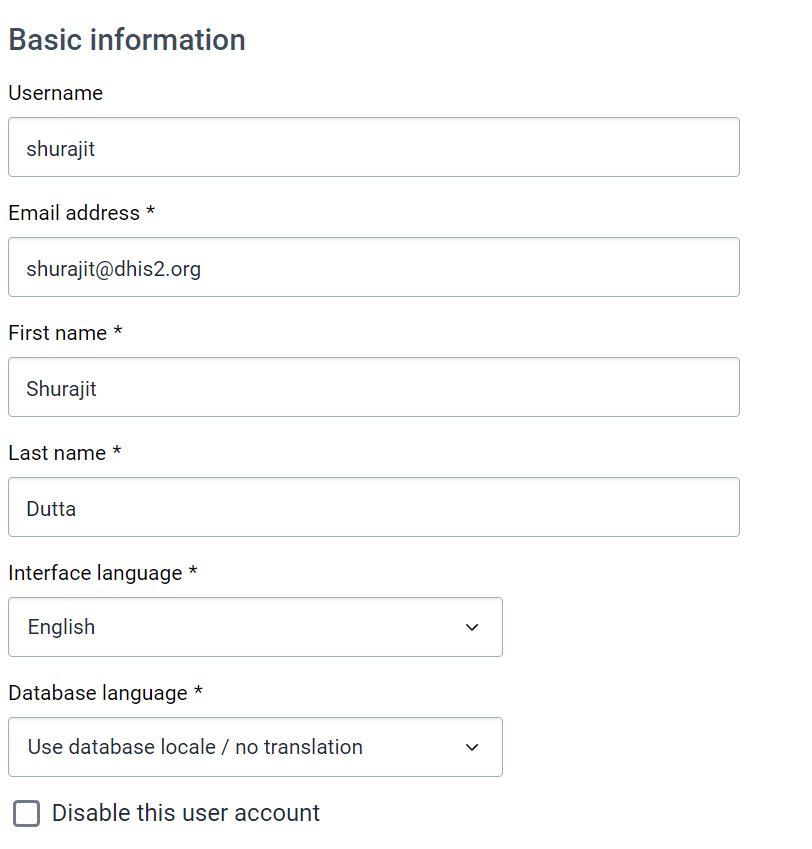

Next, we have the contact details. This can be useful to record if you have alternative contact details for the user being created.

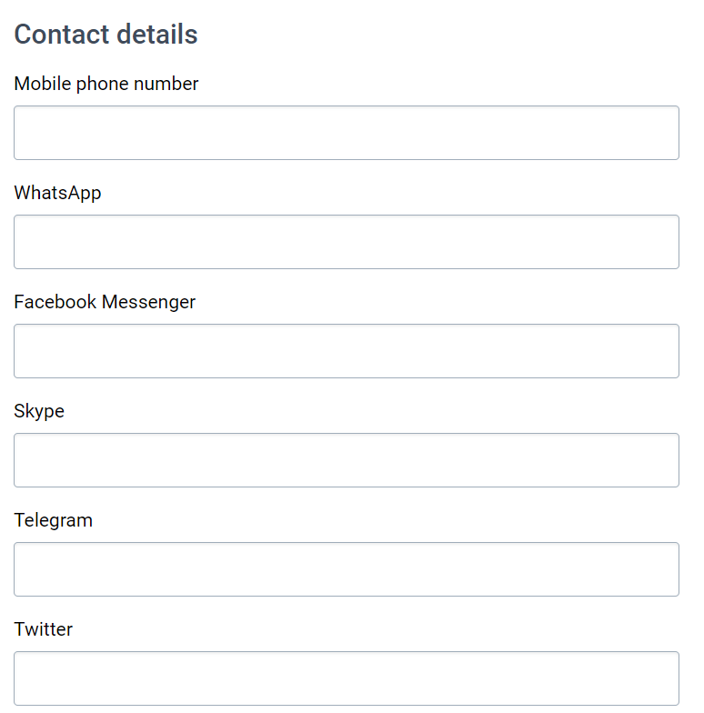

After the contact details, we have the **Organisation unit access** with 3 sections as follows

* Data capture OUs: Where the user can enter data (we can use Bird District)
* Data output OUs : Where the user can view data (we can use Bird District)
* Search OUs : Which orgunits the user can search for TEIs (this is superseded by the search across all OUs authority) (we can use Trainingland)

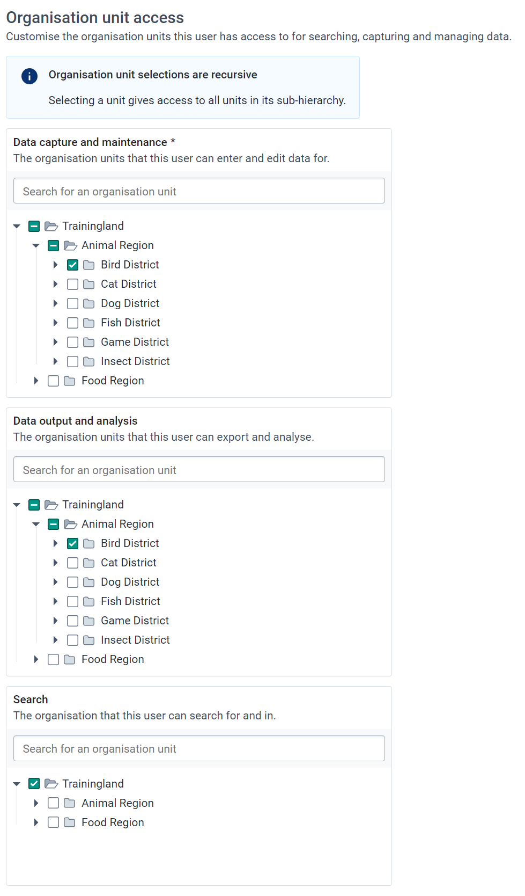

Under the search orgunit assignment, you will see the option “Maximum organisation unit level for data output.” This allows you to restrict a user to creating outputs up to a certain level if desired. For example, if I only wanted to allow a user to create district outputs and not regional or national outputs, I could place this restriction on the user. In normal cases, this will be blank however. 

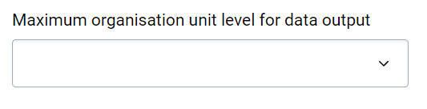

Eventually, under the **Roles and groups** heading, you will get to the area where you have to assign a role to the user. Assign the user the role of tracker data entry.

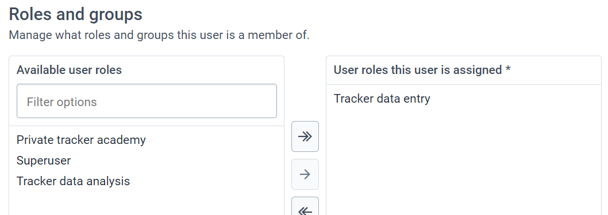

Next, we see available user groups. We will skip this for now as we will discuss user groups in more detail later. 

Lastly, we have **Analytics dimension restrictions**. We will not cover this in this academy.

A quick note, if you change the invite type to “Create account with user details”


You will see one more heading under Basic Information labeled “Security.” If we are creating a user this way we would also enter their password details here.

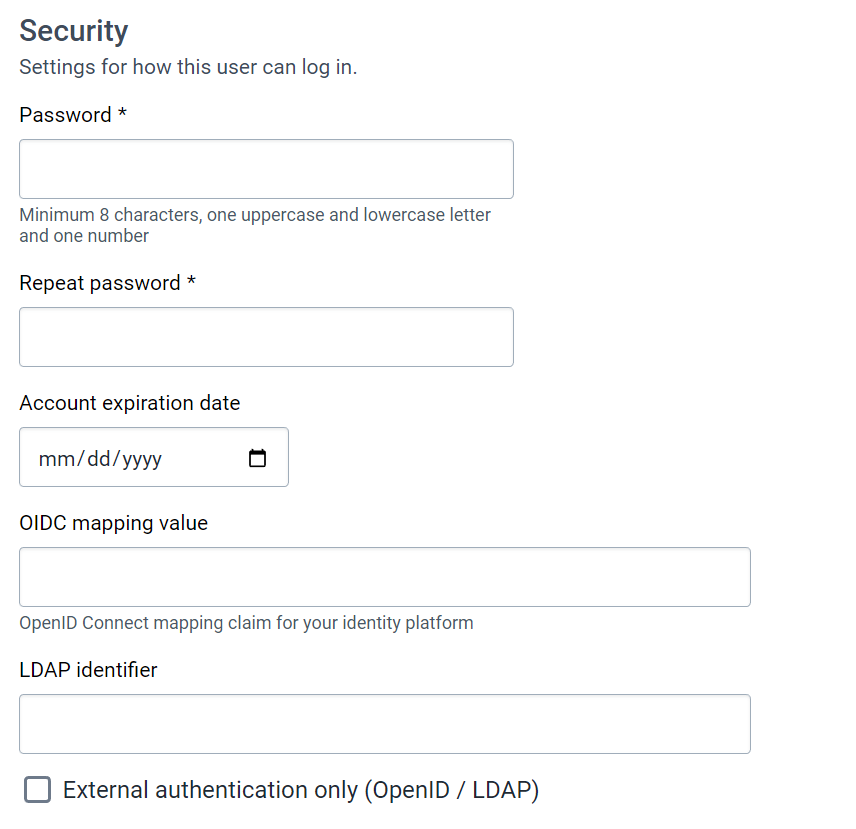

Switch back to email invitation to create account. 

When you have filled in all the details, select “Create user” to send the invitation to the person’s email.

### Sign the user up

Sign this user up by checking the email you entered when creating the account (make sure you are logged out of the account you used to make the new user!)

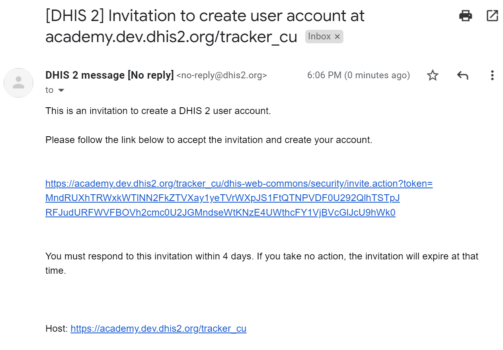

Follow the link and fill in the new details for the user. Select Create once all the details are entered.

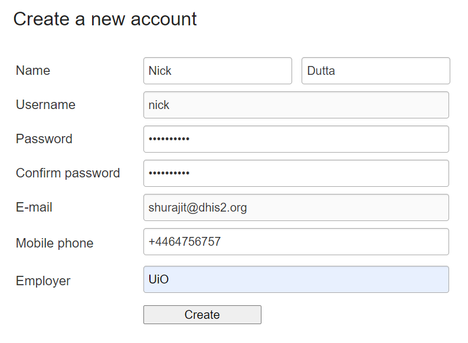

This will log you in as the user. You can test the functionality to ensure they have the correct access.

## Exercise 3 - Create a new user role

Navigate to users and list out the user roles


Select the “New” button to add a new user role

Give the user role a name “tracker data analysis” (use your initials as a prefix to the name) and add a description like:

Allows a user to access event/tracker data outputs via data visualizer, maps, event reports, event visualizer, dashboard and create public items from within these apps.

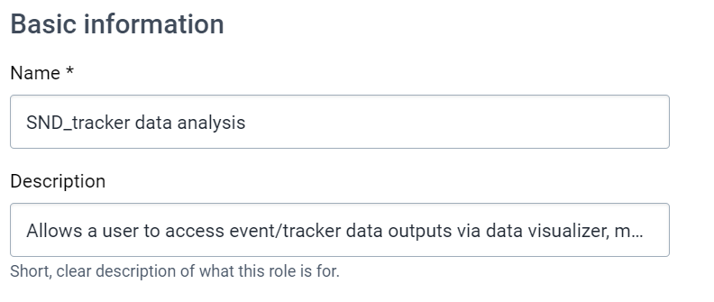

Let us now think through the permissions we want this role to grant.

1. They should be able to access the various analysis apps
2. They should be able to see event data
3. They should be able to add public reports from the analysis apps

In order to provide a user with these authorities, we actually need to use three sections

1. Metadata, to allow the creation of public objects
2. Apps, to give access to the analysis apps
3. Tracker, to give access to the event data

We can start in the apps box and go from there. We can grant them the following authorities

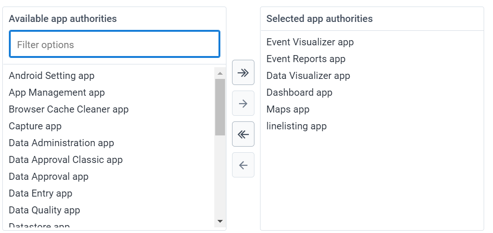

Next, let's look at the metadata section. You will notice that some of the authorities for reports are already selected, for example add/update private dashboard and delete dashboard. This is because by giving them access to the dashboard app, you also give them access to manage at least their own dashboards. 

To allow them to create public reports, we can modify the following authorities manually:

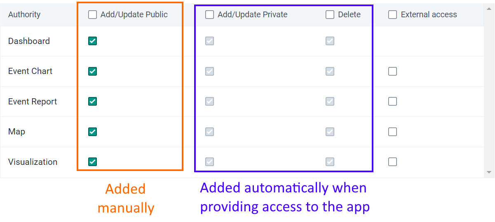

You can see we are just trying to match the apps we granted with the public reports we want them to be able to make.

Lastly, lets add the authorities from the tracker section

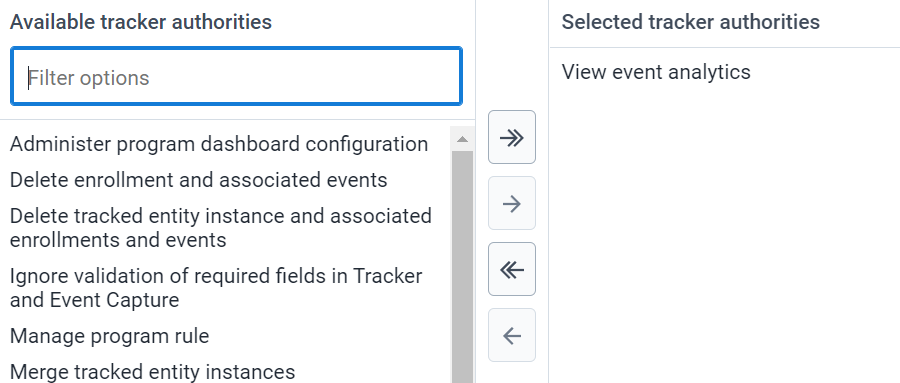

This is strictly a data analysis role, we are only adding the authority to view event analytics. If we want them to enter data, we can also assign them the data entry role in combination with this role! This authority will allow them to view the event data within the programs/stages shared with them. 

We do not need any authorities from import-export or system. This will be true in most of the user roles that are not related to administration of the system.

We can now save this user role.

### Assign this user role to the user you previously created

Open the user you previously created and assigned the “tracker data entry” user role to them. Do not change any parameters, just assign them the tracker data analysis user role you just made.

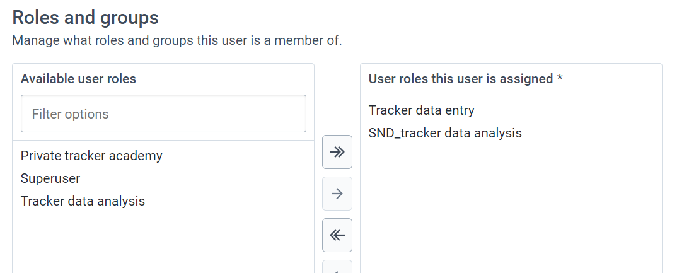

Save this change.

### Log in with the user you edited

After logging in, access the apps menu.

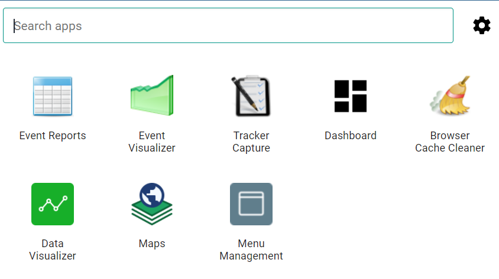

We can already see an immediate difference here in the apps they can access.

You can make an event report using some data from this month from the TB treatment card program to show they now have access to review the data.

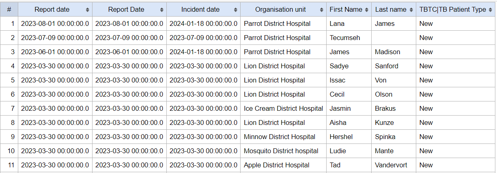

The user we are logged in with has two roles, and these roles give them distinct permissions. By creating roles this way, rather than creating a role for a user type, more flexibility is granted. For example, we could have a number of users that just have access to data analysis, but can not enter any data for example. Same for data entry; or we can combine existing roles like we have done here.
