# Trainer’s Guide to Creating a Tracker Program

## What is this guide?

This guide is a support document for the DHIS2 Tracker Configuration Academy for the session "Designing a tracker program in DHIS2.” This session follows the standard Academy training approach with 1) a live demo session where the trainer demonstrate and explain the features, and 2) a hands-­on session with exercises where participants get to practice the same features.

This guide will help the trainer​ prepare​​ for the live demo session. The section ***Live demo step by
step*** has a detailed walkthrough of all the steps to demonstrate with
explanations and screenshots that should be easy to follow. Use that when preparing for
the live demo session.

There is also a ***Quick Guide*** which lists the steps very briefly and this is meant as a lookup
guide or “cheat sheet” WHILE doing the demo, to help the trainer remember all the steps
and the flow of the demo.

## Learning objectives for the session

The overall objective of this session is to demonstrate the design of a multiple stage tracker program in DHIS2. Detailed objectives include:

- Creating Option Sets through the user-interface
- Creating “Tracker” type data elements
- Creating Tracked Entity Attributes through the user interface
- Reusing existing option sets, data elements and tracked entity attributes
- Creating Program stages
- Assigning a Program to Organization Units

## Time Requirements 

Demo : 3 hours (alternating between demo and learner participation)
Exercise : 3 hours

## Background

In this demo we will go through the process of creating a single, repeatable stage tracker program in its entirety. An example of this program has already been created in the tracker configuration demo database, “COVAC - COVID-19 Vaccination Registry,” and has been assigned to the facility level. You can review this program within the demo database to get a better understanding of how this example program has been created.

This program consists of a single, repeatable stage called "Vaccination." It is part of the [DHIS2 metadata packages](https://dhis2.org/metadata-package-downloads). You can view a detailed description of this program, including all of its attributes, data elements and sections, via the [system design guide](https://docs.dhis2.org/en/topics/metadata/covid-19-vaccine-delivery/covac-immunization-registry-tracker/design.html).

## Preparations

This program’s meta-data is already available within the ***Tracker Customization Database***. If you are not using this DB, import the program into DHIS2 prior to starting the demo so you do not need to re-create all of the meta-data during the demo itself as this can take a fair amount of time. The learner's in this session should have the requisite background knowledge in creating data elements/option sets from the event fundamentals course. You can always go through and re-create one of the data elements/option sets for review purposes if required; however you should focus on the actual program design during this session.

As this program is already configured, please review it with the participants prior to creating it. While it is often not the case that you will have access to a final version of your program in DHIS2 before creating it; this will serve as a good demonstration for everyone to understand how the program should look. 

In addition to the program in DHIS2, a paper form has been created for reference and use in this program. You should apply the DHIS2 tracker data model to this paper form as well to demonstrate how this has been broken up into attributes, data elements, option sets, etc. within the tracker program. 

## General steps when creating a tracker program

We will follow these general guidelines as we go through our demo.

1. Review the tracker program design - take time to identify the program stages, repeatability, relationships, scheduling, attributes, data elements and indicators associated with the program
2. Identify and create (if not yet created) the entity that you are tracking
3. Identify and create (if not yet created) any relationship types to other tracked entities
4. Identify and create option sets
5. Identify and create (if not yet created) the attributes that will register the entity in the program
6. Create Data elements with the domain type “Tracker”
7. Identify the number of program stages in the program
8. Identify if any of the program stages are repeatable or not
9. Create a tracker program
10. Follow the step-wise approach to creating the program by:
       - Filling in the program details
       - Filling in the enrollment details
       - Adding attributes to the program
       - Create Program stages, identifying the number of days each stage should be filled in from the start of the program
       - Include the Data elements in the respective program stages
       - Assigning the Program to Organization unit(s)

## Live demo step-by-step instructions

### Step 1 - Review the tracker program design

In this case, you have several resources available that you can use to review the program. This includes:

1. [The system design guide](https://docs.dhis2.org/en/topics/metadata/covid-19-vaccine-delivery/covac-immunization-registry-tracker/design.html)
2. [The paper version of the form](insertlink)
3. The actual program in DHIS2

Before you go through program, use one of these to review the program's design. The most realistic scenario is either reviewing a paper copy of the form or some type of requirements document; therefore in this case we will use the paper form. A pre-filled version conceptual design worksheet is located [here](insertlink).

Within this worksheet you will see that all of the following has been identified from the paper reporting form:

- The program attributes
- The program stages
- The program data elements
- The option sets for both attributes and data elements
- The program stage sections

You can go over each of these sections with the participants prior to configuring them in DHIS2.

You would typically want to also review indicators/mock dashboards etc. These will be discussed more later on during the program indicator's session.

### Step 2 - Identify and create (if not yet created) the entity that you are tracking

The first thing we will do in DHIS2 is ensure that there is an entity of type “Person” within the DB. 

In order to navigate to the tracked entity page first select maintenance from the apps menu

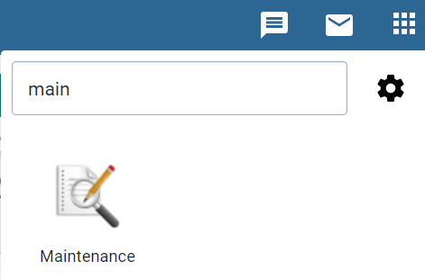

From maintenance, you can navigate to  the tracked entity management page

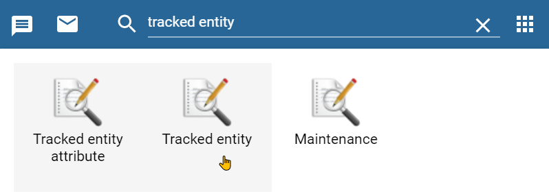

We are tracking a person within the program we are creating, therefore no other tracked entity type needs to be created at the moment. If you needed to, you could use the blue plus icon in the bottom right corner to create the entity type. A full description of creating tracked entity types can be found [here](https://docs.dhis2.org/en/use/user-guides/dhis-core-version-master/configuring-the-system/programs.html#configure_tracked_entity). Note that other entities such as supplies can be tracked by creating the entity type here (as would have been identified in a previous session). You will come back to the tracked entity during the sharing session. 

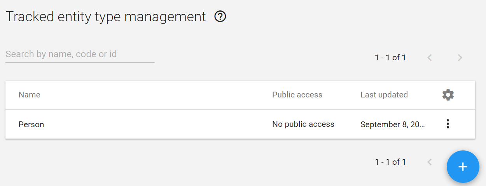

### Step 3 - Identify and create (if not yet created) any relationship types to other tracked entities

In order to navigate to the relationships page, select ***Relationship type*** from the side menu or the apps menu

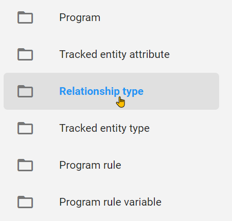

There are no relationships made at this stage, but let us configure a family member relationship to allow those in the same family to be linked with one another. A full description of creating relationship types can be found in the [DHIS2 documentation](https://docs.dhis2.org/en/use/user-guides/dhis-core-version-master/configuring-the-system/programs.html#configure_relationship_type). Use these instructions to create a bidirectional relationship called **Family Member**. Ensure to explain each step as you create this relationship and use your initials when you create this as this will be the same procedure they should follow in all of their exercises/assignments. 

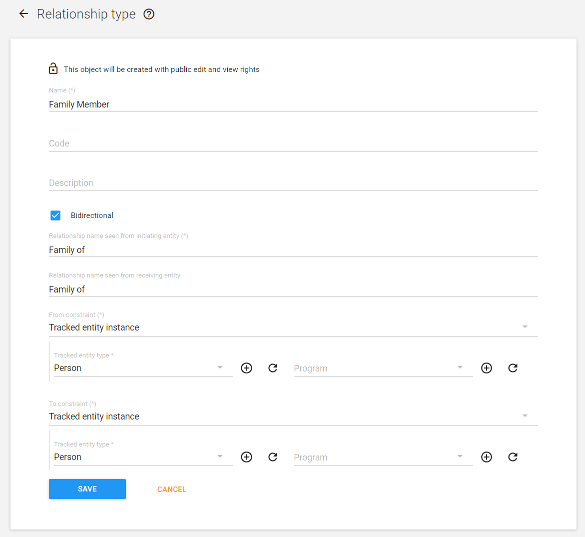 

**STOP!**

#### Exercise 1 - Explore the tracked entity type and create a relationship

Allow the participants to perform the first exercise by exploring the tracked entity type and creating a relationship type.

### Step 4 - Identify and create option sets

Let us review which attributes and data elements require option sets before proceeding

#### Attributes

- Sex
- Area
- Occupation

#### Data Elements

- Pregnancy
- Underlying Condition
- Previously infected with COVID-19
- Vaccine Name
- Vaccine Brand
- Vaccine Manufacturer
- Batch Number
- Dose Number

In order to create/edit options sets, navigate to the option set section within maintenance. 

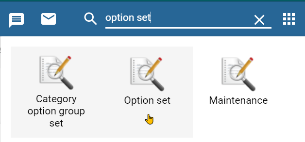

From here, you will note that all of the option sets required for this program have already been made. If you think the participants require a reminder of how to create an option set you can go ahead and create one. The [documentation](https://docs.dhis2.org/en/use/user-guides/dhis-core-version-master/configuring-the-system/metadata.html#manage_option_set) outlines the creation of option sets in detail. You can follow this process if you need a reference.

As an example, you can re-create the sex option set. The name of the option set should use initials so it is unique.

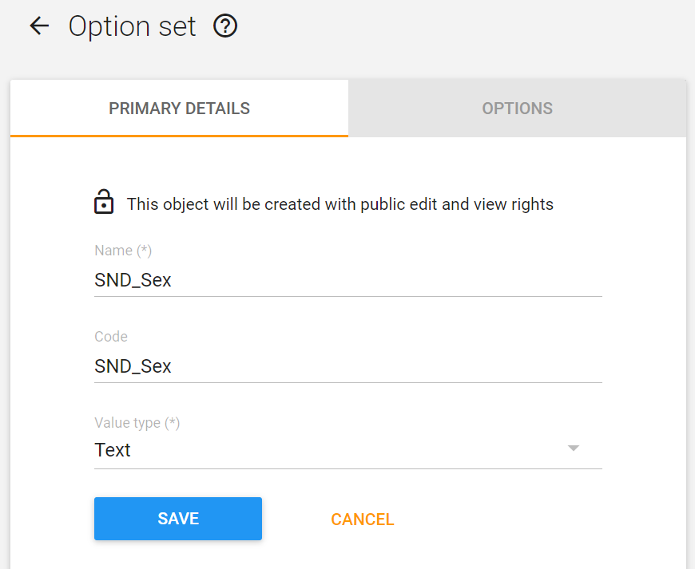

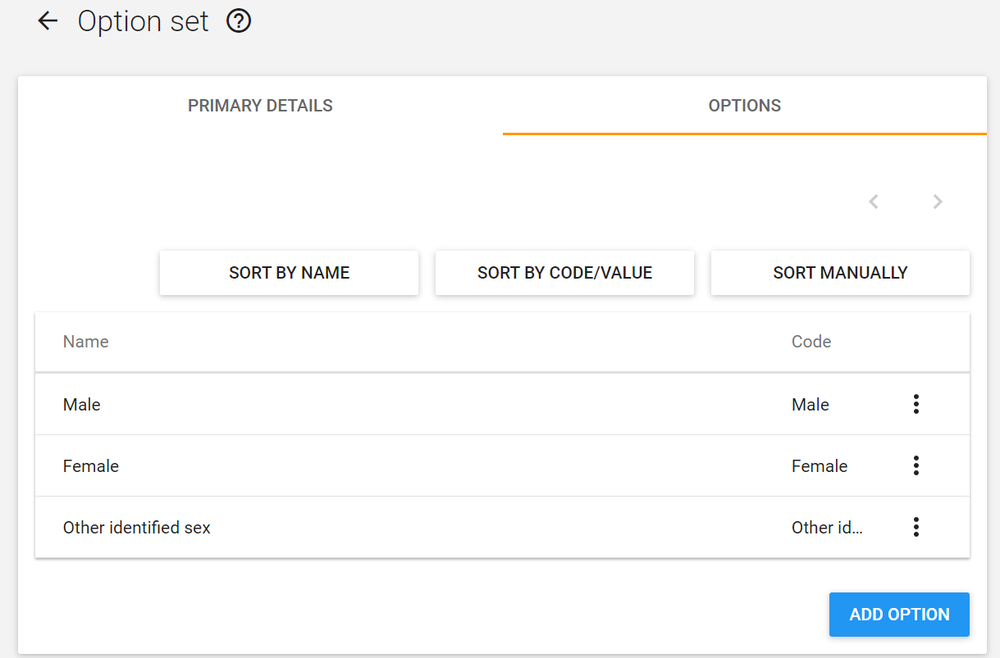

**STOP!**

#### Exercise 2 - Create an option set

Allow the participants to create an option set if you feel they need this reminder.

### Step 5 - Identify and create (if not yet created) the attributes that will register the entity in the program

From our conceptual design worksheet, we will note that the following attributes are required for our program:

- Unique System ID
- National ID
- First Name
- Surname
- Sex
- Date of birth is estimated
- Date of birth
- Age
- Mobile phone number
- Home Address
- Area Urban Rural
- Occupation

Rather than creating all attributes again during this session, it should be sufficient to create 2-3 attributes. Make sure to explain this process in detail, as attributes would not have been covered in any previous sessions or courses. All of the attributes are available in the system already, so you can select which ones you want to create as examples.

In order to create/view/edit attributes navigate to ***Tracked entity attribute*** from within the maintenance app:

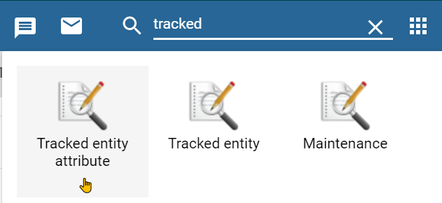

As is the case with option sets, you will also see all of the required tracked entity attributes already created. We will create two following the instructions available within the [documentation](https://docs.dhis2.org/en/use/user-guides/dhis-core-version-master/configuring-the-system/programs.html#create_tracked_entity_attribute)

> Note on encryption: When adding new attributes, encryption can either be configured or not configured depending on the server configuration. In our example, it is not configured. If configured, this allows you to decide if you want certain attributes to be searchable or not. This can be useful in instances where confidentiality is of paramount concern and there are proper registration/ID numbers that allow you to track individuals without looking up other details such as name, etc. For demonstration purposes, please note the differences between the attribute creation screen in a DHIS2 instance where encryption is not available vs. a DHIS2 instance where encryption is configured.

If encryption is not configured, you will receive a message notifying you that this is not the case

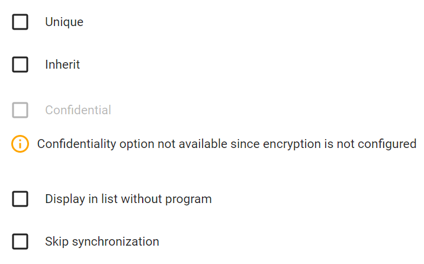

If encryption is configured correctly, you will have the option to select the confidential option when creating attributes.

Insert Image

Create the attributes **First Name** and **Sex** respectively by following the [documentation](https://docs.dhis2.org/en/use/user-guides/dhis-core-version-master/configuring-the-system/programs.html#create_tracked_entity_attribute) if needed, using your initials as a prefix when creating these objects. Give these objects a form name without the prefix so your initials do not show during registration. Explain the fields and process to the participants as you create these two attributes. For the sex attribute, you can use the option set you created with your initials.

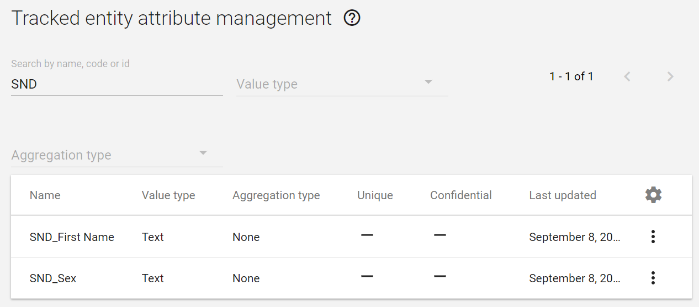

**STOP!**

#### Exercise 3 - Create tracked entity attributes

Allow the participants to create the same attributes you just made : First name and Sex.

### Step 6 -  Create Data elements with the domain type ***Tracker***

> Note: if you feel the participants are comfortable in creating data elements with option sets, then you should only review this process briefly. All of the data elements that are required for the program are already available for them to use.

For a full reminder of which data elements need to be made for this program, refer to the [conceptual design worksheet](insertlink).

In order to create/view/edit data elements we navigate to ***Data Elements*** within the maintenance app.

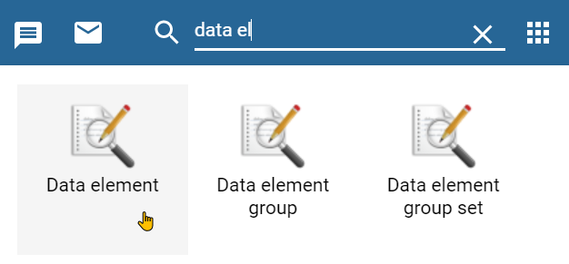

Here all the data elements for the program have been made. We can make some data elements as a reminder however following the instructions within the [documentation](https://docs.dhis2.org/en/use/user-guides/dhis-core-version-master/configuring-the-system/metadata.html#create_data_element).

Create the data elements COVAC - Vaccine Name and COVAC - Suggested date of next dose using your initials as a prefix. Explain each of the mandatory fields (code, description and form name are also good optional fields to explain). The domain type should always be assigned to Tracker, as you are working with Tracker data elements exclusively.

#### Step 6b - Create a data element group

After you create your data elements, it is always a good idea to group them together. There are many advantages in doing so from the maintenance perspective. Select ***Data element group*** from the left side menu within the data element section of maintenance. 

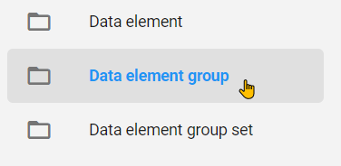

Group your data elements together, referring to the [documentation](https://docs.dhis2.org/en/use/user-guides/dhis-core-version-master/configuring-the-system/metadata.html#create_data_element_group) if needed.

**STOP!**

#### Exercise 4 - Create tracker type data elements

Allow the participants to create the same data elements you just made : COVAC - Vaccine Name and COVAC - Suggested date of next dose.

### Step 7 - Identify the number of program stages in the program

In this case, we have already identified that there is only 1 stage in this program. You can refer back to the [conceptual design worksheet](insertlink) or the actual program to discuss this further.

### Step 8 - Identify if any of the program stages are repeatable or not

The stage for vaccination is repeated and should be identified as such within the [conceptual design worksheet](insertlink)

### Step 9 - Create a new tracker program

In order to create a new program

1. Navigate to "Programs" from within maintenance
2. Select Program from the left-side menu or select "List" from within the program heading box. (Note : if you add a program from this screen, it will be an event program NOT a tracker program)

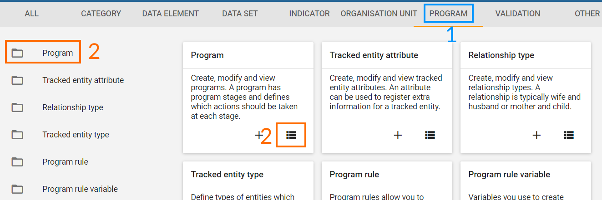

To add a new program, click the blue "+" button follow by tracker program from the program maintenance screen.

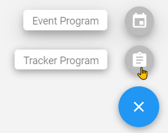

At the top, you will see that, similar to when you create an event program, a stepwise approach to creating tracker programs has been implemented within program maintenance

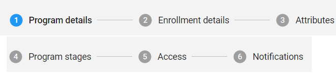

We will follow this approach as we create our program in DHIS2.

You can consult the [documentation](https://docs.dhis2.org/en/use/user-guides/dhis-core-version-236/configuring-the-system/programs.html#configure_tracker_program_in_Maintenance_app) at any time if need be.

### Step 10a - Fill in the program details page

Describe the fields in the program details box area as much as possible, and note the mandatory fields that are identified using a star. It may also be useful to refer them to the [documentation](https://docs.dhis2.org/en/use/user-guides/dhis-core-version-236/configuring-the-system/programs.html#configure_tracker_program_in_Maintenance_app) for a more detailed explanation of what each field does (note : it is a good idea to have this open in a different tab so you can refer to it in the event there are questions about one of the fields). Fill in the mandatory fields, as well as any other fields you think is appropriate within the program details page (note : code and description are good additional, non-mandatory fields to fill and describe; skip the explanation of "Access level" if possible as this will be discussed in its own session).

An example description:
COVID-19 immunization register. Records all individuals receiving their COVID-19 vaccination and tracks all information related to each dose they receive.

When naming your program, use your initials so the program maintains a unique name (ex. SND_COVID-19 Vaccination).

**STOP!**

#### Exercise 5 - Create your program, enter your program details and save!

Allow the participants to create the program, fill in the program details and save it before moving on.

### Step 10b Fill in the enrollment details page

Open the program you have saved by selecting it from program maintenance and select the “Enrollment details” tab from the top bar. Here you may want to refer to the [documentation](https://docs.dhis2.org/en/use/user-guides/dhis-core-version-236/configuring-the-system/programs.html#configure_tracker_program_in_Maintenance_app) again if people are interested in understanding what each fields represents on this page. 

For this program, disable the incident date as it is not required and add in a description of the enrollment date. 