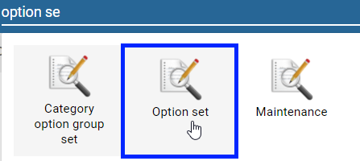
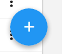
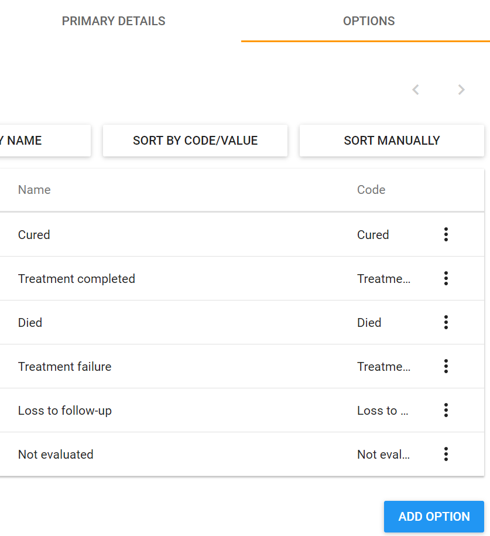
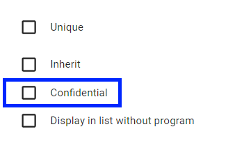
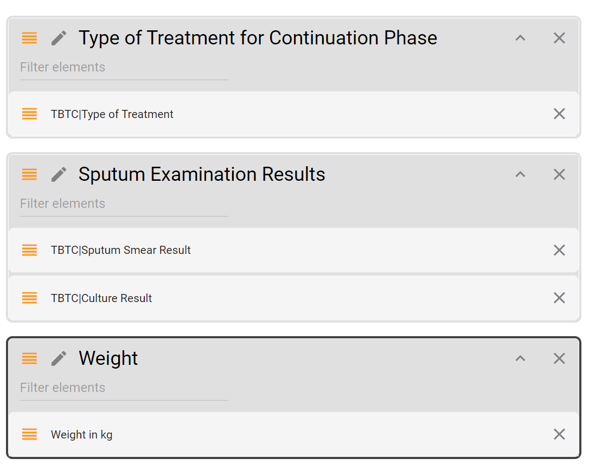

# **Trainer’s guide to Creating a Multiple Stage Tracker Program**

## What is this guide?

This guide is a support document for the DHIS2 Academy trainers for the session “Demo - Designing an tracker program in DHIS2.” This session follows the standard Academy training approach with 

1. a live demo session where the trainer demonstrate and explain the features, and 
2. a hands-­on session with exercises where participants get to practice the same features.

This guide will help the trainer​ prepare​​ for the live demo session. The “Live Demo step by step” section has a detailed walkthrough of all the steps to demonstrate with explanations and screenshots that should be easy to follow. Use that when preparing for the live demo session.

There is also a Quick Guide which lists the steps very briefly and this is meant as a lookup guide or “cheatsheet” WHILE doing the demo, to help the trainer remember all the steps and the flow of the demo.

## Learning objectives for this session

The overall objective of this session is to demonstrate the design of a multiple stage tracker program in DHIS2. Detailed objectives include:

* Creating Option Sets through the user-interface
* Creating “Tracker” type data elements
* Creating Tracked Entity Attributes through the user interface
* Creating Program stages
* Assign a Program to Organization Units
* Assigning initial sharing settings to the program

## Time Requirements

Live Demo: 3 hours

Hands-on Exercises: 3 hours

## Background

In this demo we will go through the process of creating a multiple stage tracker program in its entirety. An example of this program has already been created in Trainingland, “TB Treatment Chart,” at the facility level. You can review this program to get a better understanding of how this example program has been created. 

The program consists of 4 stages starting with the diagnosis/initial phase, 2 continued treatment phases and the end of treatment phase. The program is broken up via the following attributes and data elements:

**Attributes**

* Reg. No
* First Name
* Last Name
* Age (in years)
* Sex (Male/Female)
* Address
* Phone #

**Program Stage 1 - Diagnosis/Initial Phase**

| Data Element            	| Data Element Type        	| Options                                                                                                                                                                                   	|
|-------------------------	|--------------------------	|-------------------------------------------------------------------------------------------------------------------------------------------------------------------------------------------	|
| TB Patient Type         	| Text                     	|  New  Relapse  Treat after failure  Treat after loss to follow up  Transfer in  Other previously treated  Treat history unknown                    	|
| Disease Site            	| Text                     	|  Pulmonary  Extra-Pulmonary                                                                                                                                                      	|
| Extra Pulmonary TB Site 	| Text                     	|  Pleura  Lymph Nodes  Abdomen  Genitourinary tract  Skin  Joints and Bones  Meninges                                                               	|
| Type of Treatment       	| Text                     	|  Hospitalized  Facility-based DOT  Community-based DOT  Self-administered                                                                                            	|
| Sputum Smear Result     	| Text                     	|  Negative (0 AFB / 100HPF)  1-9/100HPF  + 10-99 AFB/100HPF  ++ 1-10 AFB/HPF  +++ >10 AFB/HPF                                                                   	|
| Culture Result          	| Text                     	|  Negative (0 colonies)  <10 colonies  + 10-100 colonies  ++ >100 colonies  +++ Innumerable/confluent growth  Contaminated                                	|
| GeneXpert Result        	| Text                     	|  No TB detected (N)  TB confirmed, not Rifampicin (T)  TB confirmed, Rifampicin (RR)  TB confirmed, Rifampicin indeterminate (TI)  Invalid/No result/Error (I) 	|
| Weight (Kg)             	| Zero or positive integer 	| N/A                                                                                                                                                                                       	|

**Program Stage 2 - Continuation Phase 1 (2-3 months)**

| Data Element        	| Data Element Type        	| Options                                                                                                                                                    	|
|---------------------	|--------------------------	|------------------------------------------------------------------------------------------------------------------------------------------------------------	|
| Type of Treatment   	| Text                     	|  Hospitalized  Facility-based DOT  Community-based DOT  Self-administered                                                             	|
| Sputum Smear Result 	| Text                     	|  Negative (0 AFB / 100HPF)  1-9/100HPF  + 10-99 AFB/100HPF  ++ 1-10 AFB/HPF  +++ >10 AFB/HPF                                    	|
| Culture Result      	| Text                     	|  Negative (0 colonies)  <10 colonies  + 10-100 colonies  ++ >100 colonies  +++ Innumerable/confluent growth  Contaminated 	|
| Weight (Kg)         	| Zero or positive integer 	| N/A                                                                                                                                                        	|

**Program Stage 3 - Continuation Phase 2 (5 months)**

| Data Element        	| Data Element Type        	| Options                                                                                                                                                    	|
|---------------------	|--------------------------	|------------------------------------------------------------------------------------------------------------------------------------------------------------	|
| Sputum Smear Result 	| Text                     	|  Negative (0 AFB / 100HPF)  1-9/100HPF  + 10-99 AFB/100HPF  ++ 1-10 AFB/HPF  +++ >10 AFB/HPF                                    	|
| Culture Result      	| Text                     	|  Negative (0 colonies)  <10 colonies  + 10-100 colonies  ++ >100 colonies  +++ Innumerable/confluent growth  Contaminated 	|
| Weight (Kg)         	| Zero or positive integer 	| N/A                                                                                                                                                        	|

**Program Stage 4 - End of Treatment **

| Data Element        	| Data Element Type        	| Options                                                                                                                                                    	|
|---------------------	|--------------------------	|------------------------------------------------------------------------------------------------------------------------------------------------------------	|
| Sputum Smear Result 	| Text                     	|  Negative (0 AFB / 100HPF)  1-9/100HPF  + 10-99 AFB/100HPF  ++ 1-10 AFB/HPF  +++ >10 AFB/HPF                                    	|
| Culture Result      	| Text                     	|  Negative (0 colonies)  <10 colonies  + 10-100 colonies  ++ >100 colonies  +++ Innumerable/confluent growth  Contaminated 	|
| Treatment Outcome   	| Text                     	|  Cured  Treatment completed  Died  Treatment failure  Loss to follow-up  Not evaluated                                    	|
| Weight (Kg)         	| Zero or positive integer 	| N/A                                                                                                                                                        	|

## Preparations

You can find the option sets for this program located here:

https://drive.google.com/open?id=0B9cgz2MOOXtcbDRXcV9saEVCWXc

The data elements are located here:

https://drive.google.com/open?id=0B9cgz2MOOXtcMW9RbXJJaERSUzQ

**_This program’s meta-data is already available in Trainingland._** If you are not using Trainingland, Import them into DHIS2 prior to starting the demo so they do not need to be created during the demo as this can take a fair amount of time. They should have the requisite background knowledge in creating data elements/option sets from the event program assignment. You can always go through re-creating one of the data elements/option sets for review purposes if required.

If you are using Trainingland for this session, all of the meta-data associated with the program is already created and associated with the program “TB Treatment Card.” You can review the program in Trainingland and also re-use meta-data as required during the demonstration (no need to import the meta-data again if using Trainingland).

This session builds on the TB use presentation located here:

https://drive.google.com/open?id=1XL_Pg41DLYQRCQvRbYL8lJ1w0JlRMGWzDmLIWUjU7mY

Elements of this presentation are incorporated into the tracker terminology session on Day 3.

### Quick Guide

1. Introduce the TB use case, and go over the TB form https://drive.google.com/open?id=0B9cgz2MOOXtcM1F1SU5QMDhGWlE
Try to discuss its conceptual design before going into DHIS2.
2. Show how to access the tracked entity page. Describe the different types of entities that can be made (ie. person, item, etc.)
3. Navigate to the relationship page and show them example relationship types. Explain how to make new relationship types and how this is tied to tracker programs.
4. Review the option sets in Trainingland (create 1 or 2 as a review if needed)
    1. Sex: Male; Female
    2. TB Patient Type: New; Relapse; Treat after failure; Treat after loss to follow up; Transfer in; Other previously treated; Treat history unknown
    3. Disease Site: Pulmonary; Extra-Pulmonary
    4. Extra Pulmonary TB Site: Pleura; Lymph Nodes; Abdomen; Genitourinary tract; Skin, Joints and Bones; Meninges
    5. Type of Treatment: Hospitalized; Facility-based DOT; Community-based DOT; Self-administered
    6. Sputum Smear Result: Negative (0 AFB / 100HPF); 1-9/100HPF; + 10-99 AFB/100HPF; ++ 1-10 AFB/HPF; +++ >10 AFB/HPF
    7. Culture Result: Negative (0 colonies); &lt;10 colonies, + 10-100 colonies; ++ >100 colonies; +++ Innumerable/confluent growth; Contaminated
    8. GeneXpert Result: No TB detected (N); TB confirmed, not Rifampicin (T); TB confirmed, Rifampicin (RR); TB confirmed, Rifampicin indeterminate (TI); Invalid/No result/Error (I)
    9. Treatment Outcome: Cured; Treatment completed; Died; Treatment failure; Loss to follow-up; Not evaluated

#### STOP - Have them complete exercises 1 and 2 in the learner’s guide

5. Create the attributes (create 1 or 2 to introduce this concept, the rest will already be there):
   
    1.  Registration Number
    2.  First Name
    3.  Last Name
    4.  Age (in years)
    5.  Date of birth (date)
    6.  Sex (Male/Female)
    7.  Address
    8.  Phone Number

#### STOP - Have them complete exercise 3 in the learner’s guide

6. Review the data elements that are available. Review the creation of tracker type data elements by re-creating 1 or 2 data elements if needed.
    1. TB Patient Type (Option Set: TB Patient Type)
    2. TB Disease Site (Option Set: Disease Site)
    3. EPTB Site (Option Set: Extra Pulmonary TB Site)
    4. Type of Treatment (Option Set: Type of Treatment)
    5. Sputum Smear Result (Option Set: Sputum Smear Result)
    6. Culture Result (Option Set: Culture Result)
    7. GeneXpert Result (Option Set: GeneXpert Result)
    8. Treatment Outcome (Option Set: Treatment Outcome)
    9. Weight (kg)

#### STOP - Have them complete exercise 4 in the learner’s guide

7. Create the program with registration. Discuss the number of program stages and repeatability of stages during this initial design phase.

#### STOP - Have them complete exercise 5, 6, 7, 8, 9 in the learner’s guide

8. Add in the attributes to the program

#### STOP - Have them complete exercise 10 in the learner’s guide

9. Create the program stages with the scheduling and data elements as follows:

| Stage 1 – Initial/Diagnosis                                                                                                                   	| Stage 2 – Continuation 1 (60 days)                                        	| Stage 3 – Continuation 2 (150 days)                  	| Stage 4 – End of Treatment                                                	|
|-----------------------------------------------------------------------------------------------------------------------------------------------	|---------------------------------------------------------------------------	|------------------------------------------------------	|---------------------------------------------------------------------------	|
| TB Patient Type Disease Site EPTB Site Type of Treatment Sputum Smear Result Culture Result GeneXpert Result Weight (Kg) 	| Type of Treatment Sputum Smear Result Culture Result Weight (Kg) 	| Sputum Smear Result Culture Result Weight (Kg) 	| Sputum Smear Result Culture Result Treatment Outcome Weight (Kg) 	|

#### STOP - Have them complete exercise 11 in the learner’s guide

10. Assign the program to organization units
11. Assign the sharing settings to the program and stages

#### STOP - Have them complete exercise 12 and 13 in the learner’s guide

### Live Demo Step-by-Step

In order to create a multiple-event with registration tracker program, we can follow these general guidelines within DHIS2:

1. Identify and create (if not yet created) the entity that you are tracking
2. Identify and create (if not yet created) any relationship types to other tracked entities
3. Identify and Create (if not yet created) option sets
4. Identify and create (if not yet created)  the attributes that will register the entity in the program
5. Create Data elements with domain type “Tracker”
6. Identify the number of program stages in the program
7. Identify if any of the program stages are repeatable or not
8. Create a tracker program
9. Follow the step-wise approach to creating the program by:
    * Filling in the program details
    * Filling in the enrollment details
    * Adding attributes to the program
    * Create Program stages, identifying the number of days each stage should be filled in from the start of the program
        1. Include the Data elements in the respective program stages
    * Assign the Program to Organization unit(s)

#### Step 1 - Identify and create (if not yet created) the entity that you are tracking

The first thing we will do is ensure that there is an entity of type “Person” within Trainingland. 

In order to navigate to the tracked entity page select “Tracked entity” from the apps menu when you are within the maintenance app:

Indicate that we are tracking a person within the program we are creating, therefore no other tracked entity type needs to be created. Note that other entities such as supplies can be tracked by creating the entity type here (as would have been identified in a previous session). You will come back to the tracked entity during the sharing session. 

#### Step 2 - Identify and create (if not yet created) any relationship types to other tracked entities

In order to navigate to the relationships page select “Relationship Type” from the apps menu.

There is currently a tracker program that registers mothers and follows them through antenatal care, delivery and post-natal care. In this context, the child enrolled in the Infant Delivery and PNC program can be linked with the mother enrolled in the ANC-Delivery-PNC mother program. We can therefore use the already existing relationship type of Mother-Child in order to link these new entities within the TB program. Describe this briefly and relate it to the previous demonstration. This is only one type of relationship; more could be defined (Husband-Wife, etc.) for example as required.

#### Step 3 - Identify and Create Option Sets

Let us review which attributes and data elements require options sets (refer to the table in the background section to see the options):

Attributes:

* Sex (note that male/female options should already be present)

Data Elements within Program Stage 1-4 (note that the option sets will be re-used throughout the program):

* TB Patient Type
* Disease Site
* Extra Pulmonary TB Site
* Type of Treatment
* Sputum Smear Result
* Culture Result
* GeneXpert Result

Refer back to the form or design guidance to see this in full view.

In order to create/edit option sets, navigate to the option set page. Note that if you feel people are comfortable making options from the event program demo/exercise, it is a better idea to review the option sets rather than re-create all of them. 

After navigating to option sets from within maintenance, you will see the list of existing option sets. All of the option sets used in the demo have already been configured for use. You can re-make one of the option-sets if you feel a review is required. 

To add a new option set, click on the plus sign in the lower right corner

Provide the option set a name (mandatory) a code (optional) and value type (mandatory) click on “Save” to save the option set:

After the option set has been saved, you will be taken directly to the option management screen

We can then add new options from the Option management screen by clicking on the add option button

Provide a name and code for the option and click on Save:

The option will then be added to the Option Management Screen:

Repeat this process in order to complete the Treatment Outcome option set:

If necessary, repeat the process of adding a new option set and individual options until all of the option sets required for the program are present (note this may be mixed with other option sets from other programs). You can likely just review this quickly, as participants should be fairly familiar with this concept after working with option sets in the events portion of the academy.

#### STOP - Have them complete exercises 1 and 2 in the learner’s guide

#### Step 4 - Identify and create (if not yet created) the attributes that will register the entity in the program

From the previous review of the program, the following attributes need to be made:

* Registration Number
* First Name
* Last Name
* Age (in years)
* Date of birth (date)
* Sex (Male/Female)
* Address
* Phone Number

Rather than creating all of the attributes again during this session, it should be sufficient to create 1-2 attributes. Make sure to explain this process in detail, as tracked entity attributes would not have been covered in any previous sessions or academies. The remainder of the attributes are available in Trainingland already.

In order to create/view/edit attributes navigate to “Tracked entity attribute”:

We can add new attributes by clicking on the plus sign from the attribute management screen:

When adding new attributes, encryption can either be configured or not configured. In the case of Trainingland, encryption is not currently configured. This would allow you to decide if you want certain attributes to be searchable or not. This can be useful in instances where confidentiality is of paramount concern and there are proper registration numbers that allow you to track individuals without looking up other details such as name, etc. For demonstration purposes, please note the differences between the attribute creation screen in a DHIS2 instance where encryption is not available vs. a DHIS2 instance where encryption is configured.

If encryption is not configured, you will receive a message notifying you that this is not the case

If encryption is configured correctly, you will have the option to select the confidential option when creating attributes.

Review and fill in the options for the attribute. Click on “Add” to save the new attribute. Note that by choosing Text for the Registration number, we can also make this attribute unique for the whole system. There is also the option to automatically generate these numbers, but for the moment we will assume that these are taken from another source. Make sure to explain all of the fields that are present in this screen before adding the attribute

The attribute will be added to the Tracked entity attribute management screen:

Continue the process of adding the remaining attributes until all of the attributes associated with the TB Treatment Chart program are present. Make sure to assign the “sex” option set to the sex attribute and assign the proper value types. Most of these are text, but make sure phone number is assigned the phone number value type for example. You should use prefixes when creating your attributes in this portion of the demo. The participants will have to use prefixes when doing their exercise.

#### STOP - Have them complete exercise 3 in the learner’s guide

#### Step 5 - Create Data elements with domain type “Tracker”

**Note that if you feel the participants are comfortable in creating data elements with option sets based on previous participant experience, you should only create 1-2 data elements as a review.**

In order to create/view/edit data elements we navigate to:

Within the app, click on the “+” sign underneath data element to add in new data elements.

Now we create the required data elements. From the background section:

* TB Patient Type
* TB Disease Site
* EPTB Site
* Type of Treatment
* Sputum Smear Result
* Culture Result
* GeneXpert Result
* Treatment Outcome
* Weight (kg)

We will just create one as part of the demo.

Let us review the Data Element properties for the TB Patient Type data element

When making the data elements provide them with a prefix. In this instance, TBTC has been used to denote “TB Treatment Card.” The participants can also use their initials to find them more easily within DHIS2 (and give them a unique name). Assign the data elements form names to remove the prefix in the data entry pages. Run through the definitions of the fields that are located when adding or editing a data element and in particular how they relate to tracker. 

The domain type should be assigned to Tracker, as it is a Tracker data element. The value type will be determined by the option set that has been selected for this particular data element. The value type should be specified for the weight (in kg) data element however. The option set is defined as TB Patient Type, the option set that has been previously created. 

If you feel it is necessary, create additional data elements, but this should be enough of a review if they have experience in creating event programs.

As several of the data elements belong to more than one program stage, like sputum smear result or weight (kg), they only need to be made once as they can be used in multiple program stages.

You should have the following data elements for this program

After you have created the data elements, it is a good idea to create the data element group as well (as a standard principle, we should group or data elements; in this case this is for admin operation (like bulk sharing) as tracker DE groups are not really used for analysis). Either select Data Element Group from the left context menu and click on the “+” sign in the bottom right hand corner, or click on the “+” sign directly from the main app page under data element group.

Provide the Group with a name and assign all the relevant program DE’s to the data element group. Click “Save” when finished.

#### STOP - Have them complete exercise 4 in the learner’s guide

#### Step 6 - Identify the number of program stages in the program

In this case, we have already identified that there are 4 stages in the program. You can relate this back to the initial discussion on this use case. 

#### Step 7 - Identify if any of the program stages are repeatable or not

In this particular program, the four stages are distinct and should not be repeated. This is because each stage has a different mix of data elements that are reported on. You can refer to any previously presented example on when a repeatable stage is necessary (for example, ANC visits with the same services, HIV Testing and Counselling with Negative Results; the immunization program). 

#### Step 8 - Create a new tracker program

In order to create a new program, navigate to Program from within maintenance

To add a new program, click the + button follow by tracker program from the program management screen.

At the top, you will see that, similar to events, a stepwise approach to creating tracker programs has been implemented within program maintenance

We will follow this approach as we create our program in DHIS2.

#### Step 9 - Fill in the program details page

Describe the fields in the program details box area as much as possible. It may also be useful to point to the docs for a more detailed explanation of what each field does. Fill in the mandatory fields, as well as any other fields you may be appropriate within the program details page.

#### Step 10 - Fill in the enrollment details page

Select the “Enrollment details” from the top bar. Here you may want to refer to the docs again if people are interested in understanding what each fields represents on this page. At minimum, fill in the incident and enrollment date. Clearly define again what these dates are and why they are important.

Select “Save” to save the details of the program so far.

#### STOP - Have them complete exercise 5, 6, 7, 8, 9 in the learner’s guide

#### Step 11 - Add in the attributes

You now want to add in the attributes of the program. Select your program from maintenance to open it back up, then select attributes from the top header. You can refer back to the initial form, slide set or other conceptual documentation you may have created to identify the attributes at the beginning of the session. Note that it is important to identify these before actually going into DHIS2. You can add in the following attributes

| TB Registration Number 	| Date of Birth 	| First Name 	|
|------------------------	|---------------	|------------	|
| Last Name              	| Age           	| Sex        	|
| Family Address         	| Phone number  	|            	|

Select Save to save the changes.

#### STOP - Have them complete exercise 10 in the learner’s guide

#### Step 12 - Create Program stages, identifying the number of days each stage should be filled in from the start of the program if possible and including the required data elements in the program stages

From the background information above, some basic information on scheduling can be obtained. There are stages at diagnosis, 2-3 months and 5 months. The end of treatment stage is dependent on a number of factors. They could end the program prematurely, and thus this stage would be moved in front of the others. In the case that they finish the program, a new TB case would typically reach the end of treatment phase at 6 months while a re-treatment case would reach this phase at 8 months. Due to the variability of the end of treatment stage, schedule only the second and third stages of the program. Therefore, the general outline of the program can be viewed as below:

| Diagnosis/Initial Phase                                                                                                                       	| Continuation 1 (60 days)                                                  	| Continuation 2 (150 days)                            	| End of Treatment                                                          	|
|-----------------------------------------------------------------------------------------------------------------------------------------------	|---------------------------------------------------------------------------	|------------------------------------------------------	|---------------------------------------------------------------------------	|
| TB Patient Type Disease Site EPTB Site Type of Treatment Sputum Smear Result Culture Result GeneXpert Result Weight (Kg) 	| Type of Treatment Sputum Smear Result Culture Result Weight (Kg) 	| Sputum Smear Result Culture Result Weight (Kg) 	| Sputum Smear Result Culture Result Treatment Outcome Weight (Kg) 	|

#### Step 12.1 - Create the 1st stage

In order to add a new program stage, select the “Program stages” button from the top menu. Select the “+” button to add a new program stage

**Let’s review the program stage details for the first stage, “Diagnosis/Initial Phase.”**

You will need to go over the various options that are available here as well as how they can potentially affect tracker capture. You may need to go back to this when you are opening up the program stage in tracker capture after it is created.

In this particular stage, you can see that the event is not repeatable as mentioned earlier. Upon registration, the event will be auto-generated and the data entry form for these data elements will also appear. Events are also auto-generated based on the enrollment date that is selected by the user for each stage. 

**Assign the data elements to the program stage**

Refer back to the accompanying documentation to check which data elements belong in the first stage and assign them here. You can also explain what the options that appear for each data element mean when they are selected (compulsory, display in reports, etc.)

The data elements have been added using the same order as the paper form. They can be arranged by using the up and down green arrows if required. You can also add them to sections. For now, save the program stage, and save the program before proceeding.

**Create the Data Entry Form**

It is always a good idea to take the data elements you have added in the program and arrange them based on sections in your source form. This allows you more control in defining the layout of how data elements appear within your program stages. Referring back to the TB Treatment Card, we can create the following sections and data elements in the 1st stage of the program:

| Section                             	| Data Elements                                                        	|
|-------------------------------------	|----------------------------------------------------------------------	|
| Type of Patient                     	| TBTC\|TB Patient Type                                                	|
| Disease Site                        	| TBTC\|TB Disease Site TBTC\|EPTB Site                             	|
| Type of Treatment for Initial Phase 	| TBTC\|Type of Treatment                                              	|
| Sputum Examination Results          	| TBTC\|Sputum Smear TBTC\|Culture Result TBTC\|GeneXpert Result 	|
| Weight                              	| Weight in kg                                                         	|

Select your program, navigate back to program stages, and select the program stage you have just made. Select “Create data entry form” after you have opened your program stage.

Add in the 5 sections. Click on the 

button to add a new section.  Enter the title of the section and click on “Add”

Repeat this process for all 5 sections. After this is complete, add the data elements to the section.

Select a section (it will be highlighted in black) and select the data element you want to add to that section from the list on the right side.

If we follow the table outlined previously, we should end up with something that looks like this

Select “Add stage” when you have finished, followed by “Save” to make updates to your program.

#### Step 12.2 - Create the 2nd stage

Create a new stage by selecting the program you have made, going back to program stages and selecting the 

icon

**The second stage, Continuation 1, will add in some scheduling components to the program details. This is reflected in the “Scheduled days from start” and “Generate events based on enrollment date” options.**

**After entering in the details, assign the data elements to the stage**

Note that in this second stage, 60 days has been entered as the “Scheduled days from start” value to denote the 2-3 month scheduling of the second program stage.

**Create the Data Entry Form**

We can define our sections based on our form as follows

| Section                                  | Data Elements                              |
|------------------------------------------|--------------------------------------------|
| Type of Treatment for Continuation Phase | TBTC\|Type of Treatment                    |
| Sputum Examination Results               | TBTC\|Sputum Smear TBTC\|Culture Result |
| Weight                                   | Weight in kg                               |

It should look like this when you create it in DHIS2

Select “Add stage” when you have finished, followed by “Save” to make updates to your program.

##### Step 12.3 - Create the 3rd stage

Create a new stage by selecting the program you have made, going back to program stages and selecting the 
icon

**For the third stage, Continuation 2, make sure to add in the proper scheduling as well as correct data elements**

**Program Details**

**Assign the Data Elements**

**Create the data entry form**

We can define our sections based on our form as follows

| Section                    	| Data Elements                              	|
|----------------------------	|--------------------------------------------	|
| Sputum Examination Results 	| TBTC\|Sputum Smear TBTC\|Culture Result 	|
| Weight                     	| Weight in kg                               	|

Create the section and add in the data elements to it

Select “Add stage” when you have finished, followed by “Save” to make updates to your program.

#### Step 12.4 - Create the 4th stage

Create a new stage by selecting the program you have made, going back to program stages and selecting the 

icon

**The properties for the final stage, End of Treatment, do not include any scheduling due to its inherent volatility (someone could die or no longer attend abruptly for example); we can also ask the user to complete the program when this stage is completed.**

**Program Details**

**Assign the data elements**

**Create the data entry form.**

We can define our sections based on our form as follows

| Section                    	| Data Elements                              	|
|----------------------------	|--------------------------------------------	|
| Sputum Examination Results 	| TBTC\|Sputum Smear TBTC\|Culture Result 	|
| Weight                     	| Weight in kg                               	|
| Treatment Outcome          	| TBTC\|Treatment Outcome                    	|

It should look like this in DHIS2

Select “Add stage” when you have finished

**When finished, there should be 4 stages as part of the TB Treatment Card Program:**

Click on “Save” to make updates to your program.

#### STOP - Have them complete exercise 11 in the learner’s guide

#### Step 13 - Assign the Program to Organisation unit(s)

Select your program from within program maintenance then select “Access” from the top menu and proceed to select the organisation units you wish to assign the program to:

After assigning the organisation units you can click on “Save” to save these changes

#### Step 14 - Assign Sharing to the Program

Remember what they have been shown from events training! When they configure an event program they must share the program and program stages. The same applies to a tracker program!

Under the “Roles and access” heading within the Access tab, select the program name you have made.

Apply the following sharing settings:

* Public Access
    * Metadata : No Access
    * Data: No Access

Look for your user in the “Add users and user groups” field and apply the following sharing settings:

* Metadata : Can edit and view
* Data: Can capture and view

Select “Apply” when finished.

Click “Select all” to select all of your program stages

Click on “Apply to selected stages.” You will see that the sharing settings you applied to your program will then be applied to all of your program stages as well.

Select “Save” to save your program updates.

**The program can now be viewed in tracker capture and data entered against the assigned org. Units.**

#### STOP - Have them complete exercise 12 and 13 in the learner’s guide