# Trainer’s guide to Program Access Levels

**_Perform this within the “DEMO” system._**

**What is this guide?**

This guide is a support document for DHIS2 Academy trainers for the session “Program Access Levels.” This session follows the standard Academy training approach with 

1. a live demo session where the trainer demonstrate and explain the program access levels concept and 
2. a hands-­on session with exercises where participants get to modify sharing settings.

This guide will help the trainer​ prepare​​ for the live demo session. The “Live Demo step by step” section has a detailed walkthrough of all the steps to demonstrate with explanations and screenshots that should be easy to follow. Use that when preparing for the live demo session.

There is also a Quick Guide which lists the steps very briefly and this is meant as a lookup

guide or “cheatsheet” WHILE doing the demo, to help the trainer remember all the steps and the flow of the demo.

## Background
 
 In this section we will discuss a security feature (breaking the glass) a quick means when a person does not have access to certain features or part of program to get a quick access when necessary. 

 This means it is possible to override the ownership privelege of the program that was configured witn an access level protected. Any user will be able to temporarily gain access to the program related data, if the user specifies a reason for accessing the tracked entity-program data.

In this demo, we will use both program configuration set as open level access and closed level access. 

## Preparation

Everything in Trainingland has been configured already for you to use in this demo. Just follow the guide using the accounts listed and everything should work as intended. Use the **MAIN DEMO** trainingland instance with data, **DO NOT** use the customization instance as this is not configured there.

## Learning objectives for this session

* Describe what program access levels are
* Describe the 4 types of program access level available in DHIS2
* Apply program access levels to your own tracker programs


## Time Requirements

## Quick Guide

## Live Demo step by step

Start this demo when reaching SLIDE 8 in this [presentation](https://docs.google.com/presentation/d/1ub022jxP8xjsi8UvUZMWfawgR9aZM-_sMutQsNgPrrE/edit?usp=sharing)


### Part 1 - Register a new TEI

Log in as a user who has access to register an tracked entity within the entire organisation unit. Select **_Parrot District Hospital_** and proceed to register an individual in the <span style="text-decoration:underline;">TB Treatment card program</span>.

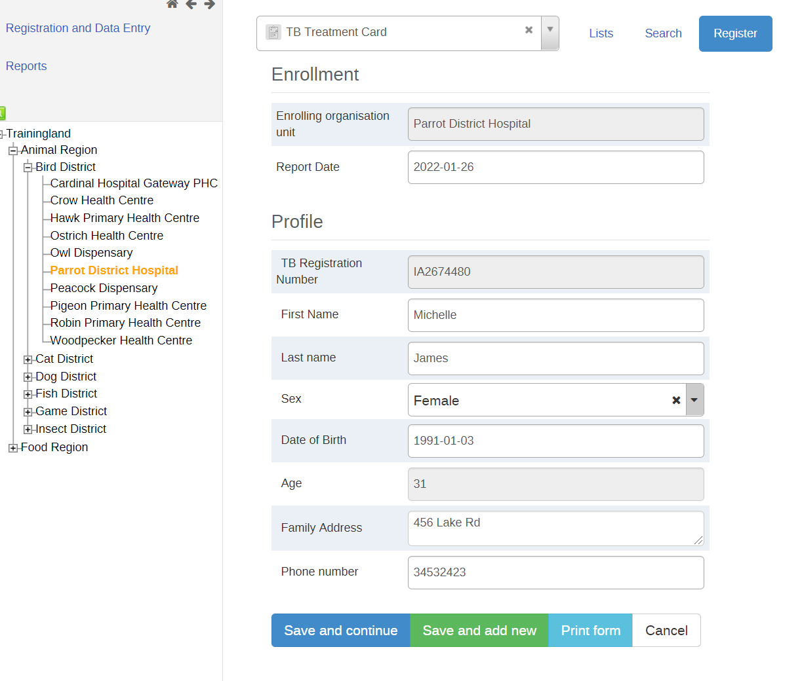

After registration, quickly fill in some of the first stage data.

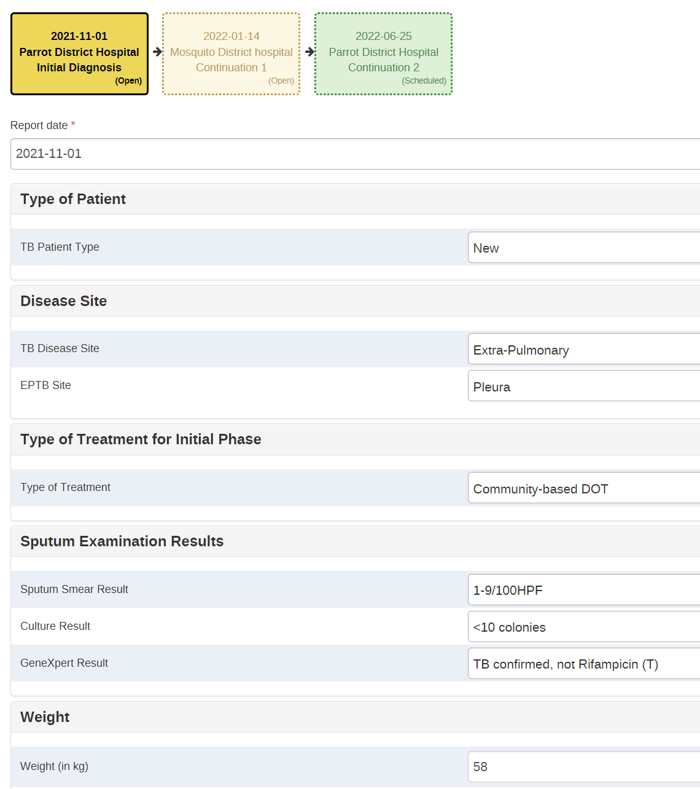

### Part 2 - Find this TEI by breaking the glass

Log out and log back in again as a user with the following details:

Username : breakglass

Password : District1#

After logging in clear your cache and go to tracker capture.


```
Note on user permissions: In our example, the current user that is logged in has access to register and search for people within the TB Treatment card tracker program. They also have the ability to edit/update the information within the program stages of this program. 

Though they are only assigned one district for data capture, they can search for individuals within this program across the entire organisation unit hierarchy (note that this is configured on a per user basis as we can select which organisation units a user has access to search). 
```


In this example, in the event this user needs to search for AND access an individual's record that was not registered within their data capture organisation unit(s), they will have to enter a reason as to why they are accessing this record. 

First we can search for the record that was previously registered (select an orgunit, the TB program, then search). 

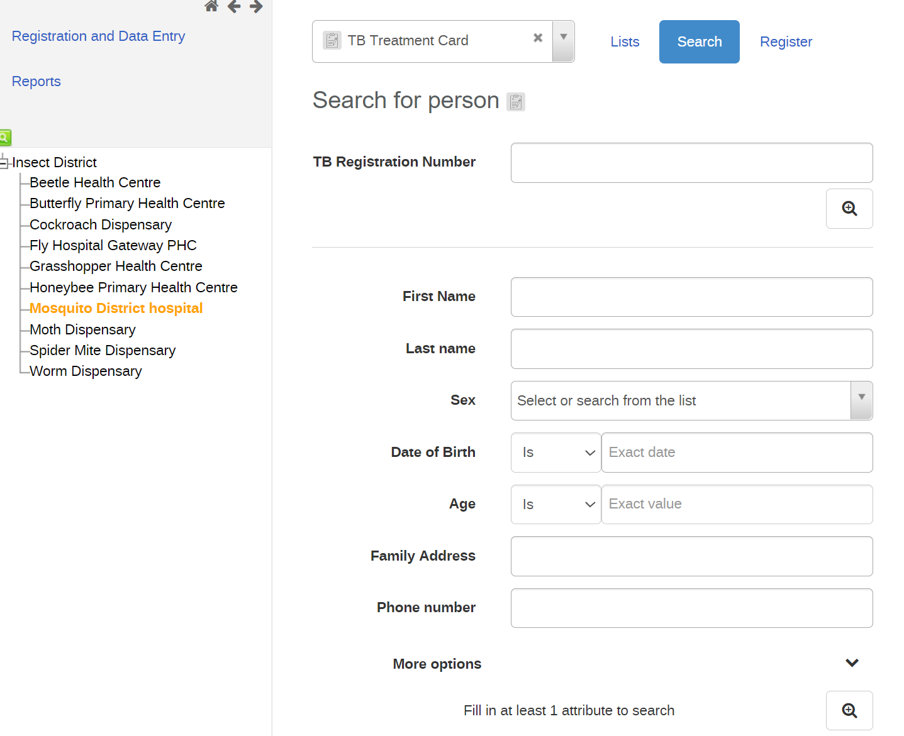

Enter the details and search for the person.

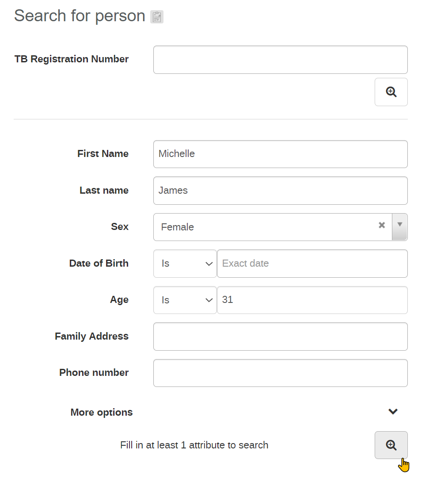

Select the record after you find it.

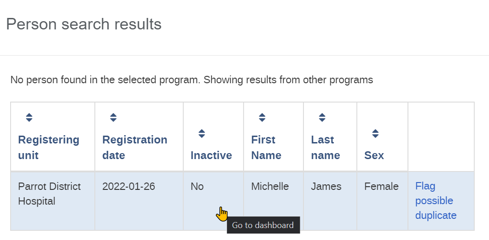

When we try to access the record, we will have to enter a message as to why we are accessing a record outside of our assigned data capture organisation unit. For example:

This person has attended our facility to continue their TB treatment; however they have initiated their treatment in a facility outside of our district. In this case, it seems a referral was not performed directly and we need to update the record with their latest treatment details

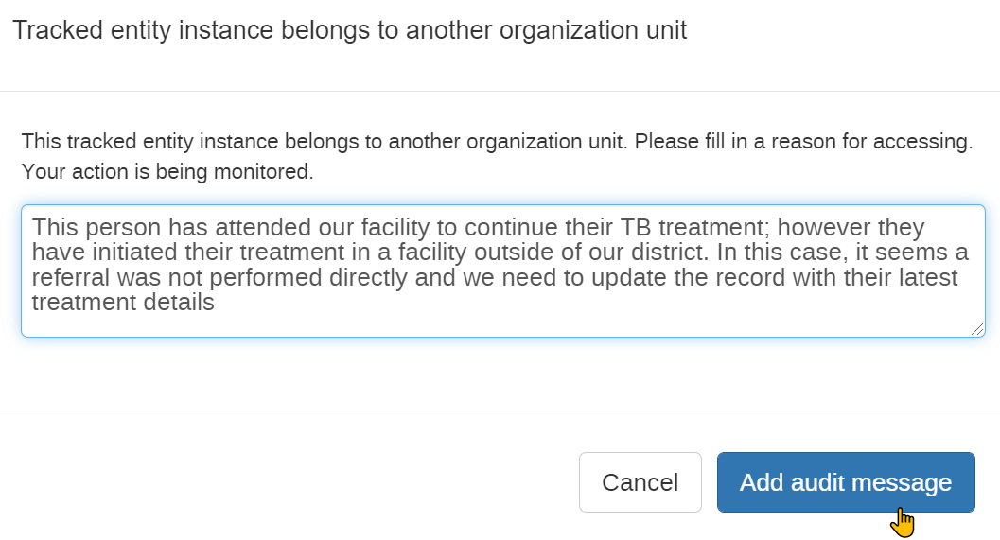

Only after we enter this information can we be allowed to access the record.

This access control is dependent on how the program is set up and if this feature is configured. If there is no need to have them enter a reason for accessing a person’s information outside of their data entry organisation unit(s) this prompt does not have to be displayed.  This can also be configured to not allow them to access tracked entity records outside their own data entry org unit within a certain program at all, which we will discuss shortly.

If the program is configured to allow this type of access, when the user enters a reason for entering the record they will then subsequently be taken to the person’s tracker dashboard. 

You can see this individual can enter data for a new stage, as it is attached to their data capture organisation unit, but can not edit the data from the program stage belonging to the organisation unit outside of its data capture assignment

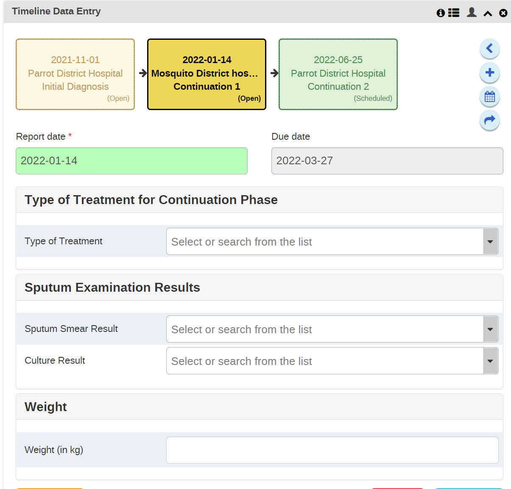

### STOP - Perform Exercise 1

Go back to SLIDE 9 in the [presentation](https://docs.google.com/presentation/d/1ub022jxP8xjsi8UvUZMWfawgR9aZM-_sMutQsNgPrrE/edit?usp=sharing)


### Part 3 - Review records for Immunization and ANC

Start this part of the demo after reaching SLIDE 13 in the [presentation](https://docs.google.com/presentation/d/1ub022jxP8xjsi8UvUZMWfawgR9aZM-_sMutQsNgPrrE/edit?usp=sharing)

We can review other levels of program access, open and closed, through use of our different programs. 

#### Immunization - Open

**_Ensure you are logged in as a user the has access to all orgunits for capture_**

* Select Cardinal hospital followed by the Immunization program.
* Find the record Jayden Thomas

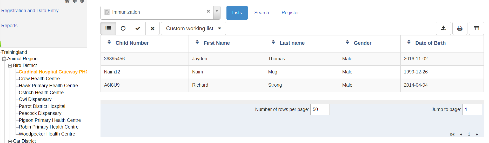

The immunization program is using the “open” program access level, and therefore a user should be able to open this record without any prompt even if outside of their capture scope.

#### ANC - Closed

Ensure you are logged in as a user the has access to all orgunits for capture

* Select Cardinal hospital followed by the Antenatal Care program
* Find the record Sheila Smith

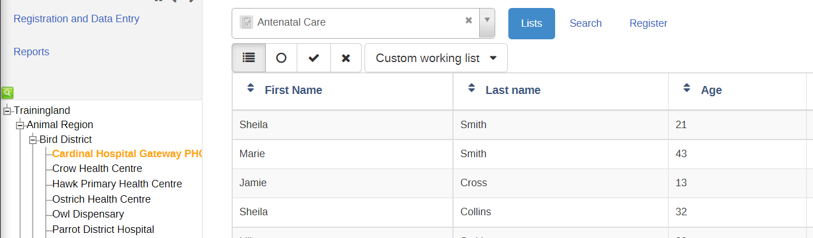

The ANC program is using the “closed” program access level, and therefore a user will not be able to open this record if it is outside of their capture scope.

### Part 4 - Review Open Access

Log out and log back in again as a user with the following details:

Username : breakglass

Password : District1#

After logging in clear your cache and go to tracker capture.

In this example, in the event this user needs to search for AND access an individual's record that was not registered within their data capture organisation unit(s), they will be able to access it without any extra log entry or audit entry required from the user. That is because the program we are accessing is set to the “Open” access level.

Navigate to tracker capture, select an orgunit and select the Immunization program and search for 


* First Name: Jayden
* Last name: Thomas
* Sex : Male.

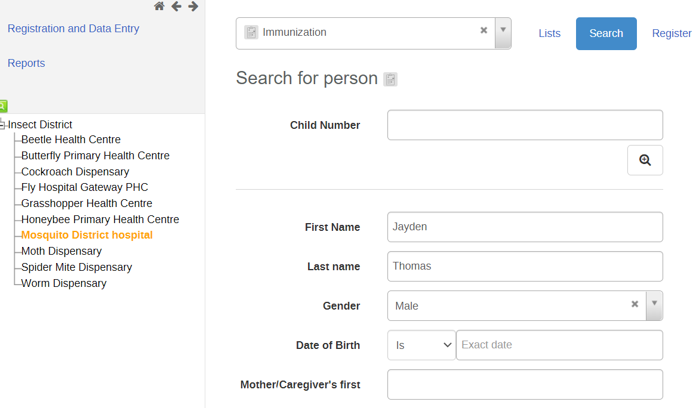

You will see he was not registered in any of the capture org units this user has access to

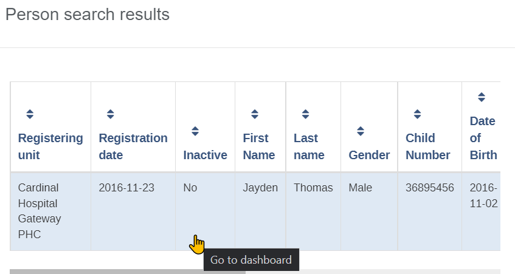

If I select the record, it will just open however. No reason needs to be entered.

```
Note: The behaviour for the audited level of access is the exact same, except an additional log entry will be automatically created. The user will not have to enter any additional details though.
```

### Part 5 -  Review Closed Access

Go back to tracker capture, select the ANC program and perform a search

* First Name : Sheila
* Last name : Smith
* Phone Number : 6134567890

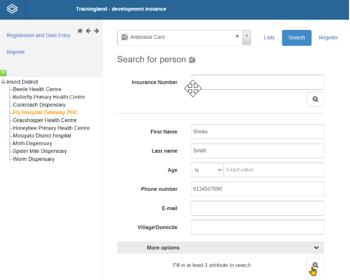

You will see he was not registered in any of the capture org units this user has access to

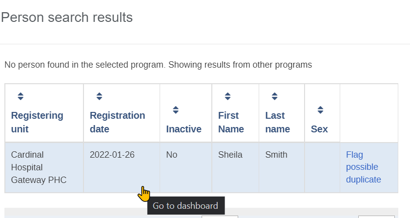

If I try to open this record, I will not be able to. Instead I will receive the following message.

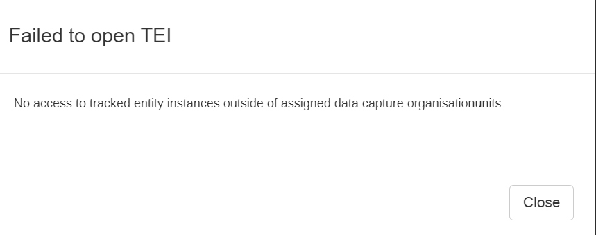


This is because this program is configured with the CLOSED level of access.

### STOP - Perform Exercise 2

After the exercise, go back to SLIDE 14 in the [presentation](https://docs.google.com/presentation/d/1ub022jxP8xjsi8UvUZMWfawgR9aZM-_sMutQsNgPrrE/edit?usp=sharing)

### Part 6 - Review how to configure access levels

Start this demo after reaching slide 16 in the [presentation](https://docs.google.com/presentation/d/1ub022jxP8xjsi8UvUZMWfawgR9aZM-_sMutQsNgPrrE/edit?usp=sharing)

Log in as an admin user.

Navigate to the TB Treatment Card Program in Maintenance and review the program details. Discuss the “Access level” field.

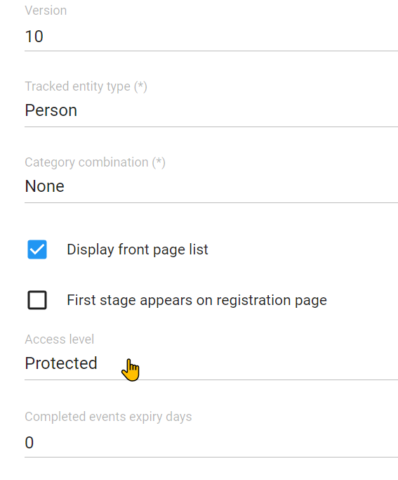

This is where we configure the access level of the program. This then needs to be combined with a user’s data capture scope to dictate the behaviour that we observe in tracker capture. 

### Review the “breakglass” user in the users app

Navigate to the users app and find the “breakglass” user.

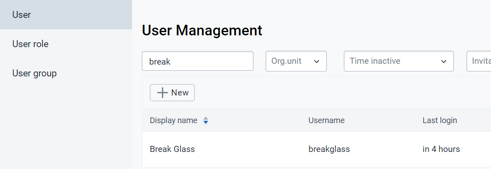

Review their orgunit assignment

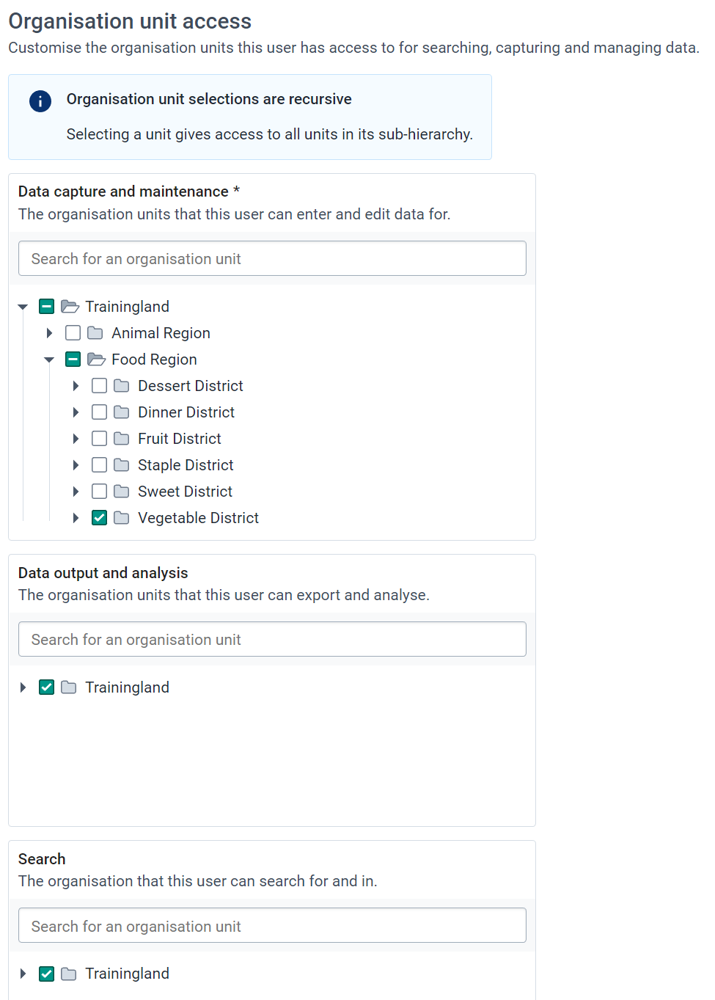


We can see here the data capture org unit is limited to one district (Insect in this example). The search org units comprise the entire country however. This, combined with the program access level, will dictate the behaviour of what happens when this user tries to access a tracked entity instance in one of the programs (we saw already that different behaviours applied to the TB, immunization and ANC programs for the same user). 

In summary:

For the closed level

* If a TEI is outside of a users data capture scope, the user can not open it

For the protected level

* If a TEI is outside of a users data capture scope, the user can open it but will have to enter a reason. This access expires after 3 hours before they have to enter a reason again

For the audited level

* If a TEI is outside of a users data capture scope, the user can open it but additional log entries will be made on its access

For the open level

* If a TEI is outside of a users data capture scope, the user can open it. Only the regular log/audit history is recorded

Keep in mind, the person still needs sharing settings applied to their user that allows them to interact with the program as well, otherwise they won’t be able to perform any operations with the program. We can see that the user “breakglass” is part of several user groups allowing them to interact with the programs by viewing the user group details.  

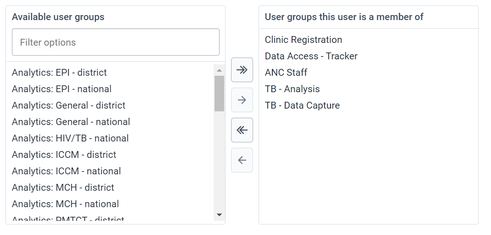

 