# **Trainer’s guide to Creating Program Indicators**

**_PERFORM THIS on the INDICATOR SYSTEM_**

**_Use your initials when making an indicator_**


## **What is this guide?**

This guide is a support document for the DHIS2 Academy trainers for the session “Demo - Program Indicators.” This session follows the standard Academy training approach with 


1. A live demo session where the trainer demonstrates and explains program indicators.
2. A hands-­on session with exercises where participants get to understand and analyze the program indicators.

This guide will help the trainer​ prepare​​ for the live demo session. The “Live Demo step by step” section has a detailed walkthrough of all the steps to demonstrate with explanations and screenshots that should be easy to follow. Use that when preparing for the live demo session.

There is also a Quick Guide which lists the steps very briefly and this is meant as a lookup guide or “cheat sheet” WHILE doing the demo, to help the trainer remember all the steps and the flow of the demo.


## **Learning objectives for this session**

By the end of this session, users should be familiar with the basics in creating program indicators within DHIS2. Users should also be aware of how program indicators can be combined with aggregate data elements to create combined indicators. There are several concepts that the participant should be familiar with by the end of this session:


1. Describe the concept of a program indicator
2. Describe the individual components that are part of a program indicator
    1. Aggregation type
    2. Analytics type
    3. Expression
    4. Filter
3. Create program indicators in DHIS2
4. Create combined indicators (tracker + aggregate data) in DHIS2


## **Time Requirements**

Live Demo: 1.5 hours

Hands-on Exercises: 1.5 hours


## **Background**

The Program Indicators session has proven difficult for several reasons during previous academies. Whether or not to allow participants to follow along with you and than attempt to see the results of the indicators they have created immediately are two divergent approaches that can potentially be applied during this session. The advantage of going through the session without interruption is that they will follow along with the demo all at the same pace. However, this is also one of the sessions in which participants tend to have difficulty following along. By going step-by-step and having them replicate what you are doing, they may understand more, but this completely disrupts the session. Certain participants may take longer than others, and at what point do you proceed? In this case, it is up to the academy team to decide how to best present this session. Both have potential pros and cons, and the team will have to gauge how comfortable the participants have been with the content up to this point. 

Keep in mind that program indicators are calculated on-the-fly, there is **no need to run analytics** after creating a program indicator. You can check it directly with the group to show them what you have done is working correctly.  For the combined indicators, **_you must_** run analytics prior to showing the result.


## **Quick Guide**

**Indicator 1**

Program: TB Treatment Card

Indicator: Extra-Pulmonary TB

Short name: EPTB

Aggregation Type : Count

Analytics Type : Event

PERFORM EXERCISE 1

**Indicator 2**

Program: TB Treatment Card

Indicator: New, Pulmonary TB cases

Short name: NPTB

Aggregation Type : Count

Analytics Type : Event

PERFORM EXERCISE 2

**Indicator 3**

Program: TB Treatment Card

Indicator: TO - failure or died

Short name: TO - failure or died

Aggregation Type : Count

Analytics Type : Event

Create a copy of this indicator with the same characteristics, but filter out Sex = Male, Age > 60

PERFORM EXERCISE 3

**Indicator 4**

Program: TB Treatment Card

Indicator: Hospitalized - Initial and Continuation

Short name: All Treatment Hospitalized

Code: AT_HOSP

Aggregation Type : Count

Analytics Type : Enrollment

PERFORM EXERCISE 4

**Indicator 5**

Program: TB Treatment Card

Create a program indicator of enrollment type. This should calculate the difference in weight between the Initial Diagnosis and End of Treatment program stages when the culture result is negative and the treatment outcome is either cured or completed.

PERFORM EXERCISE 5

**Indicator 6**

Combined indicator

Program: TB Treatment Card

Indicator: TB incidence rate per 100,000

Numerator: TB new cases

Denominator: Population Total

PERFORM EXERCISE 6

## **Live Demo Step-by-Step**

START by presenting slides 1-6 in the program indicators presentation here:

[https://docs.google.com/presentation/d/18D1sY_F-HznxDGLvnE572W_30lg2lUDef-yNGArCuoo/edit?usp=sharing](https://docs.google.com/presentation/d/18D1sY_F-HznxDGLvnE572W_30lg2lUDef-yNGArCuoo/edit?usp=sharing) 

Than come back to the demo

## Indicator 1 : EPTB Cases

### Conceptualize the indicator

We want to COUNT the number of extra-pulmonary TB cases. This is taken from the field disease site, which has an option set where I can select this value.

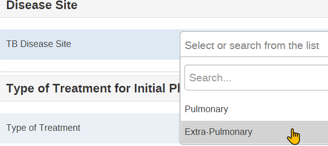

### Edit the indicator details

Navigate to maintenance -> Indicator-> Program Indicator

Select “TB Treatment Card” as the program

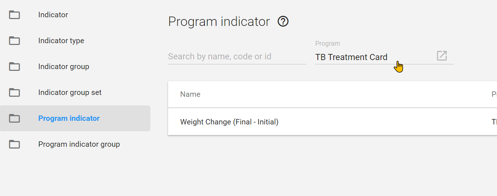

### Add a new indicator and edit the program indicator details

Select the blue plus sign to add a new indicator. 

First, edit the name, short name and code details.

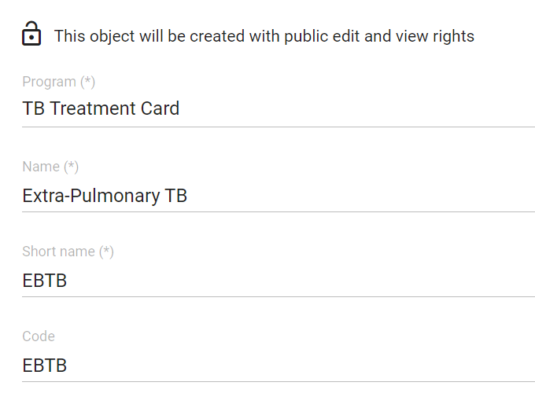

Skip color and icon

Next, add a description. 

Review the aggregation type, what are we trying to do with this indicator? We want to COUNT the number of cases that are EPTB.

Review the analytics type. We only need data from one stage in the program, and this stage is not repeated. In this scenario, the analytics type is EVENT. 

After selecting the analytics type, you will see “Analytics period boundaries.” Leave these all as default, we will not cover them in this academy. You can learn more about them in the [docs](https://docs.dhis2.org/en/use/user-guides/dhis-core-version-master/configuring-the-system/programs.html#about_program_indicators).  

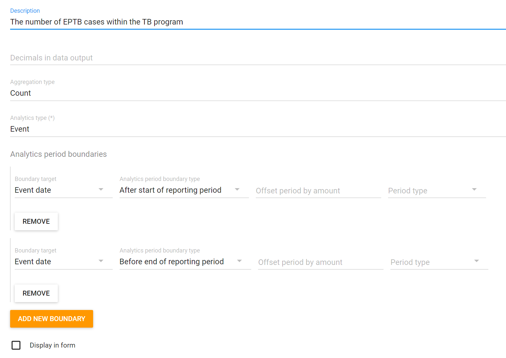

### Edit the expression

Select the expression tab in order to edit the expression. This is where we define what we want to happen mathematically. 


```
When you create a program indicator in a tracker program, you will see all of the program stages located on the right side menu. From here, you can select any of the data elements belonging to those stages. You will also be able to select the attributes that belong to the program. In addition, we also have variables and constants that we can use in our calculations.
```


In this case, we can use a simple variable, called event count, to define our expression. This is because we want to count the number of events that meet a certain criteria. This is a variable you will likely find yourself using quite often.

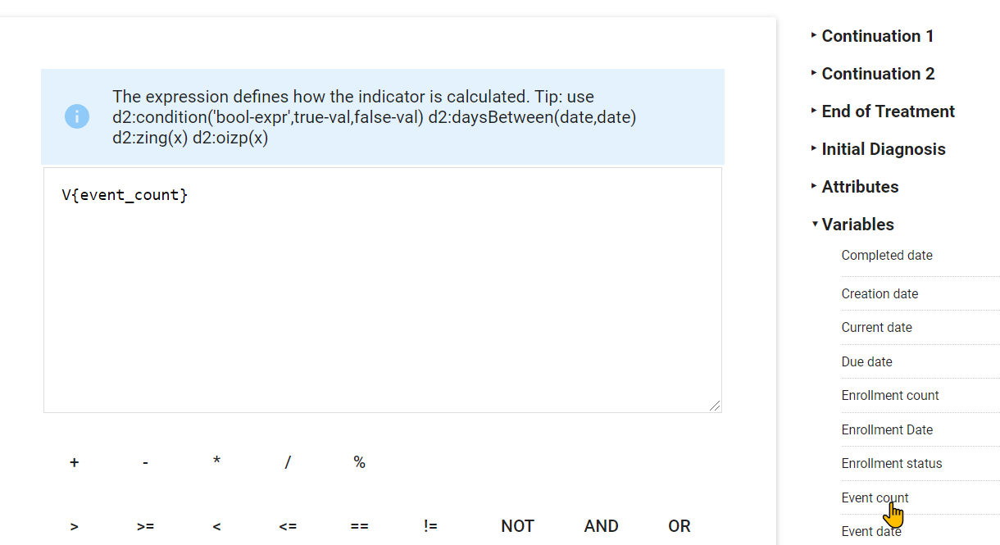


### Edit the filter

Select the filter tab in order to edit the filter. Here we define what criteria we want to include in our mathematical calculation. We want to count events, but which ones? In our case, those where the disease site is extra pulmonary.

Disease site is a data element in our program, so we can select it

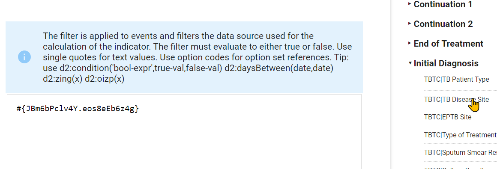

Next, we can use our operator ‘equals to.’

In program indicators, options are identified via their code within an option set. In this example, the name and the code are the same, but if you are not familiar with the metadata, it is usually a good idea to check the code of the option you are using.

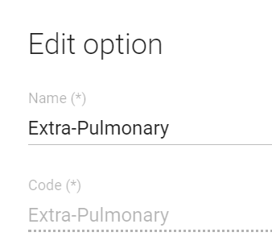

Copy the code and add it into the filter. We add it in between quotes as it is a text value. All text values need to be in-between quotes.

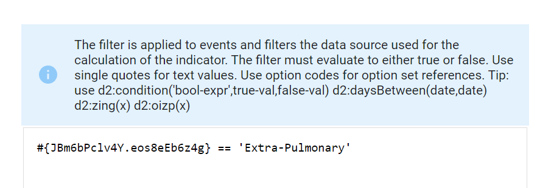

### Test the program indicator

Now that you have created the program indicator, it is a good idea to test if it is functional. You can compare the properly configured indicator with the one you have created to ensure that the value is correct. In order to do this you can navigate to the pivot table app.

### Navigate to the data visualizer app 

Create a new pivot table with the following details

* Data : the program indicator you made, the program indicator “Extra Pulmonary TB”
* Period : This year
* Organisation Unit : Trainingland

Click on update to verify that the values are equal in the indicators. This will provide some validation that the indicator is created correctly.

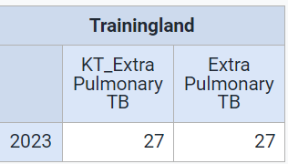

### STOP - Perform Exercise 1

## Indicator 2 : New, Pulmonary TB Cases

### Conceptualize the indicator

We want to COUNT the number of New, Pulmonary TB cases

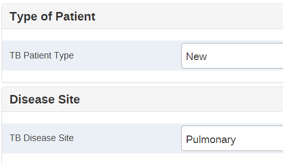

These values are taken from 2 different data elements, TB Patient Type and TB Disease Site, both with option set values to select from. This means that we will need to consider the codes of these values again. 

### Edit the indicator details

Navigate to maintenance -> Indicator-> Program Indicator

Select “TB Treatment Card” as the program


### Add a new indicator and edit the program indicator details

Select the blue plus sign to add a new indicator. 

First, edit the name, short name and code details.

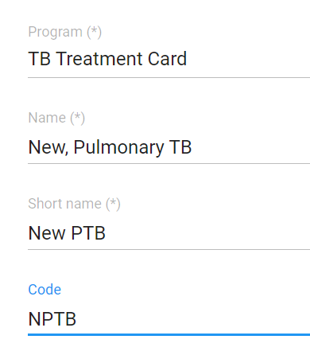

Skip color and icon

Next, add a description. 

Review the aggregation type, what are we trying to do with this indicator? We want to COUNT the number of cases that are EPTB.

Review the analytics type. We only need data from one stage in the program, and this stage is not repeated. In this scenario, the analytics type is EVENT. 

After selecting the analytics type, you will see “Analytics period boundaries.” Leave these all as default, we will not cover them in this academy. You can learn more about them in the [docs](https://docs.dhis2.org/en/use/user-guides/dhis-core-version-master/configuring-the-system/programs.html#about_program_indicators).  

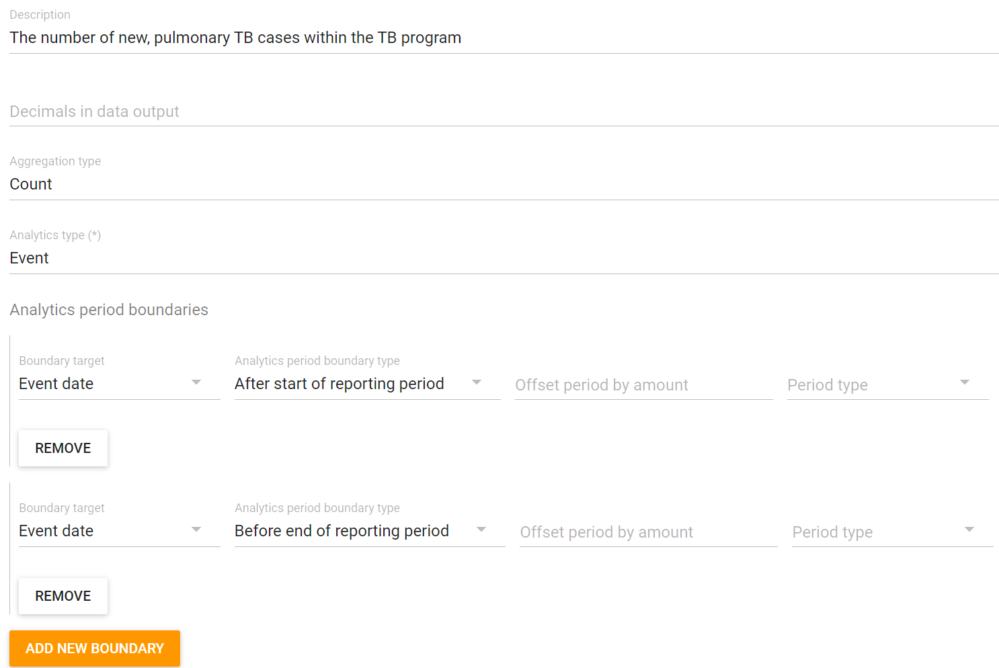

### Edit the expression

Select the expression tab in order to edit the expression. This is where we define what we want to happen mathematically. 

In this case, we can use a simple variable, called event count, to define our expression. This is because we want to count the number of events that meet a certain criteria. This is a variable you will likely find yourself using quite often.


### Edit the filter

Select the filter tab in order to edit the filter. Here we define what criteria we want to include in our mathematical calculation. We want to count events, but which ones? In our case, those where the patient type is new AND the disease site is pulmonary.

Patient Type and Disease site is a data element in our program, so we can select them. Let us first select Patient type

Next, we can use our operator ‘equals to.’

In program indicators, options are identified via their code within an option set. In this example, the name and the code are the same, but if you are not familiar with the metadata, it is usually a good idea to check the code of the option you are using.


Copy the code and add it into the filter. We add it in between quotes as it is a text value. All text values need to be in-between quotes.

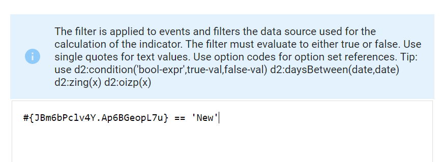

In order for this indicator to meet our required criteria, the patient has to be new AND the disease site has to be pulmonary. We therefore must use the ‘and’ logical operator in this scenario. Select the disease site data element and complete the filter.

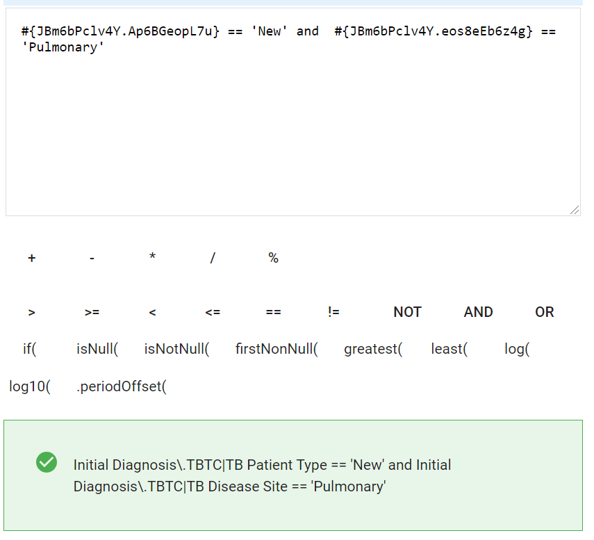

### Test the program indicator

Now that you have created the program indicator, it is a good idea to test if it is functional. You can compare the properly configured indicator with the one you have created to ensure that the value is correct. In order to do this you can navigate to the pivot table app.

### Navigate to the data visualizer app 

Create a new pivot table with the following details

* Data : the program indicator you made, the program indicator “New, Pulmonary TB”
* Period : This year
* Organisation Unit : Trainingland

### Click on update to verify that the values are equal in the indicators. This will provide some validation that the indicator is created correctly.

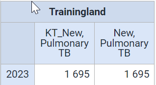

### STOP - Perform Exercise 2

## Indicator 3 : Patients on who failed treatment or died

### Conceptualize the indicator

We want to COUNT the number of cases that either died or treatment failed

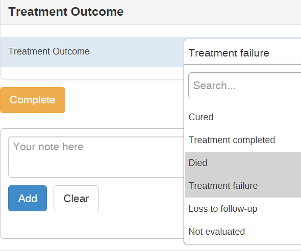

These values are taken from 1 data element, Treatment Outcome, with option set values to select from. This means that we will need to consider the codes of these values again. 

### Edit the indicator details

Navigate to maintenance -> Indicator-> Program Indicator

Select “TB Treatment Card” as the program


### Add a new indicator and edit the program indicator details

Select the blue plus sign to add a new indicator. 

First, edit the name, short name and code details.

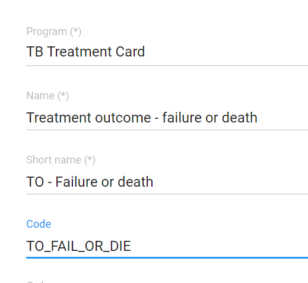

Skip color and icon

Next, add a description. 

Review the aggregation type, what are we trying to do with this indicator? We want to COUNT the number of cases that are either on facility or community based DOT.

Review the analytics type. We only need data from one stage in the program, and this stage is not repeated. In this scenario, the analytics type is EVENT. 

After selecting the analytics type, you will see “Analytics period boundaries.” Leave these all as default, we will not cover them in this academy. You can learn more about them in the [docs](https://docs.dhis2.org/en/use/user-guides/dhis-core-version-master/configuring-the-system/programs.html#about_program_indicators).  

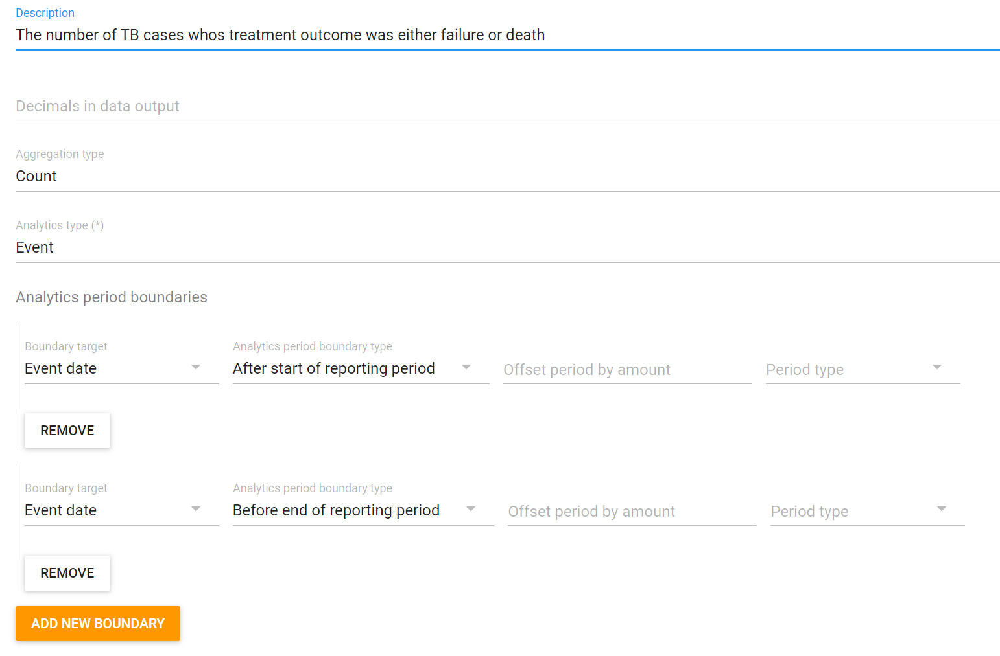

### Edit the expression

Select the expression tab in order to edit the expression. This is where we define what we want to happen mathematically. 

In this case, we can use a simple variable, called event count, to define our expression. This is because we want to count the number of events that meet a certain criteria. This is a variable you will likely find yourself using quite often.


### Edit the filter

Select the filter tab in order to edit the filter. Here we define what criteria we want to include in our mathematical calculation. We want to count events, but which ones? In our case, those where the treatment outcome is either treatment failure or died.

Treatment outcomet is a data element in the the end treatment stage of  our program, so we can select it.

Next, we can use our operator ‘equals to.’

In program indicators, options are identified via their code within an option set. In this example, the name and the code are the same, but if you are not familiar with the metadata, it is usually a good idea to check the code of the option you are using.


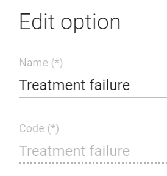
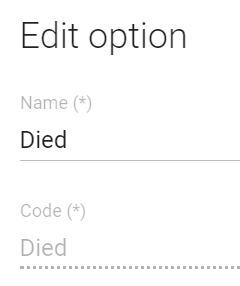

Copy the code and add it into the filter. We add it in between quotes as it is a text value. All text values need to be in-between quotes.

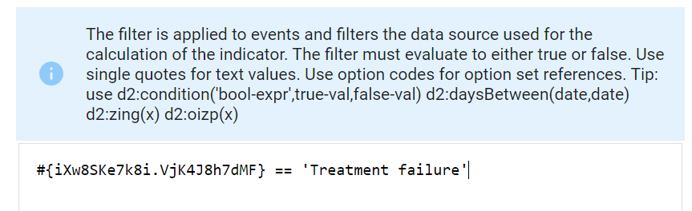

In order for this indicator to meet our required criteria, the patient can be on facility based OR community based DOT. We therefore must use the ‘or’ logical operator in this scenario. Select the disease site data element and complete the filter.

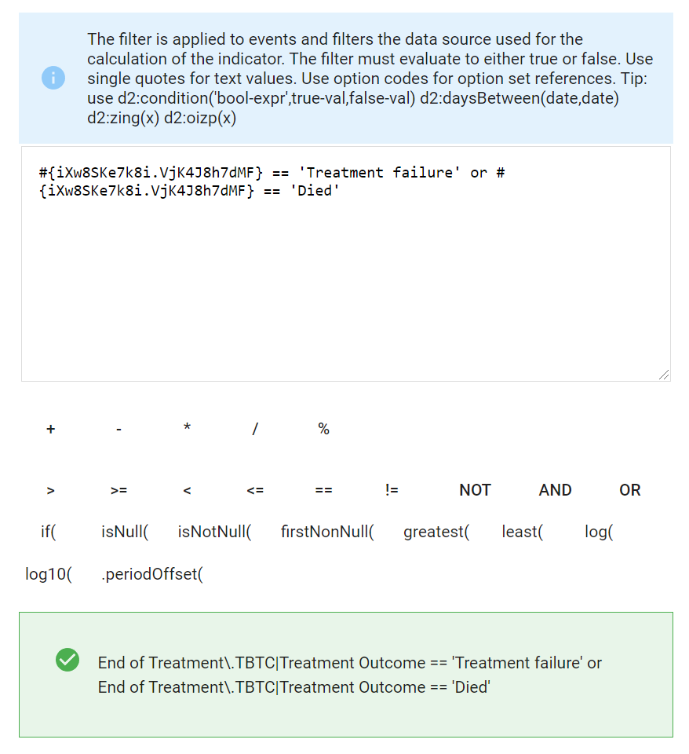

### Test the program indicator

Now that you have created the program indicator, it is a good idea to test if it is functional. You can compare the properly configured indicator with the one you have created to ensure that the value is correct. In order to do this you can navigate to the pivot table app.

### Navigate to the data visualizer app 

Create a new pivot table with the following details

* Data : the program indicator you made, the program indicator “Treatment outcome - failure or death”
* Period : This year
* Organisation Unit : Trainingland

Click on update to verify that the values are equal in the indicators. This will provide some validation that the indicator is created correctly.

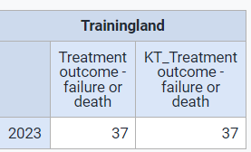

#### Adding more filter information

What if we want to modify this indicator to only count those cases that were Male and >60?

In order to do this, we need to modify our indicator filter. As we are adding on to the previous indicator, let us find it and clone it.

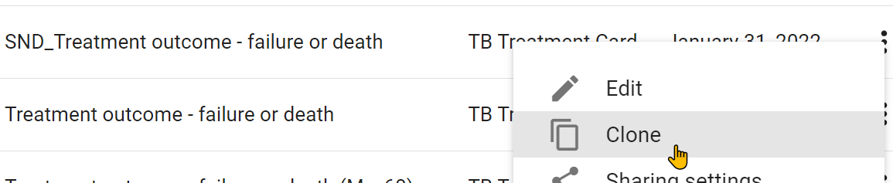

Update the name, short name, code and description

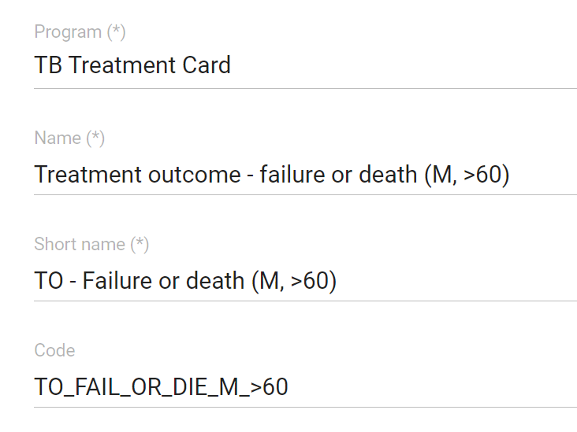
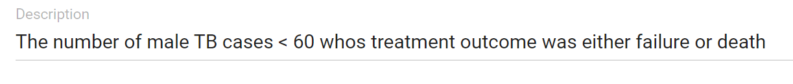

Aggregation type and analytics type remain the same.

The expression is also the same (V{event_count}). 

We do need to update our filter however.

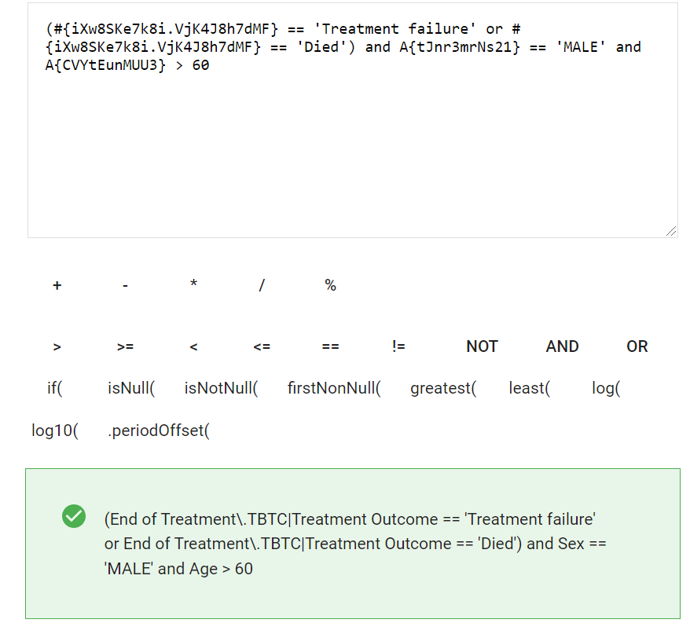

Let’s review what’s changed.

1. We introduced grouping by bracketing the or statement
2. We added two additional filters for age and sex using and statements

Note that if you are grouping multiple and/or conditions together to create a specific filter criteria, then you will need to use brackets. This acts as a sort of order of operations. Save the indicator after you have entered and explained the filter.

After we save this, we should be able to verify this indicator in data visualizer

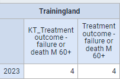

### STOP - Perform Exercise 3

## Create Enrollment Type Indicators

## Indicator 4 : Patients hospitalized the entire treatment

### Conceptualize the indicator

We want to COUNT the number of cases that were hospitalized in both the initial AND continuation phases. This means we are retrieving data from 2 program stages. 

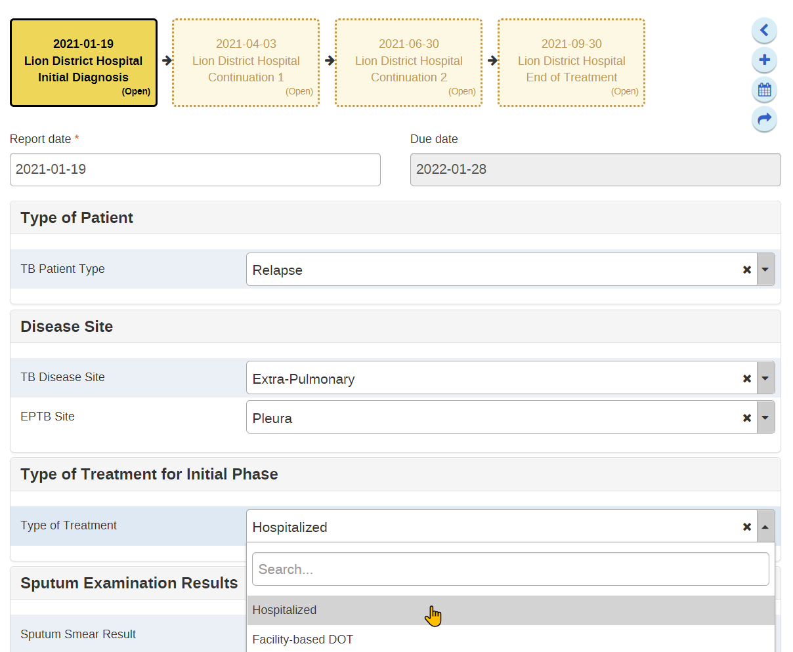

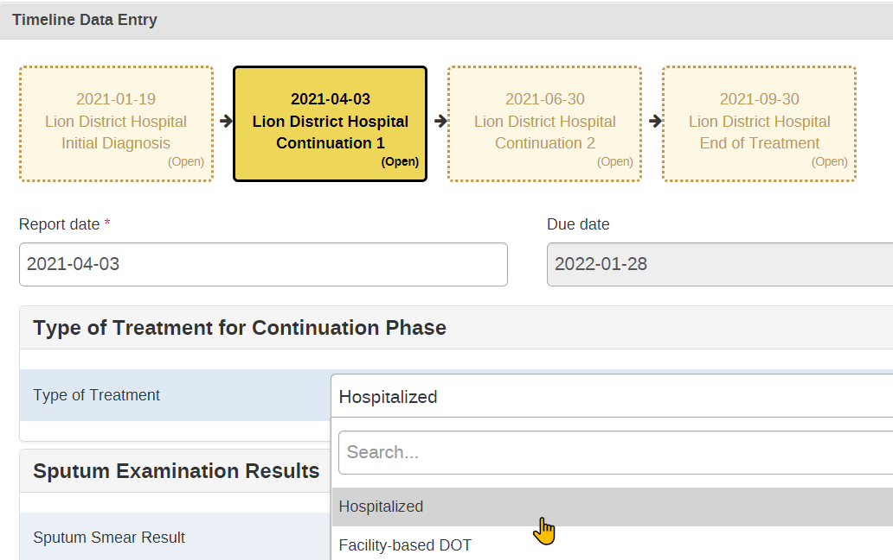

### Edit the indicator details

Navigate to maintenance -> Indicator-> Program Indicator

Select “TB Treatment Card” as the program


### Add a new indicator and edit the program indicator details

Select the blue plus sign to add a new indicator. 

First, edit the name, short name and code details.

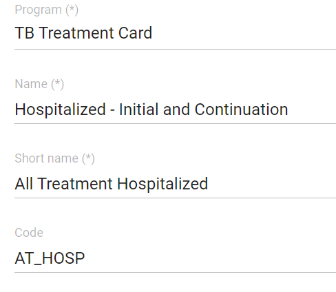

Skip color and icon
Next, add a description. 

Review the aggregation type, what are we trying to do with this indicator? We want to COUNT the number of cases that were hospitalized during both the initial and continuation phases od treatment. 

Review the analytics type. Now we need data from more than one stage, so our analytics type will be ENROLLMENT!


```
In this particular example, we are creating an enrollment indicator which calculates and displays its information. Note that you can also create a program indicator that calculates the number of enrollments that meet certain criteria. This may be useful if, for example, you want to use data elements with options sets from multiple program stages within the same program in order to filter out the number of enrollments in calculating your indicator. Make sure you let the participants know this, as this will be part of their exercise. 
```


After selecting the analytics type, you will see “Analytics period boundaries.” Leave these all as default, we will not cover them in this academy. You can learn more about them in the [docs](https://docs.dhis2.org/en/use/user-guides/dhis-core-version-master/configuring-the-system/programs.html#about_program_indicators).  

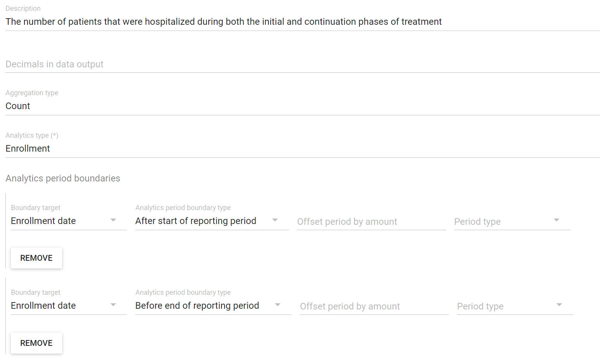

### Edit the expression

Select the expression tab in order to edit the expression. This is where we define what we want to happen mathematically. 

In this case, we can use a simple variable, called enrollment count, to define our expression. We are no longer counting events, but enrollments, as we want to combine information across the enrollment and then evaluate it using our filter.

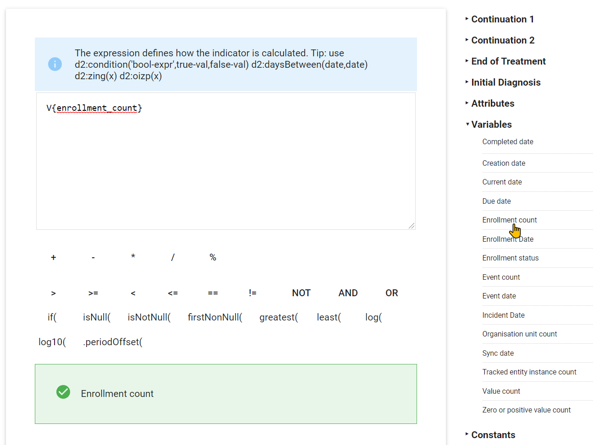

### Edit the filter

Select the filter tab in order to edit the filter. Here we define what criteria we want to include in our mathematical calculation. We want to count events, but which ones? In our case, those where the treatment outcome is either treatment failure or died.

Type of treatment is included in both the initial and continuation 1 program stages. Data elements we put into our expression include identification of which program stage it belongs to. This allows us to combine and evaluate data from multiple program stages.

In program indicators, options are identified via their code within an option set. In this example, the name and the code are the same, but if you are not familiar with the metadata, it is usually a good idea to check the code of the option you are using.

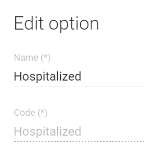

### Edit the expression

Let’s review the expression

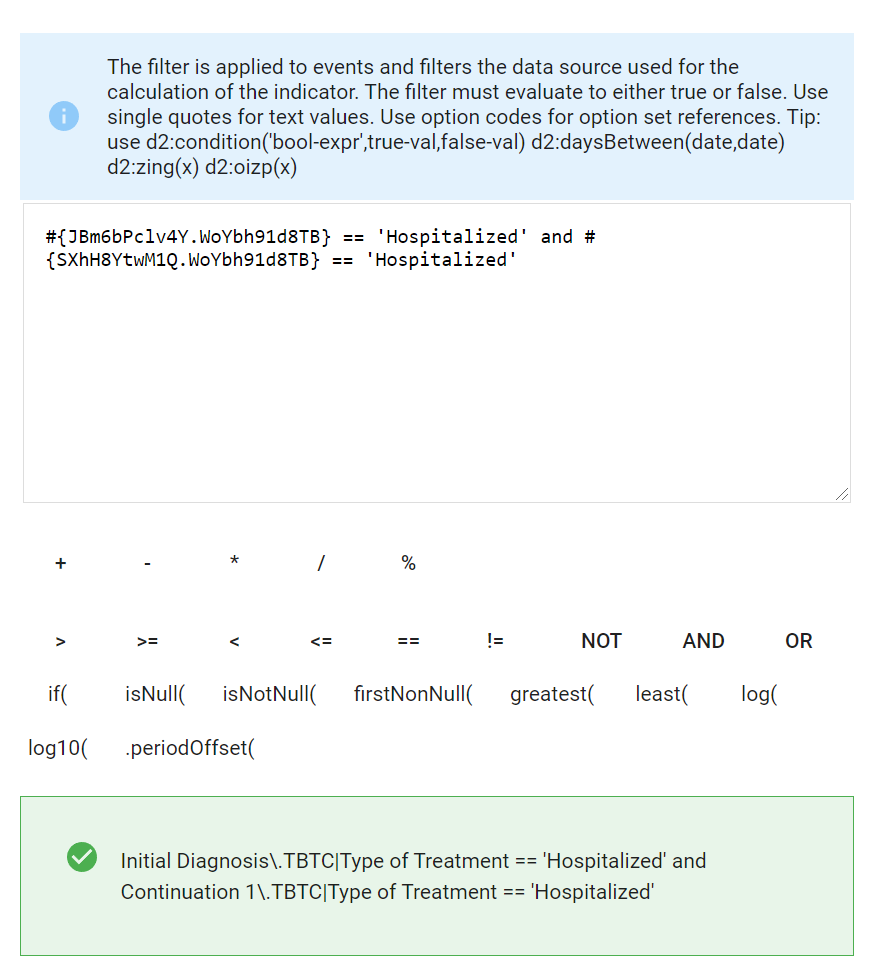

The data elements in our expression are identified as {program stage.data element}. We can see we have the same data element, but the program stage id is different. We can also see this in the green verification box below.

### Test the program indicator

Now that you have created the program indicator, it is a good idea to test if it is functional. You can compare the properly configured indicator with the one you have created to ensure that the value is correct. In order to do this you can navigate to the pivot table app.

### Navigate to the data visualizer app 

Create a new pivot table with the following details

* Data : the program indicator you made, the program indicator “Hospitalized - Initial and Continuation”
* Period : This year
* Organisation Unit : Trainingland

Click on update to verify that the values are equal in the indicators. This will provide some validation that the indicator is created correctly.

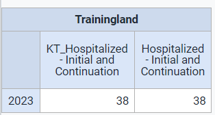

### STOP - Perform Exercise 4

## Indicator 5 - Change in Weight

Navigate back to Indicators -> Program Indicators and click on New to create a new indicator


**Program: TB Treatment Card**

### Conceptualize the indicator

Create a program indicator which calculates the difference in weight between the initial diagnosis and end of treatment. This should only be calculated on the condition that the culture result is negative and the treatment outcome is either cured or completed.


### Edit the program indicator details

After selecting the plus sign, ensure the program you are working with is selected. Fill in the details as follows (replace your initials with the ones in the screenshot). Note in this case you are using “Enrollment” as the aggregation type. This type of program indicator calculates the indicator using parameters across the entire enrollment, rather than within an event. 

We want this indicator to calculate on the fly and then be displayed directly in tracker capture. In order to accomplish this, ensure that “Display in form” is checked.

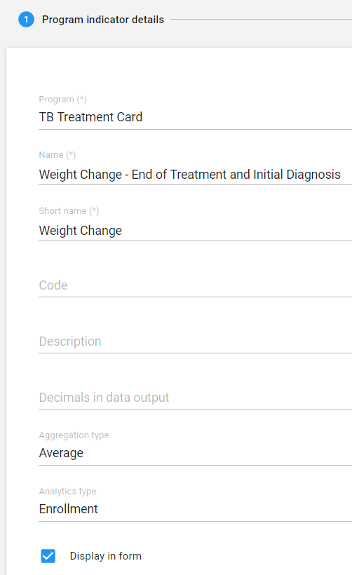

### Edit the expression

Select edit expression from the timeline menu

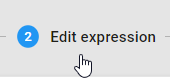

For the expression, you want to take the difference between the weight during the end of treatment stage and the initial diagnosis stage. TB tends to cause additional weight loss often, and after treatment they should hopefully gain some of this back. 	

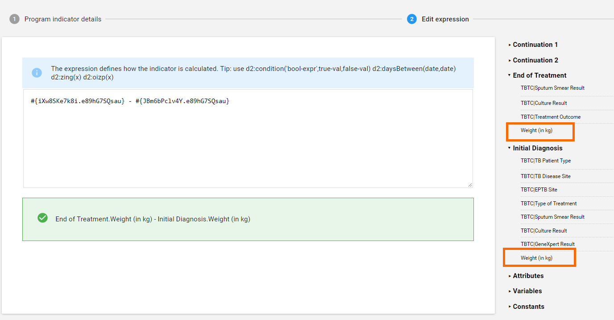

### Edit the Filter

Select edit filter from the timeline menu

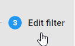

We are now going to create our criteria which will filter out the events required (culture result is negative and the treatment outcome is either cured or completed).

When we set criteria within a filter using option sets, we must use the option code. The option code may be different than the name, We will have to set three criteria using the available data elements from the program:

* Culture Result == ‘Negative (0 colonies)’ and 
* Treatment Outcome == ‘Cured’ or Treatment Outcome == ‘Treatment completed’

You can select the data elements from the right side menu as before. In the filter box, you will see the programuid.dataelementuid in the expression. Underneath in the green box, you will see this represented in plain text which is easier to decipher. 

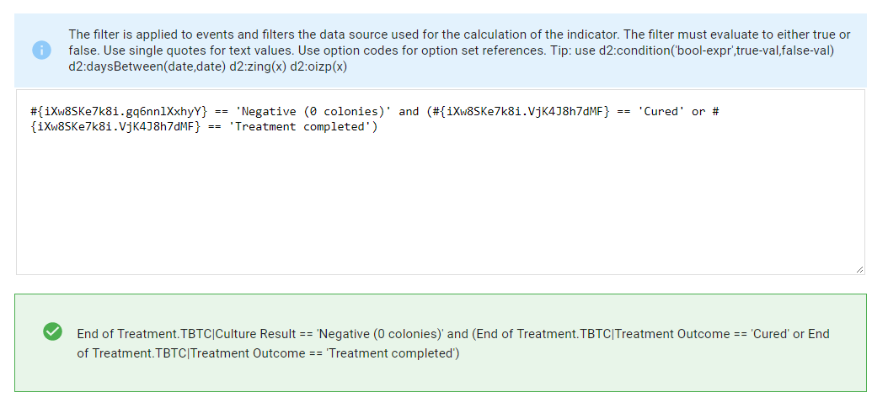

Notice how the **or** condition is contained within brackets. This is required to ensure the filter runs properly. Note that if you are grouping multiple and/or conditions together to create a specific filter criteria, then you will need to use brackets. Save the indicator after you have entered and explained the filter.

### Test the program indicator

Navigate to tracker capture in this case to test the program indicator. Clear your cache if you have accessed the program already.

Select any Facility that has the TB Treatment Card program.

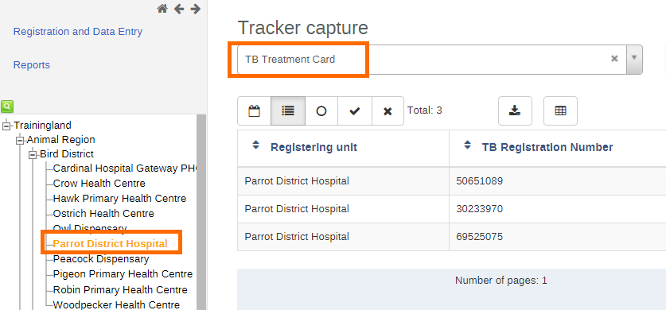

Proceed to register a new TEI. Click on Save and continue when the details are entered. You may want to select a report date that is ~5-6 months back from the current date as this is the average difference between the initial diagnosis and end of treatment stages.

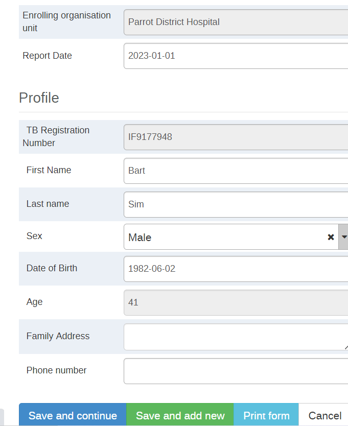

In the tracker dashboard, you will see a space for indicators as well as the timeline data entry. The weight indicator will appear when the filter meets your criteria that was set earlier 

* Culture Result == ‘Negative (0 colonies)’ and 
* Treatment Outcome == ‘Cured’ or Treatment Outcome == ‘Treatment completed’

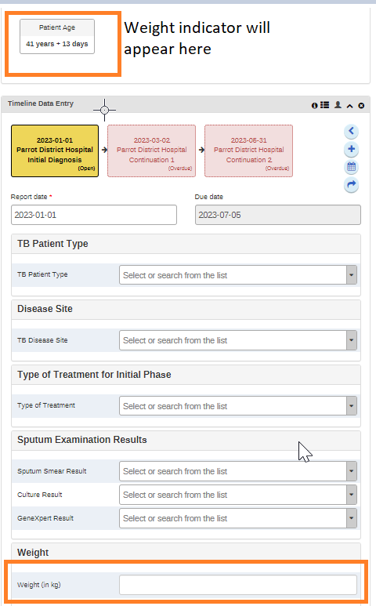

To get started enter a weight value in the **Initial Diagnosis** stage

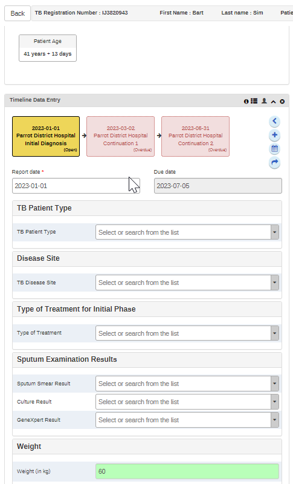

Than add an event for the end of treatment stage

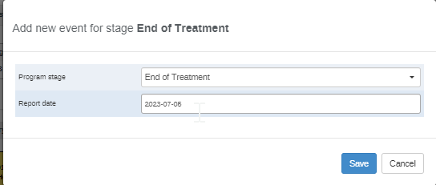

Enter a weight value, select **negative **as the_ **culture result**_ and select either **Cured** or **Treatment completed** as the **_treatment outcome_**. 

**Note to the participants that the weight indicator does not appear unless these criteria are met.** 

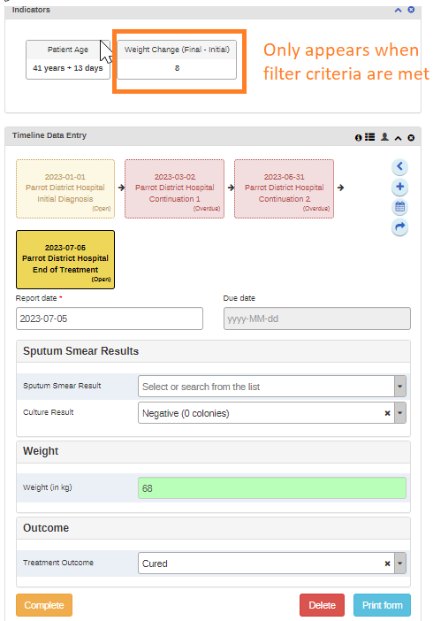

### STOP - Perform Exercise 5

## Creating Combined Indicators

## Indicator 6 : TB Incidence rate per 100,000

After you have made a couple program indicators, it is a good idea to show the participants how to create combined indicators. This would have been discussed briefly in the program indicators presentation. Here we can take program indicators and combine them with aggregate data elements to make indicators as required. We do this by using the regular indicators app.

### Conceptualize the indicator

We want to calculate the TB incidence rate per 100, 000 population. This is equal to:

(The number of new TB cases/Total Population) * 100, 000

If we break this down, 

1. We can retrieve the number of new TB cases from our TB treatment card program. We need to create a program indicator to retrieve this total
2. The total population is an aggregate data element that we might import into DHIS2 from a census or other estimation survey
3. We multiply the divided values by 100,000 to calculate our incidence rate


### Review the program indicator

A program indicator, TB new cases, has already been created as part of this demonstration. You can review it quickly to see the aggregation type, expression and filter.

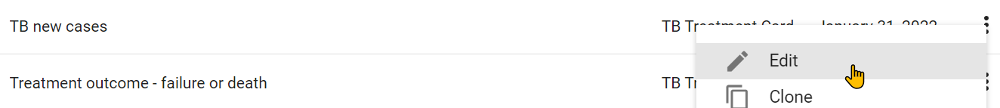

### Review the denominator

We can use the data element “Total Population” as our denominator. This already exists as a data element in our system and also already has data within it.

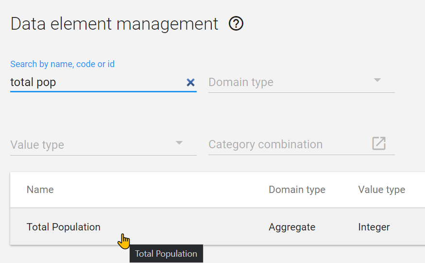

### Review the indicator type

We want to create an indicator with a factor of 100, 000. This already exists in our system and we can use it when we build our indicator.

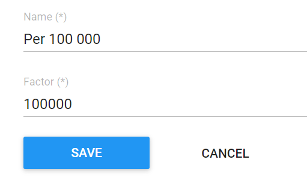

### Create a new indicator

Navigate to the indicator management page (Maintenance -> Indicator) and proceed to create a new indicator.

Add in the details of your indicator

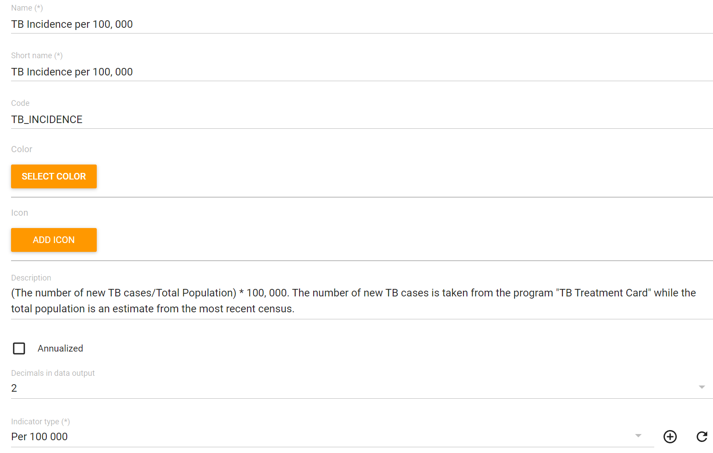

Here is an example description:

(The number of new TB cases/Total Population) * 100, 000. The number of new TB cases is taken from the program "TB Treatment Card" while the total population is an estimate from the most recent census.

#### Edit the numerator

I am able to select program indicators as a source here in the indicator management page.

Select 

1. Programs
2. TB Treatment Card
3. Indicators
4. The indicator TB new cases
5. Enter a description
6. Save

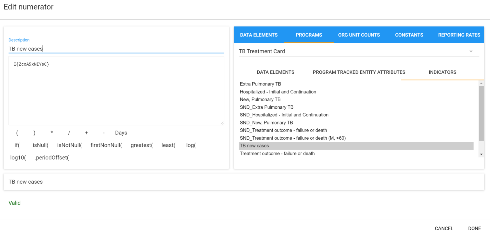

#### Edit the denominator

Select 

7. Data Elements
8. The data element Total Population
9. Enter a description
10. Save

### Save the indicator before proceeding

Allow the others to create the indicator than give everyone a break. You will need to run analytics before you can see the output of this indicator.

### Verify the indicator in data visualizer

Create a pivot table with the inputs:

1. Data:
    1. TB new cases (program indicator from TB treatment card)
    2. Total population (data element)
    3. TB Incidence per 100,000 (the indicator you just made)
2. Period : Last year
3. Org unit : Trainingland

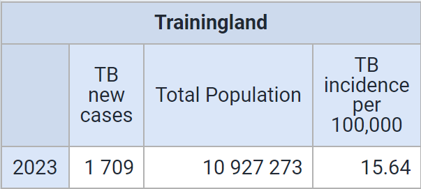

You can verify the calculation manually and see if the result is correct!

### STOP - Perform Exercise 6
