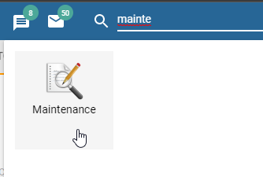
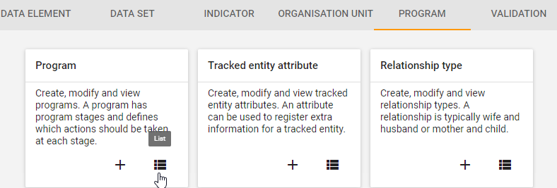
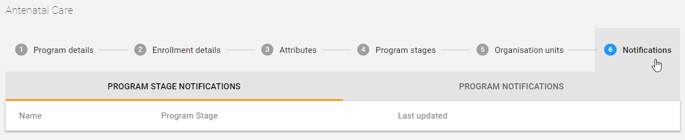
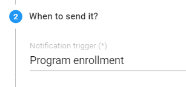
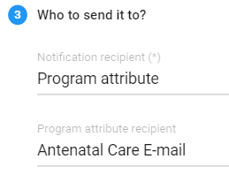
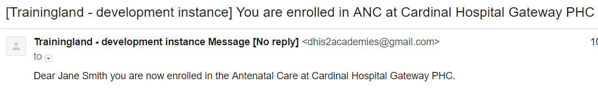
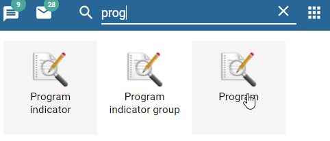
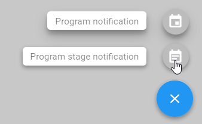

# **Trainer’s guide to Program Notifications**

**_Perform this on the DEMO instance using the ANC program_**

**What is this guide?**

This guide is a support document for DHIS2 Academy trainers for the session “Program Notifications.” This session follows the standard Academy training approach with 
1. a live demo session where the trainer demonstrate and explain how to create program reminders, and 
2. a hands-­on session with exercises where participants get to create program reminders.

This guide will help the trainer​ prepare​​ for the live demo session. The “Live Demo step by step” section has a detailed walkthrough of all the steps to demonstrate with explanations and screenshots that should be easy to follow. Use that when preparing for the live demo session.

There is also a Quick Guide which lists the steps very briefly and this is meant as a lookup

guide or “cheatsheet” WHILE doing the demo, to help the trainer remember all the steps and the flow of the demo.

**Background**

Program reminders allow for system managers to further customize a responsive system that is able to send reminders following program management needs, guidance and protocols. 

In this demo, the demo program that has been created will be used to demonstrate the features of event capture.

**Preparation**

In order to run this session, **_if you want to send SMS or email, you need to have both e-mail settings and an SMS gateway configured_**. Additionally, **_you will need to be connected to the internet_**. If you are using a local server only, then you can show the notification being sent to the messages page within DHIS2 rather than an external method.

You will also need a method to project your phone through the projector in order to show participants the SMS. Scrcpy is a flexible way to do it for Android [https://github.com/Genymobile/scrcpy](https://github.com/Genymobile/scrcpy) 

## Learning objectives for this session

The overall objective of this session is to describe the usage of building and using program reminders in DHIS2. Detailed objectives include:

* Describe what program notifications are
* Identify when to use reminders
* Create reminders at the program and program stage level
    * Understand how template messages populate when notifications are sent
    * Understand the different types of recipients that can be specified to receive notifications

## **Time Requirements**

Live Demo: 45 minutes

Hands-on Exercises: 45 minutes

## **Quick Guide**

1. Explain the purpose and different types of reminders
2. Create a program notification at the program level that sends a notification within the Antenatal Care program to the mother upon enrollment via e-mail
3. Explain the different sending options/recipients and the template messages you create the program notification
4. Show that the notification works by enrolling a new mother in the program and showing the received E-Mail & SMS (The SMS notification has already been created for you; it is a copy of the e-mail notification)
5. Create a program stage notification at the program stage level (ANC visit) that sends a notification 2 days before the scheduled due date to the mother via SMS

## **Live Demo step by step**

In order to create a program reminders, we can follow these general guidelines:

1. Identify the program to used to configure program reminders
2. Identify the different types of reminders and when they should be sent out by the system

## Part 1

### Show an example of a program level notification

NB: The email config needs to be working to show email. This is set up in both  DEMO and CUSTOMIZE for the participant.

Learner’s can try this example in the DEMO system.

Register a new person into the ANC program. Use your own email.

You should receive an email

## Part 2

### Configure the program notification you have shown

**_(it will already exist in DEMO, so you will need to delete it; than you can recreate it)_**

For this demo and exercise, the learners can use the tracker program created in the tracker configuration graded assignment (the ANC program) as it will be used to demo the different reminders.

_Create a notification template for the ANC program created in the previous exercise that notifies the mother by e-mail that she is registered in the program._

Log into the customize instance and go to Program maintenance

Select the Antenatal Care program then select “Notifications” from the top bar menu.

Click on “+” in order to add a new notification Program notification.

Enter the program notification name and enter the message details

The message window allows for customization of the reminders including parameters to personalize the message e.g adding the name (Last name) of the tracked entity, where they are registered (Orgunit) and when the appointment is due (due date).

==>Enter the message template  **“Dear _First name_ _Last name_ you are now enrolled in the _Program name_ program at _Orgunit name_”**

Specify when to send it

**NOTE:**

* Days scheduled allows for specifying the number of days after enrollment or incident date that the message is going to sent
* Program completion will only send the reminder when the enrollment is completed
* Program enrollment will send the reminder when a tracked entity is enrolled into the program

==>Select **Program enrollment**

Specify the recipients of the reminder

Explain the different recipients that are available (also explained in the presentation). 

    
You will notice different fields pop-up depending on the recipient type that is selected. For example, if user group is selected then the different user groups available in DHIS2 will be available for selection.

You are now able to specify the program attribute that you want to send a message to. This allows you to, for example, send a different messages to different numbers using the same enrollment.

==>Select “**Program attribute”**

==>Select “**Antenatal care E-mail”**

This will send the message to the e-mail that is entered during enrollment.

Save the reminder by clicking on Done than Save.

### **Test the program notification in tracker capture**

Navigate to tracker capture and select an org unit at the facility level as well as the Antenatal Care program. Proceed to register a new mother.

After registration, check the email that you entered. You can show them the program notification has been sent.

## Part 3

### **Notification 2 : Creating a reminder based on program stage**

Notifications can also be set on within a program stage.

  _In this demo part you will configure a template that will be used to send appointment reminders 2 days before the due date._

1. Log into the blank instance and go to Program app

2. Click on Program and select the Antenatal Care program. Select “Notifications” from the top bar menu.

3. Click on the “+” sign followed by Program stage notification

4. Create the message

5. Decide when the message will be sent

6. Specify the recipients

While not possible to show this reminder being sent, this example is to show participants how to create a schedule based notification when necessary. 

## Part 4

### **Configuring the time when messages should be sent out (Scheduling)**

When your scheduled jobs run, all the messages scheduled to be delivered in the next day will be prepared and OUTBOUND (pending sending at the scheduled delivery time)

You will need to set the time when you want the messages delivered to the intended recipients. This is done using a CRON expression. While several preset times are available in DHIS2, you may also want to use your own expression.

1. Navigate to the scheduler app

2. Add in the details when you would like these sent out and click on “Add Job” in order to add this to the scheduler

