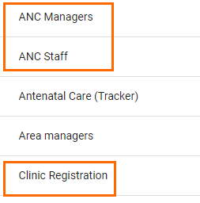
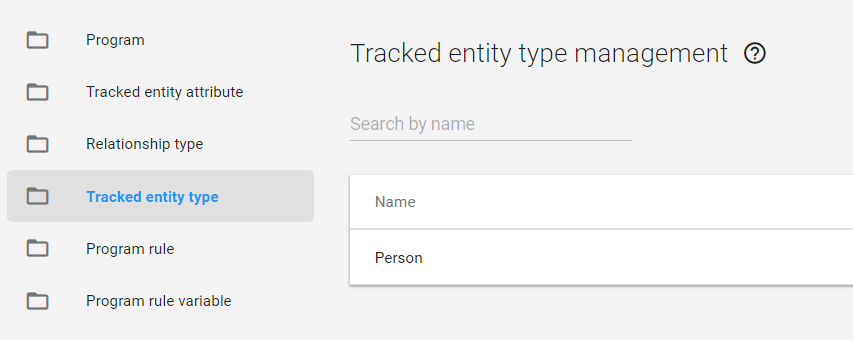
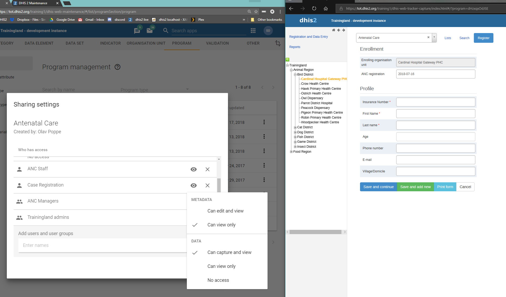
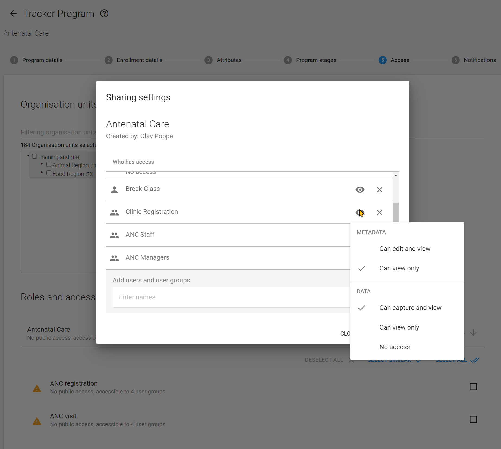

# **Trainer’s guide to Sharing - Part 2**

## Perform this in the “DEMO” system.

**What is this guide?**

This guide is a support document for DHIS2 Academy trainers for the session “Sharing and user groups.” This session follows the standard Academy training approach with 1) a live demo session and 2) a hands-­on session with exercises 

This guide will help the trainer​ prepare​​ for the live demo session. The “Live Demo step by
step” section has a detailed walkthrough of all the steps to demonstrate with explanations and screenshots that should be easy to follow. Use that when preparing for the live demo session.

There is also a Quick Guide which lists the steps very briefly and this is meant as a lookup guide or “cheatsheet” WHILE doing the demo, to help the trainer remember all the steps and the flow of the demo.

**Background**

Sharing can be used in order to provide granular access to meta-data and data as of 2.29. This is a new concept and is an important consideration to define for any tracker implementation. This session shows the users how sharing settings can be configured and used in line with tracker programs.

**Preparation**

Everything in Trainingland has been configured already for you to use in this demo. Just follow the guide using the accounts listed and everything should work as intended.

## **Learning objectives for this session**

* Describe the sharing concept
* Explain the link between sharing and user groups
* Describe the difference between metadata and data sharing
* Identify the objects within a tracker program that can be shared
* Describe the concepts of program and program stage sharing
* Apply program and program stage sharing to your own program

## **Quick Guide**

1. Introduce the concept of data level sharing
    1. Discuss user groups and how objects can be shared with user groups in DHIS2
    2. Discuss the new sharing dialog and what each of these options does as it relates to tracked entity types, programs and program stages (use the [presentation](https://docs.google.com/presentation/d/1BwSMoxU8b84Zwz-xwUKswnhgbkg-l8azNJOUrgqh6OU/edit?usp=sharing) to help explain these items)
2. Review the sharing configuration of these 3 objects (tracked entity type, program, program stages) in detail, explaining how each of these sharing settings affects what the user can do

## **Live Demo step by step**

In this demo we will show what sharing settings have been applied to the tracked entity type, program and program stages in order to allow for the different level of access for each of the users for the ANC program shown in [Part 1](https://docs.google.com/document/d/1w4Oufeq41IdTNJ9a0Ofu4JbBnAKvS6nu5SmDMvejw7E/edit?usp=sharing) of the demo. We can refer back to our discussion on user roles to then understand how we combine these concepts to assign the appropriate level of access we require. 

### Part 1 - Introduce data level sharing

We will now review the concept of data level sharing in more detail as it applies to tracker programs. In particular, we will discuss 3 objects in detail:

1. Tracked Entity Types
2. Programs
3. Program Stages

These 3 objects have both meta-data and data level sharing applied to them. In most instances (unless everything is public) sharing of these items will have to be configured in order for users to access different parts of the program correctly. 

Sharing generally works within the intersection of these 3 concepts in DHIS2:

1. The user role assigned to a user (already covered)
2. The user group in which the user belongs to
3. The sharing settings themselves

We can traditionally think of user groups as defining how outputs are shared (dashboards, tables, maps, etc.) but we can also use both meta-data and data level sharing to restrict what a user has access to in quite a bit of detail.

### 2.1 - User Groups

We have covered user roles, now we can discuss user groups in a bit more detail. Navigate to the user groups part of the application. There are 3 user groups we can focus on here as related to the ANC program:

1. Clinic Registration
2. ANC Managers
3. ANC Staff

These 3 user groups contain the same users that were discussed earlier, linked to the various functionality that has already been demoed. We can use these groups to share reports/outputs, but also to share meta-data and data which is what we will do in this case.

Creating a user group is very easy. 

1. Select the blue plus sign to add a new group
2. Assign the group a name (and code if you want)
3. Save the user group

We assign these user groups to our user in order to apply the correct sharing settings to them. If we review the user “ANC Staff” we can see they are assigned to a user group.

This allows us to use these user groups to assign sharing permissions to any user assigned to the group.  

### 2.2 - Data Level Sharing

Slides 2-4 explain specific permissions for data level sharing for different tracker specific objects: [https://docs.google.com/presentation/d/1cpYTy_rkAqhVp6zHZqUrcUrb7UCEdOFBwYcTej4tqwA/edit?usp=sharing](https://docs.google.com/presentation/d/1cpYTy_rkAqhVp6zHZqUrcUrb7UCEdOFBwYcTej4tqwA/edit?usp=sharing) 

Go to “Tracked Entity Type” and open the sharing dialog for the tracked entity type of “Person”

We can see that all 3 user groups we have discussed have some sharing settings applied to this item. Select a user group in order to open its sharing settings. You will see this is separated into **METADATA** and **DATA.**

**METADATA** sharing determines if a person can edit (for example, updating its name or changing another parameter, note that they would need the proper user authorities/user role assigned to them on top of this sharing setting) and view an object or only view the object (see the object in various apps). 

**DATA **level sharing takes this one step further and determines, in specific detail, what a person can do with the data that is linked to the object. You can move over the [presentation](https://docs.google.com/presentation/d/1BwSMoxU8b84Zwz-xwUKswnhgbkg-l8azNJOUrgqh6OU/edit?usp=sharing) in order to explain data level sharing in more detail for each object.

### STOP - Perform Exercise 1

### Part 3 - Reviewing the configuration

In order to understand how we have achieved the various levels of access for each of the users demoed in Part 1, we can review each object type and determine what level of sharing settings these users have. Note that this may be in addition to meta-data sharing that has been applied to data elements or other meta-data in the system. This will not be covered in detail at this stage due to time limitations. 

**_Review each of the 3 items (tracked entity type, program, program stage) through the maintenance user interface_**for each of the user groups for the Antenatal care program and discuss what the data level sharing access as configured provides to the user groups they are shared with. 

It may also be helpful to have three browser windows open, logged into the 3 users you are discussing the sharing settings for (for example, one incognito window, one chrome window, one firefox window and one edge window will allow you to achieve this). You can then alternate between the explanation and showing what the user can do (similar to demo 1 but now with the maintenance explanation). This will allow the user to see how certain sharing settings are reflected within DHIS2. These are the login details of the 3 users.

1. Case registration user : casereg/District1#
2. ANC staff member : ancstaff/District1#
3. ANC manager : ancmanager/District1#

Here is an overview of the sharing settings that are applied to these 3 groups (remember to show this through the UI and not just list it so others can investigate/follow along). 

<table>
  <tr>
   <td>Object
   </td>
   <td>User Group
   </td>
   <td>Data Level Sharing Setting Explanation
   </td>
  </tr>
  <tr>
   <td rowspan="3" >Tracked EntityType
   </td>
   <td>Clinic Registration
   </td>
   <td><strong>Can capture and view:</strong> allows the user group to view all tracked entity data related to a person and enroll a person into DHIS2. In this case, it allows front desk staff to add new people to the system.
   </td>
  </tr>
  <tr>
   <td>ANC Staff
   </td>
   <td rowspan="2" ><strong>Can view only:</strong> Can view tracked entities of type person; they can not alter this data
   </td>
  </tr>
  <tr>
   <td>ANC Manager
   </td>
  </tr>
  <tr>
   <td rowspan="4" >Program
   </td>
   <td>Clinic Registration
   </td>
   <td><strong>Can capture and view:</strong> allows this user group to enroll users <strong>INTO</strong> the ANC program; without access to capture data for a particular program, users with “can capture and view” for the tracked entity type can only register new entities with no program
   </td>
  </tr>
  <tr>
   <td>ANC Staff
   </td>
   <td><strong>Can capture and view: </strong>allows this user group to delete enrollments, update existing tracked entity information, and delete enrollments. They can not register new entities though, due to the sharing settings they have for the tracked entity type
   </td>
  </tr>
  <tr>
   <td rowspan="2" >ANC Manager
   </td>
   <td rowspan="2" ><strong>Can view only:</strong> allows the users within these groups to view the data associated with the program
   </td>
  </tr>
  <tr>
  </tr>
  <tr>
   <td rowspan="3" >Program Stages
   </td>
   <td>Clinic Registration
   </td>
   <td rowspan="2" ><strong>Can view only:</strong> these users can view the data in <strong>BOTH</strong> data entry (tracker capture) and data analysis apps. They must have access to these apps via their user authority/role. As the clinic registration user does not have access to the analysis apps, they will only see this data via tracker capture.
   </td>
  </tr>
  <tr>
   <td>ANC Manager
   </td>
  </tr>
  <tr>
   <td>ANC Staff
   </td>
   <td><strong>Can capture and view:</strong> these users can view and edit the data in all of the program stages in data entry (tracker capture) <strong>and </strong>view the data in data analysis apps. They must have access to these apps via their user authority/role. In some cases, you may need different levels of access for each program stage and this can be controlled via sharing the stages differently within the program.
   </td>
  </tr>
</table>

For all three objects, the meta-data permissions are set to view only for these 3 user groups. This is so these users within these groups can see this meta-data but do not have permission to edit it. The “can edit and view” meta-data sharing setting is often reserved for administrators of the systems, and we can see that is the case here as well. 

When reviewing the sharing settings for the program and program stages, use the access tab within the program itself from maintenance and go through the user groups for the program and each of the stages.

### STOP - Perform Exercise 2
