# Learner's Guide to Capture (Android)

## What is this guide?

This guide contains all exercises and detailed steps to perform them related to capture app (android) session for the academy. Please perform each of the exercises when prompted to by your instructors.

## Learning objectives for this session

## Exercise 1

Before starting, login to the android app using your training instance

Username: android2

Password: District1#

### Review the maps display within the case based surveillance program

The android app will display the map screen in event or tracker programs that contain one or more of the following elements:

- Event coordinates/Polygon
- TEI coordinates/Polygon
- Enrollment coordinates/Polygon
- Tracked entity attributes type coordinate
- Data elements type coordinate

#### Open the map

To access the demo map open the Case based Surveillance program and wait for it to load the list. At the bottom you’ll see the navigation bar. Select the map icon to access the map (note, in order to use this feature, your program needs to be collecting the coordinate during registration).

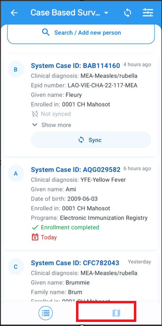

#### Cycle through the carousel

After opening the map icon, you will see TEI details at the bottom of the screen. This is referred to as the map carousel. You can scroll through all of the individuals registered in this program by scrolling the carousel horizontally.  The map will zoom into the selected coordinates. If there are no coordinates then a message will be shown. Each card in the carousel displays the tracked entity attributes marked as ‘Display in list’ when you configure your program. Click on the arrow to expand the card information. 

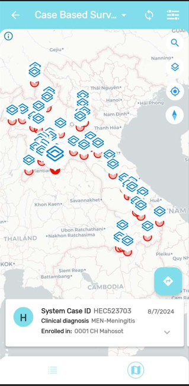

If the TEI contains an image as an attribute you will also see the picture instead of the Person icon. 

Click on the card to open the TEI dashboard

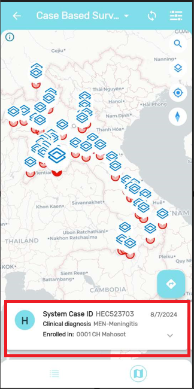 

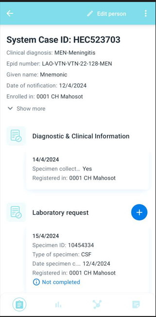

#### Navigate to the TEIs location (than switch back to the original maps display)

From the TEI dashboard, select back. This will take you back to the map. If the TEI or event has coordinates then a navigation icon will be displayed at the top right corner of the card. When you click it, your device will ask to select an app to open the location (if you have multiple maps apps, if not it will use the default one). This will take you to the location in the maps app you have selected.

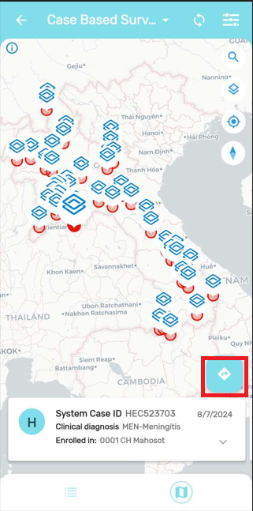 

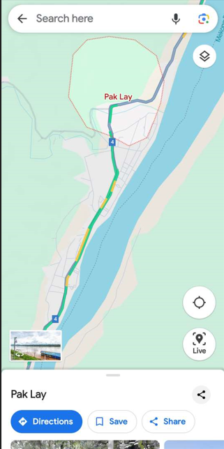

#### Change the map layers to show the heatmap and use the satellite **view**

Go back to the maps information in DHIS2 by navigating back to the capture app. By selecting the second button at the top right corner of the app, a menu will appear displaying all the possible layers.

Map layers you can see here include (depending on the configuration of the program): TEI coordinates, enrollment coordinates, Individual stage coordinates,  relationships, heatmap, tracked entity attributes of coordinate type, and data elements of coordinate type.

In the Case based surveillance program the app offers the TEI and Enrollment coordinate. Change the background layer and the add the heatmap to show how the map changes, click on the “Apply” button to the changes.

 

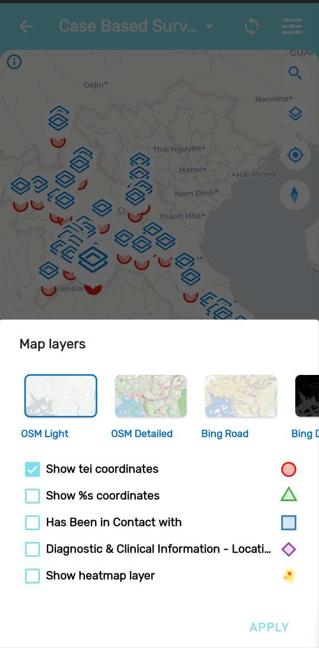 

#### Navigate to your location

Navigate to your location by selecting the location icon on the map

If the user grants location permissions to the App, the map will show the current location represented as a blue color dot. The maps in the DHIS2 Android Capture App now include the possibility to center the map on the users location.

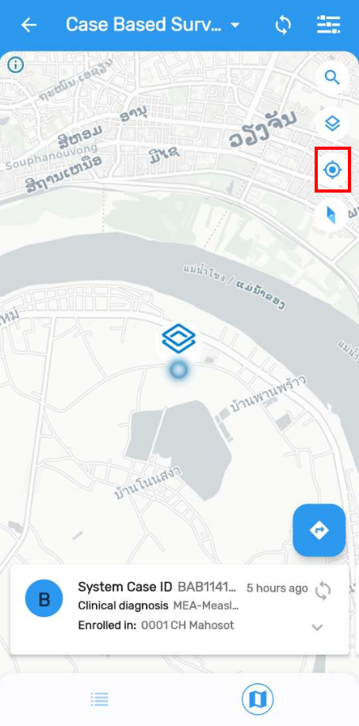

#### STOP! Have them perform Exercise 1 

### Review data element evolution charts within the Malaria case notification , investigation and response program

Exit the maps tab and go back to the list within a program. 

It is possible to display the evolution of data elements over time as charts, values or tables. It is important to explain that this analysis will be available only for numeric value types within a repeatable stage.

Select the Malaria case notification , investigation and response Program and search for the TEI “Alakazam Malakazama”

Open the Analytics menu in the TEI dashboard by selecting the graph icon in the navigation panel to show the chart.

The chart here shows the temperature of the person as taken from different repeated events within a program stage. In this example, you are seeing a person’s temperature in degree celsius. 

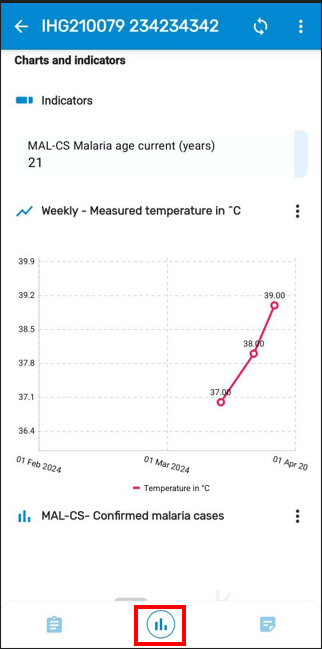

Explain it is possible to change the visualization to bars, line, table or single value

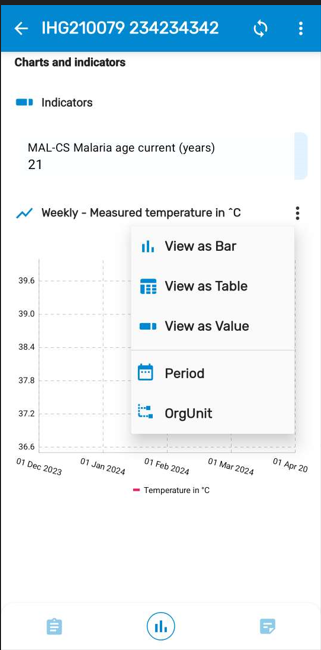

Filters are also available. Display the menu to see periods and organisation units available as filters.

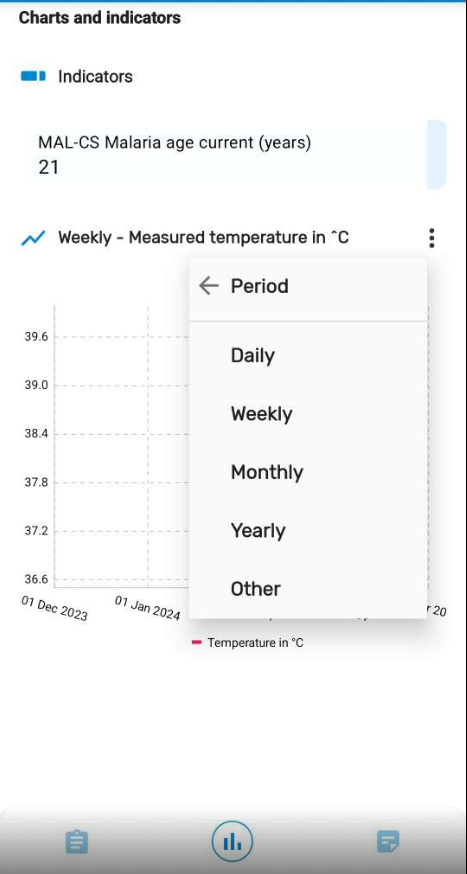

#### STOP! Have them perform *Exercise 2* in the learner’s guide.

### Review program indicators (within the Case-based surveillance program)

You can display any program indicator by enabling the “Display in form” feature when configuring your indicator. All program indicators are listed at the top of the screen. These also would have appeared within tracker capture on the web.

Open the Case-based surveillance program and search for 

Given Name : Fleury 

Family Name : Theo 

Selecth the Analytics menu in the TEIs navigation bar from their dashboard and explain that "Total Lab results" indicator counts the total number of lab results recorded for this single case. 

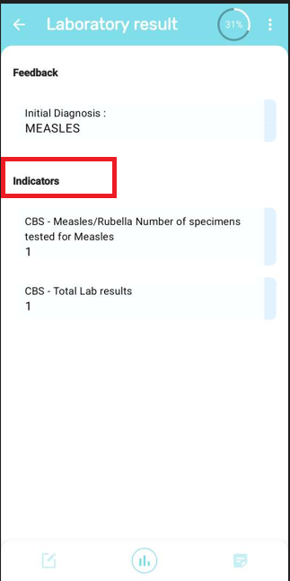

Note that you can also set up program indicators to work within an event. You would just select the analytics section from within the event, rather then from the TEI dashboard.

> **NOTE** 
>
> The Android App does not support customized boundaries for program indicators.

### Review program feedback within the Electronic Immunization Registry Program

Switch over to the Electronic Immunization Registry Program and search for the TEI “Maria Smith” Select the analytics tab after opening this record. You can also show other information in the analytics tab. This will include feedback or other information that has been configured to show on the tracker dashboard. 

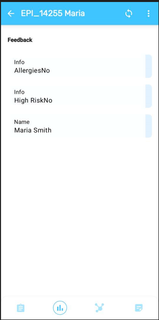 

#### STOP! Have them perform *Exercise 3* in the learner’s guide.

### Review program based dashboards

On an android device, you are able to review program dashboards, either on the home screen of android device or within each of the screens of the programs themselves.

You can get started by viewing a dashboard on the home screen. Do this by navigating to the home screen where all of your programs/datasets are listed. From here, select the analytics tab.

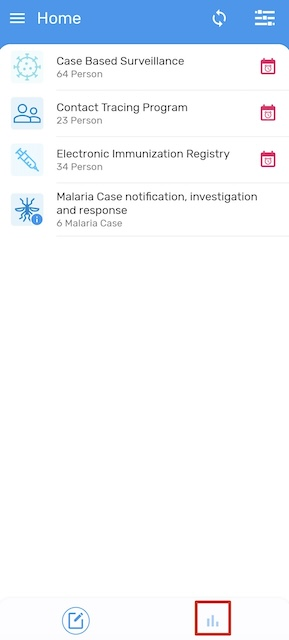

This will take you to the dashboard page. 

These dashboards use locally stored data and already made visualizations (in line listing and data visualizer) in order to populate visualizations on the android device. Since they only use the locally stored data, this means this dashboards are available completely offline.

> **Note:**
> 
> Already existing visualizations get added to these dashboards by someone who has the "ALL" authority using the android settings web apps. There are many limitations to the android dashboard that will be covered in an accompanying slide. If you want to see how these dashboards are configured, navigate to the android settings web app and under the analytics section view either the home or program tabs.

In the dashboard page, you will see the avaiable dashboards at the top of the screen. You can switch between them by selecting one at any time.

These dashboards only support a couple of chart types currently, this includes:
- Pivot tables
- Column Charts
- Line Charts
- Pie Charts
- Single Value Charts
- Line Lists

Let us start by reviewing the malaria case surveillance dashboard. It has both a pivot table as well as column chart on it. Both of these visualizations are reviewing cases by age distribution. The cases being shown are only those cases that are synced to the android device, based on the sync settings and the users assignment of org units.

These charts are interactive. By clicking on the menu icon of each visualization, you are able to modify the type of visualization and add period and org unit filters. 

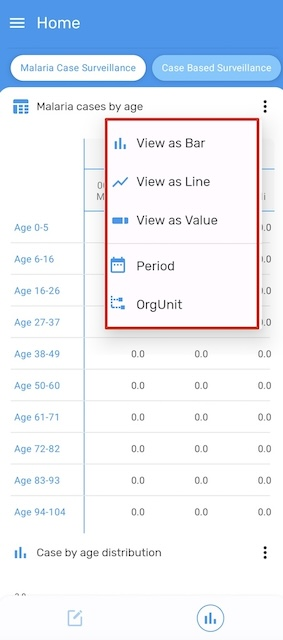

To switch dashboards, just select the dashboard you want from the top of the menu bar.

Navigate back to the home screen and select the case based surveillance program.

There is also an analytics menu available at the program level, as we can see is the case for this program.

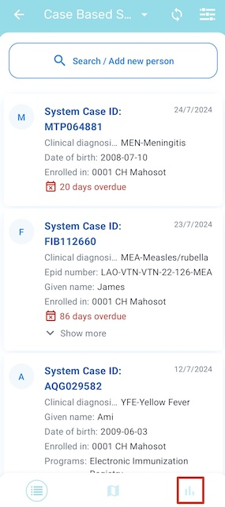

If we select it, we will be able to view dashboards associated with the program. In this case, the dashboard shown here is the same as what is available on the home screen, but you are able to configure different outputs to use at the program and home level if needed.

At this point, navigate back to slide 3 of the Android analysis presentation to review the limitations of android analysis items. 

When you have completed a review of these points, have them complete the exercise.

#### STOP! Have them perform *Exercise 4* in the learner’s guide.