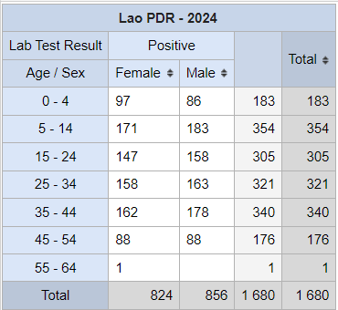
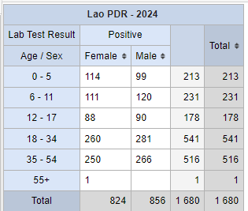
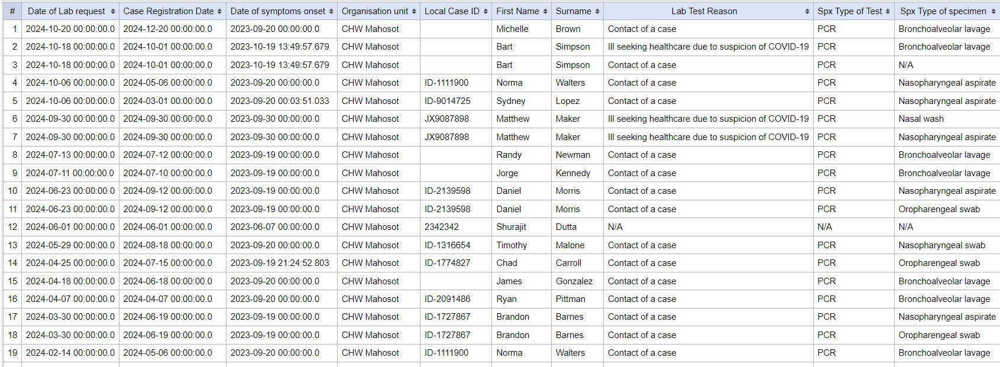
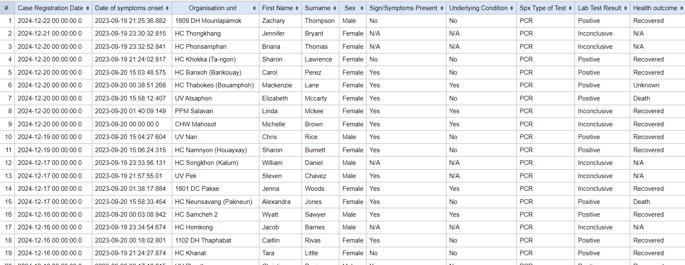

# Learner's Guide to Event Reports

## What is this guide?

This guide contains all exercises and detailed steps to perform them related to the use of event reports for the Tracker Use Level 1 academy. Please perform each of the exercises when prompted to by your instructors

## Learning objectives for this session

The overall objective of this session is to use the DHIS2 event reports app to review ***tracker*** data. Detailed objectives include:

1. Describe the functions of the event reports app
2. Explain the difference between event and enrollment type reports
3. Design event reports using tracker data
4. Describe the differences between how repeated and non-repeated stage data is displayed
5. Design event reports showing data from multiple tracker program stages

## Exercise 1

### Create an aggregate/pivot table event report using COVID-19 surveillance

Create an aggregate event report. You can use the following data items as an example:

- Table Style : Pivot, Output Type : Event
- Program : COVID-19 Case Based Surveillance
- Stage : Stage 3 - Lab Results
- Data : Lab Test Result (select Positive as the filter), Age (apply the Age COVID-19 Legend), Sex
- Period : This year
- Org Unit : Country

This is saved as "COVID_CBS - Confirmed cases by Age & Sex" for reference.

The layout can should like this

Note that you can modify the way data that is collected through tracker (and event) programs is aggregated. You can review this by changing the legend for the Age attribute to Age (COVAC) and updating the table.

You will see all the totals are the same; however the disaggregation of the data is different.

### Create a line list event report using COVID-19 vaccination

Create a new report by going to Favorites -> New and select the following details

- Table Style : Line, Output Type : Event
- Program : COVAC - COVID-19 Vaccination Registry
- Stage : Vaccination
- Data
  - First Name, Surname, National ID, Sex
  - Vaccine Name
  - Dose Number (Filter by 1st dose)
- Period : This year
- Org Unit : Country

Before updating the table, open the layout and move the items around in a logical order, noting how this will affect the output of the table.

Proceed to update the table and review what is being shown.
Modify the filters to see how the line list is updated

You will only see the data which meets this criteria

## Exercise 2

### Create a list type event report for a repeatable stage using the COVID-19 surveillance program

The data we will be reviewing to demonstrate this concept is taken from the following record:

- Org Unit : CHW Mahosot
- Program : COVID-19 Case-based surveillance
- Local Case ID : ID-5353942, First Name : Angela, Last Name : Campbell, Sex : Female

Note : here is the location of the org unit in case you are unfamiliar with this hierarchy (01 Vientiane Capital -> 0001 CH Mahosot -> CHW Mahosot)

Open up this record and navigate to the "Lab Request" stage within this program. Here you will see that there is more then one event assigned to the program. Over the next several demonstrations, we will discuss the difference of event vs. enrollment report types and how repeated stage data is affected by this selection.

Open up the different events within this stage and review the data that is there. The data will not be the same for each of these events making them easy to compare.

Keep tracker capture open on this record and open event reports in a new tab in case you need to refer to this record again.

We will now review how event and enrollment type reports handle this repeatable stage data.

Create an event report with the following inputs:

- Table Style : Line List
- Output Type : Event
- Program : COVID-19 Case-based Surveillance, Stage : Lab Request
- Data :
  - Local Case ID : ID-5353942
  - First Name
  - Surname
  - Lab Test Reason
  - Type of test
  - Type of specimen
- Period : This Year
- Org Unit : CHW Mahosot

Note : here is the location of the org unit in case you are unfamiliar with this hierarchy (01 Vientiane Capital -> 0001 CH Mahosot -> CHW Mahosot)

This should pull up the respective information for the two events that we saw when we reviewed this record in tracker capture. It is saved as "COVID_CBS - Lab Request Summary (Event)" for reference in DHIS2.

> When we are creating event reports and use "event" as the output type, ALL of the events from within a program stage will be output on our report. There is a limitation here in that we can only pull all of our event data from within one program stage, and as a result there are not really "linked" together as they are separate lines within our report.

We can further demonstrate this concept by adding more repeated event data. ***Modify the output so you are not filtering by any local case ID and update the report.*** Try sorting the data by Surname. Scroll through the report; you should see several repeated events displayed on this report.

> In summary, when running an event report with repeatable data using "event" as the output type, all of the event data from a single program stage will be used in the report!

### Update the report using enrollment as the output type

Change your output type to enrollment. Here are the selections to make for the remainder of the report

- Table Style : Line List
- Output Type : Enrollment
- Program : COVID-19 Case-based Surveillance, Stage : Lab Request
- Data :
  - Local Case ID
  - First Name
  - Surname
  - Lab Test Reason
  - Type of test
  - Type of specimen
- Period : This Year
- Org Unit : CHW Mahosot

This is saved as "COVID_CBS - Lab Request Summary (Enrollment)" in DHIS 2 for reference.

When we make this update, the number of records shown changes. This occurs because enrollment type reports only use the most recent event within a program stage for their output. When generating line list type data for repeated events they are potentially not as useful as there is a chance that you may miss some of the events when creating your list.

> In summary, when running an event report with repeatable data using "enrollment" as the output type, you will only see the most recent event data.

## Exercise 3

### Create an aggregate/pivot table event report using a repeatable stage

The same concepts that we applied to line lists are applicable to the data when it is aggregated. So, when event is selected as the output type it will count the number of events, including repeated events within a stage.

Let's review a very simple example

- Table Style : Pivot, Output Type : Event
- Program : COVAC - COVID-19 Vaccination Registration
- Stage : Vaccination
- Data : Sex, Vaccine Name
- Period : Last year
- Org Unit : Country

This is saved as the output "COVAC - Doses by sex." You can either create this report for extra practice or open it to review it.

Duplicate your tab and open the event report "COVAC - Registrations by sex." 

This report has all of the same data input selections but is using "Enrollment" as the output type instead of event.

What happens when we compare these two outputs?

The output "COVAC - Doses by sex" is useful in understanding how many actual vaccinations have been given, because the vaccination program consists of a program stage that is repeatable. This report is using "event" as the output type, meaning it will count or display data for all events in one program stage.

This is not so useful however if we want to identify the number of unique individuals that are currently in the vaccination program. The output "COVAC - Registrations by sex" shows this as it is only counting the number of enrollments based on the "Enrollment" output type that has been selected.

> In summary, the "event" output type always shows data for all events within a single program stage, while the "enrollment" output type will count unique registrations and will only use data from the most recent event in its output.

## Exercise 4

### Create a line list enrollment report using multiple stages from the COVID-19 surveillance program

Enrollment type reports have one last function that is very useful in addition to counting or displaying unique registrations. This is the ability of these reports to display data from multiple stages. Note that this can only be done for line list type reports, as having data from different stages is currently not built in to the pivot table style event report. This can be done using program indicators instead and is discussed in the program indicator analysis session.

When creating these reports, keep in mind the scenarios we went through previously and remember that ***the enrollment output type only uses data from the most recent event.***

So, using our COVID-19 case-based surveillance program as an example, where lab test and lab result are repeated stages, if we show data from these stages together, it will only show the data from the most recent entry from within either of these stages.  

Create an event report with the following inputs:

- Table Style : Line List
- Output Type : Enrollment
- Program : COVID-19 Case-based Surveillance
- Attributes
  - First Name, Surname, Sex
- Stage 1 - Clinical Exam
  - Underlying condition
  - Signs/symptoms present
- Stage 3 - Lab Results
  - Type of Test
  - Lab Result
- Stage 4 - Health Outcome
  - Health Outcome
- Period : This Year
- Org Unit : Country

This is saved as "COVID_CBS - Enrollment Summary" for reference.

What can we take away from this table?

We can clearly see that the data from each stage is being shown based on the data items that have been selected, but we must keep in mind that data from *Stage 3 - lab results* will be the most recent event data only. Applied more generally, any program stage for any other programs within an implementation using repeated stages will have this constraint when creating an enrollment type report.

If you are dealing with programs that do not have any repeatable events, then you will not need to worry about what the most recent event is when reviewing your information (as each program stage will only have 1 event).

Also, note the date. Each of these events that we have selected data from has different dates, but they are not displayed here. Instead we see the date of registration as well as the incident date (date of symptoms onset). These are the dates that are collecting during the registration/enrollment process; whereas reports with "event" as their output will display the dates of the particular event within a stage. We are not able to show these event type reports together as a summary using data from different stages however as we are able to when we run an enrollment type report.