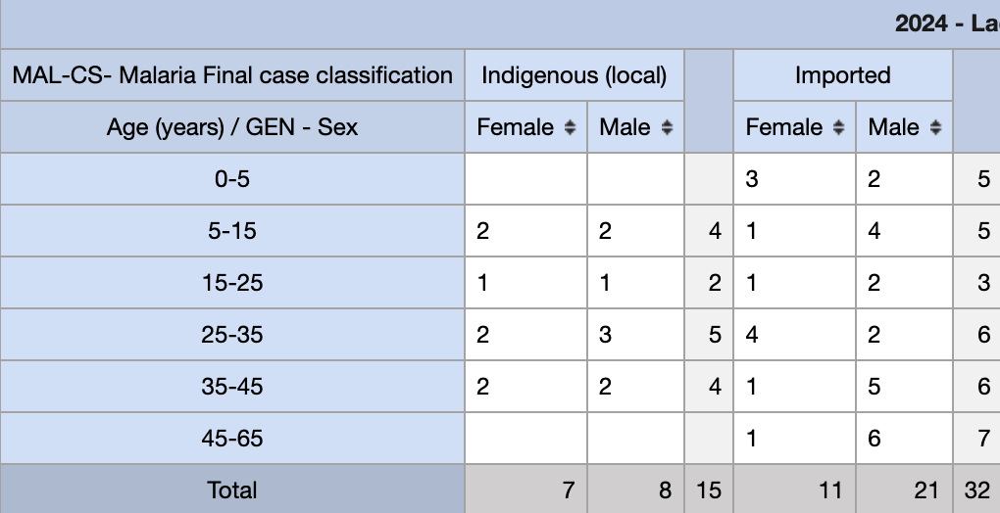
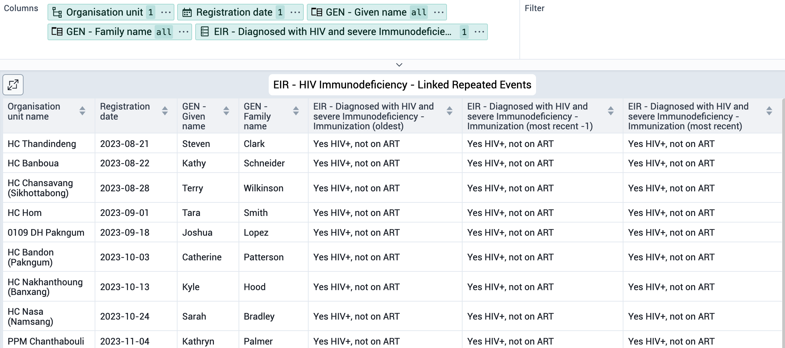
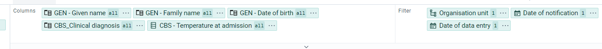
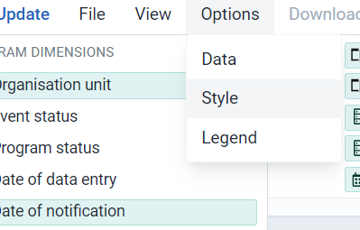
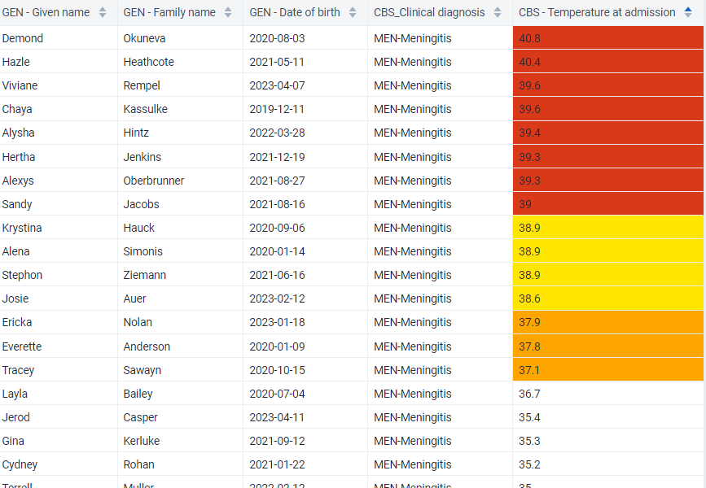

# Learner's Guide to Event Reports and Line List

## What is this guide?

This guide contains all exercises and detailed steps to perform them related to the use of event reports and Line List. Please perform each of the exercises when prompted to by your instructors

## Learning objectives for this session

The overall objective of this session is to use the DHIS2 event reports app to review ***tracker*** aggregate data and the Line Listing app to review ***tracker*** individual level data. Detailed objectives include:

1. Describe the functions of the event reports app
2. Explain the difference between event and enrollment type reports
3. Describe the functions of the line listing app
4. Design line listing reports using tracker data
5. Describe the differences between how repeated and non-repeated stage data is displayed
6. Design line listing reports showing data from multiple tracker program stages

## Exercise 1

### Create an aggregate/pivot table using the Malaria Case notification program in the Event Report App

Create an aggregate event report using the event reports app. You can use the following data items as an example:

- Table Style : Pivot, Output Type : Event
- Program : Malaria Case Notification program
- Stage : Stage  - Case Outcome
- Data : 
  - Malaria Final Classification (select Indigenious (local) as the filter), 
  - Age (years), Range Set = MAL-CS-Malaria age group
  - Sex
- Period : This year
- Org Unit : Country

The table should look like this after updating:

This is not exactly the table we want. We can make some adjustments to modify it.

Start with the layout. The layout can should like this

Next, hide any empty rows and n/a data using the table options.

Now you should see the the table following the layout we've intended.

Note that you can modify the way data that is collected through tracker (and event) programs is aggregated. You can demonstrate this by changing the legend for the Age attribute to Age (CBS) and updating the table.

You will see all the totals are the same; however the disaggregation of the data is different as the data has been seperated by new categorizations.

## Exercise 2

### Create a line list using an Electronic Immunization Registry.

Open the event reports app.

In this exercise we will create a line list using an Electronic Immunization Registry.

Create a new report by going to Favorites -> New and select the following details

- Table Style : Line list, Output Type : Event
- Program : Electronic Immunization Registry
- Stage : Immunization
- Data
  - Given Name, 
  - Family Name,
  - Unique System Identifier, 
  - Sex
  - EIR - BCG 0.05 mL
- Period : This year
- Org Unit : Country

Before updating the table, open the layout and move the items around in a logical order, noting how this will affect the output of the table.

Proceed to update the table and discuss what is being shown.

The table should look like this after updating

Modify the filters to see how the line list is updated

You will only see the data which meets this criteria

Save the line list.

## Exercise 3

### Create a line list program using Input : Event

Perform this exercise in the line listing app.

In this exercise we will create a line list using the Malaria case notification, investigation and response program.

In this case we will be using

- Input : Event 
- Select Program : Malaria case notification , investigation and response
Select Stage: Diagnosis and treatment
- Program Dimension: For this we will select the following program dimensions

  - Given Name
  - Family Name
  - Date of Birth
  - Local Case ID
  - Temperature
  - Recent travel within the country
  - Travel outside the country

- Select OU: 01 Vientiane Capital
- Enrollment date: Last 3 months

Your Dimensions should be assigned to the columns and the organisation unit to the filter.

Click on update. You will see the line list for a single stage.

 

## Exercise 4

### Create a list type event report for a repeatable stage using the Electronic Immunization Registry

Perform this exercise in the line listing app.

Create an line list with the following inputs:

- Input : Event
- Program : Electronic Immunization registry, Stage : Immunization
- Program Dimension :
  - Unique System Identifier (EPI) : EPI_12581
  - Given Name
  - Family name
  - Diagnosed with HIV and severe immunodeficiency

- Registration Date : This Year
- Org Unit : 0001 CH Mahosot

To make sure you get a specific record you need to Select EPI number and enter the ID (EPI_12581) to be used as a filter, as shown in the screenshot.

   

This should pull up the respective information for the two events that we saw when we reviewed this record in tracker capture

The table should look like this

   

Modify the output so you are not filtering by any Unique System ID and update the report. Try sorting the data by surname. Scroll through the report; you should see several repeated events displayed on this report.

   

Update the report using enrollment as the output type.

As a reminder, here are the selections to make

- Input : Enrollment
- Program : Electronic Immunization registry, Stage : Immunization
- Program Dimension :
  * Unique System Identifier (EPI)
  * Given Name
  * Family name
  * Diagnosed with HIV and severe immunodeficiency

- Registration Date : This Year
- Org Unit : 0001 CH Mahosot

When we make this update, the number of records shown changes. This occurs because enrollment type reports only use the most recent event within a program stage for their output.

## Exercise 5

### Create a line list program using repeated event data linked together

Perform this exercise in the line listing app.

Follow these steps to create this line list. (clear the table by going to File-> New to get started.)

- Input - Select Enrollment
- Program - Electronic Immunization registry

   

- Program Dimensions
  - Family name
  - Given name
  - Data Element "Diagnosed with HIV and severe immunodeficiency," where you will be able to see conditions and Repeated event tabs.
  - Filter - Select Yes HIV+,not on ART as your filter in the conditions tab.

  
  - Click on the Repeated Events tab and select the values for the most recent and oldest events
  
 In this case we are selecting
- Most recent events : 2
- Oldest events : 1

   

- Period : Date of Registration: Last 12 months
- OU : user org unit

Once you Click on update, you will see the below observation.

 
## Exercise 6

### Create a line list program using Input : Enrollment

Perform this exercise in the line listing app.

Follow the steps to create this line list 

- Input -  Enrollement

   

- Program: Case based Surveillance

   

- OU : Lao PDR, Facility - Level 3

- Period - Date of notification: This Month and Last 3 Month

- Data elements- 
   Stage 1 : Diagnostic and clinical information
   * Cough
   * fever
   * Difficulty in breathing
   * Temperature at admission

   Stage 2: Lab Request
   * Date Specimen collected
   * Date Specimen sent to laboratory
   * Type of Specimen

   Stage 4: Final Classification
   * Final classification

Click on Update 

## Exercise 7

Perform this exercise in the line listing app.

### Create a line list program using legends

Follow these steps to create this line list.

- Input : Event

- Program : Case-based Surveillance
    - Stage: Diagnostic and Clinical Information

In the program dimensions tab
Select the Attributes:
     
* Given Name
* Family Name
* Date of Birth
* CBS_Clinical Diagnosis

 Select Data Elements:
* Temperature at Admission

- Organization unit 0201 DH Phongsali

- Period - Date of notification Last 3 months

**Options** > Go to Legend 

   * Enable use a legend for table cell colors
   * Legend style: Legend changes backgroung colour
   * Legend type: Choose a single legend for the entire visualization
   * Legend : Select pre-defined legend set "Fever"

Click on Update to see the below table

You can also see the legend key is you select show legend key on the side bar.

