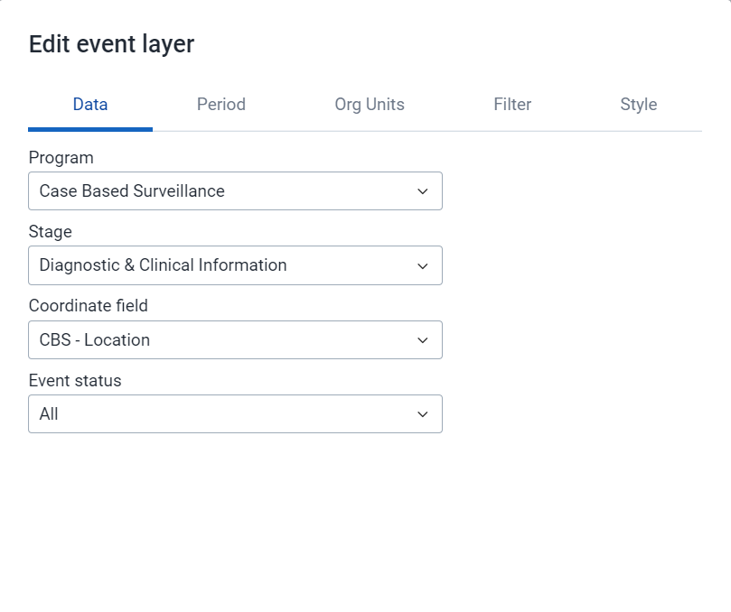
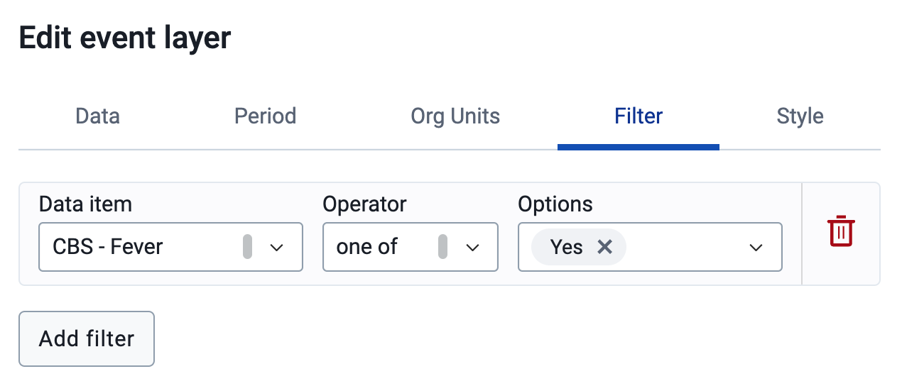
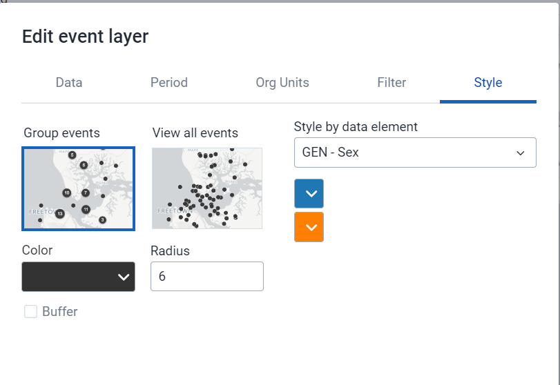
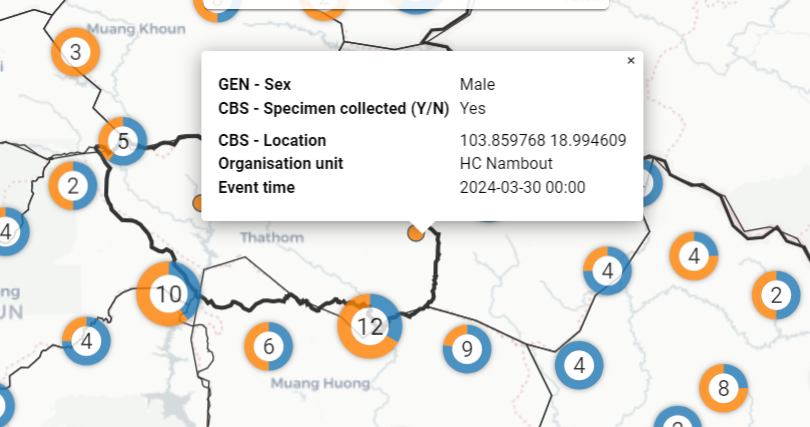
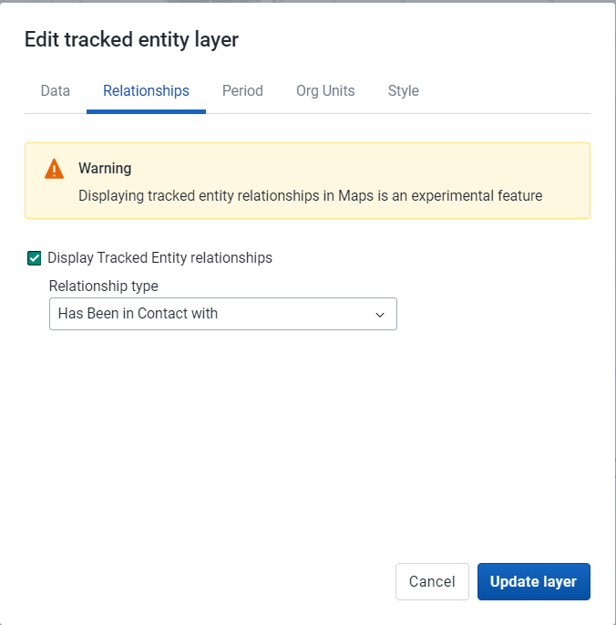
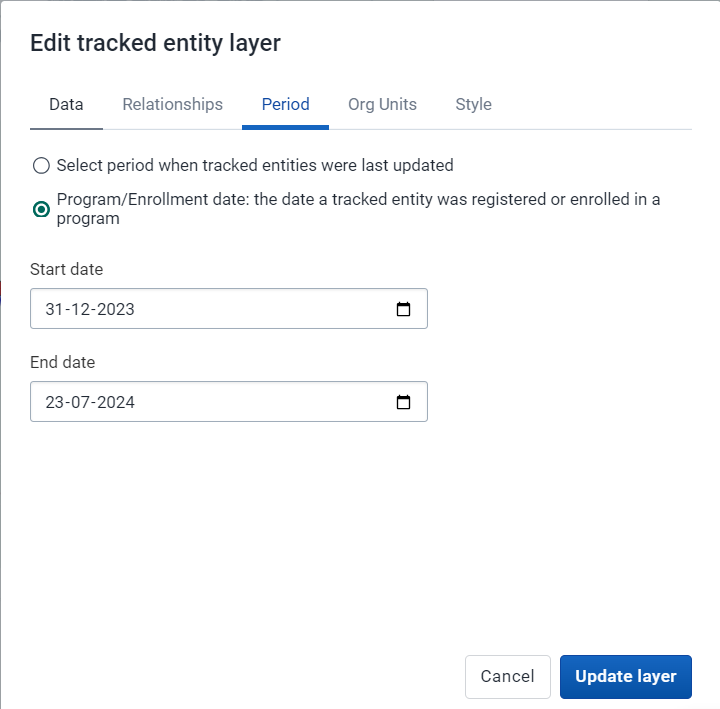
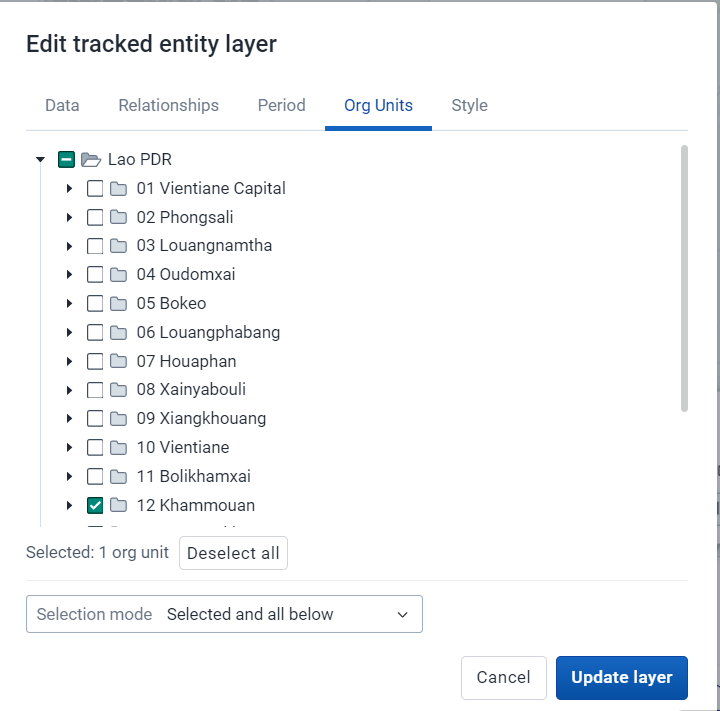
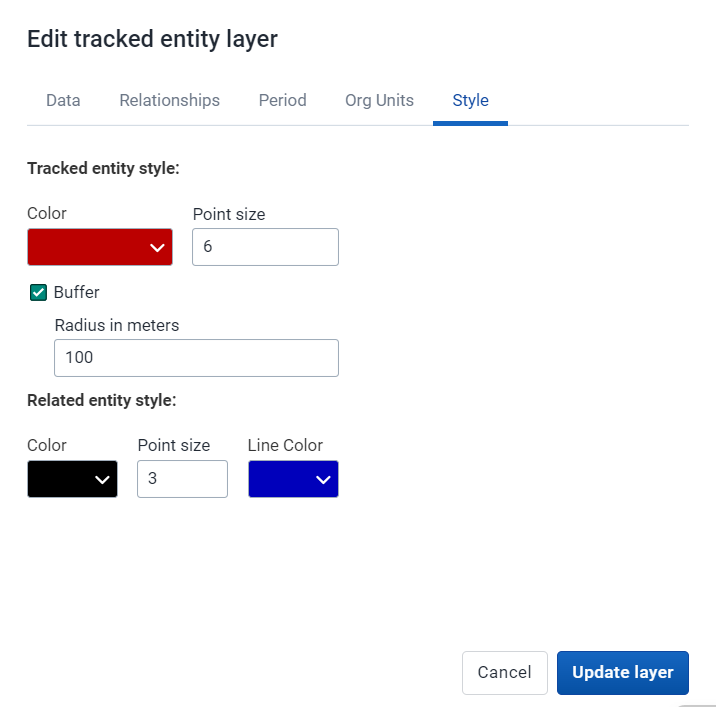

# Learner's Guide to Maps - Event and TEI Layer

## What is this guide?

This guide contains all exercises and detailed steps to perform them related to the use of ***maps - event and tracked entity layer*** for the Tracker Use Level 1 academy. Please perform each of the exercises when prompted to by your instructors.

## Learning objectives for this session

1. Describe the maps app as it relates to tracker data
2. Describe the limitations of maps when working with tracker data
3. Create maps using tracker data within:
   1. The event layer
   2. The tracked entity layer

## Exercise 1

### Create a map using the event layer

As a review, you can create a map using the event layer.

We can create a map using data from the Case based surveillance Program for Fever cases from Diagnostic and clinical information.

Clear your inputs, if any, by going to File -> New.

Create the map using the event layer with the following inputs:

- Layer Type : Org unit
  - Level 3 (District)
- Layer Type : Event (CBS Location)
- Data:
  - Program : Case-based Surveillance
  - Stage : Stage 1 - Diagnostic and clinical information
  - Coordinate field : CBS Location
  - Event status : all
- Period : This Year
- Org Units : User sub-x2-units
- Filter :
  - Data item : Fever = Yes
- Style :
  - Group events
  - GEN - Sex

The map should look like this

**Data Tab**

**Period Tab**

**Org Units Tab**

**Filter Tab**

**Style Tab**

As the events are grouped together, and you have chosen to style them by sex, we see the doughnut charts when we are zoomed out. As you zoom in however you will start to see the individual locations of each of these events. Select an event to see the details. 

As we can see, using this layer is the same whether we are using event or tracker data. As with our other analyses, we do have to keep in mind that the event layer will be displaying all the events within a program on this map; so in the case of repeated event data you can have multiple events on the map representing each of these events.

#### Review how to save a map

Go to the file menu and select the "Save" option

Give the map a name and a description and select "Save"

#### Review how to download a map

Select the download option from within the app. This will open up a new dialog. Position your legend where you want it and select "Download" to download the map. This will download a PNG file of the map to your downloads folder.

## Exercise 2

### Create a map using the TEI layer with relationships

### Create a map using the TEI layer with relationships

We will now create a map using data from the Case-Based Surveillance Program where we will display relationships on the map.

Clear your inputs by going to File -> New.

Create the map using the tracked entity layer with the following inputs:

- Layer 1 Type : Org Unit - User sub - units
- Layer 2 Type : Tracked Entity
- Data:
  - Tracked Entity Type : Person
  - Program : Case-base Surveillance
  - Program status : all
- Relationships : 
  - Display tracked entity relationships = yes
  - Relationship type : Has Been in Contact with
- Period :
  - Select periods when last updated
    - the date a tracked entity was registered or enrolled in a program: December 31, 2023 - July 13, 2024
- Org Units : 12 Khammouan
- Selection mode : Selected and all below

The map should look like this

**Boundary Layer**

***Tracked Entity Layer***

**Data Tab**

**Relationships Tab**

**Period Tab**

**Org Units Tab**

**Style Tab**

Explain the style tab in a bit more detail as you are reviewing it. You can see here you can select the colour of tracked entity, its related entities and the line used to represent the relationship.

The "Buffer" option in the Style tab is used to create a buffer zone around geographical points, lines, or areas (polygons). This buffer zone visually represents a specified distance from the selected geographic feature and can be useful for various analytical purposes.

This allows you to customize the output of these relationship outputs slightly when creating the map layer.

#### Review the map output along with limitations of this layer

As we can see, we are able to display tracked entities along with their relationships using this layer. We have already discussed that we are only able to display relationships within the same program currently, but in addition you are not able to apply any event data to filter out the tracked entities that you are showing. Therefore, ***the tracked entity layer can not be combined with any information from the events within a program stage.***

This is unfortunate, as it requires us to collect co-ordinates for every event within a tracker program, rather then just being able to collect the coordinate once and using it in conjunction with our event data.

This is something that is being worked on however and is expected in future releases.