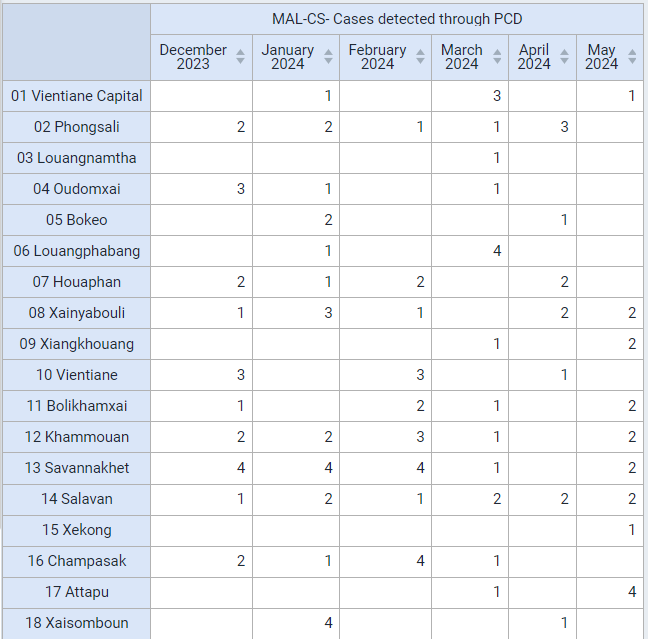
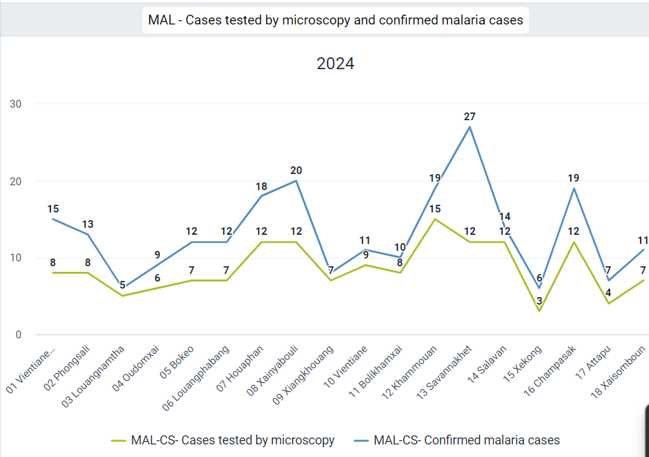
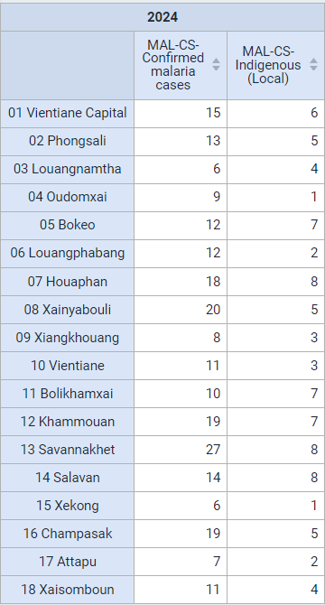
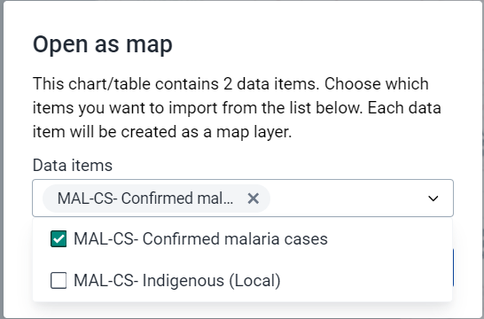
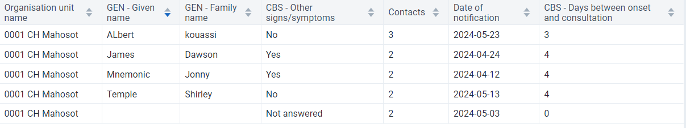
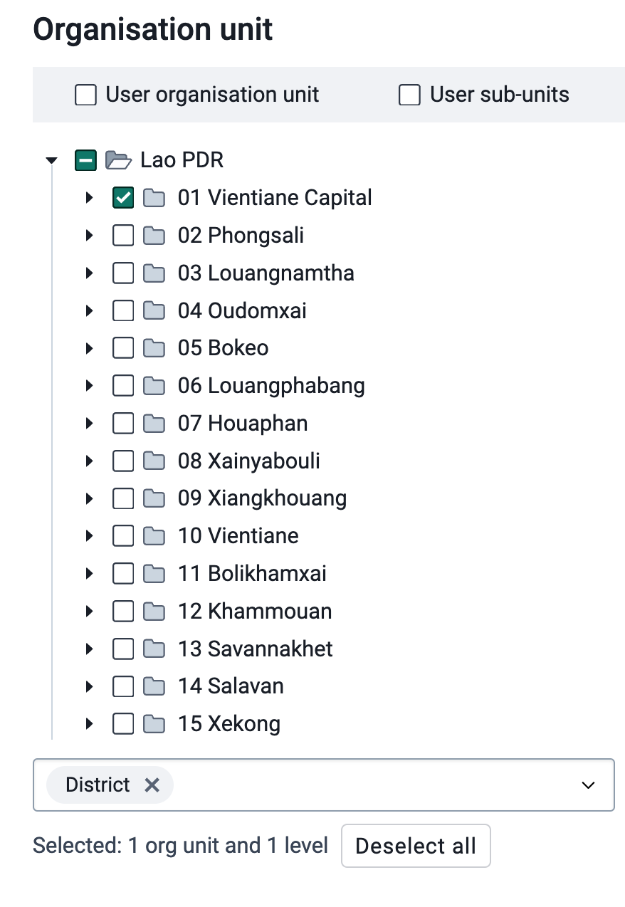

# Learner's Guide to Program Indicator Analysis

## What is this guide?

This guide contains all exercises and detailed steps to perform them related to program indicator analysis session for the academy. Please perform each of the exercises when prompted to by your instructors.

## Learning objectives for this session

1. Describe what a program indicator is
2. Describe how program indicators are derived
3. Describe the difference between event and enrollment program indicators
4. Understand how program indicators can fill tracker data analysis gaps present in other visualization tools
5. Create visualizations using program indicators derived from tracker data

## Exercise 1

### Create a pivot table in data visualizer using a program indicator from the Malaria case notification,investigation and response program

Create a simple pivot table using a single program indicator in data visualizer. It will have the following inputs:

 - Visualization Type : Pivot Table
 - Data 
   - Data Type : Program Indicator
   - Program : Malaria case notification,investigation and response
   - Program Indicator : MAL- CS - Cases detected through PCD
 - Period : Last 6 months
 - Org Unit : User sub-units

The layout can look like this

The table should look like this (the months shown may differ as its relative to the current date)

This is a program indicator that is pulling its information from the data element "Detection setting." This data element consist of an option set. This program indicator is therefore aggregating the events which meet the criteria for PCD.

### Create a chart using event indicators from different program stages from the Malaria Case notification program

Create a line chart with the following inputs:

 - Visualization Type : Line Chart
 - Data 
   - Data Type : Program Indicators
   - Program : Malaria case notification program
   - Program Indicators : 
     - MAL-CS- Confirmed malaria cases
     - MAL-CS- Indigenous (Local)
 - Period : This Year
 - Org Unit : User sub-units

In order to create this chart, ensure your layout looks like this:

The chart should look like this

This chart uses event indicators, including combining data from Stage 1 (Diagnostic and Treatment), where it gets the data on whether or not a confirmed Malaria case, and Stage 4(Case outcome), where it gets the information on whether the case is Indigenous (local). 

It is not possible to create this type of output using event visualizer (you can not pull data from multiple stages using event visualizer). 

You can convert this chart to a pivot table so they can see that you can also create a pivot table using data from multiple stages, an option not possible in event visualizer/reports.

Lastly, you can open this table as a map to show you can now use the thematic layer. The thematic layer opens up a number of additional options when working with your data (we will go over an example where we create a map from scratch using a program indicator in the thematic layer during the next part of this session).

Do this by selecting "Open as Map" from the visualization selection.

When you open this as a map, you will have to select one of the data items used in the chart/table as your primary layer (you can select all but since they are all displaying data at the same OU level, you will in effect only see data from the top layer). Select one of the event indicators (MAL-CS-Confirmed malaria cases) using data from multiple stages to demonstrate that this type of data can be mapped.

## Exercise 2

### Create a map using a program indicator from the Case-Based Surveillance program

Create a map using the thematic layer with the following inputs:

- Layer Type : Thematic 
- Data:
  - Item Type : Program Indicators
  - Program : Malaris case notification program
  - Program Indicator : MAL-CS-Female
  - Leave the aggregation type as default
- Period:
  - Period Type : Relative
  - Period : Last 6 months
  - Display Periods : Timeline
- Org Units : User sub-units
- Filter : None
- Style : Bubble Map, Single Color Legend

**Data Tab**

**Period Tab**

**Org Units Tab**

**Style Tab**

The map should look like this (note that the months displayed may be different as the period is relative to the current date)

You can play back the timeline map. You will see over time the monthly values are increasing or decreasing (the map is showing the total number per month, not the cumulative number; cumulative can be shown however the indicator needs to be configured differently).

## Exercise 3 

### In the line listing app, create a line list, enrollment report showing the number of relationships by TEI from the Case-based Surveillance Program

Program indicators can be used in event reports, line listing and event visualizer as well as within data visualizer and maps, depending on how they are defined. This is because one program indicator can work on two levels:

1. Through creating a summary output for a single TEI
2. Through creating a summary output for all TEIs within a period/org unit 

We will use these principles using two program indicators that use "Average" as the aggregation type.

1. Contact tracing program
   1. Summarizes the total number of contacts a single TEI has through the relationships that have been created in tracker capture
   2. Summarizes the average number of contacts for all TEIs based on their enrollment date and the specified period and organisation unit
2. Case based surveillance - days between onset and consultation
   1. Summarizes the total number of days between onset of symptoms and their initial consultation date for single TEI
   2. Summarizes the average number of days between onset of symptoms and initial consultation date for all TEIs based on their enrollment date and the specified period and organisation unit

Create a line list table with the following inputs:

- Input Type : Enrollment
- Program Dimesions 
  - Program : Case-based Surveillance
  - Program Dimensions
    - Org Unit : 0001 CH Mahosot
    - Time Dimension : Date of notification (this year)
    - Attributes : Given name, Family name
    - Data Element: Other Sign/Symptoms
    - Program Indicator: Contacts

Note : here is the location of the org unit in case you are unfamiliar with this hierarchy (01 Vientiane Capital -> 0101 Chanthabouli -> 0001 CH Mahosot)

The table should look like this

Sort the table by the "Contacts" column. This is showing the number of contacts each person has had as defined through adding relationships via tracker capture.

#### Add the program indicator "CBS - Days between onset and consultation" to your report and update your line list

From the program dimesions tab, add the PI "CBS - Days between onset and consultation" 

Set the Condition : Days between onset and consultation >= 0

To set the condition select the "Days between onset and consultation" program indicator. From here, you can define the condition.

Update your table.

We now have an additional program indicator which is showing the number of days between each person's onset of symptoms and their initial consultation.

#### Create a bar chart showing the average days between onset and consultation across all level 3 OUs in VC

In data visualizer, create a chart with the following inputs:

 - Visualization Type : Bar Chart
 - Data 
   - Data Type : Program Indicator
   - Program : Case-based Surveillance Program
   - Program Indicator : CBS - Days between onset and consultation
 - Period : This Year
 - Org Unit : Level 3 (District) OUs within Vientiane Capital

Note : here is the location of the org unit in case you are unfamiliar with this hierarchy

And here is the layout that should be used for the chart

You can remove the empty categories to clean up the chart.

Go to options -> data -> hide empty categories -> all

The chart should look like this after you update it.

When we review this chart, we no longer see values that are representative of one individual person, but using the same indicator we are able to take an average for all individuals within the organisation units and period that we have selected.

#### Summary on these two indicators

From these two program indicator examples, we can see that program indicators can have multiple functions at both the individual and aggregate level. These various functions can be quite useful depending on what information you are looking to review within your system. There are many other advanced possibilities that are available when using these types of indicators. The best source of this information will be the documentation.

