# Learner's Guide to Android Capture

## What is this guide?

This guide contains all exercises and detailed steps to perform them related to the Level 1 - Tracker Data Capture and Analysis Academy. Please perform each of the exercises when prompted to by your instructors

## Learning objectives for this session

1. Describe android app functionalities as related to tracker capture
2. Demonstrate how to install the android app
3. Demonstrate how tracker data can be captured on Android devices including:
   1. Searching for tracked entities
   2. Registering tracked entities
   3. Navigating a person's tracked entity dashboard
   4. Entering event data within a program stages
   5. Completing an enrollment
   6. Entering relationships
   7. Enrolling a tracked entity in multiple programs
   8. Working with tracker data offline

## Exercise 1

### Log in to the Android App

Server URL : the academy instance URL (make sure to share this with the participants)

Username: android1

Password: District1#

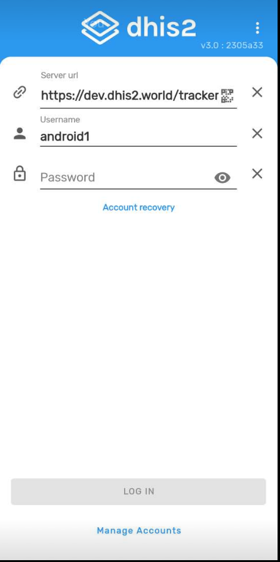

### Review the interface

You should see the following programs when logging in

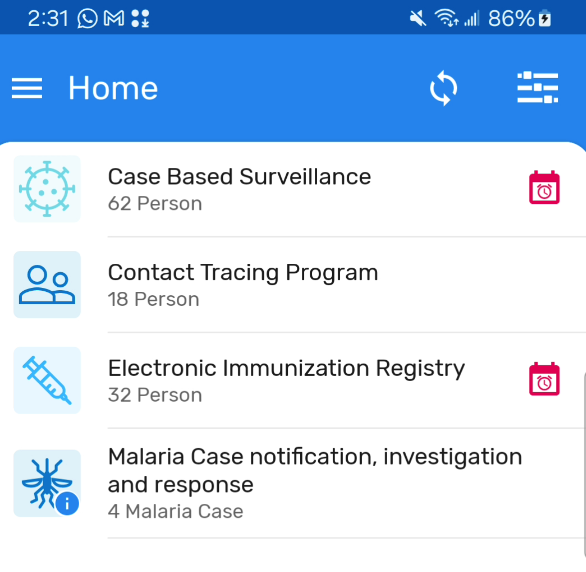

### Select the Case-base Surveillance program

Select this program. It should show you a list of individuals registered in the program based on the org units your user is assigned, similar to the front page list in tracker capture.

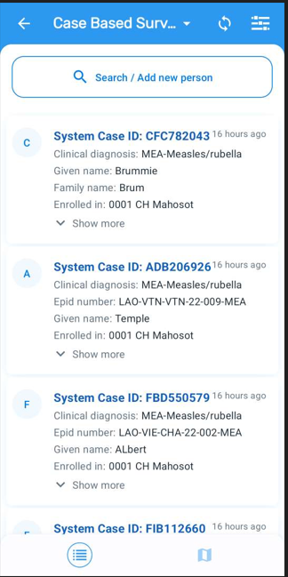

### Filter the list

You can filter the list by selecting the filter button and applying relevant filters

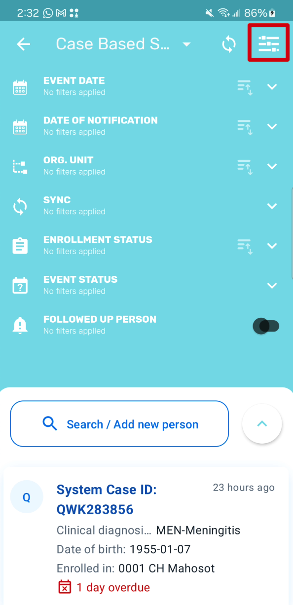

For example, you can try filtering out completed events.

### Search for an individual that already exists

Search for an individual which already exists by selecting the search box.

- System Case ID : BAB114160
- First Name : Fleury
- Surname : Theo

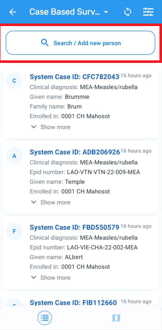	

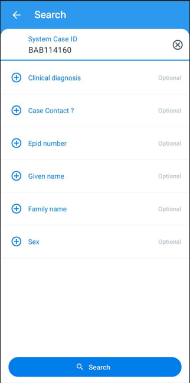

Open this record by selecting it. 

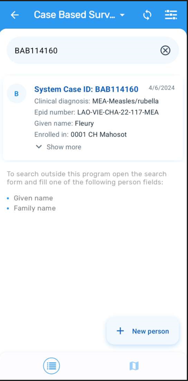

You will see all the events associated with the case within the case-base surveillance program, starting with the most recent event in each program stage. 

 There are 4 tabs at the bottom when you open the record. 

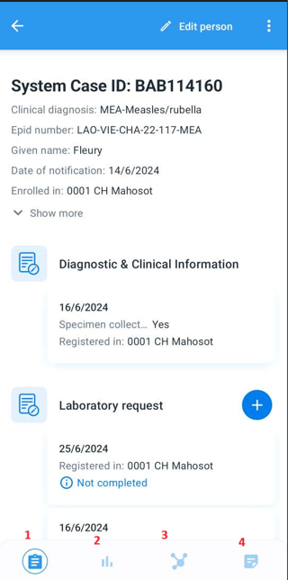

These tabs at the bottom screen from left to right represent:

1. Details : it is the page you are on by default when opening the record and shows the TEI info as well as the details of the stages and events
2. The indicators widget
3. The relationships widget
4. The notes widget

Navigate back to the details tab

You can use the “Edit Person" button within this tab to show (and edit if access allows) all of the attribute information related to the individual. Go back and review the event list after reviewing the person's details.

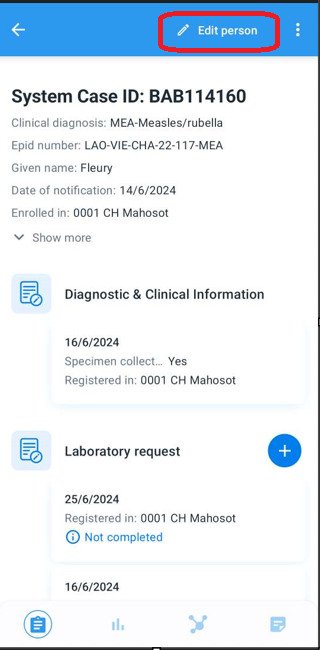	

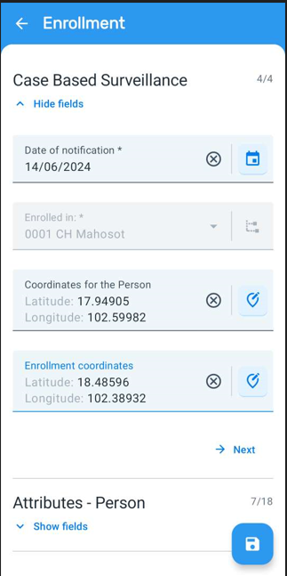	

Exit this page by using the arrow in the top left corner of the screen.

Select the first stage "Diagnostic & Clinical Information" followed by the event within it. Navigate through the various sections to show that the data within the stage has been entered and can be reviewed or updated on the device.

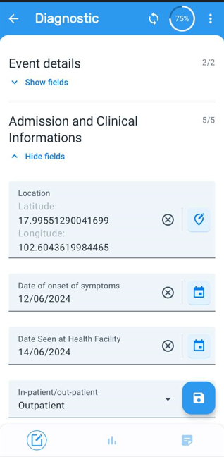	

Exit the event to proceed.

## Exercise 2

### Register a new case

Navigate back to the front page list of the Case-based Surveillance program. 

In order to register someone on the android app, you first must search to see if they exist

Start the search process again that you have just shown.

Search for a record that does not exist. Some examples:

- Jane Dawson
- Margaret Thatcher
- Joe Sakic
- Damon Hoyt
- Angelina Jolie
- Evander Holyfield
- Tim Curry
- Alicia Jackson
etc.

Enter some details and try to search for the individual. You should get a message that your record could not be found. 

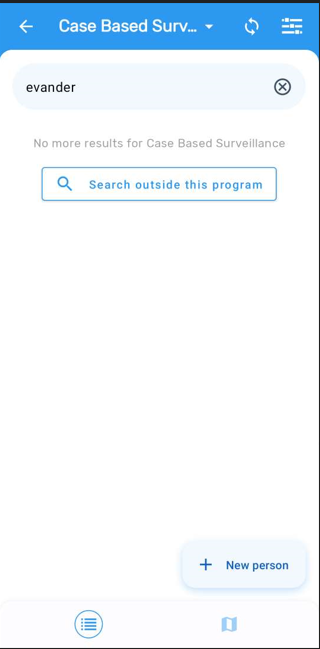

Click on new person button and select an org unit in which to register the case into. Select Done once you have select the org unit.

After selecting the org unit, select the registration date (date of notification). Select OK once you have selected the date.

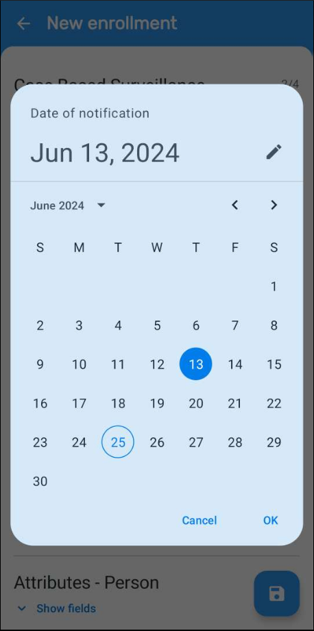

You can then expand the attributes section by selecting "show fields" under the Attributes - Person heading to fill in the remaining attributes for this person.

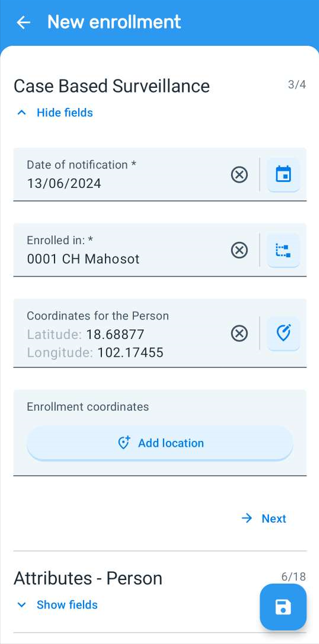	

Fill in this information then select the disk icon in order to save the person's details and enroll them into the program.

From here, you will be taken to the persons tracker dashboard. The event for the Diagnostic and Clinical information will be automatically generated. Select "Enter/skip event" in order to edit the details of this first event within this stage. 

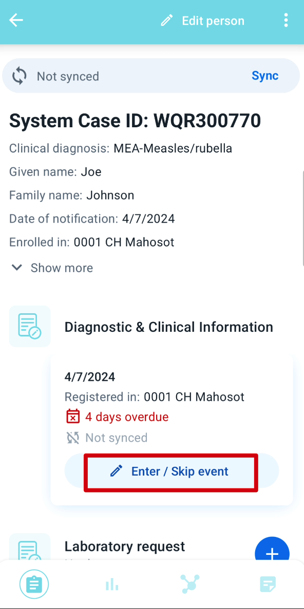	

Then you must fill the information for first event. Start by selecting a date of data entry then:

1. Fill in the details for each section
2. Expand each section by using the tabs

	

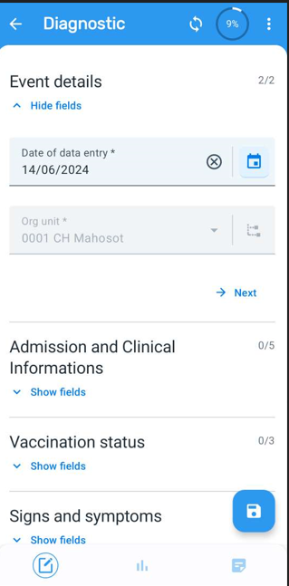

Once you have filled all the details in, save the data by selecting the disk icon

You will then be provided with a prompt if you wish to complete the event or not

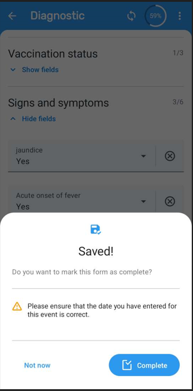

If we are done entering data for this event, you can choose the option "Complete." If there is some data missing you can choose the option "Not now." Note to the participants that if you do complete an event and you need to edit it in the future, you are able to open it back up.

Once you save the details, you will be taken back to the dashboard on the device, which has the same interface as the completed record you previously accessed.

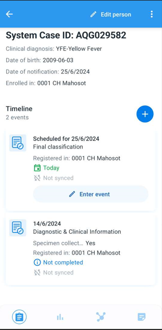

## Exercise 3

### Add a new event

Click on the plus button beside the second stage "Lab request." This will open up a context menu. Select “Add new” to add a new event.

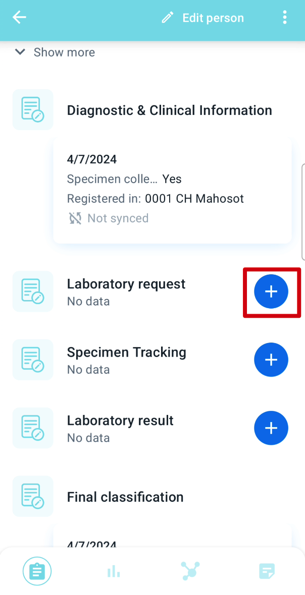		

Select the org unit in which to register the event.

Alter the date of lab request if you need to and expand the fields under the "Details" section to edit them.

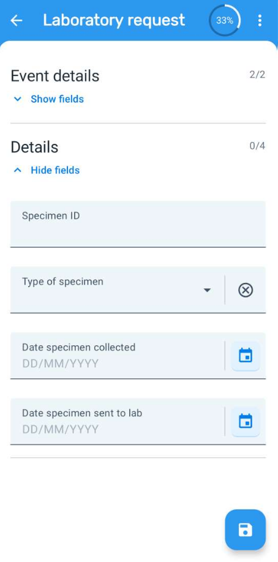

Fill in the form. You can save the details by selecting the disk icon. You will see the same two options as before regarding whether or not to complete the event. Select one to continue.

The lab request and lab result stages are repeatable, and you are able to add multiple events to these stages if needed. Just select the stage and add a new event to it if needed. After adding the event, you will see the repeated stages listed when selecting the program stage.

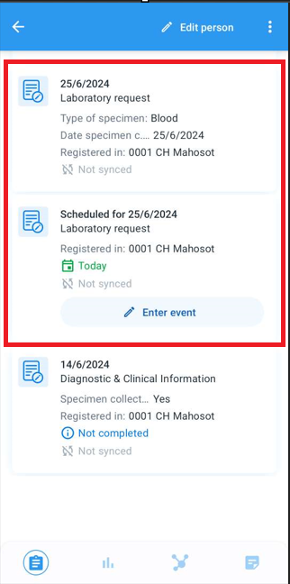

Repeat the same process with the other stages to fill in the data if you think the participant's need more examples; but you can likely stop here if you have filled in data for stage 1 and stage 2 as the process will be the same for the other stages.

## Exercise 4

### Add a relationship

From the persons tracker dashboard. Click on the relationship icon to associate the contacts with the case. Select the "Has been in contact with" relationship type

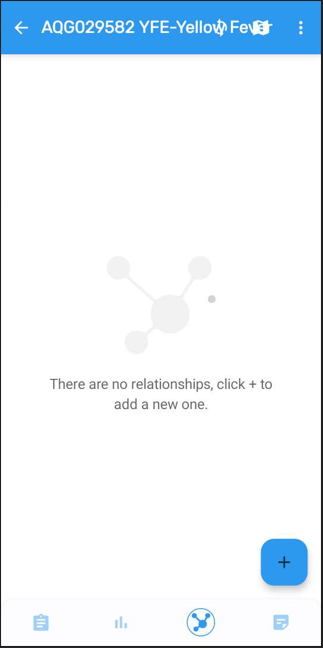	

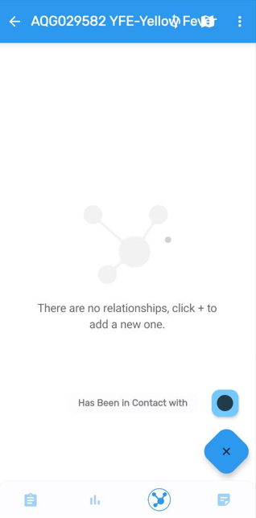

Change over to to the Contact Tracing Program by using the top menu.

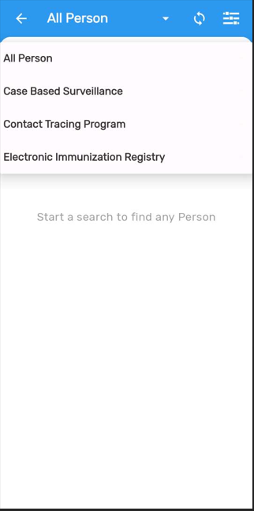

Search for an contact which already exists (in this example Seema Sharma).

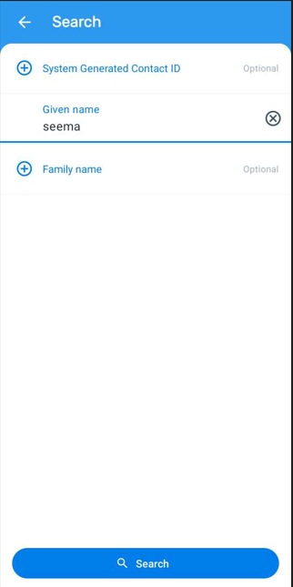	

Select the contact in order to create a relationship between them and the person you registered. This will take you back to the person's relationship widget and you will see Seema listed. 

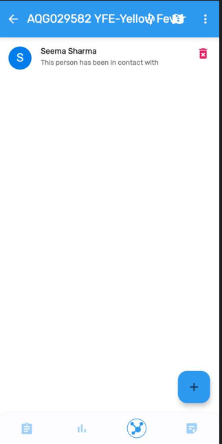

> Note: You can also add in new enrollments when creating a relationship as you can on the web. If your search does not return any result, you will be able to create an enrollment in the program and a relationship will be established after the new person is created.

### Completing the enrollment

Once you are done entering all data for a tracked entity (attribute information, event data, relationships, etc.). You should consider completing the enrollment. In order to complete the enrollment

1. Select the 3-dot menu
2. Select the complete button

After you have completed the enrollment, the status on the dashboard will change to completed.

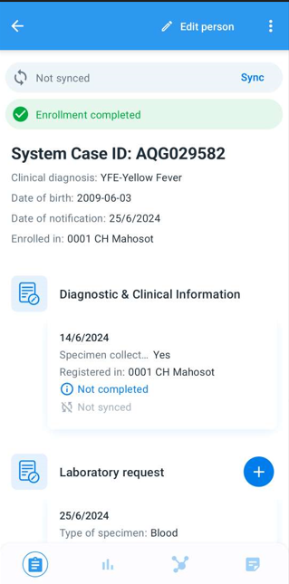

## Exercise 5

### Enroll the person in another program

From the persons tracker dashboard, go back and select the program enrollments.

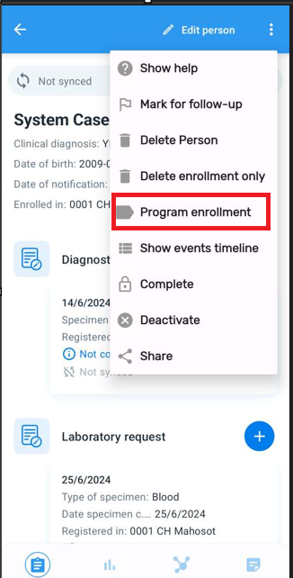

This will take you to enrollment list dashboard. From here, enroll them into the Vaccination program.

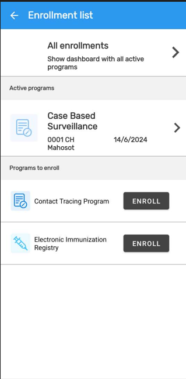

After you select the program to enroll them into, select the date of registration and the organisation unit.

This will then take you to the attribute details. You will see it carries over the details that you have already entered previously and you do not need to enter them again.

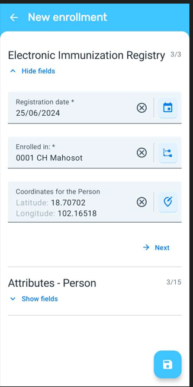

Once you have filled/updated these details, save the person by using the disk icon. This should take you to their dashboard in vaccination registry program.

Go back to the search page for the Case-based surveillance program and you will find your person that you initially enrolled into the Case-based surveillance program now also has an enrollment in the Vaccination program.

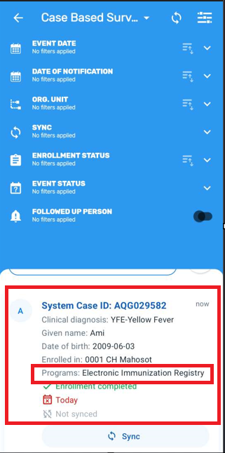

## Exercise 6

### Sync the event

Data on android syncs on a schedule. It can also be manually synced from the device to the server. Let us review how to perform the manual sync.

From the search page, select the person’s sync status to see that this data has not been posted online.

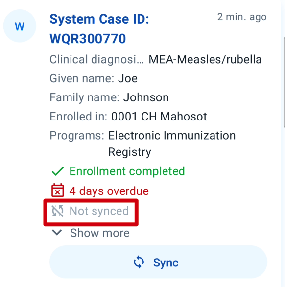

If you log in to the web and search, you will not find this person:

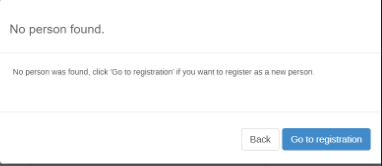

Go back to the home page and sync your data using one of the sync status icons.

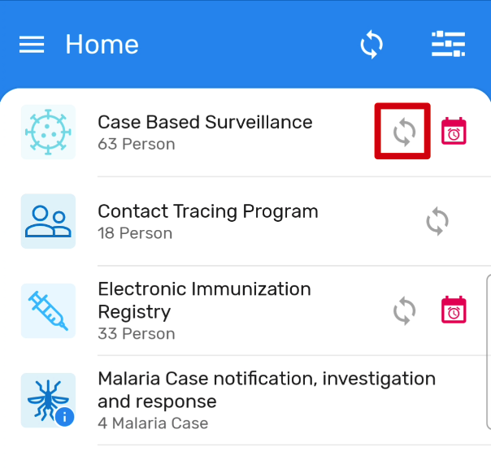

By doing this from the home page, you are able to sync many updated records at once. When the sync is in process it will show in the screen

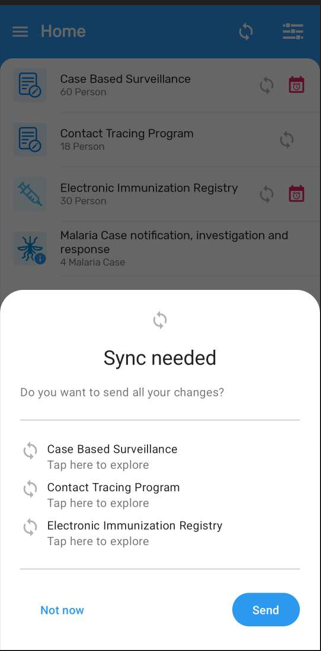

Show the person in the web by going to the org unit you registered them to. There attributes and events should all be synced online.

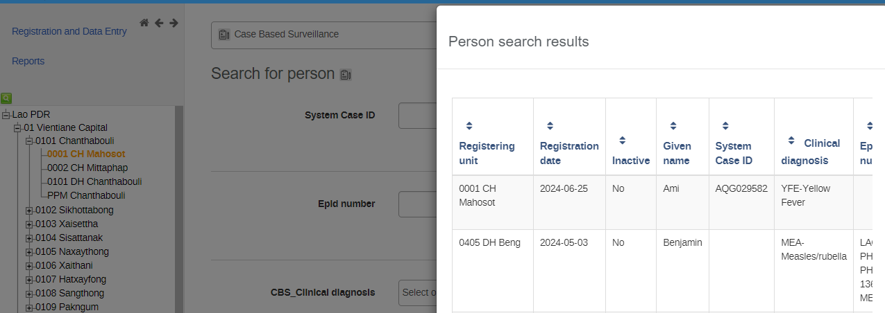

## Exercise 7

### Go offline!

Android allows for storing tracker data offline directly on the device. Records must be synced first or they can not be accessed offline. The number of records that are synced to the device is defined in the settings page of the Android app or globally by your system administrator using the Android settings app in DHIS2 (if the global option is selected, you will not be able to modify them on the device directly).

This is an example of what it looks like if it is done on the device

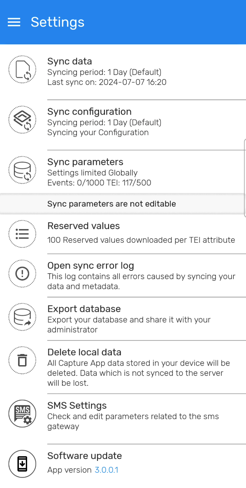

Go to your Android home screen and turn off your wi-fi/mobile data radios.

Go back to the DHIS2 app, select the Electronic Immunization Registry program and search for/register a new person

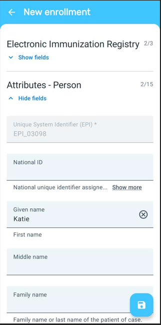

You will notice that you are able to automatically generate the EPI number. This is because when you were online, a number of ID’s were generated and stored for use. You need to be a bit careful here because if all of these ID’s become used up before you connect again, you will not be able to register any more new children. Your system administrator can help configure how many ID's you can use offline. It is recommended to keep this up to 500 ID's. Working offline should therefore be considered carefully.

Go ahead and register a new vaccination and add a new event.

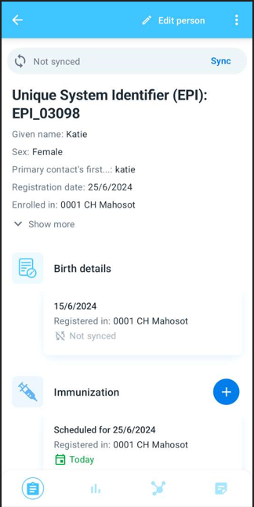

As you have no network connection the data will not sync.

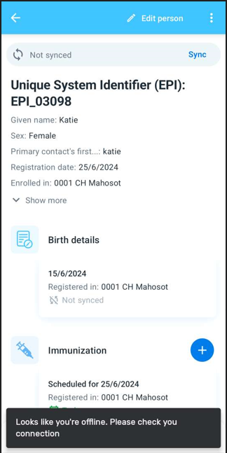

Go ahead and turn on the wi-fi, than sync the data.

Check the record and it should sync the data with syncing 

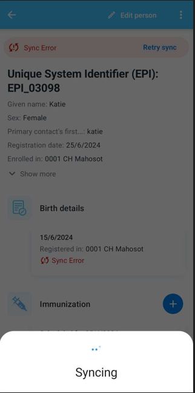

You can go online in the web and verify this as well
