# Learners Guide to Tracker Capture

## **What is this guide?**

This guide contains ungraded exercises and detailed steps to perform them related to the tracker capture use session for the Tracker Use Level 1 academy. 

## Learning objectives for this session

The overall objective of this session is to use the DHIS2 tracker capture app. Detailed objectives include:

* Understand how to select the correct program
* Understand the layout and options of tracker capture
* Understand how to register a TEI 
* Understand how to fill in program stage details
* See how to search for a TEI 
* See how skip-logic can be used in a tracker program

## Exercise 1

### Review the tracker capture interface

Steps to open a tracker capture app:

1. Open Tracker Capture from the Apps menu

    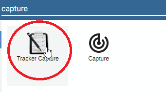
  
2. Find and select the site (organisation unit) in the org unit hierarchy.The ''COVAC - COVID - 19 Vaccine Registry tracker program'' is linked to any Organization Unit at the health facility level and above. CHW Mahosot has some example cases already entered. Click on the ‘+’ symbol to expand the hierarchy in the desired branch. For example, to find “CHW Mahosot”, expand Lao PDR, then 01 Vientiane Capital, then 0001 CH Mahosot and finally CHW Mahosot. Click on the site name to select it. When selected the org unit’s name will change color to orange.

    

3. Select a Program: Only programs relevant (allocated) to the selected org unit and user will show up in the Program drop down list. If the COVAC - COVID -19 Vaccination Registry is not already selected, make sure to select it from the program list under the “Tracker Capture” heading.

 Note : 

* People already registered will be displayed in a tabular fashion, with each row corresponding to a single record in the “All Clients” tab.
* Clients with a scheduled visit will be seen under the first tab “ Clients with a Schedule Visit”

    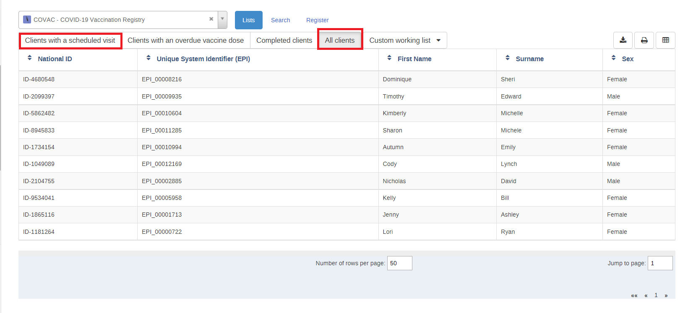   

     _Note : The above tabs are configured at the api level for this program._

* If you go to the “Case based Surveillance” program you will see the list below which is coming through the attribute display list option while configuring the tracker capture program.

   

### Registration of a TEI

During registration, it is possible to stay on the same page and keep registering more than one entity. You can also go straight to the dashboard of the registered TEI. Selecting a program and doing registration also performs enrollment into the program at the background. If a TEI is registered without a program, then enrollment is possible from the TEI dashboard. Both skip-logic and validation error/warning messages are supported during registration.

To start registering the patient in the program you need to click on the “Register” tab.

**Enrollment status filters**: If a program is selected, the app provides further filtering on the table based on enrollment status. This is displayed in the following order:

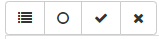

* Any enrollment status
* Only those with active enrollment
* Only those with completed enrollment
* Only those with cancelled enrollment

**Custom Working List** : This allows you to apply a custom filter to the list of TEI’s that are displayed.

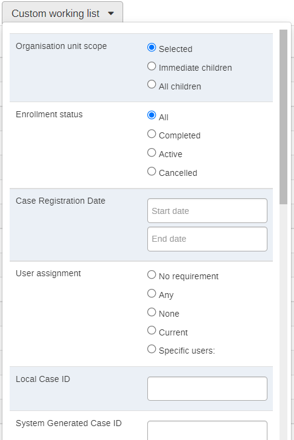

Export the TEI list: You can export the list of TEI based on the filtering criteria you have selected in CSV, XML or JSON format. 

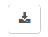

**Select columns to show**: Here you can select which attributes from the TEI you would like to show on the front page line-list.

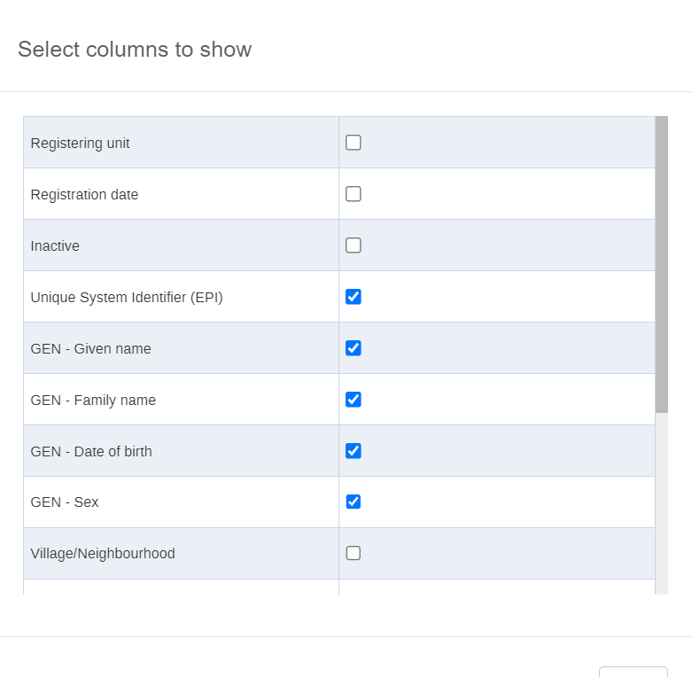

**System Generated IDs**: can follow patterns that are defined by the user. This example uses the “COVID19 - Sequential number”.The pattern is defined while configuring the program.

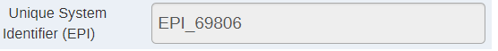

Go to the registration page and see that the ID will be generated. These ID’s can be a bit dynamic depending on the pattern that is defined to generate them. You can use inputs such as the date (used in this example), org unit codes, etc. The best resource to learn more is here:

[https://docs.dhis2.org/master/en/user/html/working-with-textpattern.html](https://docs.dhis2.org/master/en/user/html/working-with-textpattern.html)

### Register a new TEI

Click on “Register” to register a new TEI. You will then be faced with the Enrollment screen for the program. The enrollment screen lists all the attributes that are associated with the program.
In later sessions, you will go over the terminology in more detail so just focus on describing the interface and actions for now.
 1. Enter a TEI that already exists (Sharon) in the system. You will be notified that a possible duplicate has already been found.

    
    

2. If you think this is not a duplicate case you can back out of the duplicate screen.
3. Fill in additional details and try to register. It will once again give you the potential duplicate. Click on the record to be taken to their dashboard.Click on **Register new person** when the record is not found.

    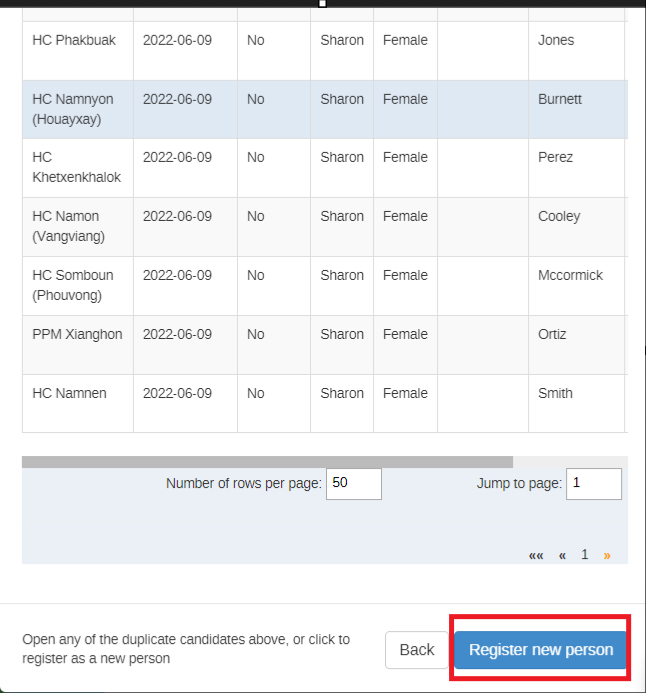

Note : This is a critical part of using a tracker and is meant to reduce the number of duplicate registries in the system. It should be emphasized that, when using tracker programs, we always emphasize searching for existing cases prior to registering new ones.

The details you entered during search will be brought over to the registration page so you do not need to enter them again. You can fill in the remaining fields in order to register the person.

After entering the details proceed to click on “**Save and continue**” in order to register the TEI.

## Exercise 2

### Review the Tracker Dashboard

#### **Top 6 items at the tracker dashboard**

The dashboard starts with below items at the top:

   

* Back button - this helps to go back to the search and registration page
* Persistent top bar - this is configurable by the user and can include different aspects from the program.
* Previous and Next buttons - these are buttons to access the previous/next TEI details
* Program selection menu - This is to dictate what kind of data to record and track for the selected TEI. This also affects the contents of the widgets.
* Small Pin icon at the right corner - This allows you to pin (or stick) the right side of the widgets. This is useful especially during data entry. If for example there are many data elements or big forms to fill, sticking the right side helps to remain visible while scrolling the data entry part.
* Small gear icon at the right corner - Clicking on the gear icon allows you to perform several different actions. 

    

  a) Show/hide widgets: This helps to control which widgets to display. There are nine widgets available to display. The widgets are collapsible, responsive and draggable - this helps to acquire optimal view area as per user needs. Widget (re)arrangements are saved automatically per user per program.

  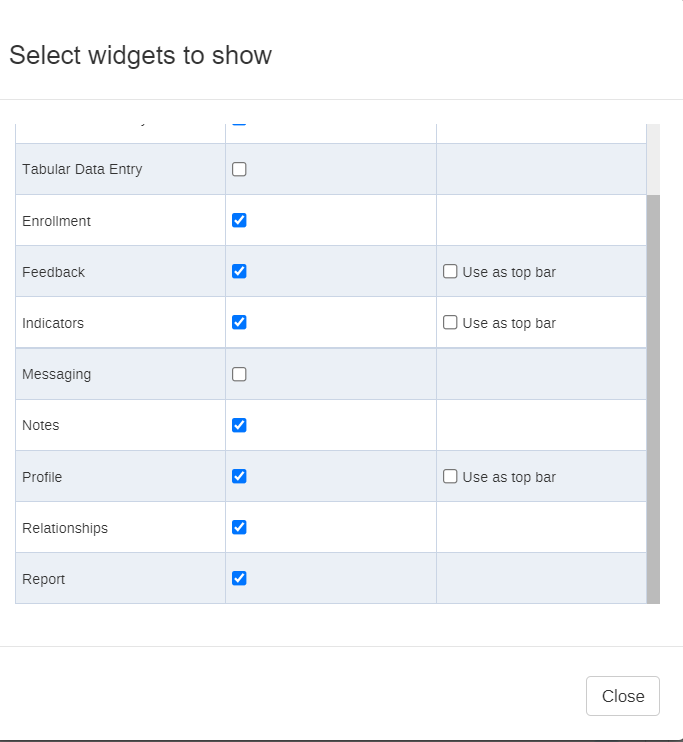  

* Save dashboard layout as default: Widgets arrangement is saved automatically every time a widget's position or state (expand/collapse) is changed. However, for the entire layout to be considered a default layout for the selected program it is required to explicitly save as "Default layout".

* Top bar settings : Allow you to modify the top bar options.After you modify it, you should see the persistent top bar present. This should remain wherever you scroll within the TE dashboard.

  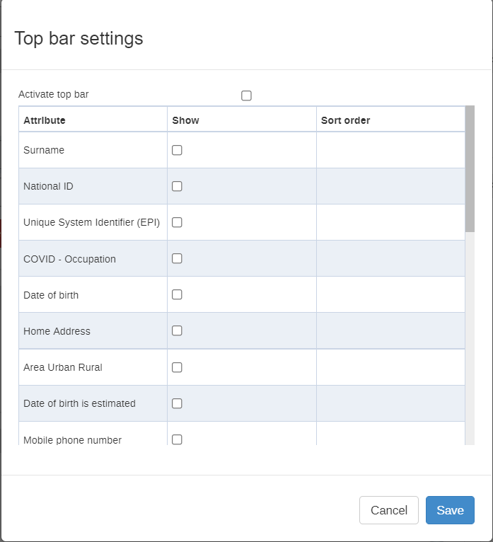

* Lock layout for all users : This is only for system admins. They can create a default layout in which all users will see in the tracker dashboard. When this is enabled non-system admins will not be able to alter the layout or add/remove widgets from the dashboard.

* Red icon at the right corner : This allows to delete or deactivate the record.Clicking on the red icon allows you to following 2 functions:
  
   
* Delete Person (or TEI) - This deletes the TEI and all the data associated with TEI
* Deactivate Person (set TEI to active/inactive) - This has nothing to do with widgets or the dashboard but it helps to set the status of dashboard owner (the TEI) to either active or inactive. If a TEI is set to inactive, only read operations are allowed - no data entry, no profile editing, no enrollment.

This is permission based, so not everyone will have the authority to perform this function.

#### Widget Descriptions

> Note: These are here for your reference, you do not need to review all of this text during the session

* Data Entry - This is for doing data entry using either default or custom forms. Depending on program definition, in particular program stages, events will be displayed in a timely fashion. Clicking on any of them displays the corresponding data entry. If a stage needs a new event, a plus icon is displayed for new event creation. To proceed with data entry, it is mandatory to have an event date. Once an event date is specified it is not possible to change the due date. The assumption is that by specifying the event date, the event has already taken place. If the event hasn't occurred yet, it is possible to change the due date - this is effectively doing nothing but rescheduling. The buttons at the bottom help to change the status of a selected event. Another key feature from this widget is the addition of multiple notes for an event. Normally data recording is through data elements, however there are cases where it is necessary to record additional information or comments. This is where the notes section comes handy. However, an interesting feature here is,it is not possible to delete a note. The idea is that notes are more like log books. Both skip-logic and validation error/warning messages are supported during data entry.
* Enrollment - This helps to enroll the TEI for the selected program. If an active enrollment already exists, the widget automatically displays it with some details about it. The widget also helps to do some operations on the selected enrollment - for example complete / cancel or a possibility to mark the enrollment for followup. The later one helps for example to deal with high-risk cases during case follow-up. A link to history is also provided if the TEI has historical enrollment.
* Feedback - In this widget you can place summary information about the TEI for review. For example if the person has allergies or you want to display information on which vaccines they have received until now you can place this information here based on what has been entered in the program.
* Indicators - Any indicator defined for the selected program will have its value calculated and displayed under this widget.
* Messaging - With messaging, you can send an SMS to the phone number that was registered directly from the dashboard
* Notes - This is the same as event notes. The difference between the two is that, here notes are attached not to events but to enrollments. This helps to record some notes based on enrollment - for example why is an enrollment terminated or what is the overall observation of the TEI throughout the enrollment. In addition, if the tracked entity has registered a phone number, messaging will be available here.
* Profile - This is to edit TEI's profile or attributes. Here, if the TEI has an attribute of value type "Tracker Associate", a small icon next to the input field is displayed. Clicking the icon opens a popup where users are allowed to either search or register a new associate.
* Relationship - This helps to relate the selected TEI (the one whose dashboard is shown) to another TEI. Adding a relative is possible by either searching from existing or registering a new one. If a program is selected while registering a new one, the new one will be automatically enrolled to the selected program. Another interesting feature in the relationship widget is attribute inheritance. For example having a contact relationship with the COVID -19 affected patient for this you want to add a relationship with a person with a current patient that has been registered in a case based surveillance program. If among others first name, last name and address attributes are required for both Programs.
* Report - This is to provide a "journal" of the TEI per program. A report row is provided for each program the TEI is/was associated with.

## Exercise 3

### Enter data

#### Data Entry

1. Select the Date and fill out the data. When selecting which data elements look out for the total doses and suggested dose for the next dose. This is a result of using program rules which have been defined to allow for these to be hidden upon the appropriate selection of another data element value. When you have entered some data, click on “Complete.”

    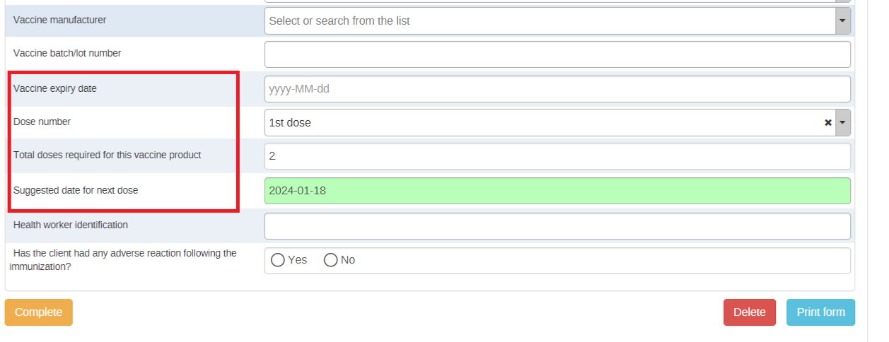

2. A prompt will ask you if you are sure you want to complete the event.Also it will show you warnings based on the data value entered in the form.

    

3. After you complete it , you can schedule another event. In this scenario the system will automatically schedule a new event based on the next dose date suggested through program rule on the basis of duration and type of dose. This will bring up a new window in which you can select the program stage (there is only one repeatable program stage in this particular example) as well as the “incident date” which has been defined as the “Date of services given” for this program. It is a good idea to schedule the “Date of services given” to be the same as the next date of vaccination which comes from the date of first dose given. This is all to take advantage of the program rules that are in place to allow for different vaccines to appear based on the schedule defined previously. When you have selected the right details, click on “Save.”

   

   Note : When you have a scheduled event, the color changes. This event is “Overdue” because it was scheduled in the past. Here we can reschedule the due date if required. In a real situation, this may not also match the due date, but for this example let us keep it the same to demo the program rules.

   

When you are done click on complete. Schedule a new event and go back or click on “Complete and exit.”

Add a New Event/Stage :In order to add a new event, click on the “Add new” button in the data entry widget.

Review the Data Entry Widget

From the screenshot above, we can see a number of different items within the data entry widget.

* Activate Legend : This activates/deactivates a legend which shows what the color of the program stage is describing.
* Audit History : In the audit history changes to any of the data elements can be reviewed and searched. This can also be done for the attributes where a similar icon is available in the profile widget.
* Collapse Widget : This will minimize/maximize the widget on the dashboard.
* Program Stage Area : In this area, the program stages are listed along with their dates and color status.
* Event Menu, Add new event, Schedule new event : In this area we can perform the described actions as required.
* Data Entry Area : This is where the actual data related to a specified program stage is entered. This can differ between program stages, and as you will demo, program rules can also cause this to vary within a repeatable stage.
* Compare the Forms Using the Compare form Button : After you have at least registered 2 events, ulse the compare form button to compare the events within the program

#### Add a Relationship

* To add a new relationship, click the “Add” button on the relationships widget.

    

* Select the relationship type. In this case, you will contact relationship with case based surveillance program

    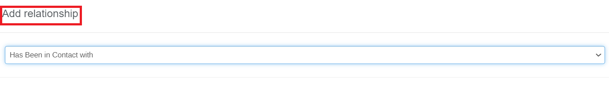

* On the left side you will see the information relating to the TEI that you are registering. On the right side you will see other TEI’s that are registered.

    

* You can select the program and use search to filter TEI’s. You may have, for example, a contact relationship with COVID - 19 affected patients.

  
    

* Select the TEI. It will bring up their details. Click on “Save” to save the relationship.

  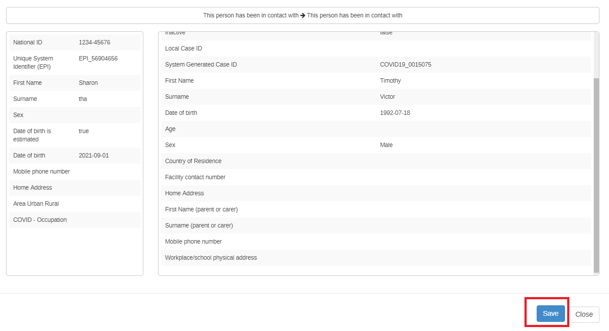

* The relationship will then be added to the relationship widget. If you click on the TEI in the relationship widget, it will take you directly to their dashboard.
  
  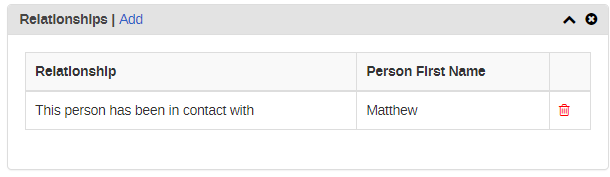

#### Make a Referral

To make a referral to a new facility in a scenario where a patient is being referred due to lack of vaccinations in the current facility or might be moving permanently to a different location we can then use the “Referral”option within DHIS2.

* Select the Referral tab at the data entry widget.
* Search and select the record to view it in the new facility.
* Select the facility and click on Save options.

    

* It will show as below image

  
  

## Exercise 4

### Register an entity in another program

TEIs can be registered in more than one program. This allows you to take the attribute information that already exists and re-use it. Additionally, you will now have a historical link of all of the different services that a unique individual has received.

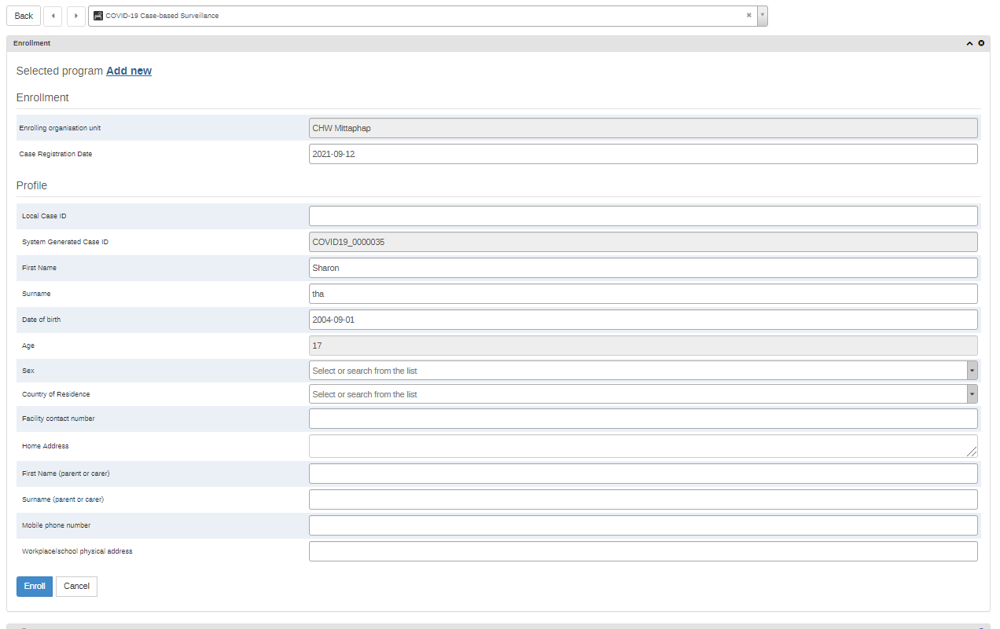

### Register a TEI with no Program

A TEI can also be registered without selecting a program. De-select the Vaccination program so that the program selection field is blank. Select the person TEI type and click on “Register". 

* Enter the details and Select “Save and continue".

    

* Upon entering the dashboard, you will see that there is a prompt to select a program for enrollment.

  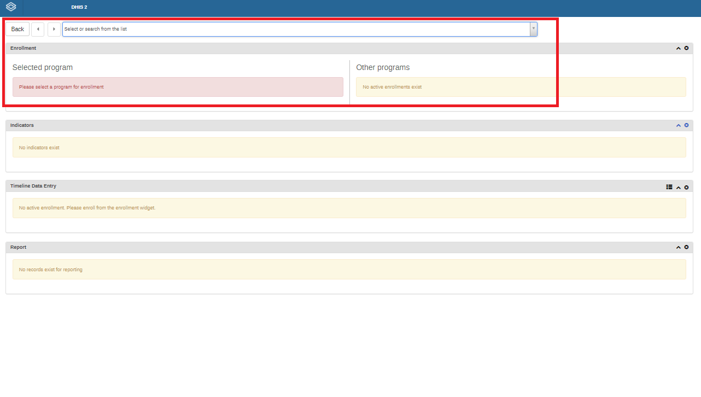

* Select the COVID - 19 case based Surveillance and click on “Add new.” The attributes for the program will appear. You can fill them out to register the person into the program. Using the program selector, TEI’s can be registered in multiple programs directly from the dashboard.
  
  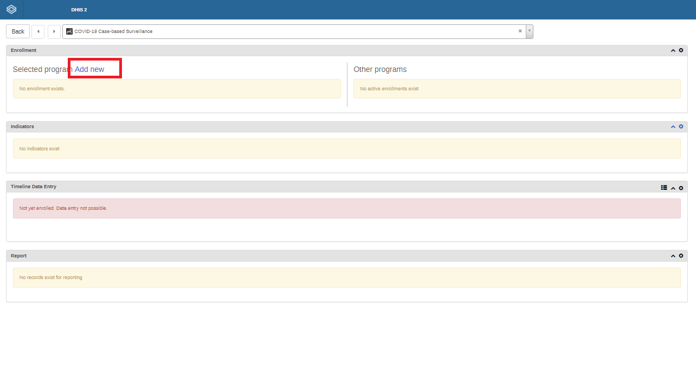
 
* After you are done, go back to the front page of the tracker capture app.

