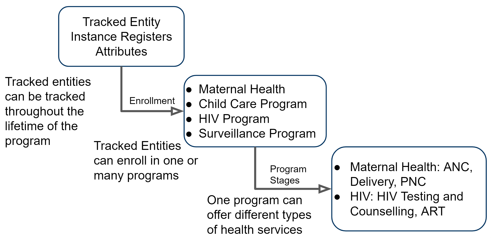
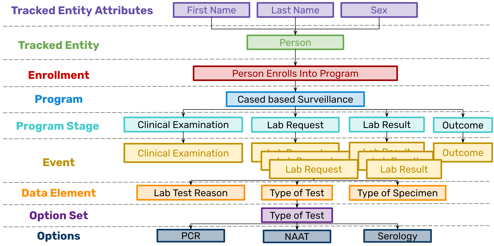

# Tracker Data Model - Session Summary

This document is a summary of the DHIS2 tracker use academy session "Tracker Data Model." You can download the accompanying presentation [here](insert link).

## Data Model Terminology

- **Tracker Entity Attributes** : Used to register profile information for what we are tracking (ie. National ID, Name, Sex, Date of birth, Address, Phone Number etc.)
- **Tracked Entity** : This refers to the type of concept that is being tracked (ie. a Person, Case, Lab Sample, a Village, etc.)
- **Tracked Entity Instance (TEI)** : Refers to a single tracked entity that has been registered in the system
- **Incident Date** : The date which triggers the first event
- **Enrollment Date** : The date the entity is enrolled in the program
- **Enrollment** : The process of taking a tracked entity and registering them into a program
- **Program** : A program defines the sequence of events that an entity can go through, the “frame” (ie. A disease surveillance program will include clinical examination, specimen tracking, lab results, and case investigation), and what attributes are required when an entity joins the program. 
- **Program Stage** : Tracker programs can have multiple program stages. The program stage defines what data should be collected during a specific type of event within the program (ie. the lab result stage will collect information about the lab result events). These can be one off or repeatable.
- **Event** : Program stages consist of one or more events. When a program stage is not repeatable, you have a 1:1 match between program stages and events. When an program stage is repeatable, one program stage can have many events.
- **Data Element - tracker type** : Defines the data points collected within a program stage, ie. “Lab Test Result.” Must be of domain type “Tracker” to separate these from data elements used in the aggregate domain
- **Option Set** : An option set is a predefined, related list of values for data elements. Each data element can only be assigned one option set
- **Option** : These are the individual options (similar to a multiple choice question) that make up an option set

## Tracker information flow summary

## Tracker Data Model Summary

