# Trainer’s guide to Capture App & Analysis Fundamentals (Web-Based)

## What is this guide?

This guide is a support document for DHIS2 Academy trainers for the session “Demonstrating and using Capture App (Web).”

This session follows the standard Academy training approach with: 
 
1. A live demo session where the trainer demonstrates and explains the features, and 

2. A hands-­on session with exercises where participants get to practice the same features.

This guide will help the trainer​ prepare​​ for the live demo session. The “Live Demo step by step” section has a detailed walkthrough of all the steps to demonstrate with explanations and screenshots that should be easy to follow. Use that when preparing for the live demo session.

There is also a Quick Guide which lists the steps very briefly and this is meant as a lookup guide or “cheat sheet” WHILE doing the demo, to help the trainer remember all the steps and the flow of the demo.

## Learning objectives for this session

The overall objective of this session is to use the DHIS2 capture app. Detailed objectives include:

* Understand how to select the correct program
* Understand the layout and options of capture app
* Understand how to register a TEI
* Understand how to fill in program stage details
* See how to search for a TEI in capture app
* See how skip-logic can be used in a program

### Time Requirements

Live Demo: 1 hour

Hands-on Exercises: 30 minutes

## Background

In the Capture app you register events that occurred at a particular time and place. An event can happen at any given point in time.

Events are sometimes called cases or records. In DHIS2, events are linked to a program. 

The Capture app lets you select the organisation unit and program and specify a date when an event happened, before entering information for the event. Some events are linked to a tracked entity instance, for example a person, allowing longitudinal follow-up.

Whereas,Tracker capture data entry is organised by program, which is the equivalent of patient registry or other similar data collection tool. As programs are entered on an individual basis, program based data is entered based on the report or enrollment date as defined by the programs requirements. Tracker capture by design is not anonymous in nature, and therefore person details are attached to each event.

In this demo, the **Electronic Immunization Registry and Malaria Case Notification,Investigation and Response** demo programs that have been created will be used to demonstrate the features of capture app.
 
## Preparations

Ensure that there are existing records in the DB and that you are able to register TEI's and enter event data correctly.

You should consider running through the entire demo prior to presenting it. After this, you should take the quick guide and supplement it with any additional notes you made while running through the demo. If you identify any changes that may be required or additional explanation that would be helpful within the session, please content the training content team in order to allow us to evaluate how to best integrate this feedback into the material.

Also, the learner's guide and session summary are the main material that will be provided to the learner's with both detailed steps for ungraded exercises as well as the key messages from the session. Review these as well to ensure you are able to get these key points across during your demonstration.

## Best Practices

Before starting the demonstration, please keep in mind that the most important thing is that the audience is following, so make sure to ask questions to the audience to verify that they are following. If something is unclear, go back and go through it slowly. If you don’t have time for all the steps, it is better to cut some steps, than to go fast while nobody understands. 

Prior to starting the actual demo, It is a good idea to do a quick overview of the stages and program flow so everyone understands the use-case clearly.

In an online setting, you will be breaking regularly to allow them to perform various ungraded exercises in order to keep them engaged.

If the participants are doing the demo with you at the same time, you can take time to go around the audience and help them if the academy is happening onsite. There should be a team of trainers doing this at all times as well.

## Quick Guide /Steps to be followed

## Live Demo step by step

### Part 1: Explain the capture interface and options 

**Electronic Immunization Registry Overview**

1. Open Capture from the Apps menu

   

2. Find and select the program 

   

3. Select the site for (Registring unit) in the org unit hierarchy

   

The **Electronic Immunization Registry** is linked to any Organization Unit at the health facility level. CH Mahosot has some example cases already entered.

**Note** : Any person that is already registered will be displayed in a tabular fashion, with each row corresponding to a single record.

   

In the capture app you will see the pop-up message stating
**"To use the new enrollment dashboard functionality in the Capture app"**

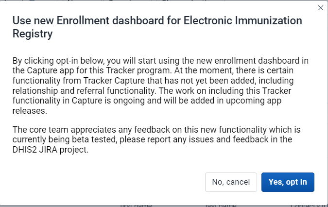

You can Select "Yes,opt in" and you will see the list of all patients enrolled in Electronic Immunization Registry for CH Mahosot.

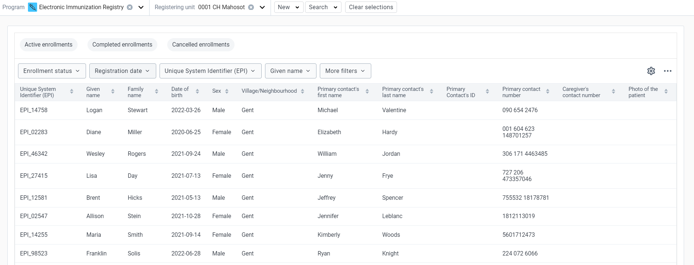

**Enrollment status filters:** If a program is selected, the app provides further filtering on the table based on enrollment status. This is displayed in the following order:

You can filter the list based on enrollments: 
* Active,
* Completed,
* Cancelled.

#### **Modify an event list layout - Select columns to show:**

You can select columns which columns to hide or show in the event list.
You can reorganize the order of the data elements by draging and dropping them in the list.

#### **Filter an event list**

**New feature for Filter** in capture app will let you filter the list by **Program Stage** as ahown in the below image

You can select the stage and click on update 

The filter option will now show only filters for **Birth details** program stage.

#### **Sort an event list**

You can sort the list by clicking the arrow down or up in ascending or descending order.

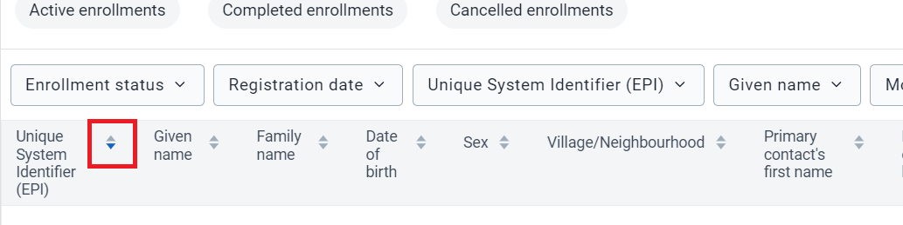

#### Predefined list views

You can setup your favorite views which can also be shared with others.A view can be saved by filters,column orders and event sort order.
This can be done by clickning on **Save current view**.

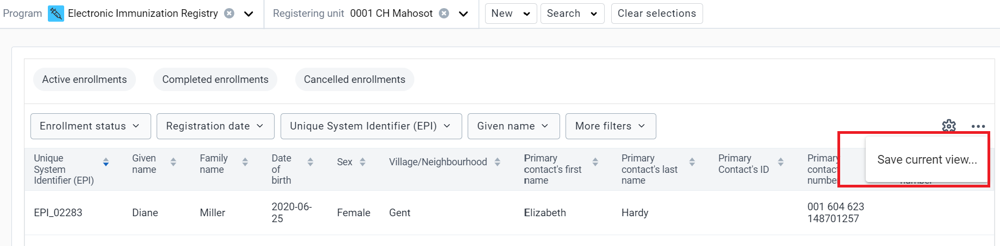

#### **Explain the unique system identifier (EPI)**

System generated ID’s can follow patterns that are defined by the user. This example uses the “"EPI_ + Random Number”

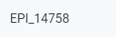

Go to the registration page and see that the ID will be generated. These ID’s can be a bit dynamic depending on the pattern that is defined to generate them. You can use inputs such as the date (used in this example), org unit codes, etc. The best resource to learn more is here:
[https://docs.dhis2.org/master/en/user/html/working-with-textpattern.html](https://docs.dhis2.org/master/en/user/html/working-with-textpattern.html)

**After you have explained the interface options, proceed to register a TEI into the program.**

### Part 2 : Registration

The capture app now has more support for tracker programs than before. Users will now be able to list and interact with tracked entity instances much in the same way as events, and will have access to searching and registering/enrolling tracked entity instances in the Capture app itself. The navigation between the apps will happen seamlessly. This will allow data entry user to access tracker and event data in the same place, and have a more integrated workflow.

**Register a TEI into the Electronic Immunization Registry Program** 

There are two ways of registering a TEI under an organization unit.

1. The first way is to register a tracked entity instance without enrolling it to a tracker program.

2. The second options is to register a tracked entity instance with program and enroll it.

#### Register a tracked entity instance without enrolling it to a tracker program**

1. Select program
2. Select organization unit.
3. Select **"New"**

    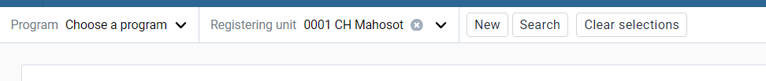

    You will be navigated to the registration page.In this page you will see a drop down menu similar to the one in the image below.

4. From the dropdown menu you can select a tracked entity type, eg. Person and Malaria Case.
Select the tracked entity type which you want to create a new instance for.

   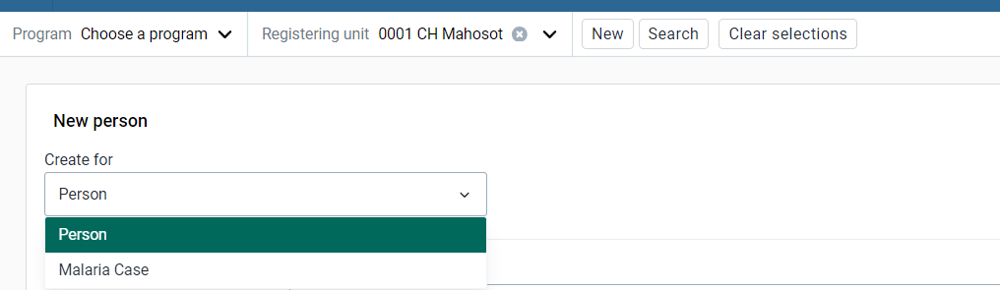

5. Once you select tracked entity type, a form will be shown on the screen for Profile of the person
   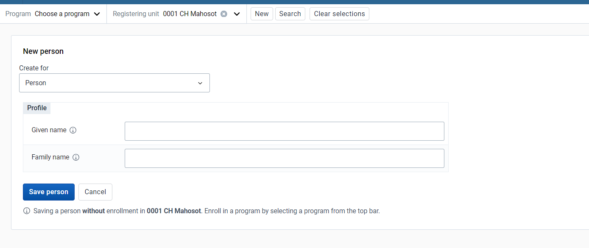
 
   Add data relevant to the tracked entity instance. The profile section mainly contains all the tracked entity attributes linked to the tracked entity type.

6. Click the Save person button to register the tracked entity instance.
You will now be prompted to the tracked entity instance dashboard.

   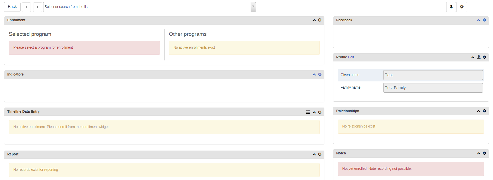

#### Register a TEI With a program enrollment**

1. Open the capture app.
2. Select a program " Electronic Immunization Registry".
3. Select an organisation unit.
4. Click **Create new person**

       Note: The label of this button corresponds to the tracked entity type of the program,which could vary as the tracked entity type.

   

5. Now you will be able to see the registration page for the Immunization program"

   

   It will display different information the way the enrollment page is customized for the program.

   In this form you have section for enrollment which shows enrollemnt date and then you have profile secction which is to capture demographic information.

6. Fill in the information and Click on Save button.

   

7. You will see the tracked entity dashboard.

   

The dashboard will show relevant information about the newly created tracked entity instance.
Both skip-logic and validation error/warning messages are supported during registration.

In later sessions, you will go over the terminology in more detail so just focus on describing the interface and actions for now. 

Enter a TEI that already exists (***Sharon***) in the system. You will be notified that a possible duplicate has already been found.

To do that Click on Search for a person in the program.Enter details.

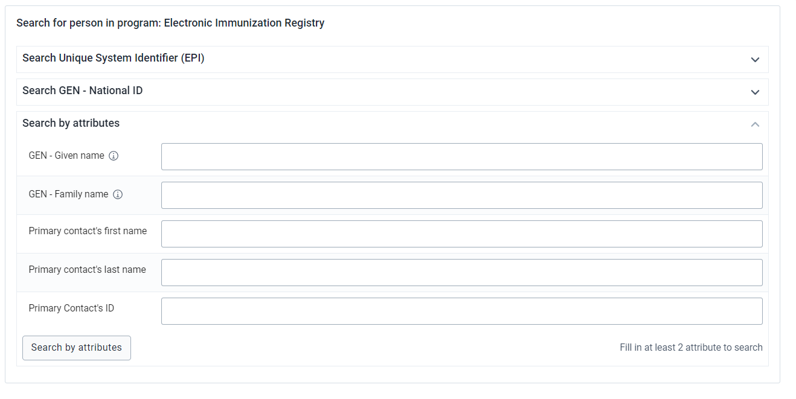

It will list all possible duplicates.

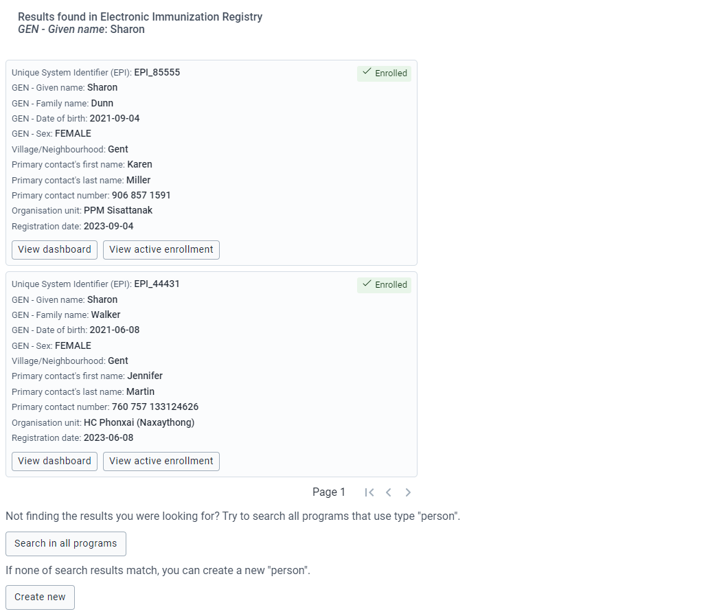

* You can choose to view the dashboard for the Tracked Entity Instance by clicking the "View dashboard" button

* You can view the the active enrollment of a Tracked Entity Instance by clicking the "View active enrollment" button

  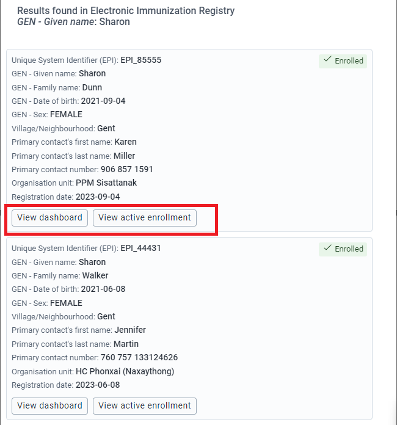

* **Fallback Search** the actual Tracked Entity Instance you are searching for may be within a different program. In that case, you may want to extend the search to other programs. This is known as a fallback search. To perform that search you need to Click on **Search in all programs**

  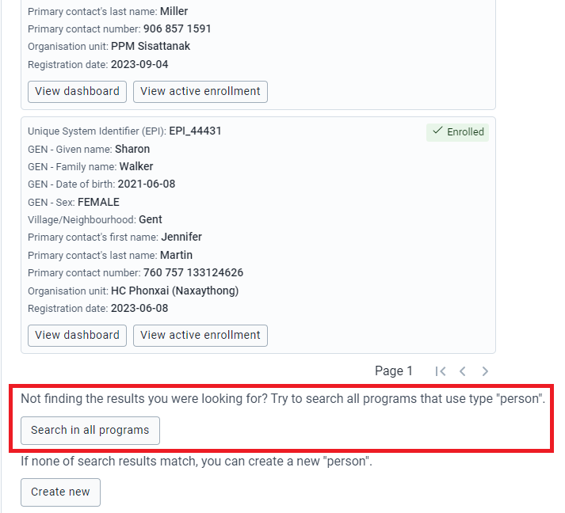

* Click on Create new person when the record is not found.

   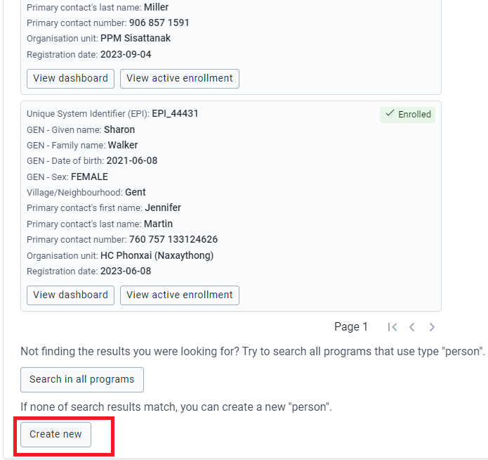

**Note :** This is a critical part of using a tracker and is meant to reduce the number of duplicate registries in the system. It should be emphasized that, when using tracker programs, we always emphasize searching for existing cases prior to registering new ones.

The details you entered during search will be brought over to the registration page so you do not need to enter them again. You can fill in the remaining fields in order to register the person. 

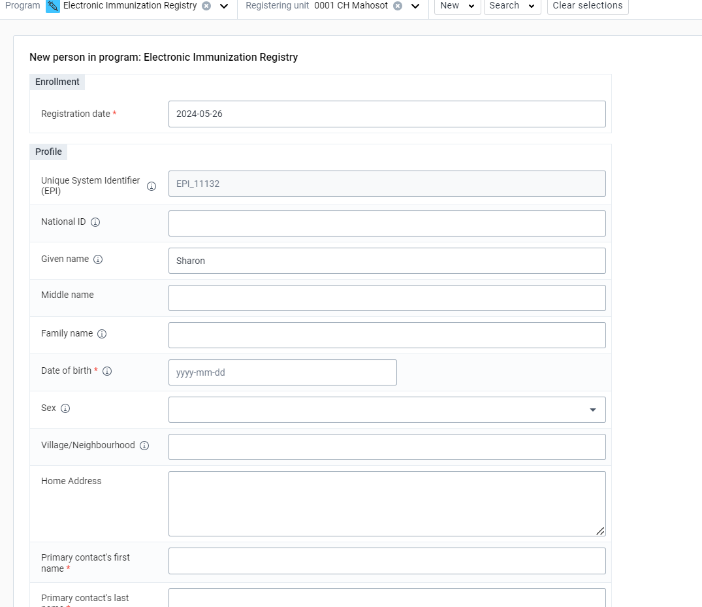

After entering the details proceed to click on “Save Person” in order to register the TEI. 

**STOP - Perform Exercise 1**   
   
### Part 3 : Describe the Tracker Dashboard

The dashboard starts with the following items:

1. **Top Bar/Header** - The top of the dashboard defines your context. For example in the image below the context is as follows, the selected program is "Electronic Immunization registry", the organisation unit is "CH Mahosot", the selected person is "Logan Stewart" and the selected enrollment is "2024-03-26".
2. **Quick Actions** - The widget will show the frequently used actions for the current enrollment.
3. **Program stage list** - Stages can be collapsed or expanded to reveal the events inside.

   **Collapsed stages:** In the collapsed state, you can view the summary information about stage including: 
   - Icon 
   - Program stage name 
   - Program stage description (on hovering the information icon) 
   - Total number of events - Last updated date Depending on the status of events, there can be additional information regarding: total number of overdue events or total number of scheduled events.

   

   **Expanded Stages:** 

   When you expand the list, you will see the table contains the data of events in the stage. 
   This includes mandatory columns:
   - Status, 
   - Report date and 
   - Registering unit, 
   - the following columns depend on the data elements that have been selected as Display in list of event.

   Events are sorted with most recent on top and other columns are also sortable.

   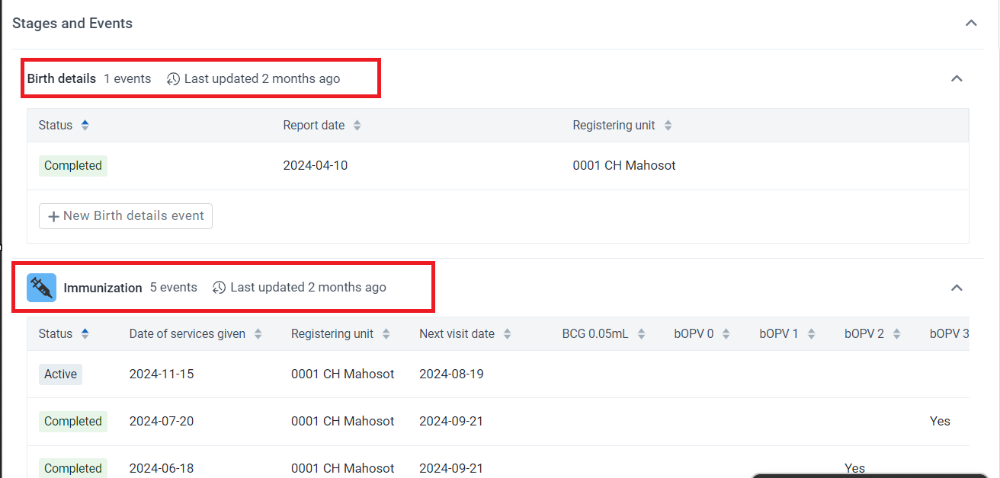

**Widget Descriptions**

1. **Stages and Events** - This is for doing data entry using either default or custom forms. Depending on program definition, in particular program stages, events will be displayed. Clicking on any of them displays the corresponding data entry. If a stage needs a new event,a tab for "New Immunization event" is displayed for new event creation. To proceed with data entry, it is mandatory to have an event date. Once an event date is specified it is not possible to change the due date. The assumption is that by specifying the event date, the event has already taken place. If the event hasn't occurred yet, it is possible to change the due date - this is effectively doing nothing but rescheduling. The buttons at the bottom help to change the status of a selected event. Another key feature from this widget is the addition of multiple comments for an event. Normally data recording is through data elements, however there are cases where it is necessary to record additional information or comments. This is where the comments comes handy. However, an interesting feature here is - it is not possible to delete a comment. The idea is that comments are more like log books. Both skip-logic and validation error/warning messages are supported during data entry.

2. **Enrollment** - This helps to enroll the TEI for the selected program. If an active enrollment already exists, the widget automatically displays it with some details about it. The widget also helps to do some operations on the selected enrollment - for example complete / cancel or a possibility to mark the enrollment for followup. The later one helps for example to deal with high-risk cases during case follow-up. A link to history is also provided if the TEI has historical enrollment.There can only be one active enrollment at a time. If there are no active enrollments, there will be a button Add new to enroll the tracked entity instance in the program again. 

3. **Feedback**- In this widget you can place summary information about the TEI for review. For example if the person has allergies or you want to display information on which vaccines they have received until now you can place this information here based on what has been entered in the program

4. **Indicators** - Any indicator defined for the selected program will have its value calculated and displayed under this widget.

5. **Comments about enrollment** - This is the same as event notes. The difference between the two is that, here notes are attached not to events but to enrollments. This helps to record some notes based on enrollment - for example why is an enrollment terminated or what is the overall observation of the TEI throughout the enrollment. In addition, if the tracked entity has registered a phone number, messaging will be available here. 

6. **Person Profile** - This is to edit TEI's profile or attributes. Here, if the TEI has an attribute of value type "Tracker Associate", a small icon next to the input field is displayed. Clicking the icon opens a popup where users are allowed to either search or register a new associate.

7. **Relationship** - This helps to relate the selected TEI (the one whose dashboard is shown) to another TEI. Adding a relative is possible by either searching from existing or registering a new one. If a program is selected while registering a new one, the new one will be automatically enrolled to the selected program. Another interesting feature in the relationship widget is attribute inheritance. For example having a contact relationship with the affected patient for this you want to add a relationship with a person with a current patient that has been registered in a case based surveillance program. If among others first name, last name and address attributes are required for both Programs.

**STOP - Perform Exercise 2**

### Part 4 : Data Entry Steps

- To start entering data you need to select a stage and click on **"Add New Event"** for a stage.

- Select the Date and fill out the data. When you see dataelements you will only see the two are three vacines as per the suggested age.This is a result of using program rules which have been defined to allow for these to be hidden upon the appropriate selection of another data element value. 
- When you have entered some data, click on “Complete.”

  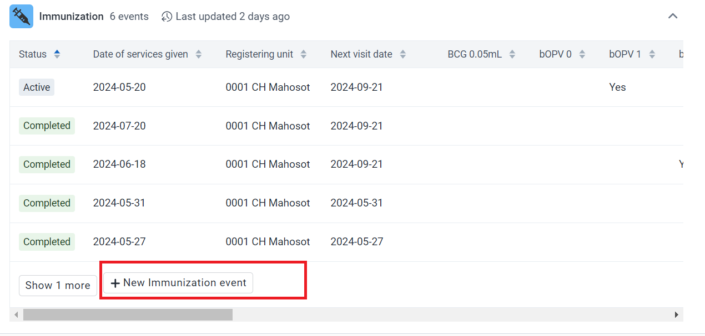

  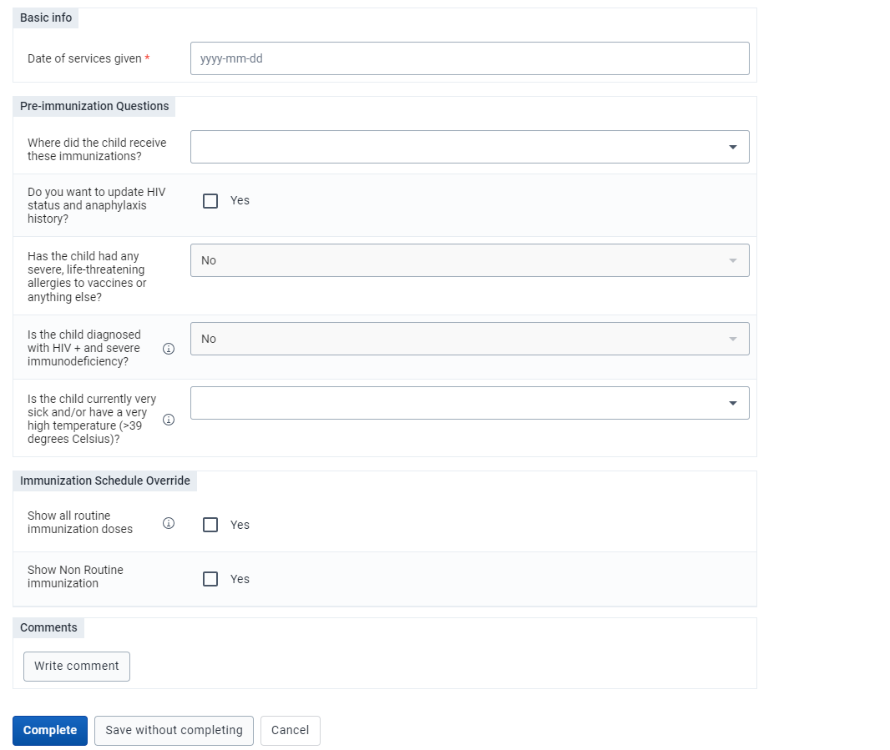

A prompt will ask you if you are sure you want to create a new event.

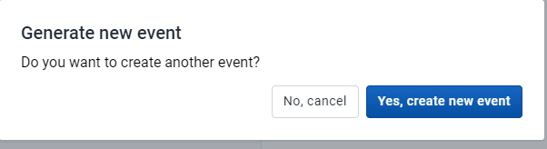

Also it will show you warnings based on the data value entered in the form.

After you complete , you can schedule another event. 

- Click on Schedule tab and this will automatically schedule a new event based on the next dose date suggested through program rule on the basis of duration and type of dose. Click on "Schedule" if you are ok with the date as suggested or else you can schedule the date.

   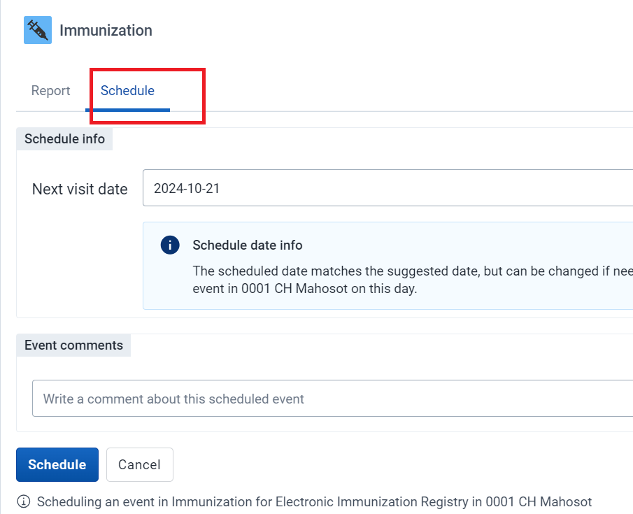

- This will be seen under the "Stage and events" in the main TEI dashboard where you can see the scheduled event on the **top of the list**. This is all to take advantage of the program rules that are in place to allow for different vaccines to appear based on the schedule defined previously. 

  

#### Add a Relationship

To perform this step we will refer to **Contact tracing program**

In the capture app ,Relationships is only supporting Event to Tracked entity relationships.

1. While you are in an event,Click Add Relationship
2. Selct the relationship you want to create.

    

3. Select a New TEI Relationship

   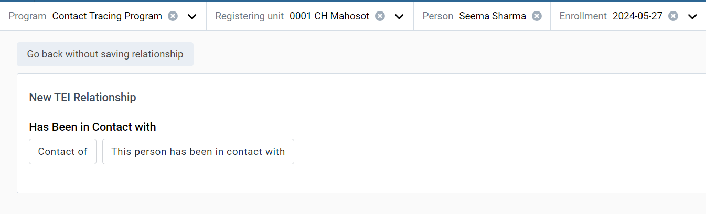

4. You now will get two options:
  * Link to an existing tracked entity instance
  * Create new tracked entity instance

    

##### Adding a relationship by Linking to an existing person.

1. Click on **Link to an existing person**. You will see a Program search option where you can select a program where you want to search your TEI.

2. Once you select a program , attributes will be seen to filter down the search for the existing tracked entity. You can search for attributes or by system generated ID

    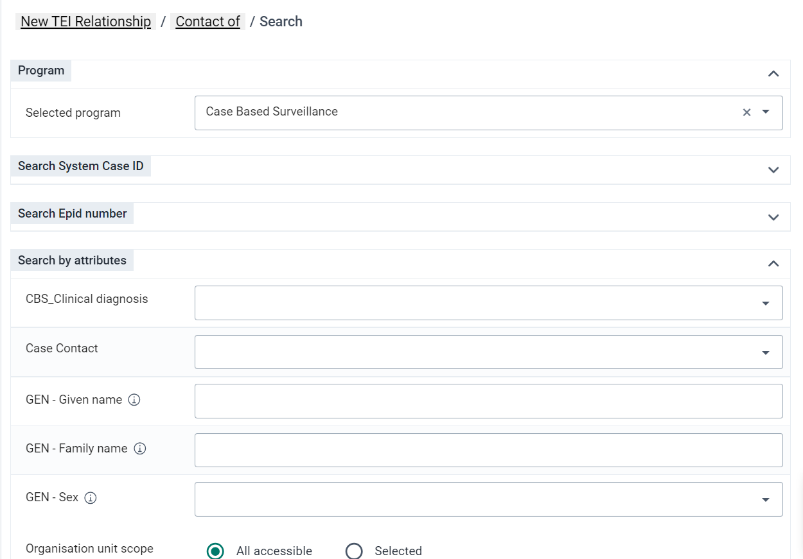

3. You can also narrow down the search by clicking on the "Organisation Unit Scope"

    

4. After a Search you will be presented with a list of Tracked Entity Instances matching the search criteria. To create a relationship click the **Link** button on the Tracked Entity Instance you would like to create a relationship to.

    

5. You will see the new relationship has been added under relationship widget in the personal dashboard 

    

##### Adding a relationship by Creating a new Tracked Entity.

1. Click on **Create new Tracked Entity Instance**.
2. You will be presented with a form for registring a new person.You can choose to register this person with or without enrollement to the program
3. You can change the Organisation unit by removing the one that is automatically set and selecting a new one.

    

    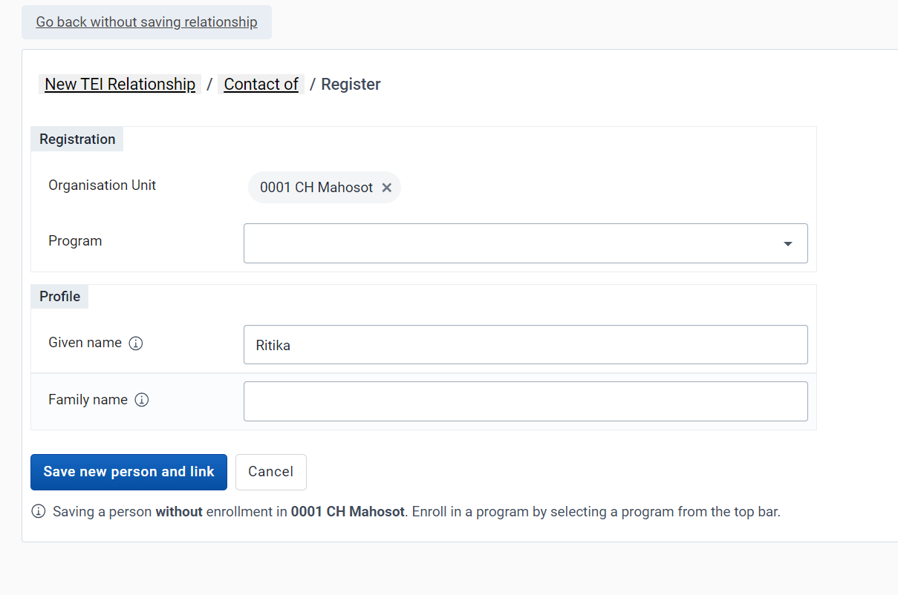

**STOP - Perform Exercise 3**

## Assignment

After you have completed all demos and they have finished the exercises, have them complete the graded assignment for this session. If you find you are running out of time, assign the graded assignment to them and ask them to complete it outside of the live scheduled session.
