# Trainer’s guide to Capture

## What is this guide?

This guide is a support document for DHIS2 Academy trainers for the session “Demonstrating and using Capture App (Web).”

This session follows the standard Academy training approach with: 
 
1. A live demo session where the trainer demonstrates and explains the features, and 

2. A hands-­on session with exercises where participants get to practice the same features.

This guide will help the trainer​ prepare​​ for the live demo session. The “Live Demo step by step” section has a detailed walkthrough of all the steps to demonstrate with explanations and screenshots that should be easy to follow. Use that when preparing for the live demo session.

There is also a Quick Guide which lists the steps very briefly and this is meant as a lookup guide or “cheat sheet” WHILE doing the demo, to help the trainer remember all the steps and the flow of the demo.

## Learning objectives for this session

The overall objective of this session is to use the DHIS2 capture app. Detailed objectives include:

* Understand how to select the correct program
* Understand the layout and options of capture app
* Understand how to register a TEI
* Understand how to fill in program stage details
* Demonstrate how to search for a TEI in capture app
* Demonstrate how skip-logic can be used in a program

### Time Requirements

Live Demo: 1.5 hours

Hands-on Exercises: 1.5 hours

## Background

In the Capture app you register events that occurred at a particular time and place. An event can happen at any given point in time.

Events are sometimes called cases or records. In DHIS2, events are linked to a program.

The Capture app lets you select the organisation unit and program and specify a date when an event happened, before entering information for the event. Some events are linked to a tracked entity instance, for example a person, allowing longitudinal follow-up.

As programs are entered on an individual basis, program based data is entered based on the report or enrollment date as defined by the programs requirements. Tracker capture by design is not anonymous in nature, and therefore person details are attached to each event.

In this demo, the **Electronic Immunization Registry** and **Malaria Case Notification, Investigation and Response** demo programs that have been created will be used to demonstrate the features of capture app.
 
## Preparations

Ensure that there are existing records in the demo DB and that you are able to register TEI's and enter event data correctly.

You should consider running through the entire demo prior to presenting it. After this, you should take the quick guide and supplement it with any additional notes you made while running through the demo. If you identify any changes that may be required or additional explanation that would be helpful within the session, please contact the capacity building team in order to allow us to evaluate how to best integrate this feedback into the material.

Also, the learner's guide and session summary are the main material that will be provided to the learner's with both detailed steps for ungraded exercises as well as the key messages from the session. Review these as well to ensure you are able to get these key points across during your demonstration.

## Best Practices

Before starting the demonstration, please keep in mind that the most important thing is that the audience is following, so make sure to ask questions to the audience to verify that they are following. If something is unclear, go back and go through it slowly. If you don’t have time for all the steps, it is better to cut some steps, than to go fast while nobody understands. 

Prior to starting the actual demo, It is a good idea to do a quick overview of the stages and program flow so everyone understands the use-case clearly.

In an online setting, you will be breaking regularly to allow them to perform various ungraded exercises in order to keep them engaged.

If the participants are doing the demo with you at the same time, you can take time to go around the audience and help them if the academy is happening onsite. There should be a team of trainers doing this at all times as well.

## Quick Guide

## Live Demo step by step

### Part 1: Explain the capture interface and options 

**Electronic Immunization Registry Overview**

1. Open the Capture from the Apps menu

   

2. Find and select the program ("Electronic Immunication Registry")

   

3. Select the site for (Registering unit) in the org unit hierarchy

   

The **Electronic Immunization Registry** is linked to any Organisation Unit at the health facility level. CH Mahosot has some example cases already entered.

> **Note** 
>
> Any person that is already registered will be displayed in a tabular fashion, with each row corresponding to a single record. You can display this list in program maintenance when you configure your program if needed.
 
   

**Enrollment status filters:** If a program is selected, the app provides further filtering on the table based on enrollment status. This is displayed in the following order:

You can filter the list based on enrollments: 
* Active,
* Completed,
* Cancelled.

#### Modify an event list layout - Select columns to show:

You can select which columns to hide or show and rearrange them in the event list by selecting the settings/gear icon.

From here, you can reorganize the order of the program inputs by dragging and dropping them within the list.

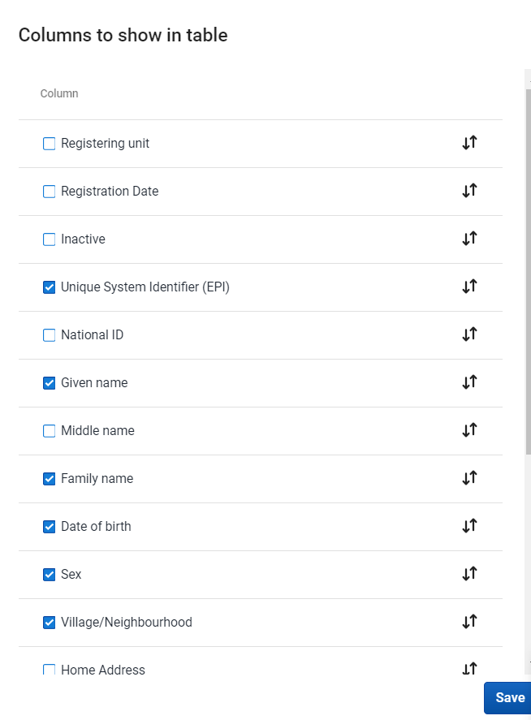

#### Filter an event list

**New feature for Filte:** the capture app will let you filter the list by **Program Stage**, as well as other additional fields, by selecing "More filters" as shown in the image below

You can select the stage and click on update 

The filter option will now show only filters for **Birth details** program stage.

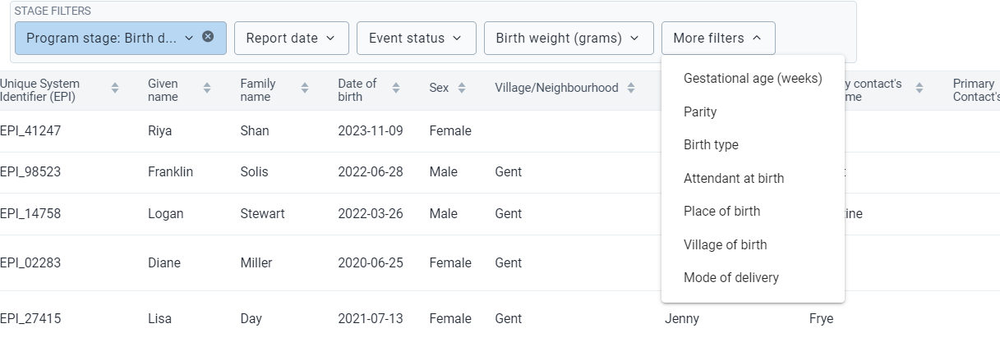

#### **Sort an event list**

You can sort the list by clicking the arrow down or up in ascending or descending order.

#### Predefined list views

You can setup your favorite views which can also be shared with others. A view can be saved by filters, column orders and event sort order. 

This can be done by clickning on **Save current view**.

#### **Explain the unique system identifier (EPI)**

System generated ID’s can follow patterns that are defined by the user. This example uses the “"EPI_ + Random Number”

Go to the registration page and see that the ID will be generated. These ID’s can be a bit dynamic depending on the pattern that is defined to generate them. You can use inputs such as the date (used in this example), org unit codes, etc. The best resource to learn more is here:
[https://docs.dhis2.org/master/en/user/html/working-with-textpattern.html](https://docs.dhis2.org/master/en/user/html/working-with-textpattern.html)

**After you have explained the interface options, proceed to register a TEI into the program.**

### Part 2 : Registration

The capture app now has more support for tracker programs than before. Users will now be able to list and interact with tracked entity instances much in the same way as events, and will have access to searching and registering/enrolling tracked entity instances in the Capture app itself. This will allow data entry user to access tracker and event data in the same place, and have a more integrated workflow.

**Register a TEI into the Electronic Immunization Registry Program** 

There are two ways of registering a TEI under an organization unit.

1. The first way is to register a tracked entity instance without enrolling it to a tracker program.

2. The second options is to register a tracked entity instance with program and enroll it.

In this demo, we will focus on registering a TEI within a program.

1. Open the capture app
2. Select the program "Electronic Immunization Registry"
3. Select an organisation unit
4. Select New -> New person in Electronic Immunization Registry

> Note: The label of this button corresponds to the tracked entity type of the program, which will vary depending on the tracked entity type (ie. in this case we see new person, as person is the TET)

Now you will be able to see the registration page for the Immunization program

   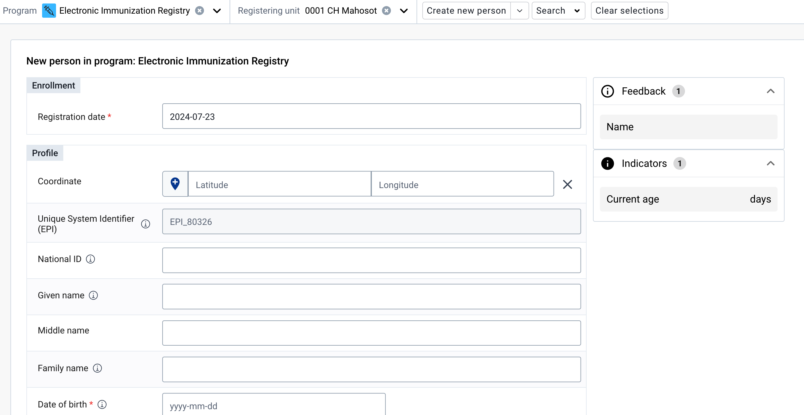

   It will display different information the way the enrollment page is customized for the program.

   In this form you have section for enrollment which shows enrollemnt date and then you have profile secction which is to capture demographic information.

5. Review the TEI registration page

As you navigate the fields notice the exclamation icon next to the field names. If you hover over this, you will see a description of the field.

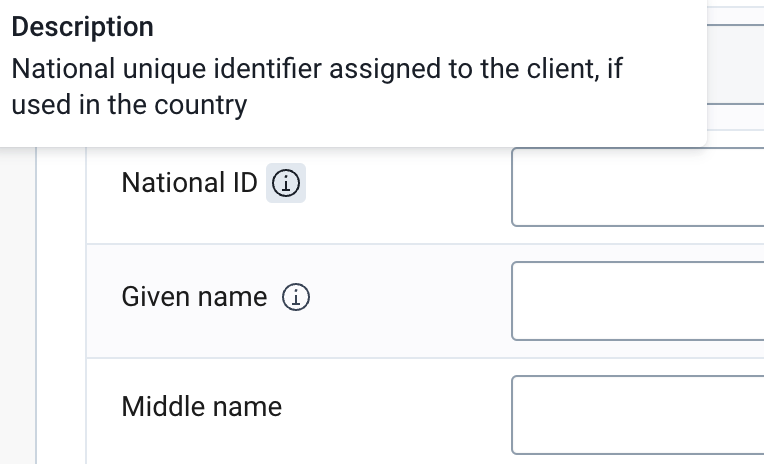

Fields that have a red star next to them indicate they are mandatory and must be filled in.

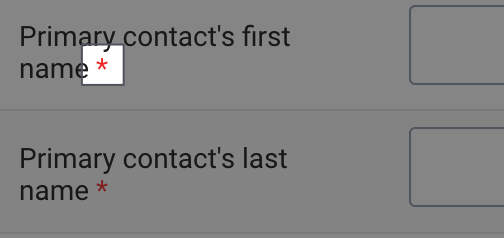

Fill in the fields and save the person when you are ready

   

6. You will then see the tracked entity dashboard.

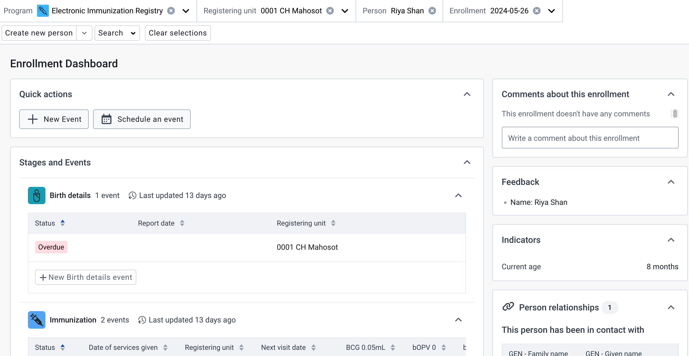

The dashboard will show relevant information about the newly created tracked entity instance.
Both skip-logic and validation error/warning messages are supported during registration.

In later sessions, you will go over the terminology in more detail so just focus on describing the interface and actions for now. 

#### Duplicates during registration

Navigate back to the TEI front page list in capture by closing the person you just registered.

Proceed to register a new TEI using the same process as before (ensure the program and registering unit are selected then select New - New person in Eletronic Immunization Registry)

Try to register a person with the following details

- Given Name : Diane
- Last Name : Miller
- Primary contacts first name : Elizabeth
- Primary contacts last name : Hardy

When you select Save person, you should see the following dialogue.  

It has identified this as a possible duplicate. You have options to view the dashboard, which will take you to this persons dashboard for review, to cancel so you do not register this person, or to save as new, which will overrride the warning and save the TEI.

In real life scenarios, it will be important to implemenet as many procedures as possible to reduce duplicates. This feature can help with reducing duplicates at the sources. We will also discuss how to search for TEIs later on in this session.

**STOP - Perform Exercise 1** 

### Part 3 - Searching

Let us now find the new tracked entity that we had previously registered. 

From the main list page in capture, select Search - > Search for a person in Electronic Immunization Registry.

The search page will then be seperated into a couple of options.

First, you will see the tracked entity attributes that are identified as unique. This is what we see in options 1 and 2 in the image above. 

Next, in 3, we will see the "search by attributes" option. This allows us to search using any of the other tracked entity attributes that have been configured to allow search in this program. 

Where possible, using a unique identifier will yield the best results when searching. For example, I can enter the EPI unique ID and I will quickly find the person I previously registered.

If I select "Search by Unique System Identifier (EPI)" and I have the correct ID, it will take me directly to the persons dashboard. 

A more common method may be to use the "Search by attributes" feature. 

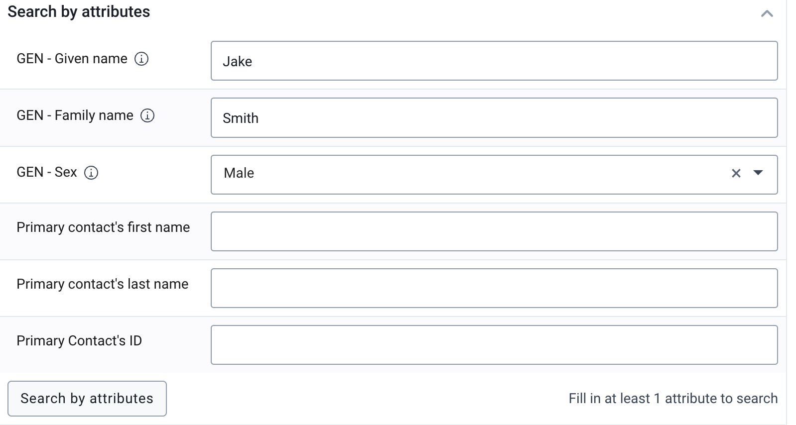

If I enter these details and select "Search by attributes", I will then by shown a list of results in which I can select the correct TEI based on the attributes I have entered

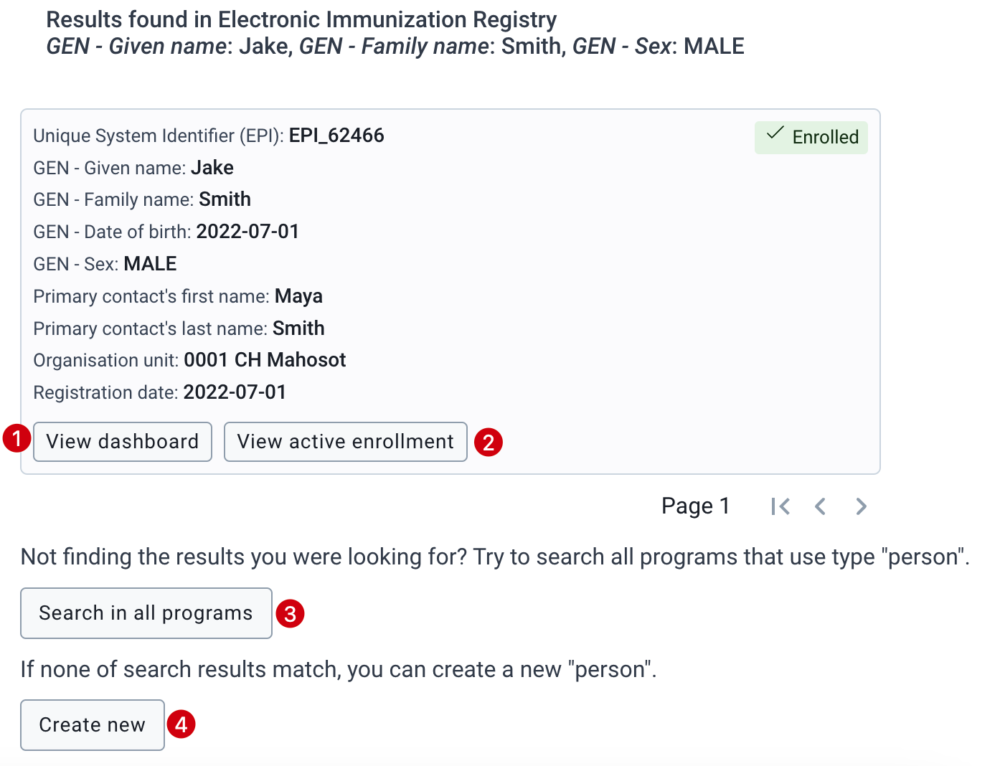

1. View dashboard: this will take me to the persons tracker dashboard
2. View active enrollment: this will open the dashboard and take me to the active enrollment in the program
3. Search in all programs: if the TEI I searched for is not in the program I have selected, I can also search in every program to make sure I do not duplicate this TEI
4. Create new: if the TEI I searched for does not exist, then I can create a new one based on the search details I entered

In this example, select "view dashboard" to open the persons tracker dashboard.
   
### Part 4 : Describe the Tracker Dashboard

The dashboard starts with the following items:

1. **Top Bar/Header** - The top of the dashboard defines your context. For example in the image below the context is as follows, the selected program is "Electronic Immunization registry", the organisation unit is "CH Mahosot", the selected person is "Logan Stewart" and the enrollment date is "2024-03-26".
2. **Quick Actions** - The widget will show the frequently used actions for the current enrollment.
3. **Program stage list** - Stages can be collapsed or expanded to reveal the events inside.

   **Collapsed stages:** In the collapsed state, you can view the summary information about stage including: 
   - Icon 
   - Program stage name 
   - Program stage description (on hovering the information icon) 
   - Total number of events - Last updated date Depending on the status of events, there can be additional information regarding: total number of overdue events or total number of scheduled events.

   

   **Expanded Stages:** 

   When you expand the list, you will see the table contains the data of events in the stage. 
   This includes mandatory columns:
   - Status, 
   - Report date and 
   - Registering unit, 
   - the following columns depend on the data elements that have been selected as Display in list of event.

   Events are sorted with most recent on top and other columns are also sortable.

   

4. Widget Descriptions

1. **Stages and Events** - This is for doing data entry using either default or custom forms. Depending on the program definition, in particular program stages and events will be displayed. 

2. **Person Relationships** - This helps to relate the selected TEI (the one whose dashboard is shown) to another TEI depending on the relationships that are defined in the system.

3. **Comments about enrollment** - This is to allow you to make any general comments on the enrollment of the TEI.

4. **Indicators** - Any indicator defined for the selected program will have its value calculated and displayed under this widget.

5. **Feedback** - In this widget you can place summary information about the TEI for review. For example if the person has allergies or you want to display information on which vaccines they have received until now you can place this information here based on what has been entered in the program

6. **Person Profile** - This is to edit TEI's profile or attributes. 

7. **Enrollment** - The enrollment widget shows key details regarding the enrollment. A number of actions can also be completed via this widget related to the enrollment including:

- Change the enrollment status to Active, Canceled or Completed using the buttons in the menu.
- Mark or remove the enrollment for a follow-up.
- Transfer the enrollment to another organisation unit
- Delete the enrollment
- Add coordinates to the enrollment

**STOP - Perform Exercise 2**

### Part 4 : Data Entry Steps

- To start entering data you need to select a stage and click on **"New Event"** for a stage. Events can also be automatically generated upon enrollment, which is the case in our example program.

- In cases where the event is automatically generated you can select the event in order to start entering data into the program stage.

 

- Select the Date and fill out the data. 

 

 1. Select a report date
 2. Fill in the data for the event
 3. Complete the event
 4. Select save

  

After saving the event, you will see a summary of the event you have saved. From here, you can select "Back to all stages and events" in order to proceed.

Note that the option to add a new birth details event is now greyed out. This is because this is a non-repeatable program stage, meaning it can only have one event within the stage.

If an event is not automatically created, then you will have to make a new event. This is the case in the "Immunization" program stage. Select "New Immunization event" to create a new event for this stage.

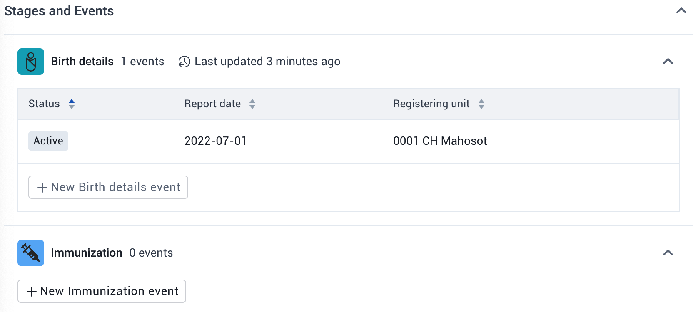

From here, we follow the same steps as before to fill in information for the event. 

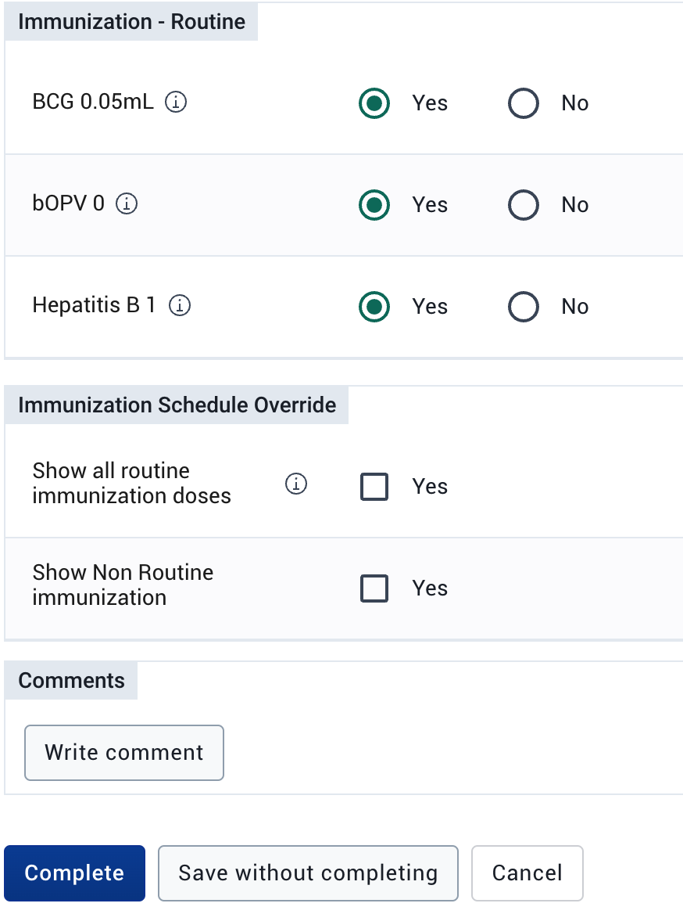

Note that you only see the vaccines that are given at birth in this initial event. This is a result of program rules that have implemented a vaccination schedule based on the child's date of birth.

As the immunization stage is repeatable (a person will attend multiple vaccination events over time) We can schedule the next vaccination visit by selecting "schedule an event" from the tracker dashboard.

It will give you a suggested date based on the program configuration; however you can change this if needed. As the next routine dose is typically 6 weeks after birth, select a date 6 weeks or beyond the date of birth. Select "Schedule" to schedule the event. This will take you back to the tracker dashboard, where you will see the event listed along with the expected visit date.

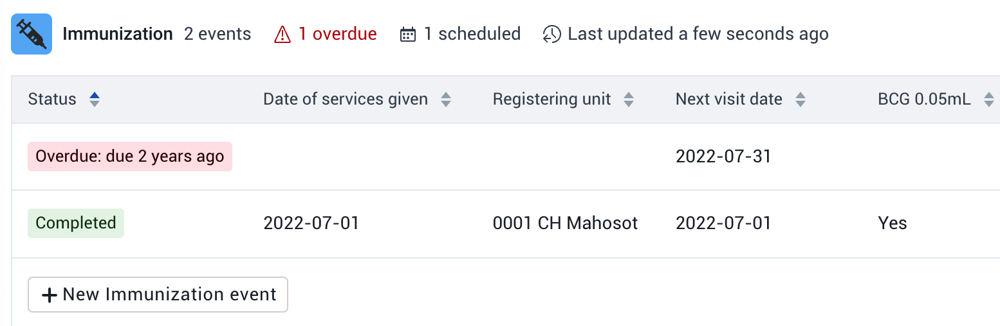

If you quickly open this event up and select a date 6 weeks from the date of birth, you will now see the next routine doses in the schedule.

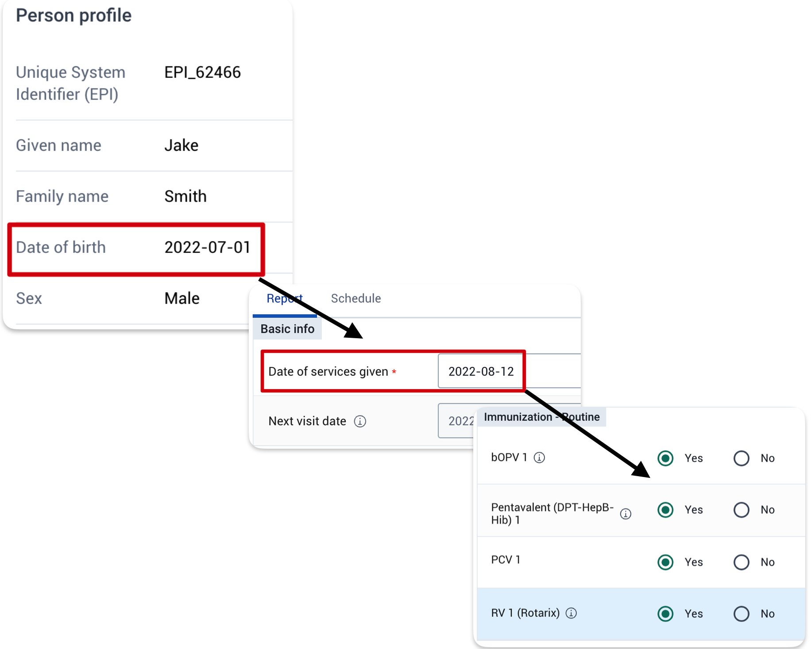

In summary, the data entry process is as follows.

1. Register a new TEI if it doesnt exist
2. Find an existing TEI if it does exist
3. Review the stages and events section of the tracker dashboard
4. Update automatically generated events or add new events as needed
5. For repeatable stages, events can be scheduled as well as being created as needed

#### Add a Relationship

To perform this step we will refer to **Contact tracing program**

In the capture app ,Relationships is only supporting Event to Tracked entity relationships.

1. While you are in an event,Click Add Relationship
2. Selct the relationship you want to create.

    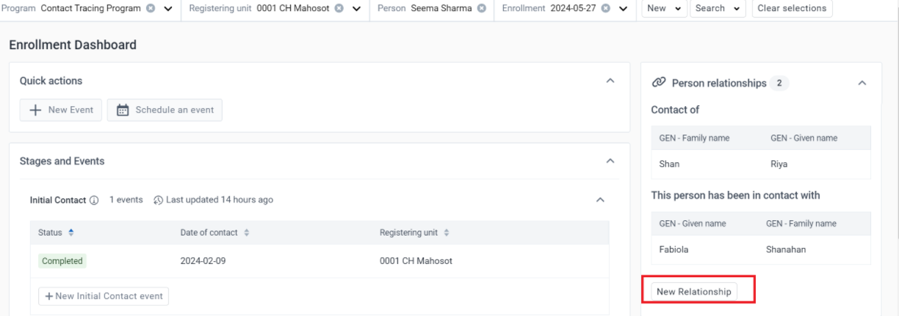

3. Select a New TEI Relationship

   

4. You now will get two options:
  * Link to an existing tracked entity instance
  * Create new tracked entity instance

    

#### Adding a relationship by Linking to an existing person.

1. Click on **Link to an existing person**. You will see a Program search option where you can select a program where you want to search your TEI.

2. Once you select a program , attributes will be seen to filter down the search for the existing tracked entity. You can search for attributes or by system generated ID

    

3. You can also narrow down the search by clicking on the "Organisation Unit Scope"

    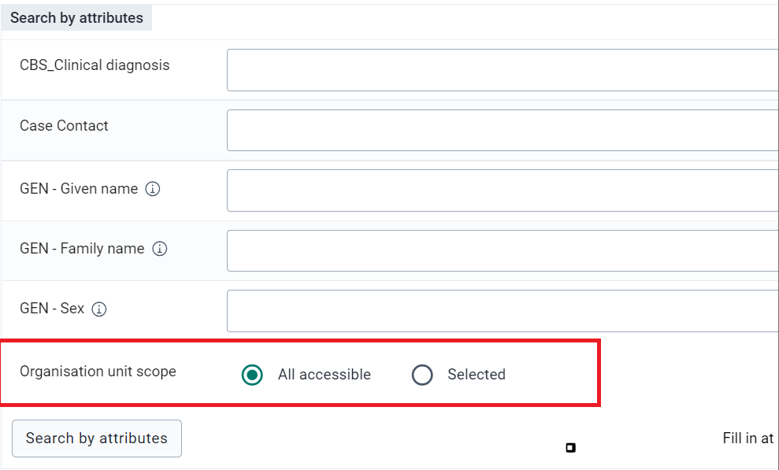

4. After a Search you will be presented with a list of Tracked Entity Instances matching the search criteria. To create a relationship click the **Link** button on the Tracked Entity Instance you would like to create a relationship to.

    

5. You will see the new relationship has been added under relationship widget in the personal dashboard 

    

##### Adding a relationship by Creating a new Tracked Entity.

1. Click on **Create new Tracked Entity Instance**.
2. You will be presented with a form for registring a new person.You can choose to register this person with or without enrollement to the program
3. You can change the Organisation unit by removing the one that is automatically set and selecting a new one.

    

    

**STOP - Perform Exercise 3**

### Part 6 - Referrals and Transfers

## Assignment

After you have completed all demos and they have finished the exercises, have them complete the graded assignment for this session. If you find you are running out of time, assign the graded assignment to them and ask them to complete it outside of the live scheduled session.

