# Trainer’s Guide to Android Analysis

## What is this guide?

This guide is a support document for DHIS2 Academy trainers for the session “Android Analysis.” This session follows the standard Academy training approach with

1. a live demo session where the trainer demonstrate and explain the features, and 
   
2. a hands-­on session with exercises where participants get to practice the same features.

This guide will help the trainer​ prepare​​ for the live demo session. The “Live Demo step by
step” section has a detailed walkthrough of all the steps to demonstrate with
explanations and screenshots that should be easy to follow. Use that when preparing for
the live demo session.

There is also a Quick Guide which lists the steps very briefly and this is meant as a lookup
guide or “cheatsheet” WHILE doing the demo, to help the trainer remember all the steps
and the flow of the demo.

## Learning objectives for this session

1. Demonstrate how maps are displayed in the tracker program and the use of the following elements:
   1. Carousel
   2. Navigation to location
   3. Map layers
   4. User current location
2. Understand how TEI Analytics work
   1. Data element evolution
   2. Program indicators

## Time Requirements

## Background

In this session, we will give the participants an opportunity to review the various features implemented within the android app to facilitate local analysis of data. These features can function when they are offline using data stored on the android device itself, and has the potential to add value within an implementation when used correctly.

## Preparations

Go through the Live demo step by step guide a few times before doing the actual demo for participants.
Make sure your user account is same or similar to the participants’ training accounts so that you don’t show more features, dimension options or forms than what they can see when doing the exercises.
Make sure the resolution on projector is OK for zooming

Create an account with the same level of access as the users you are demonstrating to (ie. if they can only search and enter within one facility, have your user have the same authority). If it is the procedure to enter this data from a paper form, it will be useful to have a copy of the form they would normally use as reference filled in. This can just be a form that you have filled in yourself for example. If they are entering data in real-time, then this is not required but you should prepare the details of an example case that you can follow in your examples.

For the exercises and small activities during the demo, fill out a couple extra forms that the participants can use to register their own cases. Your training DB should have some existing cases filled in to help support the working list filter, relationships and searching functionality. If demonstrating the working lists functionality, you will need to have a subset of the events you have created and assigned to a user where you can show this functionality.

### APK File

Make sure that you have the app made for training purposes otherwise you will not be able to cast your screen:

https://github.com/dhis2/dhis2-android-capture-app/releases

This will be denoted by “training” at the end of the APK file.

### Projecting your Android Device

The instructor will have to decide on which method they would like to use to mirror the android app on their computer screen. They will also have to set up a user account (if it doesn’t exist already) that is assigned to the same org unit as the program they are demonstrating.

Please review this CoP post for details on options you may use to mirror your android device:

https://community.dhis2.org/t/how-to-clone-your-android-screen-useful-for-presentations-debugging-etc/38077

### User Account

Ensure that there is a user account assigned to a lower level set of org units at the facility level within Trainingland that you can use prior to performing this session. If the participants are following along, ensure that there are user accounts for them to use as well assigned to lower level organization units. The demo user account is:

Username: android1

Password: District1#

### Participants

Send the instructions to the participants on how to install the Android app prior to the session. The instructions can be found [here](https://docs.google.com/document/d/1SUUUdmPSDycFtdB9yUMq8ZWiWf8gNOu5xvtNj4_V63U/edit?usp=sharing).

Some participant's may not have been able to install the app by themselves. In that scenario, you may need to walk them through how to do this via google play.

## Quick Guide

1. Review the maps display within the COVID-19 contact registration & follow-up program
   - Select the program and open the maps tab
   - Cycle through the carousel
   - Select a TEI and navigate to their dashboard
   - Navigate to the TEIs location (than switch back to the original maps display)
   - Change the map layers to show the heatmap and use the satellite view
   - Navigate to your location
2. Review data element evolution charts within the COVID-19 contact registration & follow-up program
   - Search for the TEI Carlos Barker
   - Navigate to the analytics tab
   - Review and explain the chart that is shown
   - Move between visualization types
   - Explain the filters
3. Review program indicators within the COVID-19 Case-based surveillance program
   - Search for the TEI Matthew Maker
   - Review the events in stage 3
   - Navigate to the analytics tab
   - Review and explain the program indicator “Total number of tests”
4. Review program feedback within the COVAC -COVID-19 Vaccination Registry Program
   - Search for the TEI Melissa Ortiz
   - Navigate to the analytics tab
   - Review and explain the various information that is displayed

## Live Demo step by step

Before starting, login to the android app using your training instance.

### Review the maps display within the COVID-19 contact registration & follow-up program

The android app will display the map screen in event or tracker programs that contain one or more of the following elements:

- Event coordinates/Polygon
- TEI coordinates/Polygon
- Enrollment coordinates/Polygon
- Tracked entity attributes type coordinate
- Data elements type coordinate

#### Open the map

To access the demo map open the COVID-19 Contact Registration & Follow-up program. At the bottom you’ll see the navigation bar. Select the map icon to access the map (note, in order to use this feature, your program needs to be collecting the coordinate during registration).

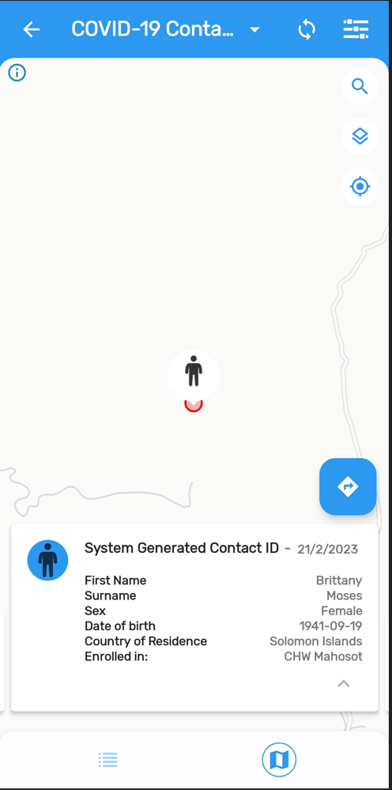

#### Cycle through the carousel

After opening the map icon, you will see TEI details at the bottom of the screen. This is referred to as the map carousel. You can scroll through all of the individuals registered in this program by scrolling horizontally the carousel.  The map will zoom into the selected coordinates. If there are no coordinates shen a message will be shown. Each card in the carousel displays the tracked entity attributes marked as ‘Display in list’ when you configure your program. Click on the arrow to expand the card information. 

If the TEI contains an image as an attribute you will also see the picture instead of the Person icon. 

Click on the card to open the TEI dashboard

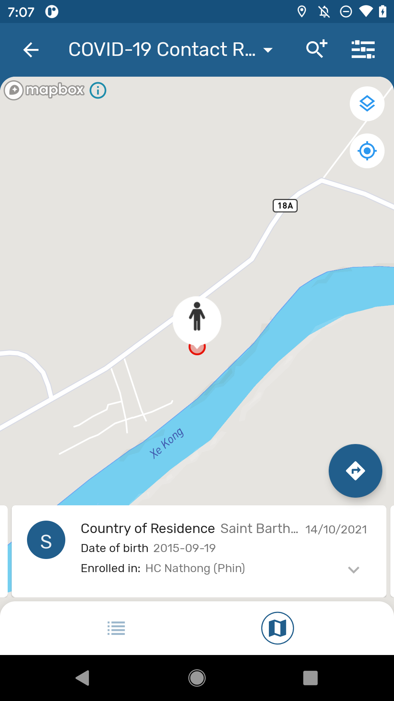 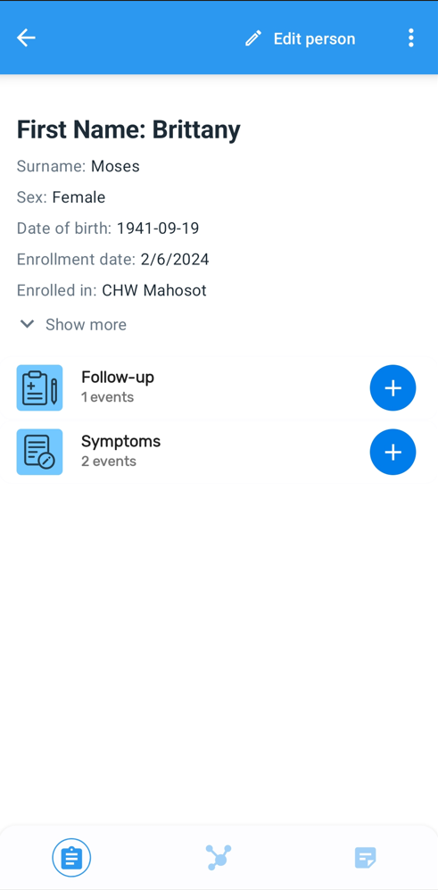

#### Navigate to the TEIs location (than switch back to the original maps display)

From the TEI dashboard, select back. This will take you back to the map. If the TEI or event has coordinates then a navigation icon will be displayed at the top right corner of the card. When you click it, your device will ask to select an app to open the location (if you have multiple maps apps, if not it will use the default one). This will take you to the location in the maps app you have selected.

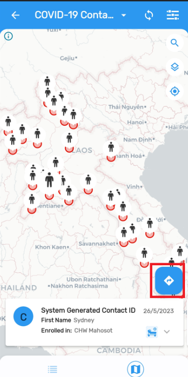 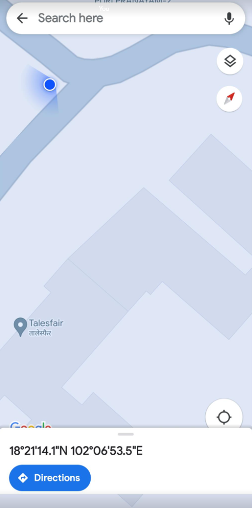

#### Change the map layers to show the heatmap and use the satellite **view**

Go back to the maps information by selecting back on your device. By clicking the first button at the top right corner, a menu will appear displaying all the possible layers.

Map layers you will see here include (depending on the configuration of the program): TEI coordinates, enrollment coordinates, Individual stage coordinates,  relationships, heatmap, tracked entity attributes of coordinate type, and data elements of coordinate type.

In the COVID-19 Contact Registration & Follow-up program the app offers the TEI and Enrollment coordinate. Select the satellite view and the heatmap to show how the map changes, click on the “Apply” button to the changes.

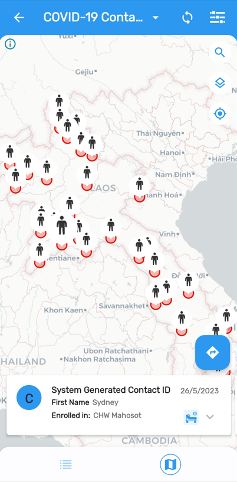 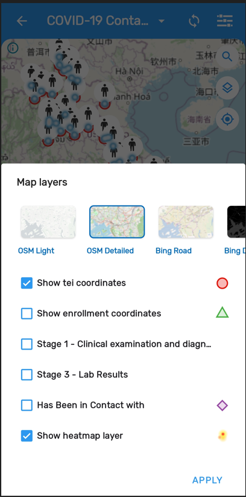 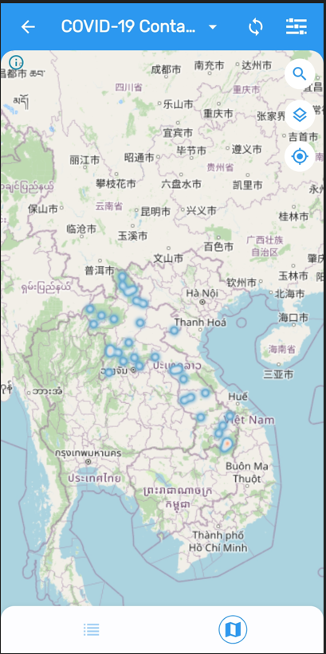

#### Navigate to your location

If the user grants location permissions to the App, the map will show the current location represented as a blue color dot. The maps in the DHIS2 Android Capture App now include the possibility to center the map on the user location.

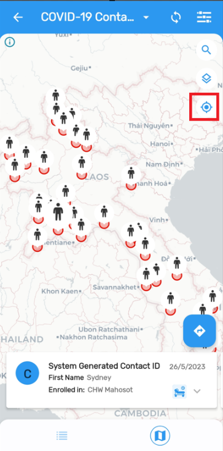

#### STOP! Have them perform *Exercise 1* in the learner's guide.

### Review data element evolution charts within the COVID-19 contact registration & follow-up program

Exit the maps tab and go back to the list within a program. 

It is possible to display the evolution of data elements over time as charts, values or tables. It is important to explain that this analysis will be available only for numeric value types within a repeatable stage.

Select the COVID-19 Contact Registration & Follow-Up Program and search for the TEI “Carlos Barker”

Open the Analytics menu in the TEI dashboard navigation panel and show the chart.

The chart here shows the weight of the person as taken from different repeated events within a program stage. In this example, you are seeing a person’s weight in kg. The example is not as applicable as it could be for monitoring COVID-19; however this type of output might make more sense in a nutrition or RMNCAH program for example.

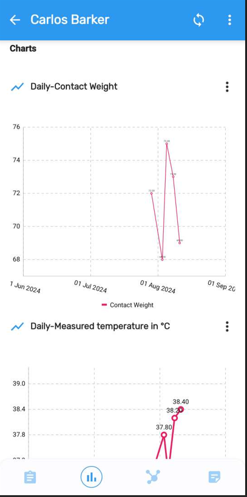

Explain it is possible to change the visualization to bars, line, table or single value

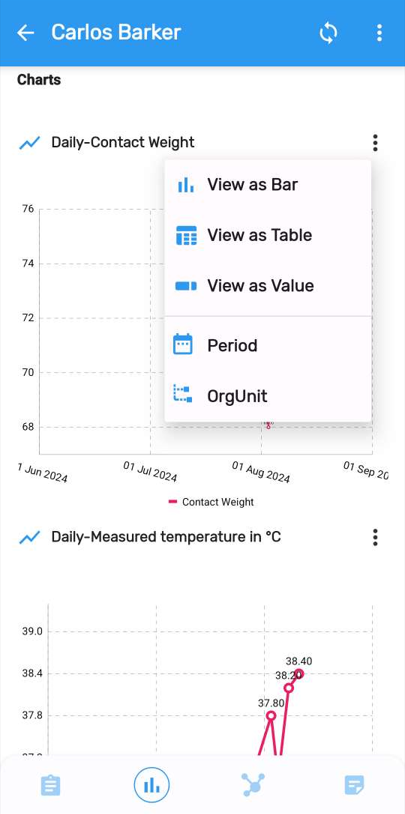

Filters are also available. Display the menu to see periods and organisation units available as filters.

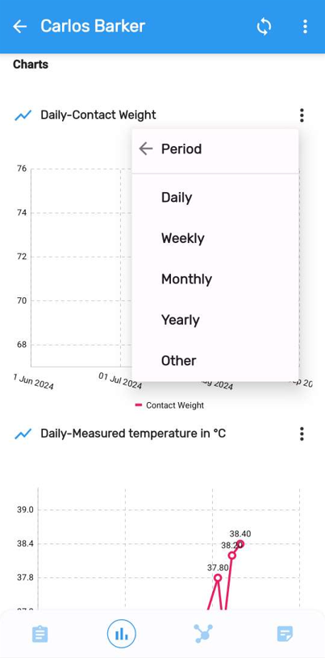

#### STOP! Have them perform *Exercise 2* in the learner’s guide.

### Review program indicators (within the COVID-19 Case-based surveillance program)

You can display any program indicator by enabling the “Display in form” feature. All program indicators are listed at the top of the screen. These also would have appeared within tracker capture on the web.

Open the COVID-19 Case-based surveillance program and search for “Matthew Maker.” You can open up stage 3 to review the number of tests performed.

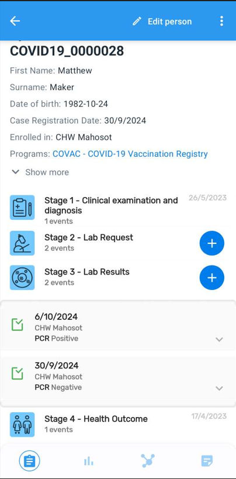

Click on the Analytics menu in the TEIs navigation bar and explain that the Total Number of Tests indicator counts all the events where the “Lab Test Result” data element has value. The charts feature still needs a little bit of work. You can see underneath it will start by showing the number of tests on the enrollment date, followed by the chart for events. The chart on enrollment date can be disregarded and will be worked on by the Android team.

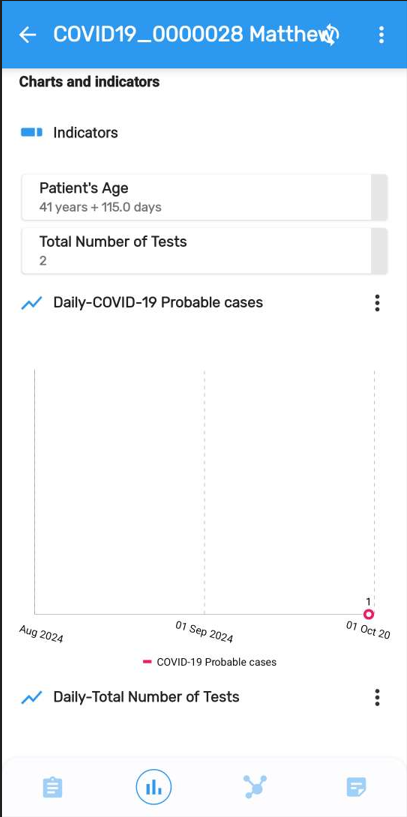
NOTE: The Android App does not support customized boundaries for PI.

### Review program feedback within the COVAC - COVID-19 Vaccination Registry Program

Switch over to the COVAC -COVID-19 Vaccination Registry Program and search for the TEI “Melissa Ortiz.” Select the analytics tab after opening this record. You can also show other information in the analytics tab. This will include feedback or other information that has been configured to show on the tracker dashboard. 

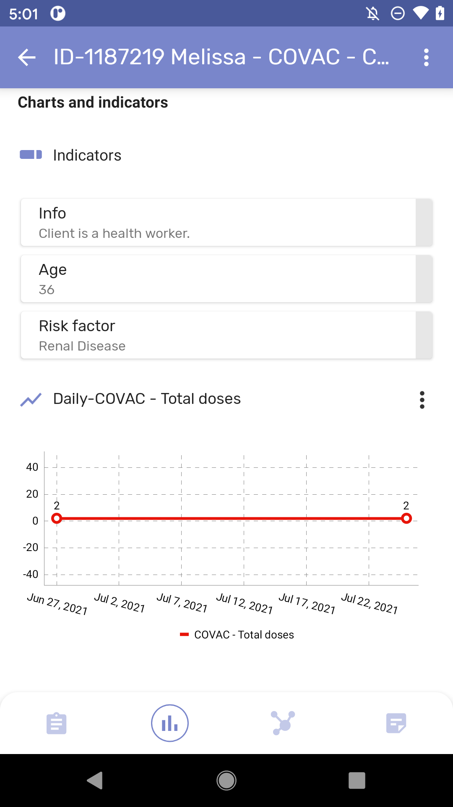 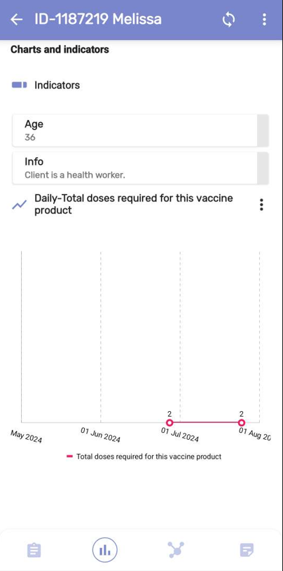 

#### STOP! Have them perform *Exercise 3* in the learner’s guide.
