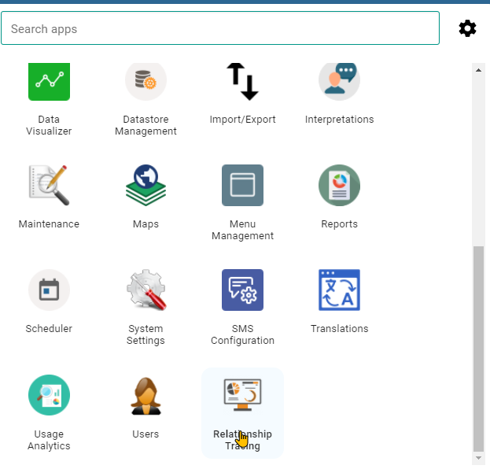
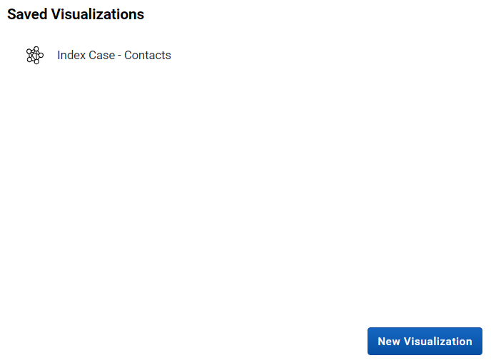
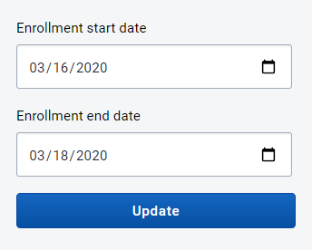
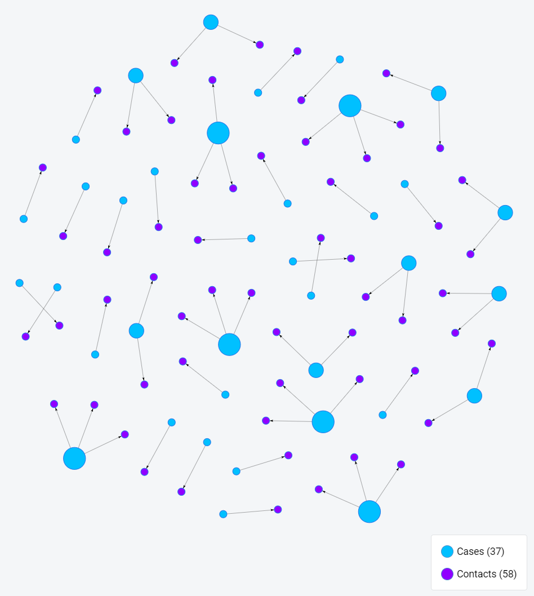
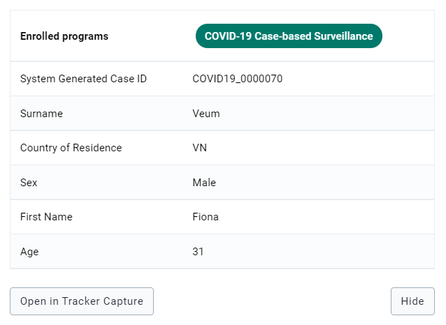
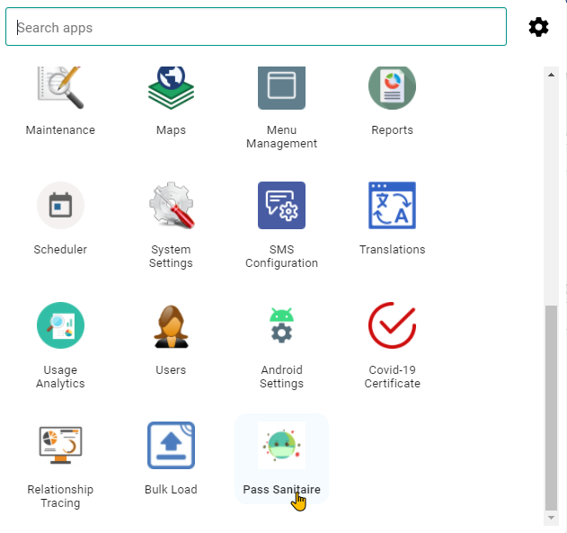
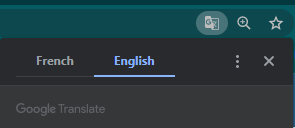
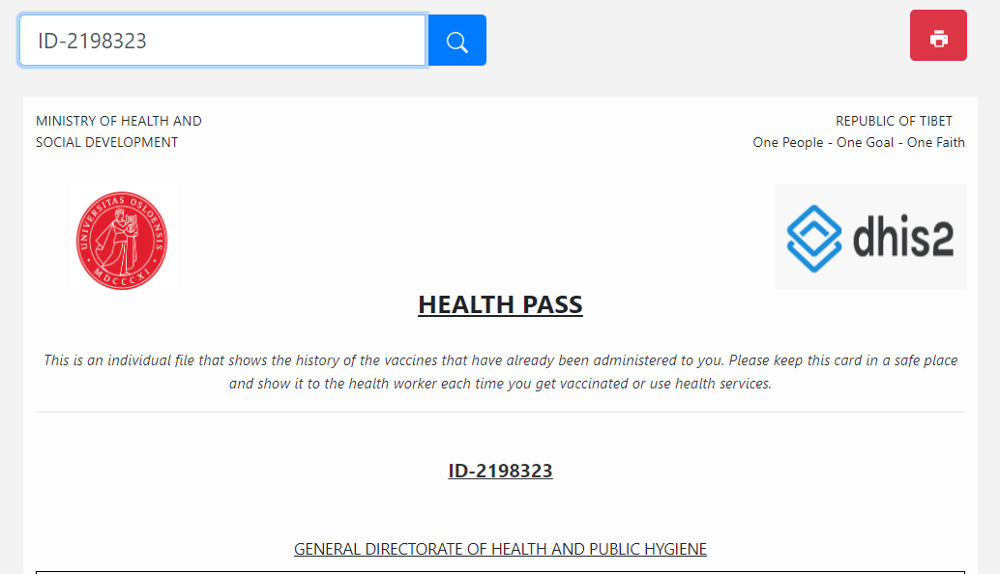
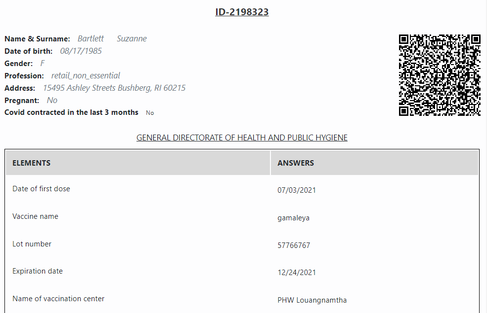
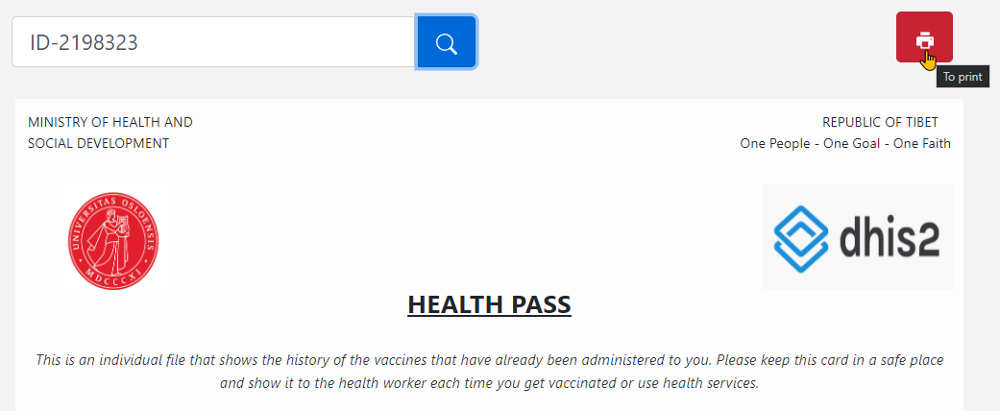

# Trainer’s Guide to Custom Apps

## What is this guide?

This guide is a support document for DHIS2 Academy trainers for the session “Custom Apps.” This session follows the standard Academy training approach with

1. a live demo session where the trainer demonstrate and explain the features, and 
   
2. a hands-­on session with exercises where participants get to practice the same features.

This guide will help the trainer​ prepare​​ for the live demo session. The “Live Demo step by
step” section has a detailed walkthrough of all the steps to demonstrate with
explanations and screenshots that should be easy to follow. Use that when preparing for
the live demo session.

There is also a Quick Guide which lists the steps very briefly and this is meant as a lookup
guide or “cheatsheet” WHILE doing the demo, to help the trainer remember all the steps
and the flow of the demo.

## Learning objectives for this session

1. Understand how custom apps can support a tracker implementation
2. Create a contact tracing map using the relationship tracing app
3. Generate a certificate using a COVID-19 health pass app

## Time Requirements

Live Demo: 2 demos, 5 minutes each

Ungraded Exercises : 2 exercises, 10 minutes each

## Background

In this session, we will give the participants an opportunity to interact with 2 custom apps. These are just examples of apps that were built to meet a specific requirement within an implementation; thus giving the participants a sense for what might be possible within their own implementations.

## Preparations

This session will have you access two databases:

1. A database with the relevant relationships required to use the "relationship tracing" app
2. The same database you have been using the rest of the academy for the "COVID-19 certificate" app

In the relationships database, ensure that the "relationship tracing" app has been installed via the app hub. For this database, also ensure that analytics has been run prior to performing this demo.

In the second database that you have been using, the app "Pass sanitaire" is the COVID-19 certificate app that you will want to ensure is set up.

## Live Demo step by step

### Review the relationships tracing app

This app was made for creating relationship network maps between cases and contacts for COVID-19 surveillance. In order to access this app, login to the relationships database using:

Username : custom_apps

Password : District1#

From the dashboard, access the "relationship tracing" app from the apps menu

The app will launch. You should see 1 saved visualization and the option to create a new visualization

Select the saved visualization "Index Case - Contacts"

You will now be asked to select an enrollment start and end date. The data and relationships in this database are for March 2020. 

Select March 16 - March 18, 2020 and update the visualization.

You should now see the relationship network map on screen.

In this example, the blue dots represent our cases and the purple dots are the contacts. We then have a line connecting each case to its contact. Select a case or a contact to pull up their information. 

You can review their details and you can also open their record in tracker capture by selecting "Open in Tracker Capture." This option will open their record in a new tab, allowing you to investigate it further.

### Review the COVID-19 Health Pass

The COVID-19 health pass app was made to generate an internal health pass with related COVID-19 vaccination data on it. It is a "health pass" because it is meant for internal use only, as it does not use any international schema that would be accepted by other governments for international travel. Solutions that use such schemas are also being tested however and this pass could use one in the future.

From the dashboard access the app "Pass Sanitaire" -- this is health pass but in French as this app was developed for French speaking communities. 

If using chrome, you should be able to translate the app to English via Google Translate.

In order to use the app to generate the pass, you must have the ID of a person. 

For example, we can use the ID : ID-2198323

Once you enter the ID, search for the record. It will populate the details of the pass.

The QR code shown here contains the following information: first name, surname, sex, the name of the vaccine and the dates of the doses. It is important to note that other information can be added to the QR or removed. It will depend on the country or organization that wants to implement it.

You are able to print or download the pass using the print button.

To read the code, you need a separate android app. For more details on this app, refer to the [user manual](https://docs.google.com/document/d/1qWyOcyCmQXsmG9FG91WIocNBvWmLkJT3/edit?usp=sharing&ouid=104677221247573000314&rtpof=true&sd=true).

