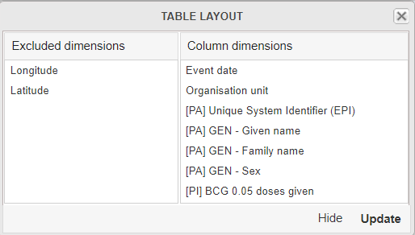
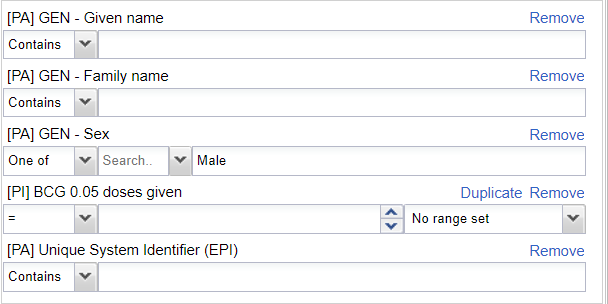

# Trainer’s Guide to Event Reports

## What is this guide?

This guide is a support document for DHIS2 Academy trainers for the session “Event Reports.” This session follows the standard Academy training approach with 

1. a live demo session where the trainer demonstrate and explain the features, and 
   
2. a hands-­on session with exercises where participants get to practice the same features.

This guide will help the trainer​ prepare​​ for the live demo session. The “Live Demo step by step” section has a  detailed walkthrough of all the steps to demonstrate with explanations and screenshots that should be easy to follow. Use that when preparing for the live demo session.

There is also a Quick Guide which lists the steps very briefly and this is meant as a lookup
guide or “cheatsheet” WHILE doing the demo, to help the trainer remember all the steps
and the flow of the demo.

## Learning objectives for this session

The overall objective of this session is to use the DHIS2 event reports app to review ***tracker*** data. Detailed objectives include:

1. Describe the functions of the event reports app
2. Explain the difference between event and enrollment type reports
3. Design event reports using tracker data
4. Describe the differences between how repeated and non-repeated stage data is displayed
5. Design event reports showing data from multiple tracker program stages

## Time Requirements

Live Demo: 4 demos, 10 minutes each
Hands-on Exercises: 4 exercises, 10 minutes each
Assignment: 

## Background

This session build on concepts introduced during the event fundamentals course. In the events fundamentals course, the learner would review how to create an event reports for a single event, creating both line-lists as well as aggregated reports. While this will be quickly reviewed within this session, a number of additional concepts not discussed (as outlined in the learning objectives) will also be covered. For this reason, the beginning part of the guide is brief as is assumed the learner is familiar with these concepts. If this is not the case, you will need to slow down on the explanation of the interface and create some initial reports together.

## Preparations

This session will see you creating a number of reports. Ensure that you have run analytics in the demo database you are using and that all the data is being populated correctly. If you find that data is not present for the correct period or year, please contact the training content team so we can advise how to move the data correctly.

You should consider running through the entire demo prior to presenting it. After this, you should take the quick guide and supplement it with any additional notes you made while running through the demo. If you identify any changes that may be required or additional explanation that would be helpful within the session, please content the training content team in order to allow us to evaluate how to best integrate this feedback into the material.

Every visualization that you are asked to create has been saved and should be shared for public view. You can open each one up and review how it is has been made if you are unsure about any of the visualizations contents.

Also, the learner's guide and session summary are the main material that will be provided to the learner's with both detailed steps for ungraded exercises as well as the key messages from the session. Review these as well to ensure you are able to get these key points across during your demonstration.

## Best Practices

Before starting the demonstration, please keep in mind that the most important thing is that the audience is following, so make sure to ask questions to the audience to verify that they are following. If something is unclear, go back and go through it slowly. If you don’t have time for all the steps, it is better to cut some steps, than to go fast while nobody understands.

In an online setting, you will be breaking regularly to allow them to perform various ungraded exercises in order to keep them engaged.

In an in-person setting, the participants may be doing the demo with you at the same time. In this scenario, it is ideal if there are other trainer's moving around the room to support participant's as it will be difficult for the trainer leading the session to answer many individual questions during the demonstrations. 

## Quick Guide

1. Review the event reports interface
2. Create an aggregate/pivot table event report using COVID-19 surveillance containing the following details:
- Table Style : Pivot, Output Type : Event
- Program : COVID-19 Case Based Surveillance
- Stage : Stage 3 - Lab Results
- Data : Lab Test Result (select Positive as the filter), Age (apply the Age COVID-19 Legend), Sex
- Period : This year
- Org Unit : Country
2. Create a line list event report using COVID-19 vaccination
- Table Style : Line, Output Type : Event
- Program : COVAC - COVID-19 Vaccination Registry
- Stage : Vaccination
- Data
  - First Name, Surname, National ID, Sex
  - Vaccine Name
  - Dose Number (Filter by 1st dose)
- Period : This year
- Org Unit : Country

STOP! Have them perform Exercise 1

3. Create a list event report for a repeatable stage using the COVID-19 surveillance program
   1. Open up this record in tracker capture and review the repeated events in stage 2 - lab request
      - Org Unit : CHW Mahosot
      - Program : COVID-19 Case-based surveillance
      - Local Case ID : ID-5353942, First Name : Angela, Last Name : Campbell, Sex : Female
   2. Create an event report with the following inputs:
      - Table Style : Line List
      - Output Type : Event
      - Program : COVID-19 Case-based Surveillance, Stage : Lab Request
      - Data :
        - Local Case ID : ID-5353942
        - First Name
        - Surname
        - Lab Test Reason
        - Type of test
        - Type of specimen
        - Period : Last Year
        - Org Unit : CHW Mahosot
   3. Explain how event reports work with repeated data
   4. Add in more repeated data by removing the filter for local case ID and change the period to this year
   
4. Create the same report using enrollment as the output type

   - Table Style : Line List
   - Output Type : Enrollment
   - Program : COVID-19 Case-based Surveillance, Stage : Lab Request
   - Data :
     - Local Case ID
     - First Name
     - Surname
     - Lab Test Reason
     - Type of test
     - Type of specimen
   - Period : This Year
   - Org Unit : CHW Mahosot

STOP! Have them perform Exercise 2

5. Create an aggregate/pivot table event report using a repeatable stage
   
   1. Create a report with the following details:
      - Table Style : Pivot, Output Type : Event
      - Program : COVAC - COVID-19 Vaccination Registration
      - Stage : Vaccination
      - Data : Sex, Vaccine Name
      - Period : This year
      - Org Unit : Country
   1. Duplicate your tab and open the event report "COVAC - Registrations by sex." 
   2. Compare these two outputs

STOP! Have them perform Exercise 3

6.  Create a line list enrollment type event report using multiple stages from the COVID-19 surveillance program

    - Table Style : Line List
    - Output Type : Enrollment
    - Program : COVID-19 Case-based Surveillance
    - Attributes
      - First Name, Surname, Sex
    - Stage 1 - Clinical Exam
      - Underlying condition
      - Signs/symptoms present
    - Stage 3 - Lab Results
      - Type of Test
      - Lab Result
    - Stage 4 - Health Outcome
      - Health Outcome
    - Period : This Year
    - Org Unit : Country

7. Review the recap slide
9. Have them perform the assignment

STOP! Have them perform exercise 4

Once they have completed all of the ungraded exercises, they should then complete the graded assignment

## Live Demo step by step

### Review the events reports interface

Access the event reports app and review the interface

#### Periods in Event Reports

In event reports, Periods can be selected as either Fixed or relative periods (same as aggregate) or with specific start/end dates (specific to event/tracker data)

If choosing the start/end dates than you can select exact dates to filter events based on the report date that was entered during event or tracker capture.

### Create an aggregate/pivot table using Malaria Case notification in Event Report App

Open the table "MALARIA_CS - Final Malaria Classification by Age & Sex." This is the table that you will create. You can explain the layout to the participants - including the table style, output type, data, periods and org units, before proceeding.

> Event reports is currently the only app where you can make on the fly pivot tables using event/tracker data. This is not yet available in the line listing app, so the event reports and the line listing app need to be used in parrallel currently for the best results.

Clear your inputs by going to Favorites -> New.

Create an aggregate event report. You can use the following data items as an example:

- Table Style : Pivot, Output Type : Event
- Program : Malaria Case Notification program
- Stage : Stage  - Case Outcome
- Data : Malaria Final Classification (select Indigenious (local) as the filter), Age , Sex
- Period : This year
- Org Unit : Country

The table should look like this after updating:

This is not exactly the table we want. We can make some adjustments to modify it.

Start with the layout. The layout can should like this

Next, hide any empty rows using the table options.

Now you should see the the table following the layout we've intended.

Note that you can modify the way data that is collected through tracker (and event) programs is aggregated. You can demonstrate this by changing the legend for the Age attribute to Age (COVAC) and updating the table.

You will see all the totals are the same; however the disaggregation of the data is different as the data has been seperated by new categorizations.

This should be a review of concepts from the event fundamentals course; however if there are questions you can explain this concept a bit more by referring to the examples you will have on screen.

#### STOP! Perform Exercise 1

### Create a list type event report for a repeatable stage using Electronic Immunization registry program

In this exercise we will create a line list using an Electronic Immunization Registry.

Open the table "EPI - BCG Dose by Sex (List)" in the Event Report App in order to review the final output.

Create a new report by going to Favorites -> New and select the following details

- Table Style : Line list, 
- Output Type : Event
- Program : Electronic Immunization Registry
- Stage : Vaccination
- Data
  - Given Name, 
  - Family Name,
  - Unique System Identifier, 
  - Sex
  - Vaccine Name - BCG 0.05 mL
  - Sex - Filter (Male)
- Period : This year
- Org Unit : Country

Before updating the table, open the layout and move the items around in a logical order, noting how this will affect the output of the table.

Proceed to update the table and discuss what is being shown.

The table should look like this after updating

Modify the filters to see how the line list is updated

You will only see the data which meets this criteria

### Other features as a refresher

You can also show them how to save the report using the favorites menu

 

and download the list

STOP! Perform Exercise 2

### Create a list type event report for a repeatable stage using the Electronic 

Before you create this report, open up a record from tracker capture that has repeated event data. The example used here has the following details that you can use to search for the person's record:

- Org Unit : 0001 CH Mahosot (Lao PDR - Vientiane Capital - 0101 Chanthabouli)
- Program : Electronic Immunization Registry
- Unique System Identifier (EPI) : EPI_12581
- First Name :Brent, 
- Last Name : Hicks, 
- Sex : Male

Open up this record and navigate to the "Immunization" stage within this program. Here you will see that there is more then one event within this program stage. Over the next several demonstrations, we will discuss the difference of event vs. enrollment report types and how repeated stage data is affected by this selection.

   

Open up the different events within this stage and review the data that is there. The data will not be the same for each of these events making them easy to compare.

Keep tracker capture open on this record and open line listing in a new tab in case you need to refer to this record again.

We will now proceed to explain the how event and enrollment type reports handle this repeatable stage data.

Open the table "EIR - HIV Summary" This the table that you will create. You can explain the layout to the participants before continuing.

Clear your inputs by going to Favorites -> New.

Create an event report with the following inputs:

- Table style: Line List
- Output Type: Event
- Program : Electronic Immunization registry, Stage : Immunization
- Program Dimension :
  * EPI Number : EPI_12581
  * Given Name
  * Family name
  * Diagnosed with HIV and severe immunodeficiency
- Period : This Year
- Org Unit : 0001 CH Mahosot

This should pull up the respective information for the two events that we saw when we reviewed this record in tracker capture

> Now you can explain how the event type report selection affects our output. When we are creating reports and use "event" as the input type, ALL of the events from within a program stage will be output on our report. There is a limitation here in that we can only pull all of our event data from within one program stage, and as a result they are not really "linked" together as they are separate lines within our report.

We can further demonstrate this concept by showing more repeated event data. Modify the output so you are not filtering by any EPI ID and update the report. Try sorting the data by surname. Scroll through the report; you should see several repeated events displayed on this report.

In summary, when running an event report with repeatable data using "event" as the output type, all of the event data from a single program stage will be used in the report!

### Update the report using enrollment as the output type

As a reminder, here are the selections to make

- Table style: Line List
- Output Type: Enrollment
- Program : Electronic Immunization registry, 
- Stage : Immunization
- Program Dimension :
  * EPI Number : EPI_12581
  * Given Name
  * Family name
  * Diagnosed with HIV and severe immunodeficiency
- Period : This Year
- Org Unit : 0001 CH Mahosot

This is saved as "EIR - HIV Summary (Enrollment)" in DHIS2 for reference

When we make this update, the number of records shown changes. This occurs because enrollment type reports only use the most recent event within a program stage for their output.

> Note: In summary, when running an event report with repeatable data using "enrollment" as the output type, you will only see the most recent event data.

STOP! Perform Exercise 3

## Recap

Review the recap slide with them at the end of the session before they perform the assignment

## Assignment

After you have completed all demos and they have finished the exercises, have them complete the graded assignment for this session. If you find you are running out of time, assign the graded assignment to them and ask them to complete it outside of the live scheduled session.

