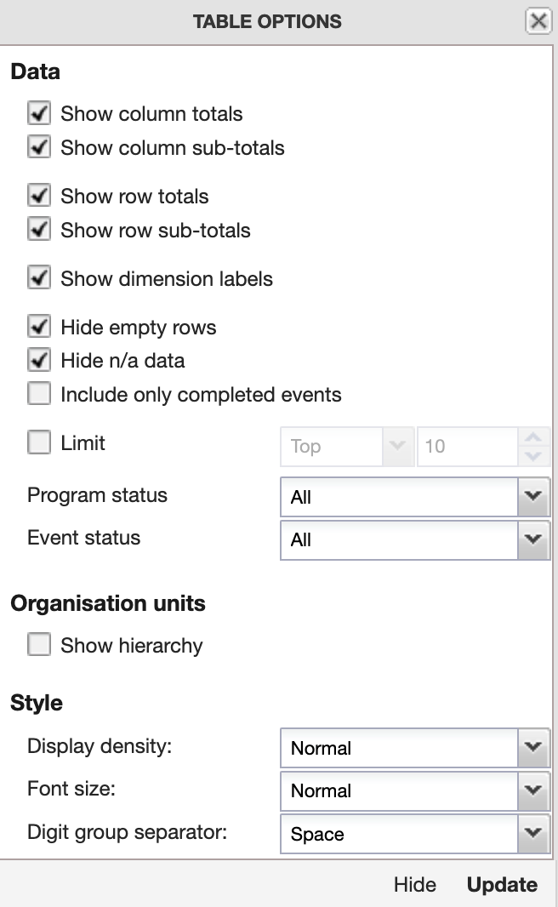
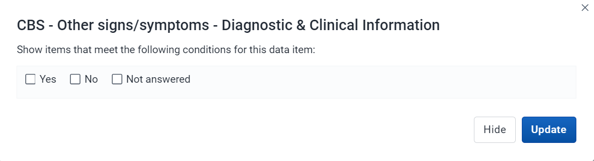
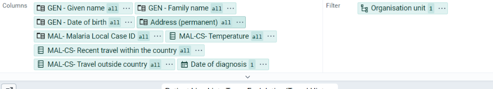
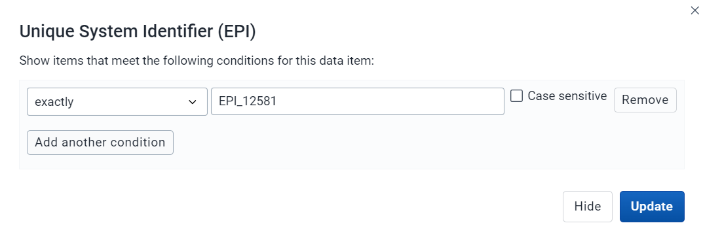
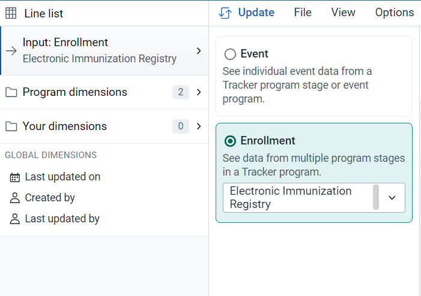
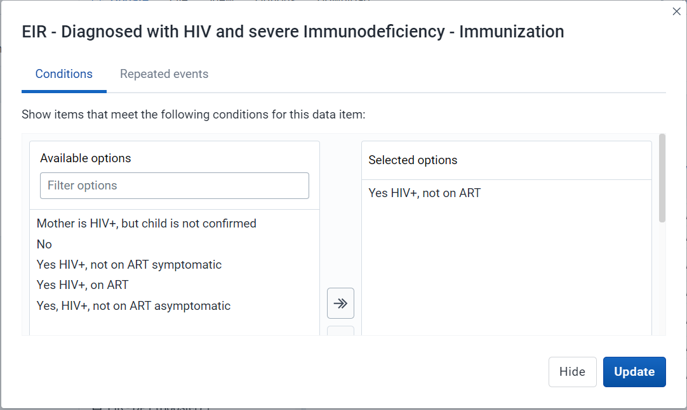
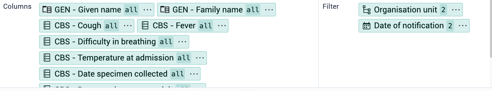
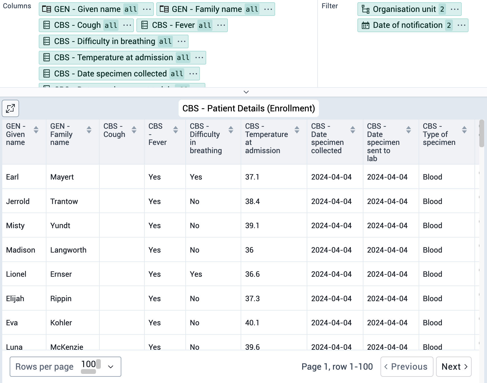
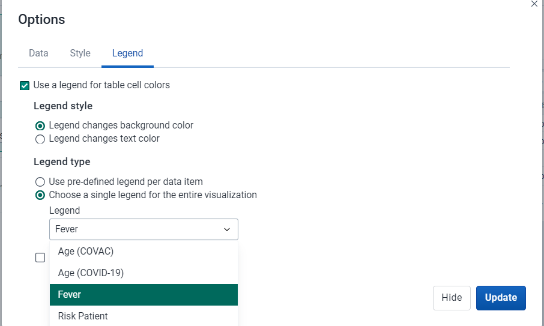
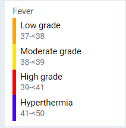

# Trainer’s Guide to Event Reports and Line List

## What is this guide?

This guide is a support document for DHIS2 Academy trainers for the session “Event Reports and Line List.” This session follows the standard Academy training approach with 

1. a live demo session where the trainer demonstrate and explain the features, and 
   
2. a hands-­on session with exercises where participants get to practice the same features.

This guide will help the trainer​ prepare​​ for the live demo session. The “Live Demo step by step” section has a  detailed walkthrough of all the steps to demonstrate with explanations and screenshots that should be easy to follow. Use that when preparing for the live demo session.

There is also a Quick Guide which lists the steps very briefly and this is meant as a lookup guide or “cheatsheet” WHILE doing the demo, to help the trainer remember all the steps
and the flow of the demo.

## Learning objectives for this session

The overall objective of this session is to use the DHIS2 event reports app to review ***tracker*** aggregate data and the Line Listing app to review ***tracker*** individual level data. Detailed objectives include:

1. Describe the functions of the event reports app
2. Explain the difference between event and enrollment type reports
3. Comparison of line list reports using tracker data in event reports and line list app.
4. Describe the functions of the line listing app
5. Design line listing reports using tracker data
6. Describe the differences between how repeated and non-repeated stage data is displayed
7. Design line listing reports showing data from multiple tracker program stages

## Time Requirements

Live Demo: 
Hands-on Exercises:
Assignment: 

## Background

This session build on concepts introduced during the event fundamentals course. In the events fundamentals course, the learner would review how to create an event reports for a single event, creating both line-lists as well as aggregated reports. While this will be quickly reviewed within this session, a number of additional concepts not discussed (as outlined in the learning objectives) will also be covered. For this reason, the beginning part of the guide is brief as is assumed the learner is familiar with these concepts. If this is not the case, you will need to slow down on the explanation of the interface and create some initial reports together.

## Preparations

This session will see you creating a number of reports. Ensure that you have run analytics in the demo database you are using and that all the data is being populated correctly. If you find that data is not present for the correct period or year, please contact the training content team so we can advise how to move the data correctly.

You should consider running through the entire demo prior to presenting it. After this, you should take the quick guide and supplement it with any additional notes you made while running through the demo. If you identify any changes that may be required or additional explanation that would be helpful within the session, please content the training content team in order to allow us to evaluate how to best integrate this feedback into the material.

Every visualization that you are asked to create has been saved and should be shared for public view. You can open each one up and review how it is has been made if you are unsure about any of the visualizations contents.

Also, the learner's guide and session summary are the main material that will be provided to the learner's with both detailed steps for ungraded exercises as well as the key messages from the session. Review these as well to ensure you are able to get these key points across during your demonstration.

## Best Practices

Before starting the demonstration, please keep in mind that the most important thing is that the audience is following, so make sure to ask questions to the audience to verify that they are following. If something is unclear, go back and go through it slowly. If you don’t have time for all the steps, it is better to cut some steps, than to go fast while nobody understands.

In an online setting, you will be breaking regularly to allow them to perform various ungraded exercises in order to keep them engaged.

In an in-person setting, the participants may be doing the demo with you at the same time. In this scenario, it is ideal if there are other trainer's moving around the room to support participants as it will be difficult for the trainer leading the session to answer many individual questions during the demonstrations. 

## Quick Guide

1. Review the events reports interface

Create an aggregate/pivot table using Electronic Immunization registry in Event Report App
- Table Style : Pivot, Output Type : Event
- Program : Electronic Immunization Registry
- Stage : Stage - Immunization
- Data : Diagnoised with HIV and severe Immuno deficiency
- Age (apply the Age COVID-19 Legend), Sex
- Period : This year
- Org Unit : Country

STOP - Perform Exercise 1

2. Create a line list in event reports
- Table Style : Line list, Output Type : Event
- Program : COVAC - COVID-19 Vaccination Registry
- Stage : Vaccination
- Data
  - First Name, Surname, National ID, Sex
  - Vaccine Name
  - Dose Number (Filter by 1st dose)
- Period : This year
- Org Unit : Country

Demo how to download the table, save the table

STOP - Perform Exercise 2

3. In the Line List app, review the Line List interface with the table "COVID_CBS - Patients with Symptoms" open 
  
- Add a data element
- Modify the org units
- Modify the period

Create a line list using COVID-19 Surveillance Case Based program in the Line List App

- Input : Event

- **Program Dimension**:
  - First Name
  - Date of Birth
  - Country of Residence
  - Local Case ID
  - Temperature
  - Travel 14 days prior to onset of any symptom
- Org Unit: Vientiane Capital (Lao PDR - Vientiane Capital)
- Date of Consultation: Last month

STOP - Perform Exercise 3

4. Create a list type event report for a repeatable stage using the COVID-19 surveillance program

- Input : Event
- Program : COVID-19 Case-based Surveillance, Stage : Lab Request
- Program Dimension :
  - Local Case ID : ID-5353942
  - First Name
  - Surname
  - Lab Test Reason
  - Type of test
  - Type of specimen
- Case Registration Date : This Year
- Org Unit : CHW Mahosot

- Update the report using enrollment as the output type to compare and explain the differences in whats shown

STOP - Perform Exercise 4

5. Update the report with the most recent events and oldest events using the Input type as Enrollment

- Table : Line List
- Input : Enrollment
- Program : COVID-19 Case-based Surveillance
- Program Dimensions : Select Type: All Types
- Data :
  - Local Case ID
  - First Name
  - Surname
  - Lab Test Reason
  - Type of test from Stage 2
  - Type of specimen from Stage 2
- Case Registration Date : This Year
- Org Unit : CHW Mahosot

For the DE "Lab Test Reason" add in the oldest 2 and 2 most recent events

STOP - Perform Exercise 5

6. Compare aggregate/pivot table event and enrollment reports using a repeatable stage in event reports
- Open the tables "COVAC - Doses by sex" and "COVAC - Registrations by sex" in two seperate tabs
- Explain what the difference is between event and enrollment aggregation

STOP - Perform Exercise 6

7. Create a line list enrollment report using multiple stages from the COVID-19 surveillance program in the line listing app

- Input : Enrollment
- Program : COVID-19 Case-based Surveillance
- Program Dimensions - 
  - Program attribute
    - First Name
    - Surname
    - Sex
  - Data Element Stage 1 - Clinical Exam
    - Underlying condition
     - Signs/symptoms present
  - Data Element Stage 3 - Lab Results
    - Type of Test
    - Lab Test Result
  - Data Element Stage 4 - Health Outcome
    - Health Outcome
- Case Registration Date (Period) : This Year
- Org Unit : Country

STOP - Perform Exercise 7

8. Review the recap slide

9.  Have them perform the assignment

Once they have completed all of the ungraded exercises, they should then complete the graded assignment

## Live Demo step by step

### Review the events reports interface

Access the event reports app and review the interface

#### Periods in Event Reports

In event reports, Periods can be selected as either Fixed or relative periods (same as aggregate) or with specific start/end dates (specific to event/tracker data)

If choosing the start/end dates than you can select exact dates to filter events based on the report date that was entered during event or tracker capture.

### Create an aggregate/pivot table using Malaria Case notification in Event Report App

Open the table "MALARIA_CS - Final Malaria Classification by Age & Sex." This is the table that you will create. You can explain the layout to the participants - including the table style, output type, data, periods and org units, before proceeding.

> Event reports is currently the only app where you can make on the fly pivot tables using event/tracker data. This is not yet available in the line listing app, so the event reports and the line listing app need to be used in parrallel currently for the best results.

Clear your inputs by going to Favorites -> New.

Create an aggregate event report. You can use the following data items as an example:

- Table Style : Pivot, Output Type : Event
- Program : Malaria Case Notification program
- Stage : Stage  - Case Outcome
- Data : Malaria Final Classification (select Indigenious (local) as the filter), Age , Sex
- Period : This year
- Org Unit : Country

The table should look like this after updating:

This is not exactly the table we want. We can make some adjustments to modify it.

Start with the layout. The layout can should like this

Next, hide any empty rows using the table options.

Now you should see the the table following the layout we've intended.

Note that you can modify the way data that is collected through tracker (and event) programs is aggregated. You can demonstrate this by changing the legend for the Age attribute to Age (COVAC) and updating the table.

You will see all the totals are the same; however the disaggregation of the data is different as the data has been seperated by new categorizations.

This should be a review of concepts from the event fundamentals course; however if there are questions you can explain this concept a bit more by referring to the examples you will have on screen.

#### STOP - Perform Exercise 1

### Review the line list functionality in Event Reports

> The line listing functions in event reports have been replaced by the **line listing app**. We will utilize the line listing app to create line lists for the remainder of the session after this example, but to compare features for those who are familiar with event reports we will just do a quick review of how line lists work in event reports. If you feel this is not needed, you can go ahead and skip this section.

In this exercise we will create a line list using an Electronic Immunization Registry.

Open the table "EPI - BCG Dose by Sex (List)" in the Event Report App in order to review the final output.

Create a new report by going to Favorites -> New and select the following details

- Table Style : Line list, Output Type : Event
- Program : Electronic Immunization Registry
- Stage : Vaccination
- Data
  - Given Name, Family Name,Unique System Identifier, Sex
  - Vaccine Name - BCG 0.05 mL
  - Sex - Filter (Male)
- Period : This year
- Org Unit : Country

Before updating the table, open the layout and move the items around in a logical order, noting how this will affect the output of the table.

Proceed to update the table and discuss what is being shown.

The table should look like this after updating

Modify the filters to see how the line list is updated

You will only see the data which meets this criteria

### Other features as a refresher

You can also show them how to save the report using the favorites menu

 

and download the list

#### STOP - Perform Exercise 2

### In the Line List app, review the Line List interface

Have the line listing app open in another tab or window with the table "CBS - Patients with Symptoms" open

In the Line Listing app, you can currently only make line lists. Aggregated pivot tables can not be made here unlike in the event reports app. The line listing app introduces many new features for creating line lists however, and is the recommended app for making these lists.

> NB: We will be using the line listing app to make line lists for the remainder of this session. We will only be using the "Pivot" table style in event reports to produce aggregate outputs. This is our suggested approach in live implementations as well. 

#### Input 

In the line list app, the input can be selected as either

* Event (see individual event data from an event program or within tracker program stages)

* Enrollment (see data from multiple stages in a tracker program)

If you have selected **Event**, then for tracker programs you need to select the program followed by the program stage to get all the data elements and attributes associated with that particular stage. 

To be able to select data from multiple stages you need to select "Enrollment" as the input type.

If you select **Enrollment** in the Input tab then all of the data elements associated with the program will be available from the different stages within the program for the purpose of cross stage selection of data elements. You are also able to access the program attributes using the enrollment type input.

> To summarize, use event when you are only interested in data from one particular event in a program. Use enrollment when you want to review event data from multiple stages together.

#### Program dimensions

In the Line Listing app, all of the dimensions related to a tracker or an event program are present in the program dimension tab.

The line list will always be based on event or tracker programs and you can perform analysis on a range of dimensions. For programs with attribute combinations (these are programs that are disaggregate by an attribute of some kind), you can use program categories and category option group sets as dimensions.

Lets review the program dimensions tab.

Underneath the ***Program Dimensions*** heading we have the following:

The **organisation unit** dialog is flexible, offering essentially three ways of selecting organisation units:

1. By user org unit
2. By selecting org units directly
3. By using Org unit groups

**Event Status**
Filters data based on the event status:  Active, Completed, Scheduled.

**Program Status**
Filters data based on the event status:  Active, Complete, Cancelled.

**Program Dates**
After the program status, we will be able to select the enrollment and event dates depending on the input type we have selected. When the input is selected as enrollment, you will only be able to select the enrollment data here. When the input is event, you can select both the enrollment and event dates to be displayed.

In the ***Program data dimensions*** section we can modify the data we want to select.

In the type dropdown selector, you can filter by various parameters including:
* all types, which just shows everything
* data elements
* program attributes
* category
* category option group set

These last 2 only apply to programs that are using an attribute of some kind to dissaggregate the program.

There are multiple ways to add data dimensions to the layout. They can be added by hovering over the dimension and clicking the plus icon or by dragging and dropping a dimension straight to the layout area.

#### Add a data element

Lets add a data element to this table.

From the program dimensions tab, filter out the type to data elements. Search or find the data element "Shortness of breath." Either select the plus sign or drag the data element to the columns section above the table.

Update the table and you should see it added to your columns on the table.

#### Filter a data element option

To add a filter to a data element, select the data element either before or after it has been added. Select signs/symptoms present.

This will open a dialog box. Select the items you want to include in your filter and move them over by either double clicking or using the arrow buttons.

Select the Yes option and update the table.You will now only see patients that have signs/symptoms present in the table.

#### Change the org unit

To change the organisation unit, select the organisation unit option from the program dimesions tab.

You can select org units, relative org units levels and groups the same as in event reports.

Change the org unit and update the line list to see its effect. 

#### Change the period

The period of data being shown is dependent on the type of input you have selected along with the dates associated with the program you have selected as discussed previously.

In the program dimensions tab, in this case you will see the enrollment and event date as event is the input type selected.

If you select the date of data entry and modify it.

You can see how it affects the table outputs.

### Global Dimensions

This is located on the left side panel.

You can select the inputs for when the event or enrollment was
* Last updated on
* Created by
* last updated by

This will depend on if you selected event or enrollment as the input type.

### Create a line list program using Input : Event

In this exercise we will create a line list using a Malaria case notification , investigation and response.

You can open the existing line list "Patient Line List - Temp Evalulation/Travel History
"

Clear the input by going to File <New

In this case we will be using

**Input** : Event 

>Note: If creating outputs of event type, then we can see the data from all events within a single program stage we are working with.

Select Program : Malaria case notification , investigation and response
Select Stage: Diagnosis and treatment

**Program Dimension**: For this we will select the following program dimensions

- Given Name
- Family Name
- Date of Birth
- Address
- Local Case ID
- Temperature
- Recent travel within the country
- Recent travel outside the country

Select OU: 01 Vientiane Capital

Date of Consultation: Last 3 months

Your Dimension should be assigned to columns and organization unit to filter.

You will see the line list for a single stage.

Click on update

#### STOP! Have them perform Exercise 3 

### Create a list type event report for a repeatable stage using the Electronic Immunization Registry

Before you create this report, open up a record from tracker capture that has repeated event data. The example used here has the following details that you can use to search for the person's record:

- Org Unit : 0001 CH Mahosot (Lao PDR - Vientiane Capital - 0101 Chanthabouli)
- Program : Electronic Immunization Registry
- Unique System Identifier (EPI) : EPI_12581, First Name :Brent, Last Name : Hicks, Sex : Male

Open up this record and navigate to the "Immunization" stage within this program. Here you will see that there is more then one event within this program stage. Over the next several demonstrations, we will discuss the difference of event vs. enrollment report types and how repeated stage data is affected by this selection.

   

Open up the different events within this stage and review the data that is there. The data will not be the same for each of these events making them easy to compare.

Keep tracker capture open on this record and open line listing in a new tab in case you need to refer to this record again.

We will now proceed to explain the how event and enrollment type reports handle this repeatable stage data.

Open the table "EIR - HIV Summary (Event)" This the table that you will create. You can explain the layout to the participants before continuing.

Clear your inputs by going to Favorites -> New.

Create an event report with the following inputs:

- Input : Event
- Program : Electronic Immunization registry, Stage : Immunization
- Program Dimension :
  * EPI Number : EPI_12581
  * Given Name
  * Family name
  * Diagnosed with HIV and severe immunodeficiency

- Registration Date : This Year
- Org Unit : 0001 CH Mahosot

To make sure you get a specific record you need to Select EPI number and enter the ID (EPI_12581) to be used as a filter, as shown in the screenshot.

   

This should pull up the respective information for the two events that we saw when we reviewed this record in tracker capture

The table should look like this

   

> Now you can explain how the event type report selection affects our output. When we are creating reports and use "event" as the input type, ALL of the events from within a program stage will be output on our report. There is a limitation here in that we can only pull all of our event data from within one program stage, and as a result they are not really "linked" together as they are separate lines within our report.

We can further demonstrate this concept by showing more repeated event data. Modify the output so you are not filtering by any EPI ID and update the report. Try sorting the data by surname. Scroll through the report; you should see several repeated events displayed on this report.

   

In summary, when running an event report with repeatable data using "event" as the output type, all of the event data from a single program stage will be used in the report!

Update the report using enrollment as the output type
As a reminder, here are the selections to make

- Input : Enrollment
- Program : Electronic Immunization registry, Stage : Immunization
- Program Dimension :
  * EPI Number
  * Given Name
  * Family name
  * Diagnosed with HIV and severe immunodeficiency

- Registration Date : This Year
- Org Unit : 0001 CH Mahosot

This is saved as "EIR - HIV Summary (Enrollment) Line list" in DHIS2 for reference

   

When we make this update, the number of records shown changes. This occurs because enrollment type reports only use the most recent event within a program stage for their output.

>Note: there is an enhanced feature in the Line list app, with the help of which you can define the most recent events and the oldest events you want in the output.

### Create a line list program using Input : Oldest events and Recent events

Kindly follow the steps to create above line list

1. Click on the **Input** - Select “Enrollment”.

2. Select **Program** :“Electronic Immunization registry”.

   

3. Go to **Program Dimension** and Select Data Element from Stage - 
*Immunization which is REPEATABLE in each event.*

   

4. Click on the Data Element “Diagnosed with HIV and severe immunodeficiency , where you will be able to see the Repeated event tab.

5. Select Yes HIV+,not on ART

   

6. To Select the number of times the most recent event and the oldest event : Click on Repeated Events and select value for newest and oldest.

   In this case we are selecting
Most recent events : 2
Oldest events : 1

   

7. Select OU: LAO

8. Date of Registration: Last 12 months 

   

9. Click on update

   
 
The advantage of this output is that we can have information from repeated events on a single line. This is different then when using the event input type, which lists repeated events on seperate lines.

#### STOP! Have them perform Exercise 4

### Create a line list program using Input : Enrollment

For this you can open the already existing linelist "Patient line list (enrollment)"

Follow the steps to create above Line list for enrollment type 

1. Click on Input and Select Enrollement

   

2. Choose Program: Case based Surveillance

   

3. Go to Program Dimension 

   To evaluate the across the stage we will select the following data dimensions:

   Stage 1 : Diagnostic and clinical information
   * Date of Admission
   * Sign and symptoms cough ,
   * fever, 
   * Difficulty in breathing
   * Temperature at admission

   Stage 2: Lab Request
   * Date Specimen collected
   * Date Specimen sent to laboratory
   * Type of Specimen

   Stage 3: Lab Results
   * PCR Date
   * PCR test Result 
   * Type of Specimen

4. Select OU : Lao PDR, Facility - Level 3

5. Case Notification Date: This Month and Last 3 Month

Click on Update 

#### STOP! Have them perform Exercise 5

### Create a line list program using legends

Kindly follow the steps to create above line list

1. Click on the **Input** - Select “Event”.

2. Select **Program** :“Case-based Surveillance”.

3. Select **Stage** : "Diagnostic and Clinical Information"

4. Select Attributes:
     
     * System case ID
     * Given Name
     * Date of Birth
     * Home Address 

5. Select Data Elements:

     * Temperature at Admission
     * Travel days outside district before onset of Rash

6. Select Date of notification : Last 3 month

7. Select OU : 0001 CH Mahosot

8. Select Options > Go to Legend 

   * Enable use a legend for table cell colors
   * Legend style: Legend changes backgroung colour
   * Legend type: Choose a single legend for the entire visualization
   * Legend : Select pre-defined legend set "Fever"

8. Click Update

(In this you will observe the red cell in the cases where temperature is more than 38 degree celcius)

You can also see the legend key is you select show legend key on the side bar.

#### STOP! Have them perform Exercise 6

## Assignment

After you have completed all demos and they have finished the exercises, have them complete the graded assignment for this session. If you find you are running out of time, assign the graded assignment to them and ask them to complete it outside of the live scheduled session.