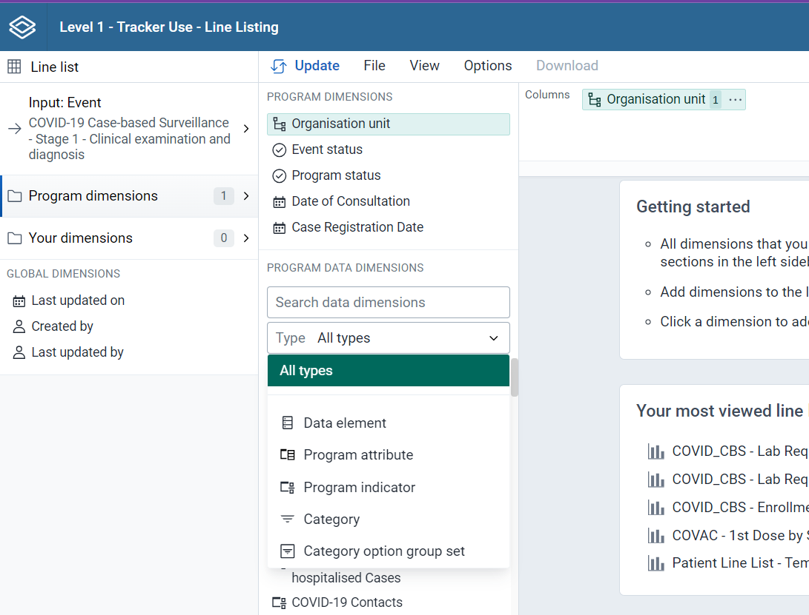
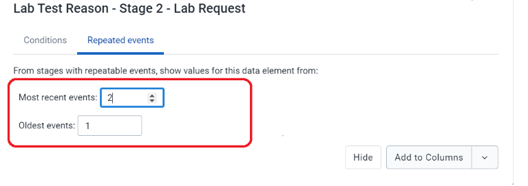

# Trainer’s Guide to Line Listing

## What is this guide?

This guide is a support document for DHIS2 Academy trainers for the session “Line Listing.” This session follows the standard Academy training approach with

1. a live demo session where the trainer demonstrate and explain the features, and 
   
2. a hands-­on session with exercises where participants get to practice the same features.

This guide will help the trainer​ prepare​​ for the live demo session. The “Live Demo step by step” section has a detailed walkthrough of all the steps to demonstrate with explanations and screenshots that should be easy to follow. Use this when preparing for the live demo session.

There is also a Quick Guide which lists the steps very briefly and this is meant as a lookup guide or “cheatsheet” WHILE doing the demo, to help the trainer remember all the steps and the flow of the demo.

## Learning objectives for this session

The overall objective of this session is to use the DHIS2 Line Listing app to review ***tracker*** data. Detailed objectives include:

1. Describe the functions of the line listing app
2. Explain the difference between event and enrollment type reports
3. Design line listing reports using tracker data
4. Describe the differences between how repeated and non-repeated stage data is displayed
5. Design line listing reports showing data from multiple tracker program stages

## Time Requirements

Live Demo: 4 demos, 10 minutes each

Hands-on Exercises: 4 exercises, 10 minutes each

Assignment: 

## Background

This session build on concepts introduced during the event fundamentals course. In the events fundamentals course, the learner reviewed how to create an event report for a single event, creating both line-lists as well as aggregated reports. The line listing app is a new app that builds on some of the concepts described in using the event reports app. The line listing app allows for much more flexibility in creating line lists for tracker data and will be updated with additional features over time that event reports does not support. At this stage, implementations may still be transitioning between event reports and the line listing app; therefore the event reports trainer's and learner's guide is still available and can be shared with participants. The line listing app does not yet support aggregated outputs; so the event reports app will still need to be used for this purpose.

## Preparations

This session will see you creating a number of reports. Ensure that you have run analytics in the demo database you are using and that all the data is being populated correctly. If you find that data is not present for the correct period or year, please contact the training content team so we can advise how to move the data correctly.

You should consider running through the entire demo prior to presenting it. After this, you should take the quick guide and supplement it with any additional notes you made while running through the demo. If you identify any changes that may be required or additional explanation that would be helpful within the session, please content the training content team in order to allow us to evaluate how to best integrate this feedback into the material.

Every visualization that you are asked to create has been saved and should be shared for public view. You can open each one up and review how it is has been made if you are unsure about any of the visualizations contents.

Also, the learner's guide and session summary are the main material that will be provided to the learner's with both detailed steps for ungraded exercises as well as the key messages from the session. Review these as well to ensure you are able to get these key points across during your demonstration.

## Best Practices

Before starting the demonstration, please keep in mind that the most important thing is that the audience is following, so make sure to ask questions to the audience to verify that they are following. If something is unclear, go back and go through it slowly. If you don’t have time for all the steps, it is better to cut some steps, than to go fast while nobody understands.

In an online setting, you will be breaking regularly to allow them to perform various ungraded exercises in order to keep them engaged.

In an in-person setting, the participants may be doing the demo with you at the same time. In this scenario, it is ideal if there are other trainer's moving around the room to support participant's as it will be difficult for the trainer leading the session to answer many individual questions during the demonstrations. 

## Quick Guide

## Live Demo step by step

### Review the Line List interface

In the Line Listing app, you currently only have one type of selection which is Line list unlike event reports where you can have aggregate outputs.

*NB: We will be using the line listing app to make line lists in this session. Therefore, we will only be using the "Pivot" table style in event reports to produce aggregate outputs. 

#### Input 

In Line List , Input can be selected as either 
* Event (see individual event data from an event program or a tracker program stage)
* Enrollment periods (see data from multiple stages in a tracker program)

If you have selected the **Event**, then for tracker programs you need to select the program stage to get all the data elements, attributes for that particular stage. To be able to select data from multiple stages you need to select "Enrollment" as the input type.

If you select **Enrollment** in the Input tab then all data elements associated with the program will be available from different stages within the program for the purpose of cross stage selection of data elements. Each data element will act as a dimension.

### Program dimensions

In the Line Listing app, all the dimensions related to a tracker or an event program are present in the program dimension component.

The line list will always be based on event or tracker programs and you can do analysis on a range of dimensions. For programs with category combinations, you can use program categories and category option group sets as dimensions.

Select program: All the event and tracker programs will be visible in the drop down.

If you want to filter the data, by data elements, program attribute, program indicators, category, category option group set you can do so by clicking on the dropdown option.

There are multiple ways to add data elements to the layout. They can be added by hovering over the dimension and clicking the plus icon or by dragging and dropping a dimension straight to the layout area.

Under Global Dimension:
You can select the data when it was 
* Last updated on
* Created by
* last updated by

## Create a line list program using Input : Event

In this exercise we will create a line list using a COVID -19 Surveillance Case Based program.

You can open the existing line list "Patient Line List - Temp Evalulation/Travel History
"

Clear the input by going to File <New

In this case we will be using

**Input** : Event 

>Note: If creating outputs of event type, then we can see the data from all events within a single program stage we are working with.

Select Program : COVID - 19 Case-based Surveillance Program
Select Stage: Stage 1- Clinical examination and diagnosis

**Program Dimension**: For this we will select the following program dimensions
First Name
Date of Birth
Country of Residence
Local Case ID
Temperature
Travel 14 days prior to onset of any symptom

Select OU: CHW Mahosot

Date of Consultation: Last month

Your Dimension should be assigned to columns and organization unit to filter.

You will see the line list for a single stage.

Click on update

STOP! Have them perform Exercise 1 in the learner's guide

### Create a line list program using Input : Enrollment

For this you can open the already existing linelist "Patient line list (enrollment)"

Follow the steps to create above Line list for enrollment type :

1. Click on Input and Select Enrollement

2. Choose Program: COVID-19 Case based Surveillance

3. Go to Program Dimension 

To evaluate the across the stage we will select the following data dimensions:

Stage 1 : Clinical examination and diagnosis
* Admission date
* Sign and symptoms cough , 
* fever, 
* shortness of breath
* Temperature
* Travel 14 days prior to onset

Stage 2: Lab Request
* Date Specimen collected
* Date Specimen sent to laboratory
* Type of test
* Type of Specimen

Stage 3: Lab Results
* Date of Test Result
* Lab test Result
* Type of Test
* Type of Specimen

4. Select OU : CHW Mahosot

5. Case Registration Date: This Month and Last Month

Click on Update 

STOP! Have them perform Exercise 2 in the learner's guide 

### Create a line list program using Input : Oldest events and Recent events

Kindly follow the steps to create above line list

1. Click on the **Input** - Select“Enrollment”.

2. Select **Program** :“COVID -19 Case-based Surveillance”.

   

3. Go to **Program Dimension** and Select Data Element from Stage 2 - 
*Lab request which is REPEATABLE in each event.*

   

4. Click on the Data Element “Lab Test Reason” and the window will open up , where you will be able to see the Repeated event tab.

   

5. Select contact of case

   

6. To Select the number of times the most recent event and the oldest event : Click on Repeated Events and select value for newest and oldest.
\
In this case we are selecting
Most recent events : 2
Oldest events : 1

   

7. Select OU: LAO
8. Select Case Registration Date: Last 3 months 

   

9. Click on update

   
 

STOP! Have them perform Exercise 3 in the learner's guide

