# Trainer’s Guide to Tracker Maps - Event and TEI Layer

## What is this guide?

This guide is a support document for DHIS2 Academy trainers for the session “Maps.” This session follows the standard Academy training approach with 

1. a live demo session where the trainer demonstrate and explain the features, and 
   
2. a hands-­on session with exercises where participants get to practice the same features.

This guide will help the trainer​ prepare​​ for the live demo session. The “Live Demo step by step” section has a detailed walkthrough of all the steps to demonstrate with explanations and screenshots that should be easy to follow. Use that when preparing for the live demo session.

There is also a Quick Guide which lists the steps very briefly and this is meant as a lookup guide or “cheatsheet” WHILE doing the demo, to help the trainer remember all the steps and the flow of the demo.

## Learning objectives for this session

1. Describe the maps app as it relates to tracker data
2. Describe the limitations of maps when working with tracker data
3. Create maps using tracker data within:
   1. The event layer
   2. The tracked entity layer

## Time Requirements

- Live Demo: 2 demos, 15 minutes each
- Hands-on Exercises: 2 exercises, 15 minutes each
- Assignment: 

## Background

This session is a mix of a review of what the participants would have learned through the event fundamentals academy and also introduces the tracked entity instance layer. This is because working with the event layer when using tracker data is no different then when you are using event data, which would have been covered in great detail within event fundamentals. The tracked entity layer is a new concept however currently has several limitations. This limitations will be discussed within the demonstration.

Note that the thematic layer is discussed during the program indicators session, not during this session.

## Preparations

This session will see you creating a number of visualizations. Ensure that you have run analytics in the demo database you are using and that all the data is being populated correctly. If you find that data is not present for the correct period or year, please contact the training content team so we can advise how to move the data correctly.

You should consider running through the entire demo prior to presenting it. After this, you should take the quick guide and supplement it with any additional notes you made while running through the demo. If you identify any changes that may be required or additional explanation that would be helpful within the session, please content the training content team in order to allow us to evaluate how to best integrate this feedback into the material.

Every visualization that you are asked to create has been saved and should be shared for public view. You can open each one up and review how it is has been made if you are unsure about any of the visualizations contents.

Also, the learner's guide and session summary are the main material that will be provided to the learner's with both detailed steps for ungraded exercises as well as the key messages from the session. Review these as well to ensure you are able to get these key points across during your demonstration.

## Best Practices

Before starting the demonstration, please keep in mind that the most important thing is that the audience is following, so make sure to ask questions to the audience to verify that they are following. If something is unclear, go back and go through it slowly. If you don’t have time for all the steps, it is better to cut some steps, than to go fast while nobody understands.

In an online setting, you will be breaking regularly to allow them to perform various ungraded exercises in order to keep them engaged.

In an in-person setting, the participants may be doing the demo with you at the same time. In this scenario, it is ideal if there are other trainer's moving around the room to support participant's as it will be difficult for the trainer leading the session to answer many individual questions during the demonstrations. 

## Quick Guide

1. Review how tracker co-ordinates are captured during both registration and within an event
2. Create a map using the event layer
   1. Create the map with the following inputs
   - Layer Type : Boundary
   - Level 3
   - Layer Type : Event (CBS Location)
   - Data:
     - Program : Case-based Surveillance
     - Stage : Stage 1 - Diagnostic & Clinical Information
     - Coordinate field : CBS Location
     - Event status : all
   - Period : This Year
   - Org Units : User org units 2x below
   - Filter :
   - Data item : CBS Fever
   - Style :
   - Group events
     - GEN - Sex
     
     Note that dealing with event or tracker data when using the event layer is exactly the same

3. Create a map using the TEI layer with relationships

   - Layer 1 Type : Boundary Layer - LAO PDR
   - Layer 2 Type : Tracked Entity
   - Data:
     - Tracked Entity Type : Person
     - Program : Case-base Surveillance
     - Program status : all
   - Relationships : 
   - Display tracked entity relationships = yes
   - Relationship type : Has Been in Contact with
   - Period :
   - Program/Enrollment date
   - Start/ End Date : January 1, 2023 - June 30, 2024
   - Org Units : 0001 CH Mahosot
   - Style : leave as default
   
   Discuss the limitations of this layer in its current state (no relationships across other programs, can't just collect the co-ordinate during registration and combine this with data within one of the events)
   
4. Review the recap slide
5. Have them perform the assignment

## Live Demo step by step

### Review how tracker co-ordinates are captured during both registration and within an event

To start this demonstration, let us discuss where we get the co-ordinates that are used on the TEI and event layer in regards to tracker data.

Go to capture and select any Level 4 OU (facility) along with the Contact tracing program. You will see a list of TEIs after making this selection

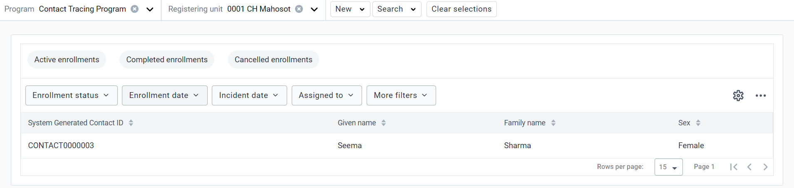

Proceed to register a new person into this program

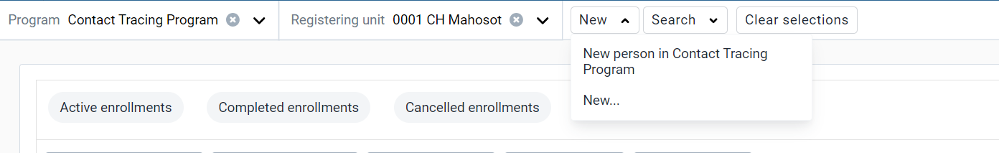

In this page, you will notice the co-ordinate field present. This co-ordinate field is for the tracked entity and can be used by the tracked entity layer within the maps app.

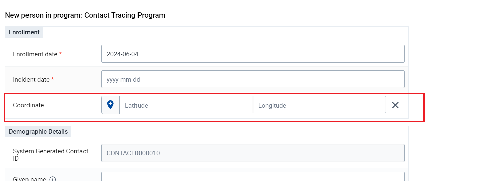

On android, you are able to capture the co-ordinate using your location; while on the web you must enter or select it from the map.

Cancel the registration and open up one of the existing records in the Contact tracing Program; this will take you to their TE dashboard in tracker capture.

Review the program stage Initial contact. Each of these events will have a field called "Location"

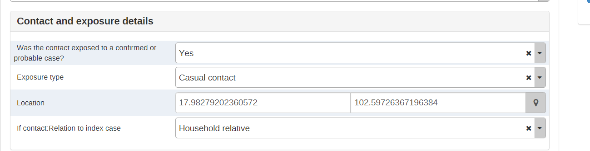

This is the co-ordinate field that is used to display data within the event layer and is captured in the same way as the registration co-ordinate (on android, you are able to capture the co-ordinate using your location; while on the web you must enter it or select it from the map).

In cases where it is needed, scripts can be used to transfer the tracked entity coordinate into each event so it does not need to be captured manually each time; however this is highly situational dependent.

### Create a map using the event layer

As a review, you can create a map using the event layer.

We can create a map using data from the Case based surveillance Program for Fever cases from Diagnostic and clinical information.

Open the maps app, then open the map "CBS - Fever cases, this year, by home location." This the map that you will create. You can explain the layout to the participants before continuing.

Clear your inputs by going to File -> New.

Create the map using the event layer with the following inputs:

- Layer Type : Org unit
  - Level 3 (District)
- Layer Type : Event (CBS Location)
- Data:
  - Program : Case-based Surveillance
  - Stage : Stage 1 - Diagnostic and clinical information
  - Coordinate field : CBS Location
  - Event status : all
- Period : This Year
- Org Units : User sub-x2-units
- Filter :
  - Data item : Fever = Yes
- Style :
  - Group events
  - GEN - Sex

The map should look like this

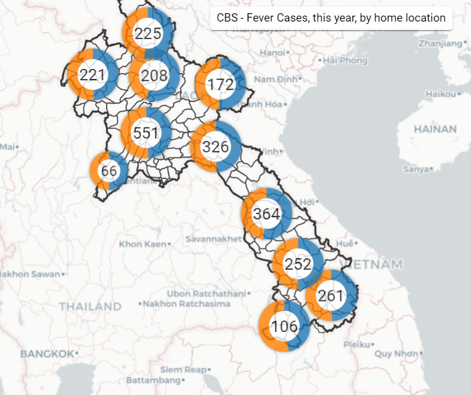

**Data Tab**

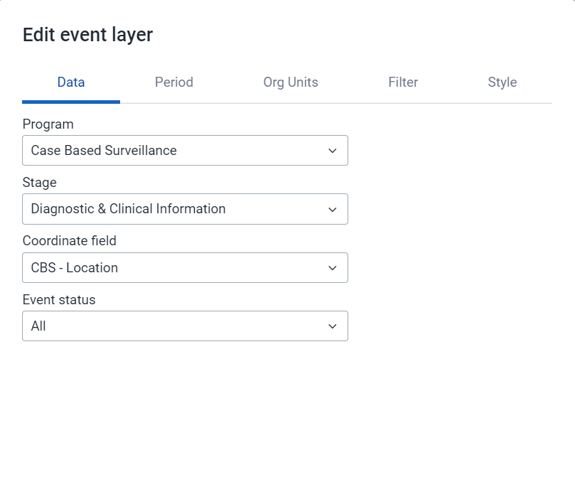

**Period Tab**

**Org Units Tab**

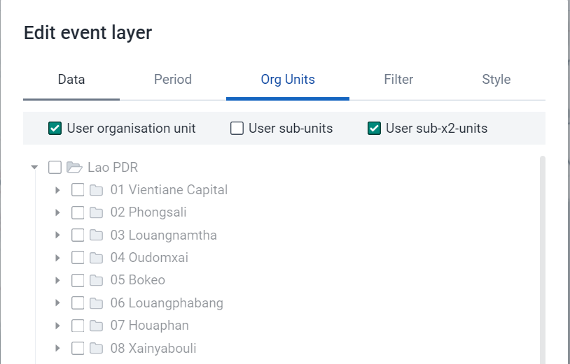

**Filter Tab**

**Style Tab**

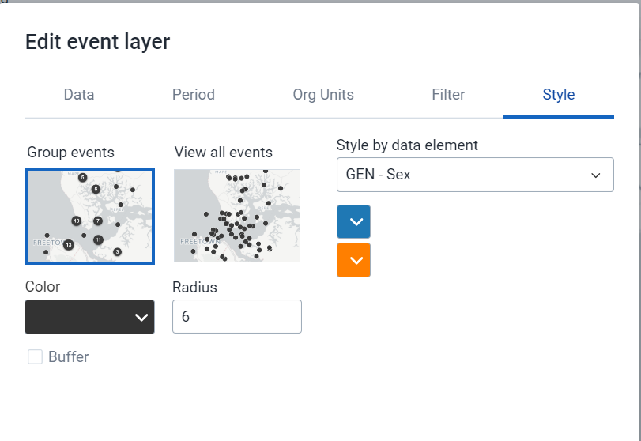

As the events are grouped together, and you have chosen to style them by sex, we see the doughnut charts when we are zoomed out. As you zoom in however you will start to see the individual locations of each of these events. Select an event to see the details. 

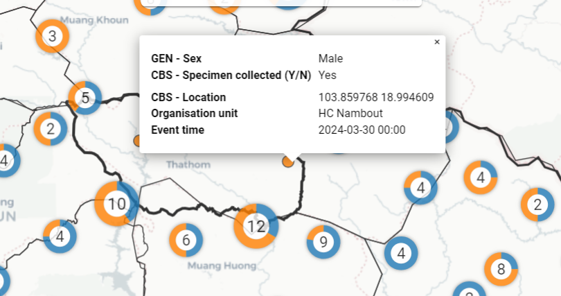

As we can see, using this layer is the same whether we are using event or tracker data. As with our other analyses, we do have to keep in mind that the event layer will be displaying all the events within a program on this map; so in the case of repeated event data you can have multiple events on the map representing each of these events.

#### Review how to save a map

Go to the file menu and select the "Save" option

Give the map a name and a description and select "Save"

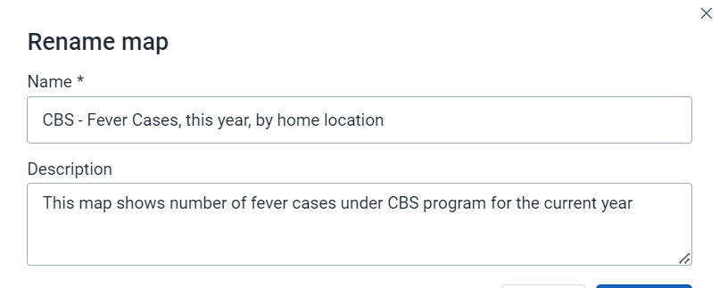

#### Review how to download a map

Select the download option from within the app. This will open up a new dialog. Position your legend where you want it and select "Download" to download the map. This will download a PNG file of the map to your downloads folder.

#### STOP! Have them perform Exercise 1

### Create a map using the TEI layer with relationships

We will now create a map using data from the Case-Based Surveillance Program where we will display relationships on the map.

Open the map "CBS - Cases and Contacts." This is the map that you will create. It is showing a person along with their relationships. In the context of this program, it means it is displaying index cases along with their contacts. The red circle in the map is the index case (or where the relationship was initiated from) and the black circles are the contacts.

Clear your inputs by going to File -> New.

Create the map using the tracked entity layer with the following inputs:

- Layer 1 Type : Org Unit - LAO PDR
- Layer 2 Type : Tracked Entity
- Data:
  - Tracked Entity Type : Person
  - Program : Case-base Surveillance
  - Program status : all
- Relationships : 
  - Display tracked entity relationships = yes
  - Relationship type : Has Been in Contact with
- Period :
  - Program/Enrollment date
  - Start/ End Date : January 1, 2023 - June 30, 2024
- Org Units : 0001 CH Mahosot
- Style : leave as default

The map should look like this

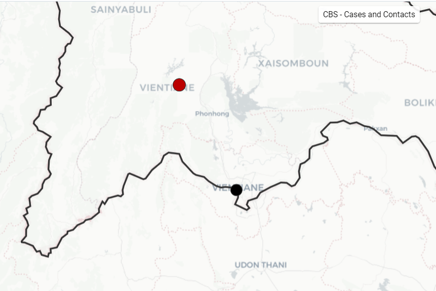

**Boundary Layer**

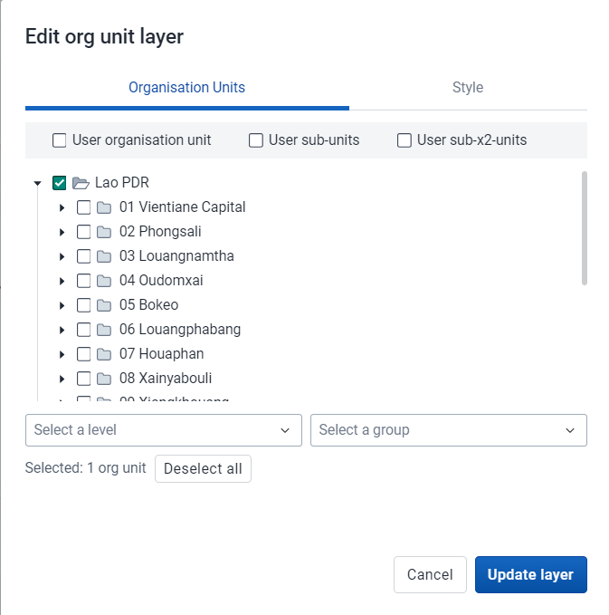

---

***Tracked Entity Layer***

**Data Tab**

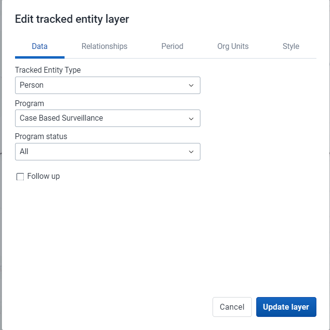

**Relationships Tab**

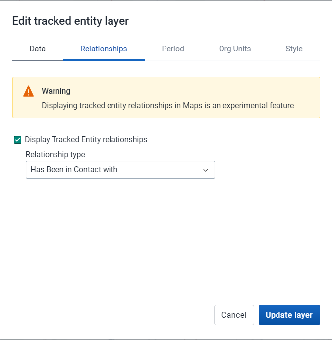

Explain the relationships tab in a bit more detail as you are configuring this part of the map. This allows you to show relationships between tracked entities, but has a large warning message as it is still in development.

One of the main drawbacks when using the relationship layer is that it only allows you to display relationships within the same program. In our example, we actually have a separate program for registering contacts, but we are not able to display the relationships between the surveillance program and the contacts program; we can only display relationships within the surveillance program (ie. both the cases and contacts must be in this program). Applied more generally, this means that you are only able to display relationships within the same program on the map currently using the tracked entity layer.

**Period Tab**

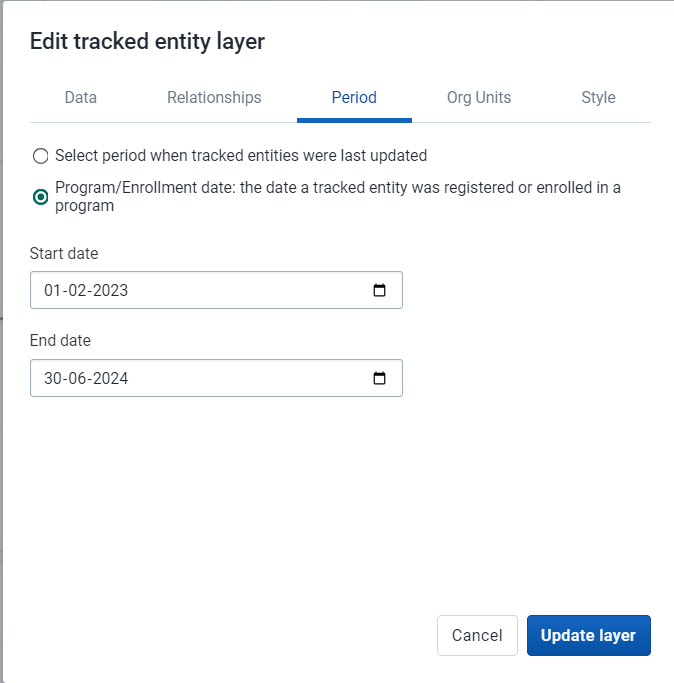

**Org Units Tab**

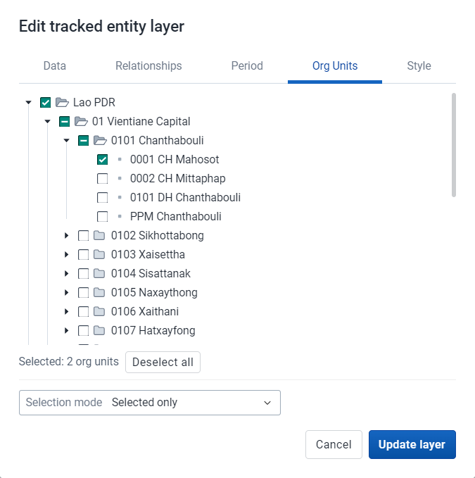

**Style Tab**

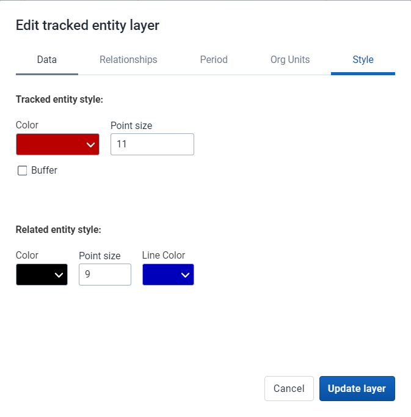

Explain the style tab in a bit more detail as you are reviewing it. You can see here you can select the colour of tracked entity, its related entities and the line used to represent the relationship. This allows you to customize the output of these relationship outputs slightly when creating the map layer.

#### Discuss the map output along with limitations of this layer

As we can see, we are able to display tracked entities along with their relationships using this layer. We have already discussed that we are only able to display relationships within the same program currently, but in addition you are not able to apply any event data to filter out the tracked entities that you are showing. Therefore, ***the tracked entity layer can not be combined with any information from the events within a program stage.***

This is unfortunate, as it requires us to collect co-ordinates for every event within a tracker program, rather then just being able to collect the coordinate once and using it in conjunction with our event data.

This is something that is being worked on however and is expected in future releases.

#### STOP! Have them perform *Exercise 2* in the learner's guide.

## Recap

Review the recap slide with them at the end of the session before they perform the assignment

## Assignment

After you have completed all demos and they have finished the exercises, have them complete the graded assignment for this session. If you find you are running out of time, assign the graded assignment to them and ask them to complete it outside of the live scheduled session.