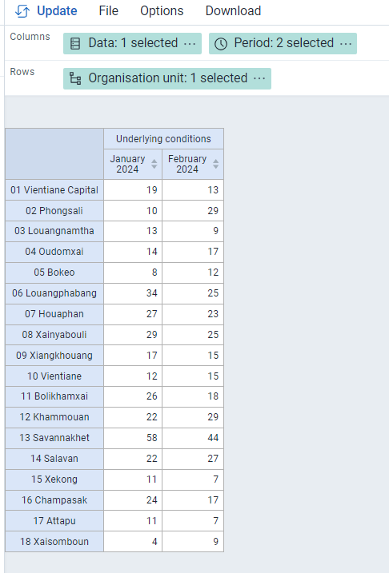

# Trainer’s guide to Event Visualizer

## What is this guide?

This guide is a support document for DHIS2 Academy trainers for the session “Program Indicator Analysis.” This session follows the standard Academy training approach with 

1. a live demo session where the trainer demonstrate and explain the features, and 
   
2. a hands-­on session with exercises where participants get to practice the same features.

This guide will help the trainer​ prepare​​ for the live demo session. The “Live Demo step by step” section has a detailed walkthrough of all the steps to demonstrate with explanations and screenshots that should be easy to follow. Use that when preparing for the live demo session.

There is also a Quick Guide which lists the steps very briefly and this is meant as a lookup guide or “cheatsheet” WHILE doing the demo, to help the trainer remember all the steps and the flow of the demo.

## Learning objectives for this session

1. Describe what a program indicator is
2. Describe how program indicators are derived
3. Describe the difference between event and enrollment program indicators
4. Understand how program indicators can fill tracker data analysis gaps present in other visualization tools
5. Create visualizations using program indicators derived from tracker data

## Time Requirements

- Live Demo: 3 demos, ~10 mins each
- Hands-on Exercises: 3 exercises, ~10mins each
- Assignment: 30 mins multiple choice

## Background

## Preparations

This session will see you creating a number of visualizations. Ensure that you have run analytics in the demo database you are using and that all the data is being populated correctly. If you find that data is not present for the correct period or year, please contact the training content team so we can advise how to move the data correctly.

You should consider running through the entire demo prior to presenting it. After this, you should take the quick guide and supplement it with any additional notes you made while running through the demo. If you identify any changes that may be required or additional explanation that would be helpful within the session, please content the training content team in order to allow us to evaluate how to best integrate this feedback into the material.

Also, the learner's guide and session summary are the main material that will be provided to the learner's with both detailed steps for ungraded exercises as well as the key messages from the session. Review these as well to ensure you are able to get these key points across during your demonstration.

## Best Practices

Before starting the demonstration, please keep in mind that the most important thing is that the audience is following, so make sure to ask questions to the audience to verify that they are following. If something is unclear, go back and go through it slowly. If you don’t have time for all the steps, it is better to cut some steps, than to go fast while nobody understands.

In an online setting, you will be breaking regularly to allow them to perform various ungraded exercises in order to keep them engaged.

In an in-person setting, the participants may be doing the demo with you at the same time. In this scenario, it is ideal if there are other trainer's moving around the room to support participant's as it will be difficult for the trainer leading the session to answer many individual questions during the demonstrations. 

## Quick Guide

1. Create a pivot table using an event program indicator from COVID-19 Vaccination Registry program
- Visualization Type : Pivot Table
 - Data 
   - Data Type : Program Indicator
   - Program : COVID-19 Vaccination Registry program
   - Program Indicator : Underlying conditions
 - Period : Last 6 months
 - Org Unit : All Level 2 OUs
2. Create a chart using program indicators from different program stages from COVID-19 Case-based Surveillance Program
 - Visualization Type : Line Chart
 - Data 
   - Data Type : Program Indicator
   - Program : COVID-19 Case-based Surveillance Program
   - Program Indicators : 
     - COVID-19 Symptoms present
     - COVID-19 Symptoms present - death
     - COVID-19 Symptoms present - recovered
 - Period : This Year
 - Org Unit : All Level 2 OUs

   1. Explain the visualization and where the data is coming from. Note that this type of chart can not be made in event reports.
   2. Convert the chart to a pivot table

3. Create an event report showing the number of relationships by TEI from the COVID-19 Case-based Surveillance Program
   1. Add the days between symptoms onset and consultation
   2. Create a bar chart showing the average days between onset and consultation across all level 3 OUs within Savannakhet
4. Create a map using an enrollment indicator from C19 Contact

## Live Demo step by step

### Create a pivot table in data visualizer using an enrollment program indicator from the COVID-19 Vaccination Registry program

In the first example, you will create a simple pivot table using a single program indicator in data visualizer. It will have the following inputs:

 - Visualization Type : Pivot Table
 - Data 
   - Data Type : Program Indicator
   - Program : COVID-19 Vaccination Registry program
   - Program Indicator : Underlying conditions
 - Period : Last 6 months
 - Org Unit : All Level 2 OUs

It is saved as "COVAC - Underlying Conditions, last 6 months" as reference. 

This is an enrollment type program indicator that is pulling its information from the data element "COVAC - Underlying conditions." 

Enrollment is being used for this program indicator so it does not double or triple count the number of individuals with an underlying condition (remember, this program consists of a single repeated stage).

You can quickly compare the two reports by opening a new tab followed by the saved table "COVAC - Underlying Conditions (event), last 6 months."

You will see the event based indicator reports higher values as it is counting the underlying condition variable for every event; this does not make sense in this scenario if you want to know the total number of unique people with an underlying condition.

Note that you are able to create this same output in event reports using an enrollment pivot table. So far, we have not addressed any gap but are just showing that it is possible to pull filtered tracker data into data visualizer.

### Create a chart using event indicators from different program stages from the COVID-19 Case-based Surveillance Program

One gap that we can address however is creating a pivot table or chart using data from different program stages. We can do this in data visualizer for any of the available visualizations using either event or enrollment type program indicators and is not something we could achieve in either event reports or event visualizer.

In this example, we will create a line chart with the following inputs:

 - Visualization Type : Line Chart
 - Data 
   - Data Type : Program Indicator
   - Program : COVID-19 Case-based Surveillance Program
   - Program Indicators : 
     - COVID-19 Symptoms present
     - COVID-19 Symptoms present - death
     - COVID-19 Symptoms present - recovered
 - Period : This Year
 - Org Unit : All Level 2 OUs

In order to create this chart, ensure your layout looks like this:

It is saved as "COVID_CBS - Symptoms and health outcome, this year" as reference. 

This chart uses enrollment indicators, including combining data from Stage 1 (Clinical exam and diagnosis), where it gets the data on whether or not a person has symptoms, and Stage 4 (Health Outcome), where it gets the information on whether or not the person died or recovered. It is not possible to create this type of output using event visualizer.

You can covert this chart to a pivot table so they can see that you can also create a pivot table using data from multiple stages, an option not possible in event reports.

#### STOP! Have them perform *Exercise 1* in the learner's guide.

### Create an line list enrollment event report showing the number of relationships by TEI from the COVID-19 Case-based Surveillance Program

