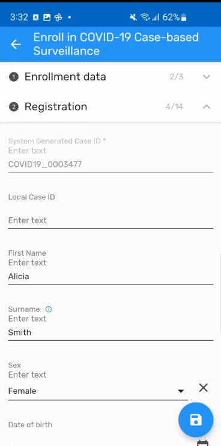
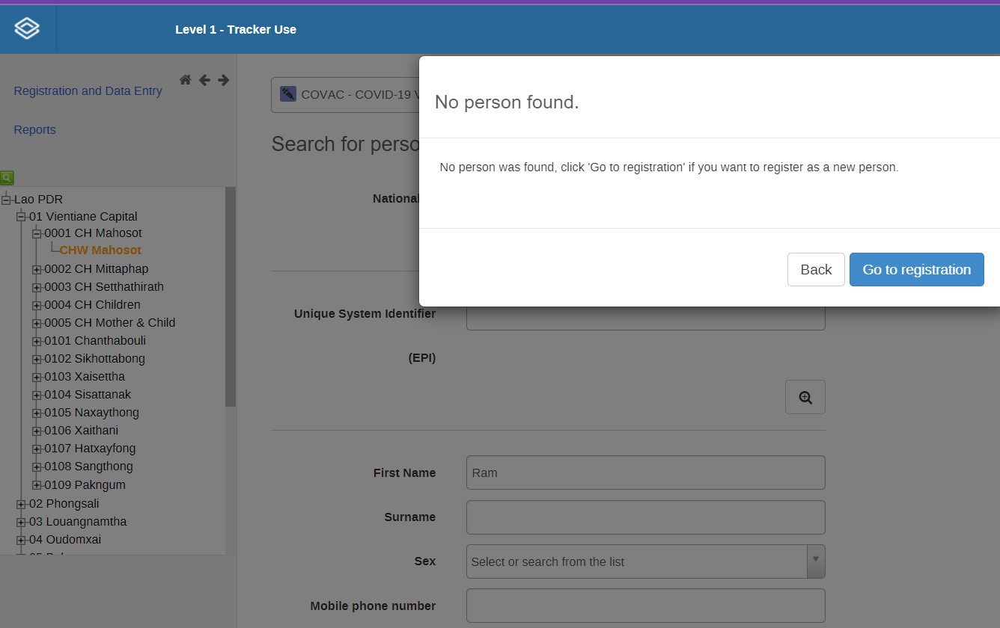

# **Trainer’s Guide to Tracker Capture (Android)**

## **What is this guide?**

This guide is a support document for DHIS2 Academy trainers for the session “Demonstrating and using tracker capture (Android).” This session follows the standard Academy training approach with 1) a live demo session where the trainer demonstrate and explain the features, and 2) a hands-­on session with exercises where participants get to practice the same features.

 This guide will help the trainer prepare for the live demo session. The “Live Demo step by step” section has a detailed walkthrough of all the steps to demonstrate with explanations and screenshots that should be easy to follow. Use that when preparing for the live demo session.

 There is also a Quick Guide which lists the steps very briefly and this is meant as a lookup guide or “cheatsheet” WHILE doing the demo, to help the trainer remember all the steps and the flow of the demo.Part 1 - Introduction to the Android data entry App

## **Learning objectives for this session**

1. Navigate to  capture app
2. Register a tracked entity into a tracker program
3. Add a relationship
4. Program enrollments

## **Time needed for this session**

Live demo: 3 demos, ~ 30 mins each

Hands-on exercises: 1 exercises, ~ 30 mins  

## **Background**

Tracker capture is a module for individual, itemized data collection.

 Tracker capture data entry is organized by program, which is the equivalent of patient registry or other similar data collection tool. As programs are entered on an individual basis, program based data is entered based on the report or enrollment date as defined by the programs requirements. Tracker capture requires that person details are attached to each event, and therefore registering and searching for entities is a key component of tracker capture.

In this demo, the **COVID-19 Surveillance example** program that has been created will be used to demonstrate the features of the android tracker capture app.

## **Preparations**

Go through the Live demo step by step guide a few times before doing the actual demo for participants.
Make sure your user account is same or similar to the participants’ training accounts so that you don’t show more features, dimension options or forms than what they can see when doing the exercises.
Make sure the resolution on projector is OK for zooming

Create an account with the same level of access as the users you are demonstrating to (ie. if they can only search and enter within one facility, have your user have the same authority)If it is the procedure to enter this data from a paper form, it will be useful to have a copy of the form they would normally use as reference filled in. This can just be a form that you have filled in yourself for example. If they are entering data in real-time, then this is not required but you should prepare the details of an example case that you can follow in your examples.

For the exercises and small activities during the demo, fill out a couple extra forms that the participants can use to register their own cases Your training DB should have some existing cases filled in to help support the working list filter, relationships and searching functionalityIf demonstrating the working lists functionality, you will need to have a subset of the events you have created and assigned to a user where you can show this functionality

### **Facilitator**

The facilitator will have to decide on which method they would like to use to mirror the android app on the projector. They will also have to set up a user account (if it doesn’t exist already) that is assigned to the same org unit as the program they are demonstrating. 

There are 3 main options to use when demoing the android app on a projector:

1. Chromecast
2. MHL to HDMI cable for phones that support this connection
3. Android Emulator on a computer

#### **Chromecast**

This will allow you to connect an Android phone or tablet to a Chromecast dongle that can be connected to the projector (requires HDMI port on projector; the android device and Chromecast device must be on the same wi-fi network). Full instructions for screen mirroring using Chromecast can be found here:http://www.howtogeek.com/199565/mirror-anything-from-your-computer-to-your-tv-using-google-chromecast/

#### **MHL to HDMI Adapter**

An MHL to HDMI adapter allows you to connect your android device (the micro-USB port) to a projector (required HDMI port) directly. A full description of MHL and connecting to TVs/projectors can be found here:http://www.howtogeek.com/201822/how-to-connect-your-android-phone-to-your-tv/

#### **Android Emulator**

Android emulators can be installed on a computer, which is then connected to the projector. The recommended emulator is called Genymotion. This should be downloaded and installed beforehand as it needs to download about 600mb. Download this fromhttps://www.genymotion.com/#!/ You will also need to create a user account. Make sure you download the bundle that comes with VirtualBox as VirtualBox is needed to run it. You can also install VirtualBox independently(https://www.virtualbox.org/wiki/Downloads).

●  You will have to install an android Image after installing genymotion. You can choose a device with Android 5.0, such as the Nexus 5.

●  NB! The emulator does not come with Google Play. Because of that, the easiest way to install an APK is by going into the browser on the emulator, go to the link below, and find the APK file to test with.http://www.github.com/dhis2/dhis2-android-trackercapture/releases

●  The apk file release must match the dhis2 version number; if not the apps will not work.

#### **User Account**

Ensure that there is a user account assigned to a lower level set of org units at the facility level within Trainingland that you can use prior to performing this session. If the participants are following along, ensure that there are user accounts for them to use as well assigned to lower level organization units. The demo user account is:

Username: android1

Password: District1#

#### **APK File**

Make sure that you have the app made for training purposes otherwise you will not be able to cast your screen:

 https://github.com/dhis2/dhis2-android-capture-app/releases

This will be denoted by “training” at the end of the APK file.

	

### **Participants**

If you are ready for a challenge, but which will probably make it more fun for the participants, ask them to install the app on their Android devices. Ask them the day before the session to install it to save time. If you do this you should have some other trainers in the audience supporting you. The latest version is available on google play. If a previous version is being used make sure to be clear to participants which version to download.

## **Best Practices**

Before starting the demonstration, please keep in mind that the most important thing is that the audience is following, so make sure to ask questions to the audience to verify that they are following. If something is unclear, go back and go through it slowly. If you don’t have time for all the steps, it is better to cut some steps, than to go fast while nobody understands.

### **Quick Guide**

1) Log in to the system on the Android device
2)  Note that this user has access to many more programs than during the event capture (android) session, and that both event and tracker type programs are available within the same app
3)  Select the COVID-19 Case-based Surveillance program and go over the interface that appears. Run the help text.
4)  Search for a person that already exists (John Doe)
5)  Open her record, see all the events that are present. Review the 4 tabs on the person dashboard
6)  Select “See details” to view the detailed attributes
7)  Go back and select any event associated with the record to show the data that is there
8)  Register a new case (and make sure those following along register a UNIQUE PERSON! that is different from yours so they can find it later on!). 
9)  Add a new event to the person’s record
10)  Fill in the details of the form and save the event
11)  Add a new event on the lab request stage, same day from the date first seen. Complete the form and save the event
12)  Adding a new event 3 days from the lab request
13)  Add new event in the lab request to show the repeatable stages   
14)  Update the lab results 
15) Add the relationship, show the contact Registration & follow up 
16) Search for a contact that already exists 
17) Enroll person into other program
18) Sync the event online. Go to the web interface to verify the data was sent
19) From the web interface, update the person’s record 
20) Go back to the Android device and show the data has not been synced
21) Sync the data, than go back to the person’s record to show the new event has been synced
22) Turn off all wi-fi/data radios on the device. Explain how offline data capture works
23) Add a new person while offline
24)  Add a new event
25)  Show that the data is being stored solely on the device
26) Turn on the wi-fi and sync the data
27)  Check it was synced on the device, as well as through the web app

## **Step-by-Step guide**

### Log in to the Android App

Username: android1

Password: District1#

	

### Review the interface

Note that its Surveillance tracker programs for the COVID-19 modules 

### Select the Case-base Surveillance program

Select this program. It will take you to a very different interface when compared with what is available when selecting an event program. This is because tracker programs emphasize the search and retrieval of records, and thus the attributes available for search appear at the top to allow you to filter and find your person. You will see a list under the search field of the case registered. 

 Click on the help button and allow the text to run, it gives some explanation of the interface which you can explain again.

### Search for an individual that already exists

Search for an individual which already exists (in this example John Doe is used as he has a complete record). 

	

Open his record. You will see all the events associated with the case within the case-base surveillance program, starting with the most recent event. 

 There are 4 tabs when you open the interface. You can discuss what each tab is and how it relates to what would normally be seen on tracker capture (web). 

	

You can use the “See details button to show (and edit if access allows) all of the attribute information related to the individual. Go back and review the event list.

	

The first stage event on the list is therefore when he would have visited the health facility. 

Select any of the events to show this in practice.

	

Exit the record to proceed.

### Register a new case

As the help text noted, in order to register someone, you first must search to see if they exist. Have people come up with their own name/number/identity that is different from the one they are using so new duplicates are entered! Enter some details and try to search for the individual. As in the previous examples, select a health facility visit day weeks back so you can show the rules working on Android correctly. You will not find them and you can now register a new person.

 Click on the plus sign than select an org unit in which to register the case into. 

	

After selecting the org unit, select the registration date.

	

You will then be prompted to confirm the details which you can than save.

	

This will take you to their dashboard on the device which has the Information that is referred to the first stage Make sure to update the Date of consultation to few weeks or days from the current day

	

Then you must fill the first stage event and you will then be prompted to confirm the details which you can than save.

	

This will take you to their dashboard on the device which has the same interface as the completed record you previously accessed!

	

### Add a new event

Click on the plus button at the bottom. It will expand and give you some options, which you can explain to the participant

Select “Add new” to add a new event.

		

It will display the program stages which in this case there is only 1 repeatable stage. Select it to continue.

	

Alter the date of lab request to be the same as the date of date consultant and click next.

	

The form will now load in which you can enter the event details. 

	

Fill in the form, click next.

	

After completing the section (or showing its empty), click “End.” You can than finish, or finish and complete the event.

Do the same process to the other stages and fill in the forms, click next.

		

Select Next - > End, Finish and complete.

### Add a relationship

From the persons tracker dashboard. Click on the relationship icon to associate the contacts with the case.

	

Search for an contact which already exists (in this example John Leach). 

	

Select the contact found to be add in the relationship.

	

As in the previous examples, select the relationship icon to register a new relationship. Now You will not find them and you can now register a new person from the contact registration & follow- up.

	

You will then be prompted to confirm the attributes details which you can than save.

This will take you to the contact registration & follow-up first stage event!

	

Do the same select the contact registered and add in the relationship.

	

Show both of the contact.

	

### Program enrollments

From the persons tracker dashboard, go back and select the program enrollments. 

	

This will take you to enrollment list dashboard. Then enroll then into the Vaccination program.

	

This will take you to the prompted attribute form to confirm and update the details which you can than save.

	

Then you must fill the Vaccination events details which you can than save.

	

Go back to the search page and you will find your Case that as an enrollment in the Vaccination program.

	

### **Sync the event**

From the persons tracker dashboard, go back to the search page. Click on the person’s sync status to see that this data has not been posted online. 

	

If you log in to the web and search, you will not find this person:

	

Go back to the home page, and select Settings. 

 From the settings page, select “Sync data now.” The data should sync. You can go back to the person’s record and check their sync status to verity.

	

Show the person in the web by going to the org unit you registered them to. There attributes and events should all be synced online.

	

### Go offline!

Android allows for storing tracker data offline directly on the device. Records must be synced first or they can not be accessed offline. The number of records that are synced to the device is defined in the settings page of the Android app.

	

Go to your Android homescreen and turn off your wi-fi/mobile data radios.

Go back to the app, select the Vaccination program and search for/register a new person

	

You will notice that you are able to automatically generate the EPI number. This is because when you were online and created a new record, a number of ID’s were generated and stored for use. You need to be a bit careful here because if all these ID’s become used up before you connect again, you will not be able to register any more new children. This should therefore be considered carefully.

 

Go ahead and register a new vaccination and add a new event. 

	

As you have no network connection the data will not sync. 

	

Go ahead and turn on the wi-fi, than sync the data.

	

Check the record and it should be green, showing it was sent. 

	

You can go online in the web and verify this as well

	

