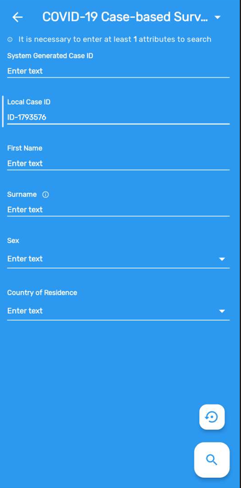
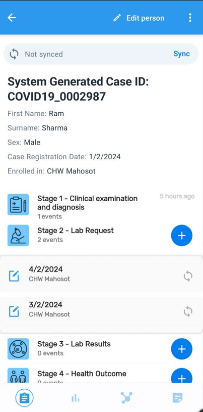
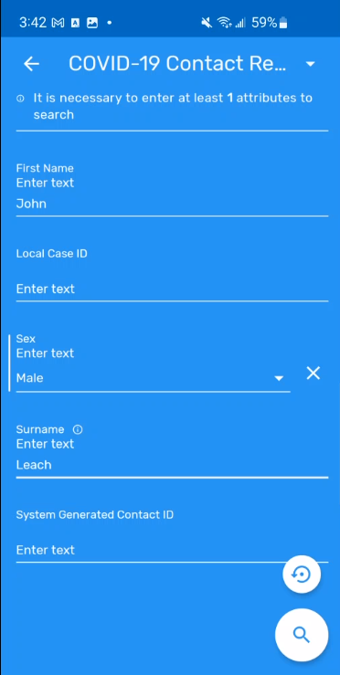
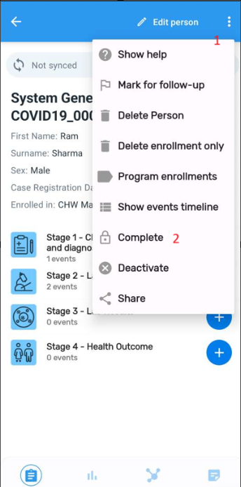
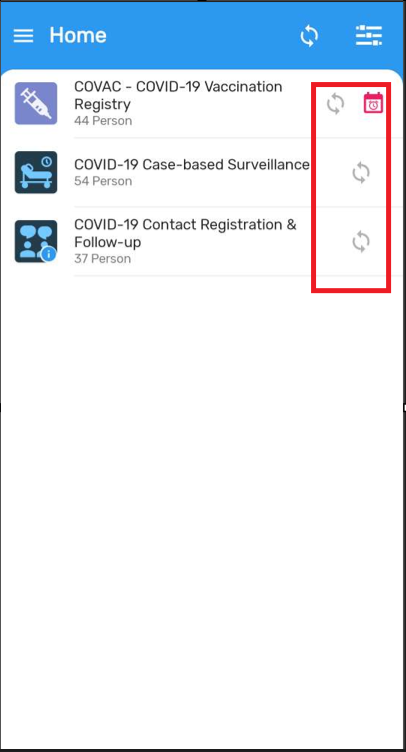

# Trainer’s Guide to Tracker Capture (Android)

## What is this guide?

This guide is a support document for DHIS2 Academy trainers for the session “Demonstrating and using tracker capture (Android).” This session follows the standard Academy training approach with 1) a live demo session where the trainer demonstrate and explain the features, and 2) a hands-­on session with exercises where participants get to practice the same features.

 This guide will help the trainer prepare for the live demo session. The “Live Demo step by step” section has a detailed walkthrough of all the steps to demonstrate with explanations and screenshots that should be easy to follow. Use that when preparing for the live demo session.

 There is also a Quick Guide which lists the steps very briefly and this is meant as a lookup guide or “cheatsheet” WHILE doing the demo, to help the trainer remember all the steps and the flow of the demo.Part 1 - Introduction to the Android data entry App

## Learning objectives for this session

1. Explain the Android App
2. Demonstrate how to install the android app
3. Demonstrate how tracker data can be captured on Android devices including:
   1. Searching for tracked entities
   2. Registering tracked entities
   3. Navigating a person's tracked entity dashboard
   4. Entering event data within a program stage
   5. Completing an enrollment
   6. Entering relationships
   7. Enrolling a tracked entity in multiple programs
   8. Working with tracker data offline

## Time needed for this session

Live demo: 

Hands-on exercises: 

## Background

Tracker capture is a module for individual, itemized data collection.

Tracker capture data entry is organized by program, which is the equivalent of patient registry or other similar data collection tool. As programs are entered on an individual basis, program based data is entered based on the report or enrollment date as defined by the programs requirements. Tracker capture requires that person details are attached to each event, and therefore registering and searching for entities is a key component of tracker capture.

In this demo, the **COVID-19 Case-based Surveillance** program will be used to demonstrate the features of the android capture app.

## Preparations

Go through the Live demo step by step guide a few times before doing the actual demo for participants.
Make sure your user account is same or similar to the participants’ training accounts so that you don’t show more features, dimension options or forms than what they can see when doing the exercises.
Make sure the resolution on projector is OK for zooming

Create an account with the same level of access as the users you are demonstrating to (ie. if they can only search and enter within one facility, have your user have the same authority). If it is the procedure to enter this data from a paper form, it will be useful to have a copy of the form they would normally use as reference filled in. This can just be a form that you have filled in yourself for example. If they are entering data in real-time, then this is not required but you should prepare the details of an example case that you can follow in your examples.

For the exercises and small activities during the demo, fill out a couple extra forms that the participants can use to register their own cases. Your training DB should have some existing cases filled in to help support the working list filter, relationships and searching functionality. If demonstrating the working lists functionality, you will need to have a subset of the events you have created and assigned to a user where you can show this functionality.

### APK File

Make sure that you have the app made for training purposes otherwise you will not be able to cast your screen:

https://github.com/dhis2/dhis2-android-capture-app/releases

This will be denoted by “training” at the end of the APK file.

### Projecting your Android Device

The instructor will have to decide on which method they would like to use to mirror the android app on their computer screen. They will also have to set up a user account (if it doesn’t exist already) that is assigned to the same org unit as the program they are demonstrating.

Please review this CoP post for details on options you may use to mirror your android device:

https://community.dhis2.org/t/how-to-clone-your-android-screen-useful-for-presentations-debugging-etc/38077

### User Account

Ensure that there is a user account assigned to a lower level set of org units at the facility level within Trainingland that you can use prior to performing this session. If the participants are following along, ensure that there are user accounts for them to use as well assigned to lower level organization units. The demo user account is:

Username: android1

Password: District1#

### Participants

Send the instructions to the participants on how to install the Android app prior to the session. The instructions can be found [here](https://docs.google.com/document/d/1SUUUdmPSDycFtdB9yUMq8ZWiWf8gNOu5xvtNj4_V63U/edit?usp=sharing).

Some participant's may not have been able to install the app by themselves. In that scenario, you may need to walk them through how to do this via google play.

## Best Practices

Before starting the demonstration, please keep in mind that the most important thing is that the audience is following, so make sure to ask questions to the audience to verify that they are following. If something is unclear, go back and go through it slowly. If you don’t have time for all the steps, it is better to cut some steps, than to go fast while nobody understands.

### Quick Guide

1. Log in to the system on the Android device
2. Select the COVID-19 Case-based Surveillance program and go over the interface that appears.
3. Review the filters options available on this page
4. Search for a person that already exists (John Doe)
5. Open their record, see all the events that are present. Review the 4 tabs on the person dashboard
6. Select “See details” to view the detailed attributes
7. Go back and select any event associated with the record to show the data that is there
8. Register a new case (if someone is following along; they should register a UNIQUE PERSON that is different from yours)
9.  Add a new event to the person’s record
10. Fill in the details of the form and save the event
11. Add a new event on the lab request stage, same day from the date first seen. Complete the form and save the event
12. Add new event in the lab request to show the repeatable stages
13. Complete the enrollment
14. Add the relationship, show the contact Registration & follow up
15. Search for a contact that already exists
16. Enroll person into other program
17. Sync the event online. Go to the web interface to verify the data was sent
18. From the web interface, update the person’s record
19. Go back to the Android device and show the data has not been synced
20. Sync the data, than go back to the person’s record to show the new event has been synced
21. Turn off all wi-fi/data radios on the device. Explain how offline data capture works
22. Add a new person while offline
23. Add a new event
24. Show that the data is being stored solely on the device
25. Turn on the wi-fi and sync the data
26. Check it was synced on the device, as well as through the web app

## Step-by-Step guide

### Log in to the Android App

Server URL : the academy instance URL (make sure to share this with the participants)

Username: android1

Password: District1#

### Review the interface

You should see the following programs when logging in

### Select the Case-base Surveillance program

Select this program. It should show you a list of individuals registered in the program based on the org units your user is assigned, similar to the front page list in tracker capture.

### Filter the list

You can filter the list by selecting the filter button and applying relevant filters

For example, you can try filtering out completed events.

### Search for an individual that already exists

Search for an individual which already exists by selecting the search box.

- Local Case ID : ID-1793576
- First Name : Brianna
- Surname : Richard

	

Open this record by selecting it. 

You will see all the events associated with the case within the case-base surveillance program, starting with the most recent event. 

 There are 4 tabs at the bottom when you open the record. You can discuss what each tab is and how it relates to what would normally be seen on tracker capture (web). 

These tabs from left to right represent:

1. Details : it is the page you are on by default when opening the record and shows the TEI info as well as the details of the stages and events
2. The indicators widget
3. The relationships widget
4. The notes widget

Navigate back to the details tabs

You can use the “See details" button within this tab to show (and edit if access allows) all of the attribute information related to the individual. Go back and review the event list after reviewing the person's details.

	

Select the first stage followed by the event within it. Navigate through the various sections to show that the data within the stage has been entered and can be reviewed or updated on the device.

	

Exit the record to proceed.

#### STOP! Have them perform *Exercise 1* in the learner's guide.

### Register a new case

Navigate back to the front page list of the COVID-19 Case-based Surveillance program. 

In order to register someone on the android app, you first must search to see if they exist

Start the search process again that you have just shown.

Search for a record that does not exist. Some examples:

- Jane Dawson
- Margaret Thatcher
- Theo Fleury
- Joe Sakic
- Damon Hoyt
- Angelina Jolie
- Evander Holyfield
- Tim Curry
- Alicia Jackson
etc.

Enter some details and try to search for the individual. You should get a message that your record could not be found. 

	

Click on create new button and select an org unit in which to register the case into. Select Accept once you have select the org unit.

After selecting the org unit, select the registration date. Select Accept once you have selected the date.

You will then be prompted to enter the remaining attribute information of the person you are registering.

	

Fill in this information then select the disk icon in order to save the person's details and enroll them into the program.

You will then be prompted to enter the initial details of the 1st stage. Confirm the date of consultation and select "Update."

	

Then you must fill the information for first event.

1. Fill in the details for each section
2. Expand each section by using the tabs

Once you have filled all the details in, save the data by selecting the disk icon

You will then be provided with a prompt if you wish to complete the event or not

If we are done entering data for this event, you can choose the option "Complete." If there is some data missing you can choose the option "Not now." Note to the participants that if you do complete an event and you need to edit it in the future, you are able to open it back up.

Once you save the details, you will be taken back to the dashboard on the device, which has the same interface as the completed record you previously accessed.

#### STOP! Have them perform *Exercise 2* in the learner's guide.

### Add a new event

Click on the plus button underneath the second stage "Lab request." It will expand and give you some options, which you can explain to the participant.

Select “Add new” to add a new event.

		

It will display the program stage, the data of the request and the org unit. 

	

Alter the date of lab request if you need to and select "next" to proceed.

	

The form will now load in which you can enter the event details. 

	

Fill in the form. You can save the details by selecting the disk icon. You will see the same two options as before regarding whether or not to complete the event. Select one to continue.

The lab request and lab result stages are repeatable, and you are able to add multiple events to these stages if needed. Just select the stage and add a new event to it if needed. After adding the event, you will see the repeated stages listed when selecting the program stage.

Repeat the same process with the other stages to fill in the data if you think the participant's need more examples; but you can likely stop here if you have filled in data for stage 1 and stage 2 as the process will be the same for the other stages.

#### STOP! Have them perform *Exercise 3* in the learner's guide.

### Add a relationship

From the persons tracker dashboard. Click on the relationship icon to associate the contacts with the case. Select the "Has been in contact with" relationship type

	

Change over to to the COVID-19 Contact Registration and Follow-Up Program by using the top menu.

Search for an contact which already exists (in this example John Leach).

	

Select the contact in order to create a relationship between them and the person you registered. This will take you back to the person's relationship widget and you will see John listed. 

> Note: You can also add in new enrollments when creating a relationship as you can on the web. If your search does not return any result, you will be able to create an enrollment in the program and a relationship will be established after the new person is created.

### Completing the enrollment

Once you are done entering all data for a tracked entity (attribute information, event data, relationships, etc.). You should consider completing the enrollment. In order to complete the enrollment

1. Select the 3-dot menu
2. Select the complete button

After you have completed the enrollment, the status on the dashboard will change to completed.

#### STOP! Have them perform *Exercise 4* in the learner's guide.

### Enroll the person in another program

From the persons tracker dashboard, go back and select the program enrollments.

This will take you to enrollment list dashboard. From here, enroll them into the Vaccination program.

After you select the program to enroll them into, select the date of registration and the organisation unit.

This will then take you to the attribute details. You will see it carries over the details that you have already entered previously and you do not need to enter them again.

Once you have filled/updated these details, save the person by using the disk icon. This should take you to their dashboard in vaccination registry program.

Go back to the search page for the COVID-19 Case-based surveillance program and you will find your person that you initially enrolled into the Case-based surveillance program now also has an enrollment in the Vaccination program (you will see the small vaccine icon on the list).

#### STOP! Have them perform *Exercise 5* in the learner's guide.

### Sync the event

Data on android syncs on a schedule. It can also be manually synced from the device to the server. Let us review how to perform the manual sync.

From the search page, select the person’s sync status to see that this data has not been posted online.

If you log in to the web and search, you will not find this person:

Go back to the home page and sync your data using one of the sync status icons.

By doing this from the home page, you are able to sync many updated records at once. When the sync is complete you will receive a verification

Show the person in the web by going to the org unit you registered them to. There attributes and events should all be synced online.

#### STOP! Have them perform *Exercise 6* in the learner's guide.

### Go offline!

Android allows for storing tracker data offline directly on the device. Records must be synced first or they can not be accessed offline. The number of records that are synced to the device is defined in the settings page of the Android app or globally by your system administrator using the Android settings app in DHIS2 (if the global option is selected, you will not be able to modify them on the device directly).

This is an example of what it looks like if it is done on the device

Go to your Android home screen and turn off your wi-fi/mobile data radios.

Go back to the DHIS2 app, select the Vaccination program and search for/register a new person

You will notice that you are able to automatically generate the EPI number. This is because when you were online, a number of ID’s were generated and stored for use. You need to be a bit careful here because if all of these ID’s become used up before you connect again, you will not be able to register any more new children. Your system administrator can help configure how many ID's you can use offline. It is recommended to keep this up to 500 ID's. Working offline should therefore be considered carefully.

Go ahead and register a new vaccination and add a new event.

As you have no network connection the data will not sync.

Go ahead and turn on the wi-fi, than sync the data.

Check the record and it should be green, showing it was sent.

You can go online in the web and verify this as well

#### STOP! Have them perform *Exercise 7* in the learner's guide.

## Assignment

After you have completed all demos and they have finished the exercises, have them complete the graded assignment for this session. If you find you are running out of time, assign the graded assignment to them and ask them to complete it outside of the live scheduled session.