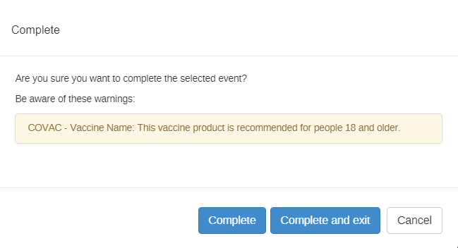
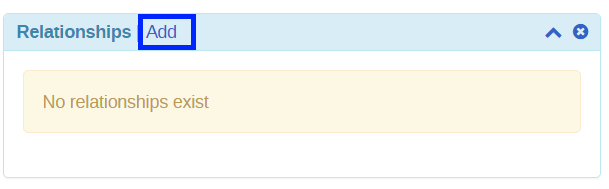
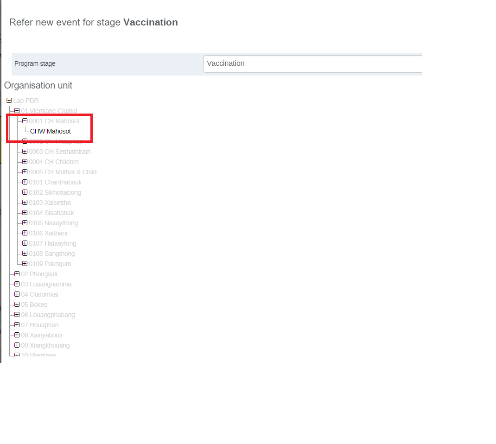

# Trainer’s guide to Tracker-Capture (Web-Based)

## What is this guide?

This guide is a support document for DHIS2 Academy trainers for the session “Demonstrating and using tracker capture (Web).”

This session follows the standard Academy training approach with: 
 
1. A live demo session where the trainer demonstrates and explains the features, and 

2. A hands-­on session with exercises where participants get to practice the same features.

This guide will help the trainer​ prepare​​ for the live demo session. The “Live Demo step by step” section has a detailed walkthrough of all the steps to demonstrate with explanations and screenshots that should be easy to follow. Use that when preparing for the live demo session.

There is also a Quick Guide which lists the steps very briefly and this is meant as a lookup guide or “cheat sheet” WHILE doing the demo, to help the trainer remember all the steps and the flow of the demo.

## Learning objectives for this session

The overall objective of this session is to use the DHIS2 tracker capture app. Detailed objectives include:

* Understand how to select the correct program
* Understand the layout and options of tracker capture
* Understand how to register a TEI
* Understand how to fill in program stage details
* See how to search for a TEI
* See how skip-logic can be used in a tracker program

### Time Requirements

Live Demo: 1 hour

Hands-on Exercises: 30 minutes

## Background

Tracker capture is a module for individual, itemized data collection.

Tracker capture data entry is organised by program, which is the equivalent of patient registry or other similar data collection tool. As programs are entered on an individual basis, program based data is entered based on the report or enrollment date as defined by the programs requirements. Tracker capture by design is not anonymous in nature, and therefore person details are attached to each event.

In this demo, the **COVID-19 (Vaccine Registry and Case-based surveillance)** demo programs that have been created will be used to demonstrate the features of tracker capture.

**COVID-19 (Vaccine Registry and Case-based surveillance)** The COVID - 19 program is based on an in-country pilot of a tracker in Laos. The case based surveillance programs enrolls and tracks the suspected case, captures symptoms, demographics, risk factors, and creates lab requests. 

## Preparations

Ensure that there are existing records in the DB and that you are able to register TEI's and enter event data correctly.

You should consider running through the entire demo prior to presenting it. After this, you should take the quick guide and supplement it with any additional notes you made while running through the demo. If you identify any changes that may be required or additional explanation that would be helpful within the session, please content the training content team in order to allow us to evaluate how to best integrate this feedback into the material.

Also, the learner's guide and session summary are the main material that will be provided to the learner's with both detailed steps for ungraded exercises as well as the key messages from the session. Review these as well to ensure you are able to get these key points across during your demonstration.

## Best Practices

Before starting the demonstration, please keep in mind that the most important thing is that the audience is following, so make sure to ask questions to the audience to verify that they are following. If something is unclear, go back and go through it slowly. If you don’t have time for all the steps, it is better to cut some steps, than to go fast while nobody understands. 

Prior to starting the actual demo, It is a good idea to do a quick overview of the stages and program flow so everyone understands the use-case clearly.

In an online setting, you will be breaking regularly to allow them to perform various ungraded exercises in order to keep them engaged.

If the participants are doing the demo with you at the same time, you can take time to go around the audience and help them if the academy is happening onsite. There should be a team of trainers doing this at all times as well.

## Quick Guide /Steps to be followed:

Go over the Vaccine Registry Program used in this tracker program to demonstrate the participants the data capture for a program with repeatable stages.

1. Open **Tracker Capture** and navigate to CHW Mahosot. Select the Vaccine Registry Program as the tracker program.

2. Explain the **tracker capture interface** and options including:
    1. The main page listing the tracked entities
    2. Filters, sorting, adding columns, downloading the TEI list
    3. System generated UIDs

3. **Register a TEI** : You can start with a duplicate record that already exists (Sharon) in order to show the process of identifying duplicates. In this case, since she already exists there is no need to register her. You can go to her tracker dashboard instead to review her completed events.

4. Now search for a person that is not registered in the system. Proceed to register them.  **Note** that it will bring in the attributes filled during the search over to the registration page so you do not need to fill in these details again.

5. Ensuring that the date chosen for the vaccine of the person being registered in the system  for the vaccine.

6. Describe the features of the tracker dashboard including:
    1. The buttons at the top of the page
    2. Widgets and their descriptions
    3. Persistent top bar

7. Add **Relationsip** and explain.

8. Add a **new event** and review the data entry widget including -
    1. Legend, Audit History, Compare Forms, Buttons to add/schedule new events, the program stage and data entry areas

9. Complete data entry for one stage while describing that there are rules and warnings in place for the vaccination and other underlying conditions.

10. Complete the event and schedule another event for the next vaccine dose.The system will generate a second dose vaccine dose date depending upon the selection of vaccine.

11. Define the **date of services given** to be the same as the scheduled date and review the data entry form again.

12. Compare the events using the **compare form button**.

13. Create a **Referral** for a new event to another facility and explain what happens as part of this process. Go to the **new facility** to see the record there.

14. Enroll the entity in another program to show that this can occur.

15. **Search for a TEI** with no program using the person TE type. The attributes that appear here are defined by the user.

16. Register a TEI with no program, then subsequently enroll them in the immunization program.

## Live Demo step by step

### Part 1: Explain the initial tracker capture interface and options 

**COVAC - COVID-19 Vaccine Registry Overview**

1. Open Tracker Capture from the Apps menu

2. Find and select the site (organisation unit) in the org unit hierarchy

The **''COVAC - COVID - 19 Vaccine Registry tracker program''** is linked to any Organization Unit at the health facility level and above. CHW Mahosot has some example cases already entered. Click on the ‘+’ symbol to expand the hierarchy in the desired branch. For example, to find “CHW Mahosot”, expand Lao PDR, then 01 Vientiane Capital, then 0001 CH Mahosot  and finally CHW Mahosot.Click on the site name to select it. When selected the org unit’s name will change color to orange.

3. Select a Program

Only programs relevant (allocated) to the selected org unit and user will show up in the Program drop down list. If the COVAC - COVID -19 Vaccination Registry is not already selected, make sure to select it from the program list under the “Tracker Capture” heading. 

**Note** : that any person that is already registered will be displayed in a tabular fashion, with each row corresponding to a single record in the “All Clients” tab.

Clients with a scheduled visit will be seen under the first tab “ Clients with a Schedule Visit”

The above tabs are configured at the API level for this program.

If you go to the “**Case based Surveillance**” program you will see the list below which is coming through the attribute display list option.

**After you have explained the interface options, proceed to register a TEI into the program.**

### Part 2 : Registration

**Register a TEI into the COVID-19 case-based surveillance program:** During registration, it is possible to stay on the same page and keep registering more than one entity. You can also go straight to the dashboard of the registered TEI. Selecting a program and doing registration also performs enrollment into the program at the background. If a TEI is registered without a program, then enrollment is possible from the TEI dashboard. Both skip-logic and validation error/warning messages are supported during registration.

**Enrollment status filters:** If a program is selected, the app provides further filtering on the table based on enrollment status. This is displayed in the following order:

* Any enrollment status
* Only those with active enrollment
* Only those with completed enrollment
* Only those with cancelled enrollment

**Custom Working List :** This allows you to apply a custom filter to the list of TEI’s that are displayed.

**Export the TEI list:** You can export the list of TEI based on the filtering criteria you have selected in CSV, XML or JSON format.

**Select columns to show:** Here you can select which attributes from the TEI you would like to show on the front page line-list.

**Explain the system generated ID’s**

System generated ID’s can follow patterns that are defined by the user. This example uses the “COVID19 - Sequential number”

Go to the registration page and see that the ID will be generated. These ID’s can be a bit dynamic depending on the pattern that is defined to generate them. You can use inputs such as the date (used in this example), org unit codes, etc. The best resource to learn more is here:

[https://docs.dhis2.org/master/en/user/html/working-with-textpattern.html](https://docs.dhis2.org/master/en/user/html/working-with-textpattern.html)

#### Register a new TEI

Click on “Register” to register a new TEI. You will then be faced with the Enrollment screen for the program. The enrollment screen lists all the attributes that are associated with the program. 

In later sessions, you will go over the terminology in more detail so just focus on describing the interface and actions for now. Enter a TEI that already exists (***Sharon***) in the system. You will be notified that a possible duplicate has already been found.

If you think this is not a duplicate case you can back out of the duplicate screen.

Fill in additional details and try to register. It will once again give you the potential duplicate. Click on the record to be taken to their dashboard.

Click on Register new person when the record is not found.

**Note :** This is a critical part of using a tracker and is meant to reduce the number of duplicate registries in the system. It should be emphasized that, when using tracker programs, we always emphasize searching for existing cases prior to registering new ones.

The details you entered during search will be brought over to the registration page so you do not need to enter them again. You can fill in the remaining fields in order to register the person. 

After entering the details proceed to click on “Save and continue” in order to register the TEI. 

#### Register and Search Using Capture App

The capture app now has more support for tracker programs than before. Users will now be able to list and interact with tracked entity instances much in the same way as events, and will have access to searching and registering/enrolling tracked entity instances in the Capture app itself. The navigation between the apps will happen seamlessly. This will allow data entry user to access tracker and event data in the same place, and have a more integrated workflow.

We will dicsuss how to do registration and enrollment using capture app.

There are two different ways one can register a tracked entity under an organization unit.The first way, is to register a tracked entity instance without enrolling it to a tracker program. The second option, is to register a tracked entity instance with program and enroll it.

#### Without a program enrollment

1. Open the Capture App from Search bar.
   
   

2. Select an Organization unit.
   
   
3. Click the **New** button.
   From the dropdown menu you can select a tracked entity type.

   

   The moment you select a tracked entity type, a form will be shown on the screen

4. You can see the profile page of the peron and can enter the relevant demographics details.
   
   

5. Click on Save new and you will now be prompted to the tracked entity dashboard.
6. The dashboard will show information about the newly created tracked entity instance.
   
   #### With a program enrollment 

   You need to follow the similar steps as explained above but for this you will select a relevant program also.

   1. Open the Capture app.
   2. Select an organization unit.
   3. Select a tarcker program in this case **COVID-19 Case based Sureveillance**.
   4. Click on **New** drop down button and select the first option.
   
   

    The form will have two sections. The first section has the title "Enrollment". There you will add all the information relevant to this program's enrollment. The second section has the title "Profile" there you will add data relevant to the tracked entity instance. The profile section mainly contains all the tracked entity attributes linked to the program or tracked entity type.
     
   3. Click on Save new and you will now be prompted to the tracked entity dashboard.
   4. The dashboard will show information about the newly created tracked entity instance.

**STOP - Perform Exercise 1**   
   

### Part 3 : Describe the Tracker Dashboard

The dashboard starts with 5 items at the top:

1. **Back button** - this helps to go back to the search and registration page
2. **Persistent top bar** - this is configurable by the user and can include different aspects from the program. You can show them how to edit what appears in the top bar
3. **Previous and Next buttons** - these are buttons to access the previous/next TEI details
4. **Program selection menu** - this is to dictate what kind of data to record and track for the selected TEI. This also affects the contents of the widgets.
5. **Small Pin icon at the right corner** - this allows to pin (or stick) the right side of the widgets. This is useful especially during data entry. If for example there are many data elements or big forms to fill, sticking the right side helps to remain visible while scrolling the data entry part.
6. **Small gear icon at the right corner** - Clicking on the gear icon allows you to perform several different actions. Explain these different actions along with the different widget types that are available.  

* **Show/hide widgets:** this helps to control which widgets to display. There are nine widgets available to display. The widgets are collapsible, responsive and draggable - this helps to acquire optimal view area as per user needs. Widget (re)arrangements are saved automatically per user per program.

* **Save dashboard layout as default:**   widgets arrangement is saved automatically every time a widget's position or state (expand/collapse) is changed. However, for the entire layout to be considered a default layout for the selected program it is required to explicitly save as "Default layout".

* **Top bar settings :** allow you to modify the top bar options.

After you modify it, you should see the persistent top bar present. This should remain wherever you scroll within the TE dashboard.

* **Lock layout for all users :** This is only for system admins. They can create a default layout in which all users will see in the tracker dashboard. When this is enabled non-system admins will not be able to alter the layout or add/remove widgets from the dashboard.

1. **Red icon at the right corner :** this allows to delete or deactivate the record.Clicking on the red icon allows you to following 2 functions:

* **Delete Person (or TEI)** - This deletes the TEI and all the data associated with TEI

* **Deactivate Person (Set TEI to active/inactive)** - this has nothing to do with widgets or the dashboard but it helps to set the status of dashboard owner (the TEI) to either active or inactive. If a TEI is set to inactive, only read operations are allowed - no data entry, no profile editing, no enrollment.

This is permission based, so not everyone will have the authority to perform this function.

**Widget Descriptions**

1. **Data Entry** - This is for doing data entry using either default or custom forms. Depending on program definition, in particular program stages, events will be displayed in a timely fashion. Clicking on any of them displays the corresponding data entry. If a stage needs a new event, a plus icon is displayed for new event creation. To proceed with data entry, it is mandatory to have an event date. Once an event date is specified it is not possible to change the due date. The assumption is that by specifying the event date, the event has already taken place. If the event hasn't occurred yet, it is possible to change the due date - this is effectively doing nothing but rescheduling. The buttons at the bottom help to change the status of a selected event. Another key feature from this widget is the addition of multiple notes for an event. Normally data recording is through data elements, however there are cases where it is necessary to record additional information or comments. This is where the notes section comes handy. However, an interesting feature here is - it is not possible to delete a note. The idea is that notes are more like log books. Both skip-logic and validation error/warning messages are supported during data entry.
2. **Enrollment** - This helps to enroll the TEI for the selected program. If an active enrollment already exists, the widget automatically displays it with some details about it. The widget also helps to do some operations on the selected enrollment - for example complete / cancel or a possibility to mark the enrollment for followup. The later one helps for example to deal with high-risk cases during case follow-up. A link to history is also provided if the TEI has historical enrollment.
3. **Feedback **- In this widget you can place summary information about the TEI for review. For example if the person has allergies or you want to display information on which vaccines they have received until now you can place this information here based on what has been entered in the program
4. **Indicators** - Any indicator defined for the selected program will have its value calculated and displayed under this widget.
5. **Messaging**: With messaging, you can send an SMS to the phone number that was registered directly from the dashboard
6. **Notes** - This is the same as event notes. The difference between the two is that, here notes are attached not to events but to enrollments. This helps to record some notes based on enrollment - for example why is an enrollment terminated or what is the overall observation of the TEI throughout the enrollment. In addition, if the tracked entity has registered a phone number, messaging will be available here. 
7. **Profile** - This is to edit TEI's profile or attributes. Here, if the TEI has an attribute of value type "Tracker Associate", a small icon next to the input field is displayed. Clicking the icon opens a popup where users are allowed to either search or register a new associate.
8. **Relationship** - This helps to relate the selected TEI (the one whose dashboard is shown) to another TEI. Adding a relative is possible by either searching from existing or registering a new one. If a program is selected while registering a new one, the new one will be automatically enrolled to the selected program. Another interesting feature in the relationship widget is attribute inheritance. For example having a contact relationship with the COVID -19 affected patient for this you want to add a relationship with a person with a current patient that has been registered in a case based surveillance program. If among others first name, last name and address attributes are required for both Programs.

9. **Report** - This is to provide a "journal" of the TEI per program. A report row is provided for each program the TEI is/was associated with.

**STOP - Perform Exercise 2**

### Part 4 : Data Entry Steps

Select the Date and fill out the data. When selecting which data elements look out for the total doses and  suggested dose for the next dose. This is a result of using program rules which have been defined to allow for these to be hidden upon the appropriate selection of another data element value. When you have entered some data, click on “Complete.”

A prompt will ask you if you are sure you want to complete the event.

Also it will show you warnings based on the data value entered in the form.

After you complete , you can schedule another event. In this scenario the system will automatically schedule a new event based on the next dose date suggested through program rule on the basis of duration and type of dose. This will bring up a new window in which you can select the program stage (there is only one repeatable program stage in this particular example) as well as the “incident date” which has been defined as the “Date of services given” for this program. **_It is a good idea to schedule the “Date of services given” to be the same as the next date of vaccination which comes from the date of first dose given_**. This is all to take advantage of the program rules that are in place to allow for different vaccines to appear based on the schedule defined previously. When you have selected the right details, click on “Save.”

**Note** when you have a scheduled event, the color changes. This event is “Overdue” because it was scheduled in the past. Here we can reschedule the due date if required. In a real situation, this may not also match the due date, but for this example let us keep it the same to demo the program rules.

When you are done click on complete. Schedule a new event and go back or click on “Complete and exit.”

#### Add a New Event

In order to add a new event, click on the “Add new” button in the data entry widget. 

#### Review the Data Entry Widget

From the screenshot above, we can see a number of different items within the data entry widget. 

* **Activate Legend :** This activates/deactivates a legend which shows what the color of the program stage is describing. 
* **Audit History :** In the audit history changes to any of the data elements can be reviewed and searched. This can also be done for the attributes where a similar icon is available in the profile widget.
* **Collapse Widget :** This will minimize/maximize the widget on the dashboard.
* **Program Stage Area:** In this area, the program stages are listed along with their dates and color status.
* **Event Menu, Add new event, Schedule new event :** In this area we can perform the described actions as required.
* **Data Entry Area :** This is where the actual data related to a specified program stage is entered. This can differ between program stages, and as you will demo, program rules can also cause this to vary within a repeatable stage.
* **Compare the forms** using the compare form button: After you have at least registered 2 events, use the compare form button to compare the events within the program

#### Add a Relationship

To add a new relationship, click the “Add” button on the relationships widget.

Select the relationship type. In this case, you will contact relationship with case based surveillance program 

On the left side you will see the information relating to the TEI that you are registering. On the right side you will see other TEI’s that are registered. 

You can select the program and use search to filter TEI’s. You may have, for example, a contact relationship with COVID - 19 affected patients.

Select the TEI. It will bring up their details. Click on “Save” to save the relationship.

The relationship will then be added to the relationship widget. If you click on the TEI in the relationship widget, it will take you directly to their dashboard.

#### Make a Referral

* Search and select the record to view it in the new facility.
* Select the facility and click on Save options.
* Explain different referral options.

**STOP - Perform Exercise 3**

####  Register an entity in another program

* Show that TEIs can be registered in more than one program. This allows you to take the attribute information that already exists and re-use it. Additionally, you will now have a historical link of all of the different services that a unique individual has received.

#### Register a TEI with no Program

* A TEI can also be registered without selecting a program. De-select the Vaccination program so that the program selection field is blank. Select the person TEI type and click on “Register". Enter the details and Select “Save and continue".

* Upon entering the dashboard, you will see that there is a prompt to select a program for enrollment. 

* Select the COVID - 19 case based Surveillance  and click on “Add new.” The attributes for the program will appear. You can fill them out to register the person into the  program. Using the program selector, TEI’s can be registered in multiple programs directly from the dashboard. 

After you are done, go back to the front page of the tracker capture app.

**STOP - Perform Exercise 4**

### Part 5 : Demonstrate Tracker Capture App Reports

Access tracker capture reports by selecting “Reports” from the front page of the tracker capture app.

There are a number of reports available which are helpful in tracking entities through their programs and making sure they have received the right services, or giving an overview of the program, etc.

## Assignment

After you have completed all demos and they have finished the exercises, have them complete the graded assignment for this session. If you find you are running out of time, assign the graded assignment to them and ask them to complete it outside of the live scheduled session.
